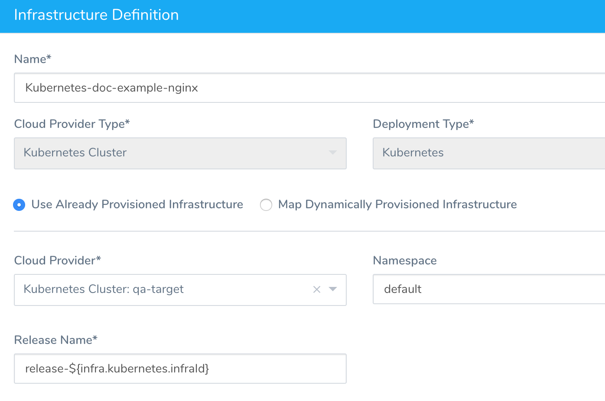

The following Kubernetes-specific Harness variables are available as expressions you can use in your Workflows.

### ${k8s.primaryServiceName}

`${k8s.primaryServiceName}` - The service in your Harness Service **Manifests** section that uses the `annotations: harness.io/primary-service: "true"` annotation. See [Create a Kubernetes Blue/Green Deployment](create-a-kubernetes-blue-green-deployment.md).

Boolean annotation values must use quotes (`"true"|"false"`).

### ${k8s.stageServiceName}

`${k8s.stageServiceName}` - The service in your Harness Service **Manifests** section uses the `annotations: harness.io/stage-service: "true"` annotation. See [Create a Kubernetes Blue/Green Deployment](create-a-kubernetes-blue-green-deployment.md).

### ${k8s.canaryWorkload}

`${k8s.canaryWorkload}` - The Kubernetes workload set up in the Canary Workflow. Workflows only deploy one workload per deployment. Workloads include the Deployment, StatefulSet, DaemonSet, and DeploymentConfig objects.

### ${k8s.virtualServiceName}

`${k8s.virtualServiceName}` - The name in the [Virtual Service](https://istio.io/docs/reference/config/networking/v1alpha3/virtual-service/) manifest deployed by the Workflow. This is the manifest in the Service **Manifests** section that uses `kind: VirtualService` for Istio. See [Set Up Kubernetes Traffic Splitting](set-up-kubernetes-traffic-splitting.md).

### Canary Destinations

`${k8s.canaryDestination}` and `${k8s.stableDestination}` - The names in the [Destination Rule](https://istio.io/docs/reference/config/networking/v1alpha3/destination-rule/) subsets deployed by the Canary Workflow. See [Set Up Kubernetes Traffic Splitting](set-up-kubernetes-traffic-splitting.md).

This is the manifest Harness generates for Istio traffic splitting:


```
Found VirtualService with name anshul-traffic-split-demo-virtualservice  
  
Found following destinations  
${k8s.canaryDestination}  
weight: 50  
  
${k8s.stableDestination}  
weight: 50  
  
...  
  
http:  
- route:  
  - destination:  
      host: "anshul-traffic-split-demo-svc"  
      subset: "canary"  
    weight: 50  
  - destination:  
      host: "anshul-traffic-split-demo-svc"  
      subset: "stable"  
    weight: 50
```
### ${infra.kubernetes.namespace}

`${infra.kubernetes.namespace}` - The Harness variable `${infra.kubernetes.namespace}` refers to the namespace entered in the Harness Environment Infrastructure Definition settings **Namespace** field:



You can use `${infra.kubernetes.namespace}` in your Harness Service **Manifests** definition of a Kubernetes Namespace to reference the name you entered in the Infrastructure Definition **Namespace** field. When the Harness Service is deployed to that Infrastructure Definition, it will create a Kubernetes namespace using the value you entered in the Infrastructure Definition **Namespace** field.

In the values.yaml file, it will look like this:


```
namespace: ${infra.kubernetes.namespace}
```
In a manifest file for the Kubernetes Namespace object, it will be used like this:


```
apiVersion: v1  
kind: Namespace  
metadata:  
  name: {{.Values.namespace}}
```
When this manifest is used by Harness to deploy a Kubernetes Namespace object, it will replace `${infra.kubernetes.namespace}` with the value entered in the Infrastructure Definition **Namespace** field, creating a Kubernetes Namespace object using the name. Next, Harness will deploy the other Kubernetes objects to that namespace.

If you omit the `namespace` key and value from a manifest in your Service, Harness automatically uses the namespace you entered in the Harness Environment Infrastructure Definition settings' **Namespace** field.