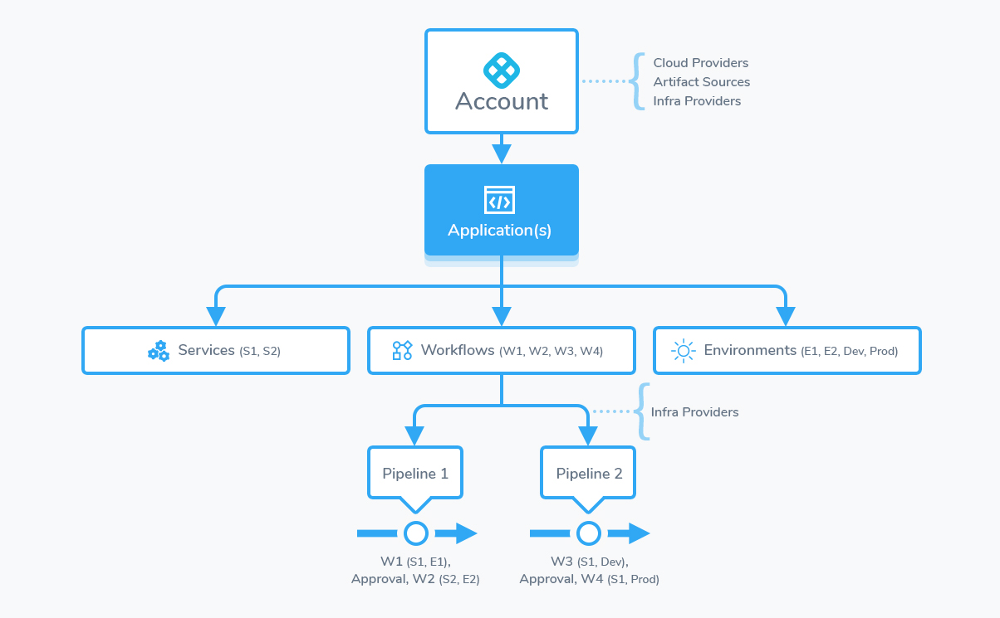
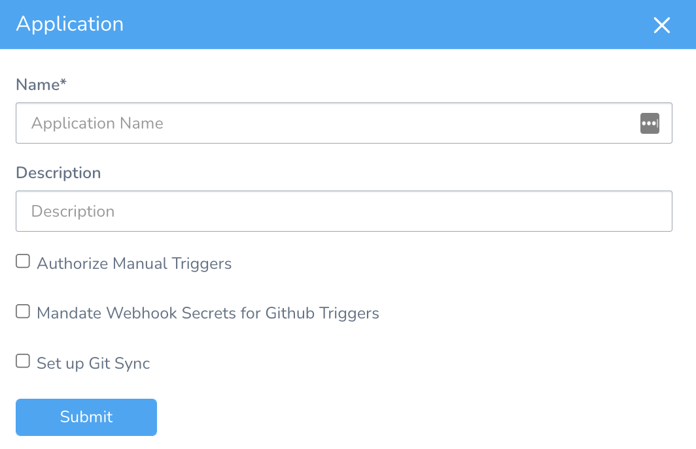
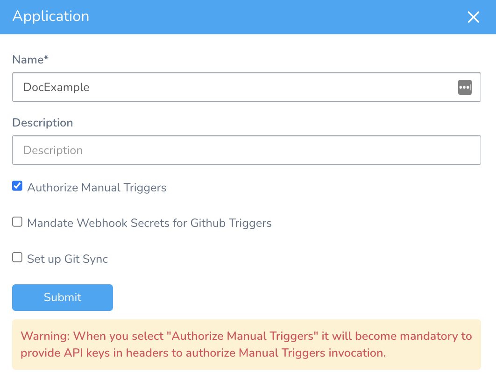
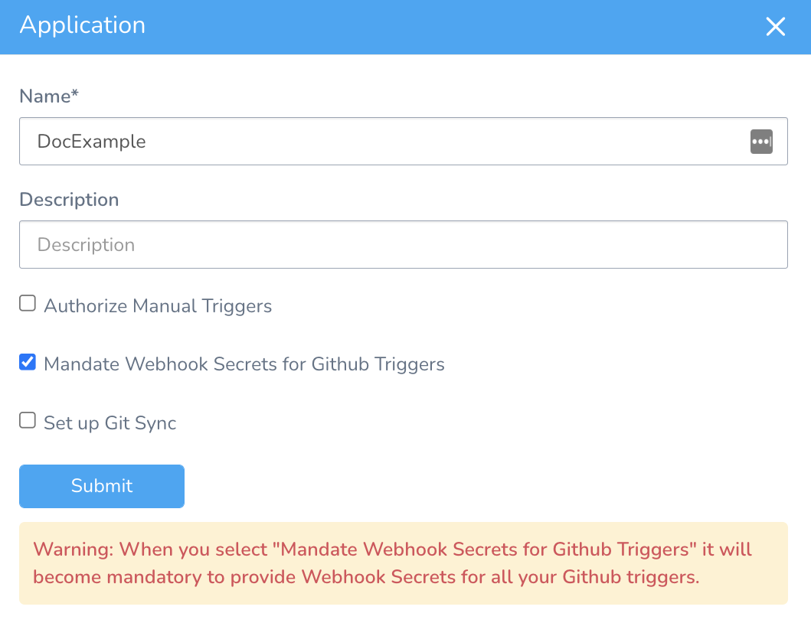
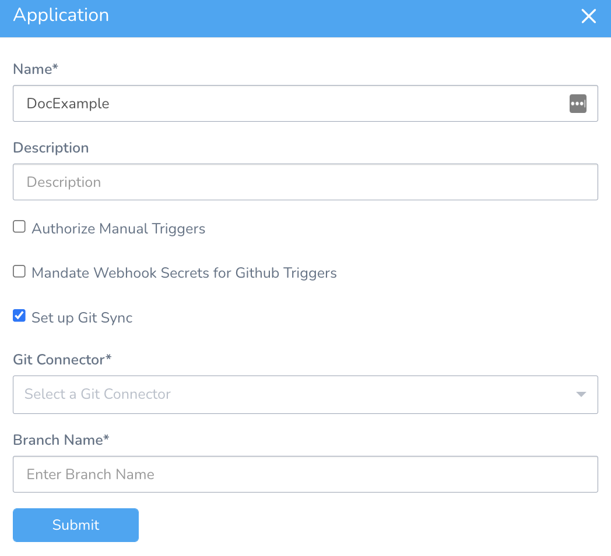
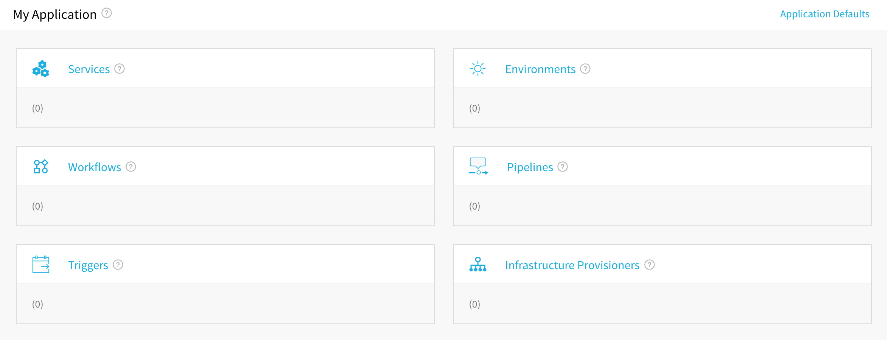

A Harness **Application** represents a group of microservices, their deployment pipelines, and all the building blocks for those pipelines. Harness represents your microservice using a logical group of one or more entities: Services, Environments, Workflows, Pipelines, Triggers, and Infrastructure Provisioners. Applications organize all of the entities and configurations in Harness CI/CD. 

The following procedure creates a new Application. Once you are done, you can add components to the Application, such as Services and Environments.

### Visual Summary

The following diagram displays how an Application organizes Services, Workflows, and Environments into components that can be selected and deployed using Pipelines (although you can deploy a workflow by itself, also). The Artifact Servers and Cloud Providers you connect to your Harness account are used to obtain your microservices/applications and deploy them to your deployment environments.

Keep this diagram in mind when setting up your Harness Application.

### Before You Begin

* [Harness Key Concepts](https://docs.harness.io/article/4o7oqwih6h-harness-key-concepts)

### Step 1: Set up the Application

1. Click **Setup**, and then click **Add Application**. The **Application** dialog appears.

2. Enter the name for your Application.

#### Option: Authorize Manual Triggers

Select **Authorize Manual Triggers** to make API keys mandatory to authorize Manual Triggers invocation. For more information, see [Manual Triggers](../triggers/trigger-a-deployment-on-git-event.md#option-manual-triggers).

#### Option: Mandate Webhook Secrets for GitHub Triggers

Select **Mandate Webhook Secrets for Github Triggers** to make Webhook Secrets mandatory for all your GitHub Triggers. You must always supply your secret token added in your Git provider to authenticate the Webhook once you make it essential to provide Webhook secrets. For more information on how to authenticate the Webhook, see [Authenticate the Webhook](../triggers/trigger-a-deployment-on-git-event.md#option-authenticate-the-webhook).

Currently, this feature is behind the Feature Flag `GITHUB_WEBHOOK_AUTHENTICATION`. Contact [Harness Support](mailto:support@harness.io) to enable the feature.

#### Option: Set up Git Sync

Select **Set up Git Sync** to sync your Application to a Git repo. You must also select a Git Connector and Branch Name that you want to use for Git Sync. For more information, see [Harness Application-Level Git Sync](https://docs.harness.io/article/6mr74fm55h-harness-application-level-sync).

1. Click **SUBMIT**. Your new Application appears.
2. Click your Application’s name. The Application appears.

### Step 2: Add Services to the Application

Services represent your microservices/apps. You define where the artifacts for those microservices come from, and the container specs, configuration variables, and files for those microservices.

Add your microservices, including their artifact sources, container types, configuration variables, and YAML files.

For more information, see [Service Configuration](../setup-services/service-configuration.md).

### Step 3: Add Environments to the Application

Environments represent one or more of your deployment infrastructures, such as Dev, QA, Stage, Production, etc.

Add deployment Environments for the Services in your application. These Environments will be deployed on the cloud providers you added as a connector.

For more information, see [Environment Configuration](../environments/environment-configuration.md).

### Step 4: Add Workflows to the Application

Workflows define how a Service is deployed, verified, and rolled back, among other important phases. There are many different types of Workflows, from Basic to Canary and Blue/Green.

Add Workflows to manage the stages of Service deployments.

For more information, see [Workflow Configuration](../workflows/workflow-configuration.md).

### Step 5: Add Pipelines to the Application

A Pipeline is a collection of one or more stages, containing workflows for one or more services and other deployment and verification steps.

Add a Pipeline to define the workflows used in deployment and verification.

For more information, see [Pipeline Configuration](../pipelines/pipeline-configuration.md).

### Step 6: Add Triggers to the Application

Triggers automate deployments using a variety of conditions, such as Git events, new artifacts, schedules, and the success of other pipelines.

Add a Trigger to define when a Workflow or Pipeline is executed.

For more information, see [Trigger Configuration](../triggers/add-a-trigger-2.md).

### Step 7: Add Infrastructure Provisioners to the Application

Infrastructure Provisioners define blueprints from known Infrastructure-as-Code technologies (Terraform, Cloud Formation, etc) and map the output (such as load balancers, VPCs, etc). They enable Workflows to provision infrastructure on the fly when deploying Services.

Add an Infrastructure Provisioner such as CloudFormation or Terraform as a blueprint for the system, networking, and security infrastructure for the Service deployment.

For more information, see [Infrastructure Provisioner Configuration](../infrastructure-provisioner/add-an-infra-provisioner.md).

