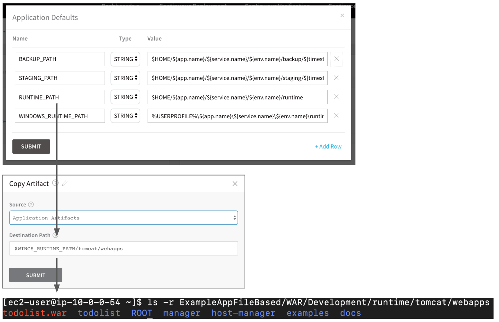
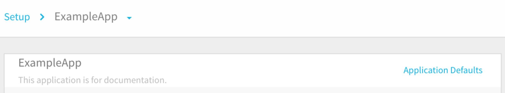
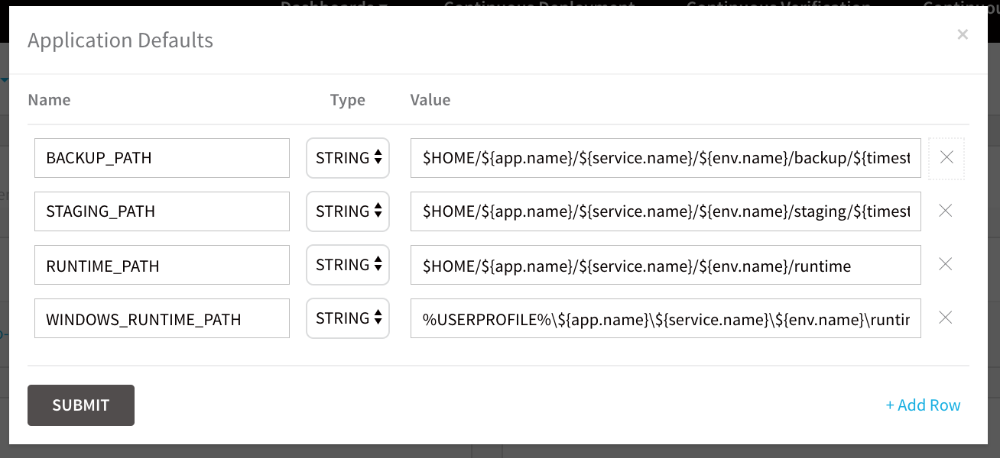
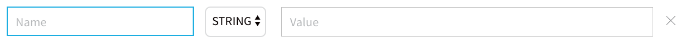
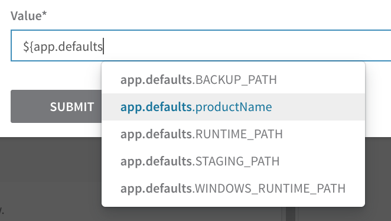

You can define Application-wide variables that can be referenced in any entity within a Harness Application. The **Application Defaults** include the paths for runtime, staging, and backup used by the scripts in the Service, and can also be used in your Workflow steps.

### Before You Begin

* [What is a Harness Variable Expression?](https://docs.harness.io/article/9dvxcegm90-variables)
* [Run Shell Scripts in Workflows](../workflows/capture-shell-script-step-output.md)
* [Add Artifacts and App Stacks for Traditional (SSH) Deployments](https://docs.harness.io/article/umpe4zfnac-add-artifacts-for-ssh-deployments)
* [Add Scripts for Traditional (SSH) Deployments](https://docs.harness.io/article/ih779z9kb6-add-deployment-specs-for-traditional-ssh-deployments)

### Review: Application Defaults

For example, here is the **Application Defaults** dialog, the **Copy Artifact** script in the Service using the `RUNTIME_PATH` variable and the Tomcat application stack **webapps** folder, and the resulting file path for the deployed artifact on the target host:

For more information, see  [Application Default Variables](https://docs.harness.io/article/9dvxcegm90-variables#application_default_variables).

### Limitations

To create or edit Application Defaults, you must be logged into Harness as a member of a User Group that has create or update permissions for that Application.

The User Group must also have the **Administer Other Account Functions** setting enabled.

See [Managing Users and Groups (RBAC)](https://docs.harness.io/article/ven0bvulsj-users-and-permissions).

### Step 1: Create an Application Default

To create an Application Default, do the following:

1. In Harness, open a Harness Application.
2. Click **Application Defaults**.

   
   
   The **Application Defaults** dialog appears, displaying several built-in variables.
   
   
3. To add a new default, click **Add Row**. A new row appears.
  
   
   
4. In **Name**, enter a name for the default. Ensure that the name is descriptive, as users will be looking at a list of variable names and will need to distinguish between them.
5. In **Type**, select **STRING**.
6. In **Value**, enter the value for the variable.  
  
   For example, if you added an **Application Default** variable for a product name, the dialog would look like this:

   
   
7. Click **SUBMIT**. The new variable is added. Now, let's reference the variable.

### Step 2: Reference an Application Default

You can reference an Application Default anywhere in your Application. Here is an example using a Service.

1. Open a Harness Application, and then open a Service within the Application.
2. In the service, under **Configuration**, click **Add Variable**. The **Config Variable** dialog appears.

   
   
3. In **Value**, enter `${app.defaults` to see the Application variables displayed.
  
   
   
4. All Application Defaults variables begin with `app.defaults` to identify the namespace of the variable.
5. Click the Application variable name to enter it. It is entered as `${app.defaults.variable_name}`.

### See Also

* [What is a Harness Variable Expression?](https://docs.harness.io/article/9dvxcegm90-variables)
* [Run Shell Scripts in Workflows](../workflows/capture-shell-script-step-output.md)
* [Add Artifacts and App Stacks for Traditional (SSH) Deployments](https://docs.harness.io/article/umpe4zfnac-add-artifacts-for-ssh-deployments)
* [Add Scripts for Traditional (SSH) Deployments](https://docs.harness.io/article/ih779z9kb6-add-deployment-specs-for-traditional-ssh-deployments)

