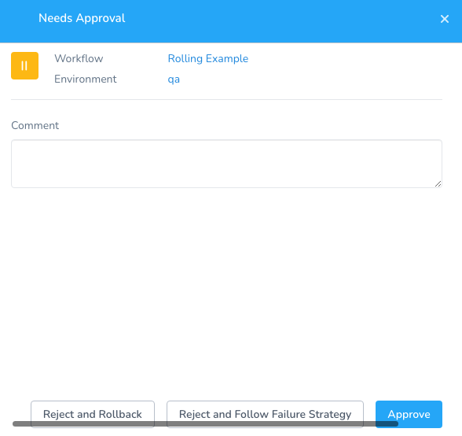
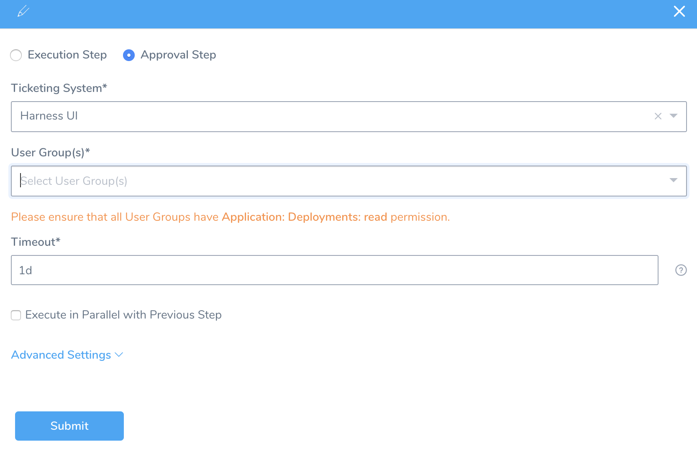
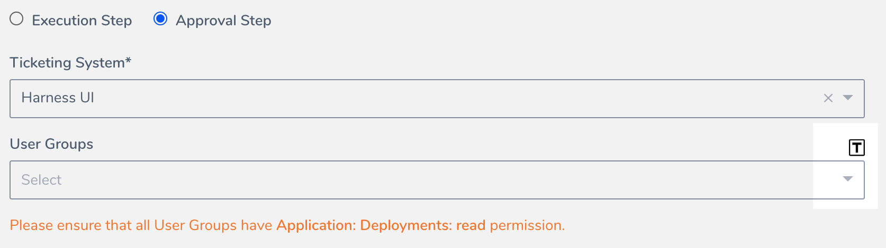
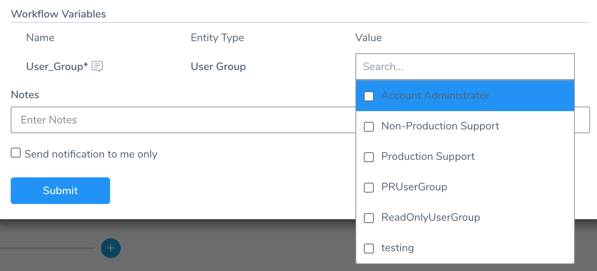
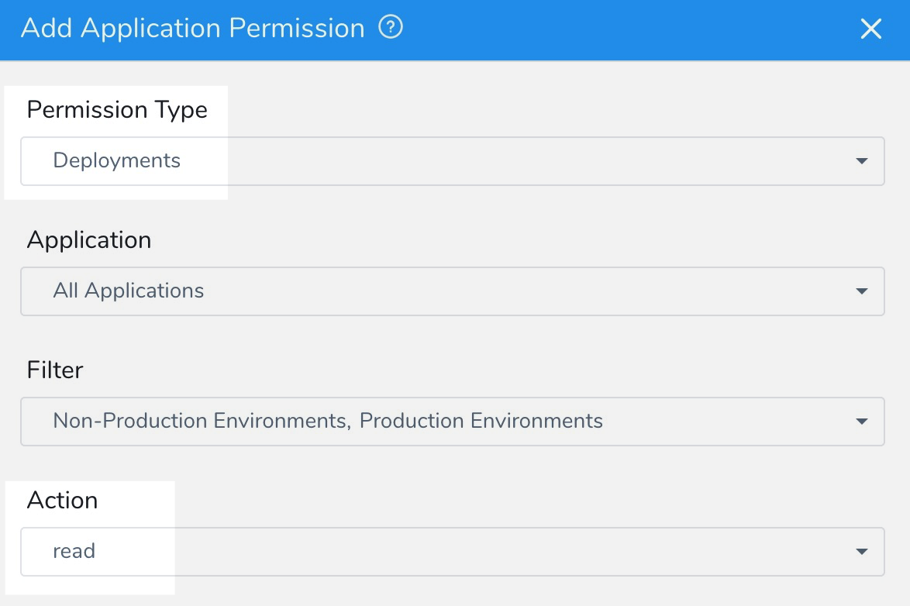
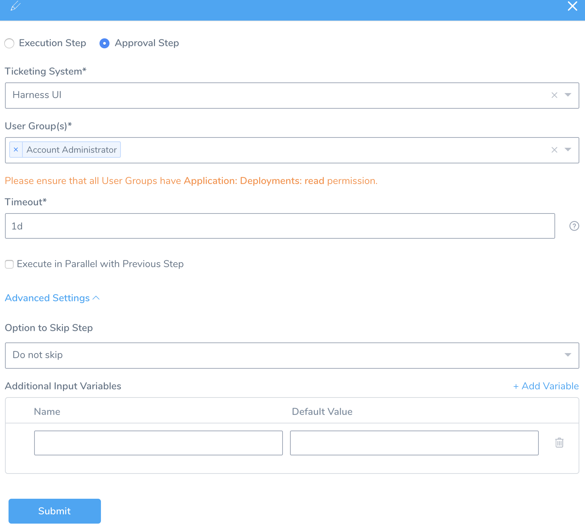
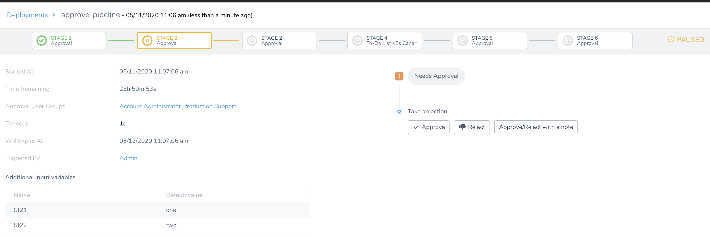
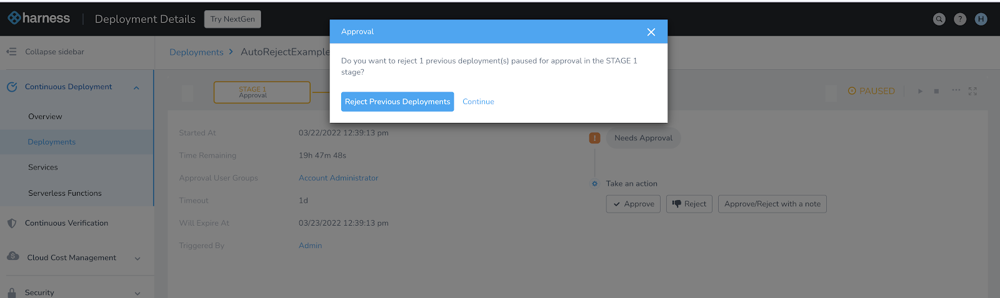

You can specify Harness User Group(s) to approve or reject a Pipeline or Workflow. During deployment, the User Group members use the Harness Manager to approve or reject the deployment.

The other approval mechanisms are:

* [Jira Approvals](jira-based-approvals.md)
* [ServiceNow Approvals](service-now-ticketing-system.md)
* [Custom Shell Script Approvals](shell-script-ticketing-system.md)

### Before You Begin

* [Workflows](../workflows/workflow-configuration.md)
* [Pipelines](../pipelines/pipeline-configuration.md)
* [Create Pipeline Templates](../pipelines/templatize-pipelines.md)
* [User Notifications and Alert Settings](https://docs.harness.io/article/kf828e347t-notification-groups)
* [Managing Users and Groups (RBAC)](https://docs.harness.io/article/ven0bvulsj-users-and-permissions)

### Review: Approval Options

When you run a Workflow with an Approval step, there are three options available:

* **Approve:** the step is marked as approved and the Workflow execution proceeds.
* **Reject and Follow Failure Strategy:** initiates the Failure Strategy for the Workflow. By default, any Workflow you create has rollback as the default Failure Strategy. But in many cases you will have a different Failure Strategy.
* **Reject and Rollback:** rolls back the Workflow regardless of the Workflow Failure Strategy.

See [Define Workflow Failure Strategy](../workflows/define-workflow-failure-strategy-new-template.md) for details on **Rollback Workflow** and **Rollback Provisioners after Phases** options.

Currently, **Rollback Provisioners after Phases** is behind the feature flag `ROLLBACK_PROVISIONER_AFTER_PHASES`. Contact [Harness Support](mailto:support@harness.io) to enable the feature.

### Add an Approval Step in a Pipeline

In your Pipeline, in **Pipeline Stages**, click **+**. The following settings appear.

Select **Approval Step**.

Select **Harness UI** in the **Ticketing System**.

Select one or more **User Group(s)** to notify for the approval requests.

You can template this setting, turning it into a parameter. Just click the template button:

In a Pipeline or Workflow Approval step, clicking this button creates a variable named `${User_Group}`. This is the default variable, but you can edit its name or replace the variable with a Service or Workflow variable, or even an [Application Default](../applications/set-default-application-directories-as-variables.md) variable.

When you deploy the Pipeline or Workflow, you are prompted to select a User Group:

You cannot pass in a value for this templated setting from another Workflow.

Ensure that the User Groups you select have **Action:** **read**, **Permission Type: Deployments**, and **Application:** the current Application or **All Applications**.

Enter the time duration that Harness should wait for the approval or rejection before killing the deployment process. You can use `**w**`  for week, `**d**`  for day, `**h**`  for hour, `**m**`  for minutes, `**s**`  for seconds and `**ms**` for milliseconds. For example, 1d for one day.

The maximum is 3w 3d 20h 30m.Select **Execute in Parallel with Previous Step** checkbox to execute the steps in parallel.

Click **Advanced Settings** to set the additional settings.

Select either **Do not skip**, **Skip always**, or **Skip Based on Assertion Expression** for setting the skip option. For more information, see [Pipeline Skip Conditions](../pipelines/skip-conditions.md).

Click **Add Variable**. These variables serve as inputs to later stages of the same Pipeline, where they support conditional execution or user overrides. See [Pipeline Skip Conditions](../pipelines/skip-conditions.md) and [Using Variables in Workflow Approvals](use-variables-for-workflow-approval.md).

In **Publish Variable Name**, enter a unique parent name for all of the output variables.

For example, if you add `info` in **Publish Variable Name**, and you have an Input Variable named `foo`, you can reference it in subsequent steps using the expression `{context.info.foo}`.

Do not use reserved words in **Publish Variable Name**, such as `var`. See [Variable Expression Limitations and Restrictions](https://docs.harness.io/article/9ob3r6v9tg-variable-expression-name-restrictions).Select **Auto-Reject previous deployments paused in this stage on approval** to reject previous deployments of this Pipeline with the same Services before this approval stage. This will prohibit older Pipelines from being approved and older builds from being deployed in the Environment.

Currently, Auto-Reject previous deployments is behind the Feature Flag `AUTO_REJECT_PREVIOUS_APPROVALS`. Contact Harness Support to enable the feature.Click **Submit**.

Deploy the Pipeline. When you deploy your Pipeline, the **Approval Stage** notifies the selected User Group(s), via their configured [notification settings](https://docs.harness.io/article/kf828e347t-notification-groups#notification_settings_for_user_groups) to approve or reject the deployment.

In **Deployments** page, the **Approval Stage** displays the following information:

* **Started At**: The time at which the Pipeline was triggered.
* **Time Remaining**: Time remaining to complete the Pipeline deployment.
* **Approval User Groups**: The user group(s) that you have specified to notify for the approval requests.
* **Timeout**: The time duration that Harness should wait for the approval or rejection before killing the deployment process.The maximum timeout duration is 24 days.
* **Will Expire At**: The time at which the Pipeline will expire.
* **Triggered By**: The user who triggered the Pipeline deployment. It can be triggered using a [Pipeline](../pipelines/pipeline-configuration.md) or [Trigger](../triggers/add-a-trigger-2.md) process.
* **Variables**: Details of the variable inputs that you have specified for the conditional execution of later Pipeline stages. For more information, see [Skip Based on Assertion Expression](../pipelines/skip-conditions.md#skip-based-on-assertion-expression).  
You can also **Approve**, **Reject**, or **Approve/Reject with a note** the Pipeline deployment from this page.

### Add an Approval Step in a Workflow

You can add UI Approval steps in a Workflow. Configuring the Workflow Approval step is similar to Pipeline UI Approvals, although the Workflow Approval steps only have the **Additional Input Variables** in **Advanced Settings**.

See [Using Variables in Workflow Approvals](use-variables-for-workflow-approval.md).

### Needs Approval

Here is an example of a Pipeline Approval Stage:

### Auto-Reject Previous Deployments

Currently, this feature is behind the Feature Flag `AUTO_REJECT_PREVIOUS_APPROVALS`. Contact Harness Support to enable the feature. You will see this option only if there are other Pipelines/Workflows queued for approval at the same stage.While approving a Workflow or Pipeline deployment, you can auto-reject previously paused deployments of the same Pipeline/Workflow (for the same Service and Infrastructure Definition combination) paused at the same approval stage.

