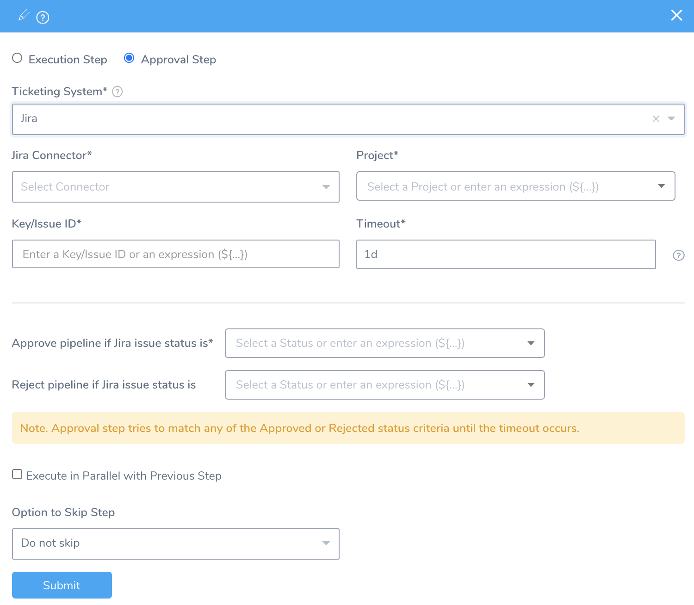
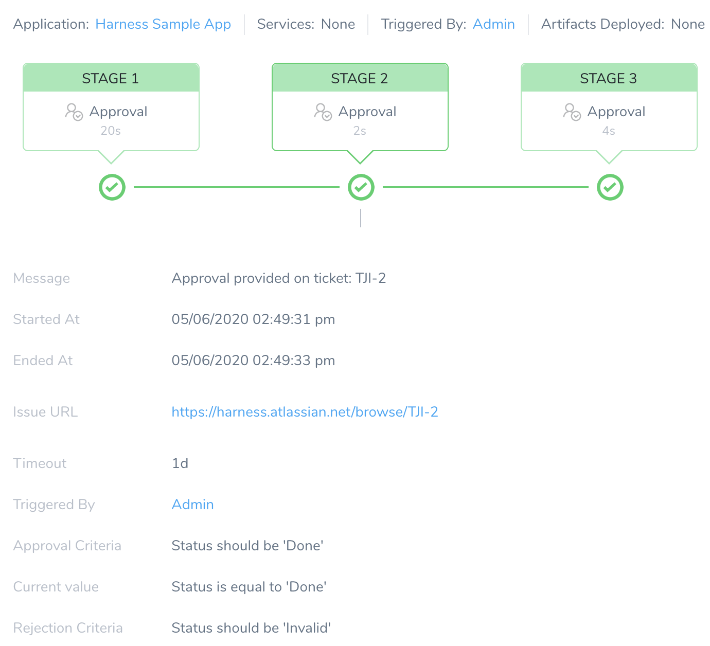

You can use Jira to approve or reject a Workflow or Pipeline step.

In your Harness Workflow or Pipeline, you define a Jira ticket and approval and rejection criteria. During deployment, a Jira ticket is created and its approval/rejection determines if the Pipeline (and Workflow) deployment may proceed. For details on integrating Jira with Harness, see [Jira Integration](../workflows/jira-integration.md).

The other approval mechanisms are:

* [Harness UI Approvals](approvals.md)
* [ServiceNow Approvals](service-now-ticketing-system.md)
* [Custom Shell Script Approvals](shell-script-ticketing-system.md)

### Before You Begin

* [Workflows](../workflows/workflow-configuration.md)
* [Pipelines](../pipelines/pipeline-configuration.md)
* [Create Pipeline Templates](../pipelines/templatize-pipelines.md)
* [Use Variable Expressions](https://docs.harness.io/category/use-variable-expressions)

### Step: Add an Approval Step

1. In your Pipeline, in **Pipeline Stages**, click **+**. The following settings appear.

   
   
2. Select **Approval Step**.
3. Select **Jira** in the **Ticketing System**.
4. Select the Jira account in **Jira Connector** that you want to use by selecting the Collaboration Provider you added for the account. For more information, see [Add Jira Collaboration Provider](https://docs.harness.io/article/bhpffyx0co-add-jira-collaboration-provider).
5. Select the Jira **Project** containing the Jira issue you want to use for approval. You can enter text and expressions together.
6. Enter the **Key/Issue ID**. It is the output variable for a Jira issue created in a Workflow, for example `${Jiravar.issueId}`. You can enter the Jira Key/Issue ID for any Jira issue in the Jira project. You can also enter text and expressions together.
7. Enter the time duration in **Timeout** that Harness should wait for the approval or rejection before failing the deployment. You can use `**w**`  for week, `**d**`  for day, `**h**`  for hour, `**m**`  for minutes, `**s**`  for seconds and `**ms**` for milliseconds. For example, 1d for one day.The maximum is 3w 3d 20h 30m.
8. Enter a value for approving the Pipeline. You can select a status from the **Approved Pipeline if Jira Status is** drop-down list or enter an expression. You can enter text and expressions together.
9. Enter a value for rejecting the Pipeline. You can select a status from the **Rejected** **Pipeline if Jira Status is** drop-down list or enter an expression. You can enter text and expressions together.
10. Select **Execute in Parallel with Previous Step** checkbox to execute the steps in parallel.
11. Select either **Do not skip** or **Skip always** for setting the skip option. For more information, see [Skip Execution](../pipelines/skip-conditions.md#skip-execution).
12. Click **Submit**.
13. Deploy your Pipeline and go to the **Deployments** page. The **Approval Stage** displays the following information:
  * **Message**: The "Message" appears only when the stage of a Pipeline is completed, and there is no action pending from the user or system. It displays the completed status of the process. For example, approval provided, approval rejected, or Pipeline aborted.
  * **Started At**: The time at which the Pipeline was triggered.
  * **Ended At**: The time at which the system or a user completed the approval process.
  * **Issue URL**: Link to the Jira issue.
  * **Timeout**: The time duration that Harness should wait for the approval or rejection before killing the deployment process.
  * **Triggered By**: The user who triggered the Pipeline deployment. It can be triggered using a [Pipeline](../pipelines/pipeline-configuration.md) or [Trigger](../triggers/add-a-trigger-2.md) process.
  * **Approval Criteria**: Criterion set for approving the request.
  * **Current Value**: Current status of Jira issue.
  * **Rejection Criteria**: Criterion set for rejecting the request.

You can click on the **Issue URL** link to see the Jira issue in Jira's UI and select set approval or rejection criteria. In this example, the status **Done** fulfills the Approval Criteria.

Once the Jira issue is approved, the Approval stage turns green in **Deployments**, and the deployment continues.

