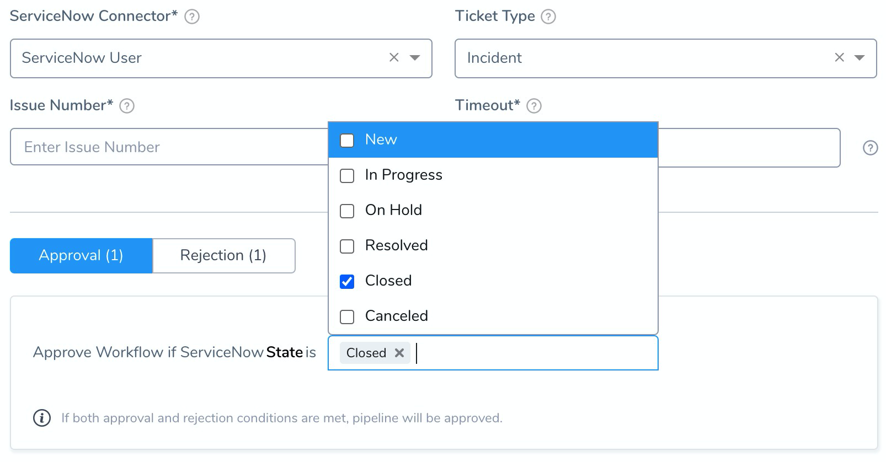
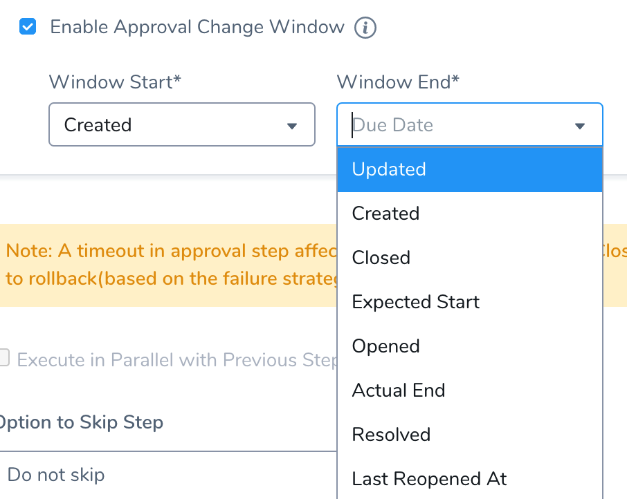
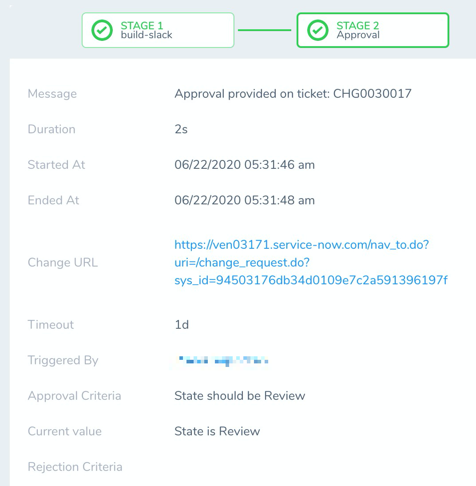
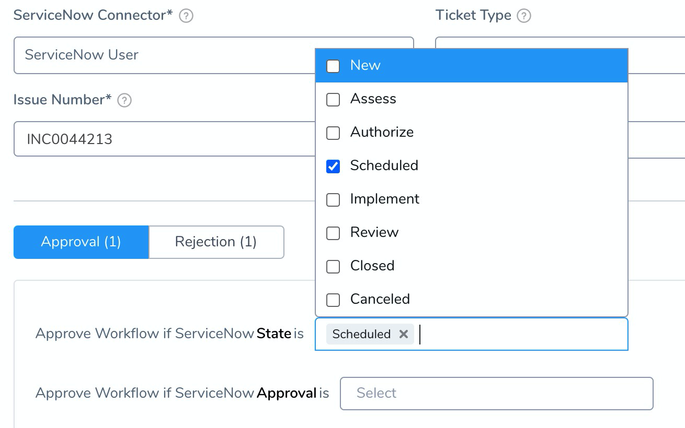

You can use ServiceNow to approve or reject a Workflow or Pipeline step.

In your Harness Workflow or Pipeline, you define a ServiceNow ticket and the approval and rejection criteria. During deployment, a ServiceNow ticket is created and its approval/rejection determines if the Pipeline (and Workflow) deployment may proceed. For details on integrating ServiceNow with Harness, see [ServiceNow Integration](../workflows/service-now-integration.md).

The other approval mechanisms are:

* [Jira Approvals](jira-based-approvals.md)
* [Harness UI Approvals](approvals.md)
* [Custom Shell Script Approvals](shell-script-ticketing-system.md)

### UTC Timezone Only

The ServiceNow API only allows date time and time values in the UTC timezone. Consequently, input for any datetime/time fields in Harness ServiceNow steps must be provided in UTC format irrespective of time zone settings in your ServiceNow account.

The timezone settings govern the display value of the settings not their actual value.

The display values in the Harness UI depend on ServiceNow timezone settings.

### Step: Add an Approval Step

The following steps are for a Pipeline Approval stage, but the same same settings apply to Workflow Approval steps.

1. In your Pipeline, in **Pipeline Stages**, click **+**. The following settings appear.
2. Select **Approval Step**.
3. Select **ServiceNow** in the **Ticketing System**.
4. Select the ServiceNow account in **ServiceNow Connector** that you want to use by selecting the Collaboration Provider you added for the account, as described in [Add ServiceNow as a Collaboration Provider](../workflows/service-now-integration.md#add-service-now-as-a-collaboration-provider). Use the same provider you used to create the ticket in the Workflow.
5. Select the ServiceNow **Ticket Type** from the drop-down list. Use the same type as the ticket you created in the Workflow.
6. Enter the **Issue Number**. It is an output variable for a ServiceNow issue created in a Workflow, such as `${snow.issueId}`.
7. Enter the time duration in **Timeout** that Harness should wait for the approval or rejection before failing the deployment. You can use `**w**`  for week, `**d**`  for day, `**h**`  for hour, `**m**`  for minutes, `**s**`  for seconds and `**ms**` for milliseconds. For example, 1d for one day.The maximum is 3w 3d 20h 30m.
8. In **Approval**, define the approval criteria using the ServiceNow status items.
9. In **Rejection**, define the rejected criteria using the ServiceNow status items.  
   For both Approval and Rejection, the criteria you see depends on the Ticket Type you selected:
   
   
   
10. In **Enable Approval Change Window**, use **Window Start** and **Window End** values to specify the window in which Harness will proceed with the deployment. Once this step is approved, Harness will not proceed with deployment unless the current time is within this window. The values that appear depend on the type selected in **Ticket Type**.

  
  
  The start and end times use the time zone set in the ServiceNow account selected in **ServiceNow Connector**.This is available in Approvals only.
11. Select **Execute in Parallel with Previous Step** checkbox to execute the steps in parallel.
12. Select either **Do not skip** or **Skip always** for setting the skip option. For more information, see [Skip Execution](../pipelines/skip-conditions.md#skip-execution).
13. Click **Submit**.
14. Deploy your Workflow or Pipeline and go to the **Deployments** page. The **Approval Stage** displays the following information:
* **Message**: The "Message" appears only when the stage of a Pipeline is completed, and there is no action pending from the user or system. It displays the completed status of the process. For example, approval provided, approval rejected, or Pipeline aborted.
* **Started At**: The time at which the Pipeline was triggered.
* **Ended At**: The time at which the system or a user completed the approval process.
* **Timeout**: The time duration that Harness should wait for the approval or rejection before killing the deployment process.
* **Triggered By**: The user who triggered the Pipeline deployment. It can be triggered using a [Pipeline](../pipelines/pipeline-configuration.md) or [Trigger](../triggers/add-a-trigger-2.md) process.
* **Approval Criteria**: Criterion set for approving the request.
* **Current Value**: Current status of ServiceNow ticket.
* **Rejection Criteria:** Criterion set for rejecting the request.

### Option: State Model and Transitions

If you select **Change** in **Ticket Type**, you enable ServiceNow's state model to move and track change requests through several states.

After the change request is authorized by all the approvers, it transitions into Scheduled state by default.

For more information, see [State model and transitions](https://docs.servicenow.com/) from ServiceNow.

