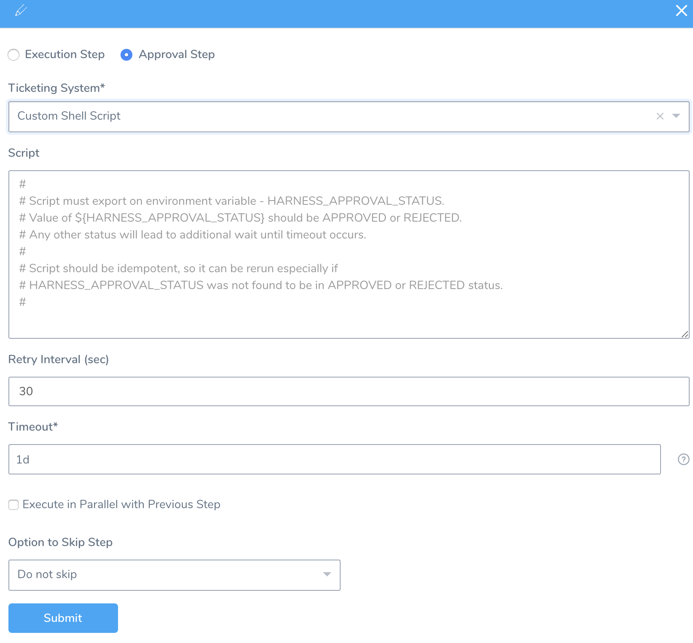
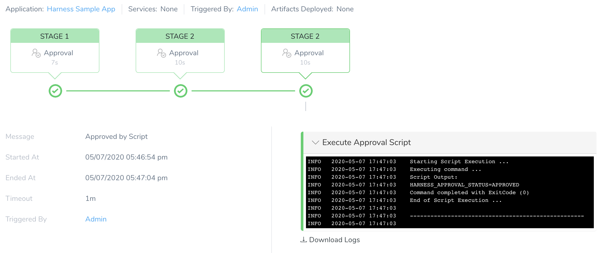

You can add approval steps in Pipelines and Workflows using a custom shell script ticketing system.

The other approval options are:

* [Jira Approvals](jira-based-approvals.md)
* [Harness UI Approvals](approvals.md)
* [ServiceNow Approvals](service-now-ticketing-system.md)

### Before You Begin

* [Workflows](../workflows/workflow-configuration.md)
* [Pipelines](../pipelines/pipeline-configuration.md)
* [Create Pipeline Templates](../pipelines/templatize-pipelines.md)

### Step: Add an Approval Step for a Pipeline

1. In your Pipeline, in **Pipeline Stages**, click **+**. The following settings appear.
2. Select **Approval Step**.
3. Select **Custom Shell Script** in the **Ticketing System**.
4. Enter custom shell script to approve or reject the Pipeline deployment request.
5. Enter the time duration in **Retry Interval (sec)** that Harness should wait between attempts to successfully execute the script.
6. Enter the time duration that Harness should wait for the approval or rejection before killing the deployment process. You can use `**w**`  for week, `**d**`  for day, `**h**`  for hour, `**m**`  for minutes, `**s**`  for seconds and `**ms**` for milliseconds. For example, 1d for one day.
7. In **Delegate Selector**, select the Selector for the Delegate(s) you want to use. Harness will use Delegates matching the Selector(s) for this approval step. For more information, see [Select Delegates with Selectors](https://docs.harness.io/article/c3fvixpgsl-select-delegates-for-specific-tasks-with-selectors).
8. Select **Execute in Parallel with Previous Step** checkbox to execute the steps in parallel.
9. Select either **Do not skip** or **Skip always** for setting the skip option. For more information, see [Skip Execution](../pipelines/skip-conditions.md#skip-execution).
10. Click **Submit**.

Deploy your Pipeline and go to the **Deployments** page. The **Approval Stage** displays the following information:

* **Message**: The "Message" appears only when the stage of a Pipeline is completed, and there is no action pending from the user or system. It displays the completed status of the process. For example, approval provided, approval rejected, or Pipeline aborted.
* **Started At**: The time at which the Pipeline was triggered.
* **Ended At**: The time at which the system or a user completed the approval process.
* **Timeout**: The time duration that Harness should wait for the approval or rejection before killing the deployment process.The maximum is 3w 3d 20h 30m.
* **Triggered By**: The user who triggered the Pipeline deployment. It can be triggered using a [Pipeline](../pipelines/pipeline-configuration.md) or [Trigger](../triggers/add-a-trigger-2.md) process.

Once the deployment is completed, the Details panel also displays a log of the script's execution.

