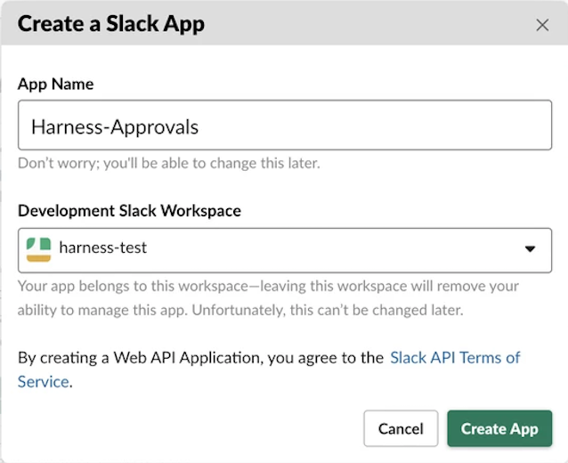
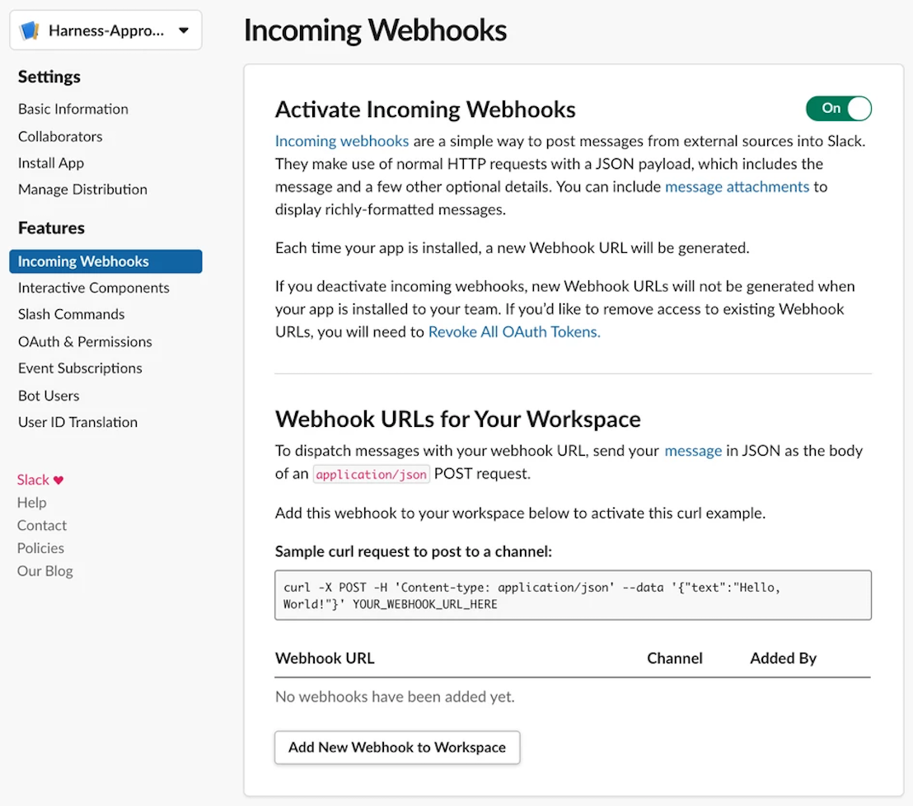
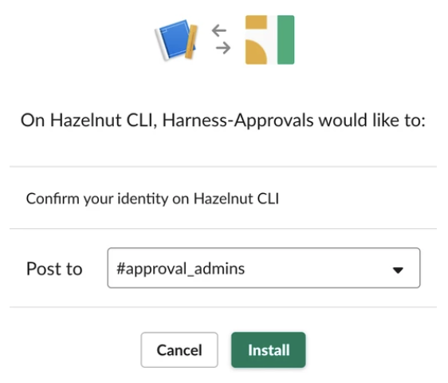
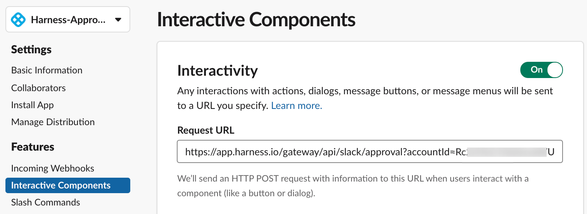
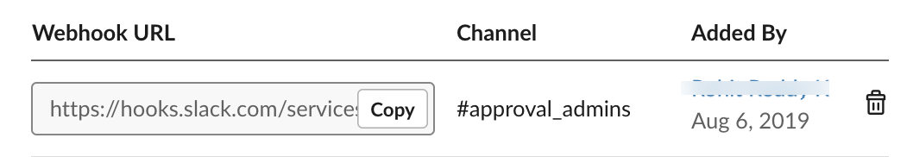
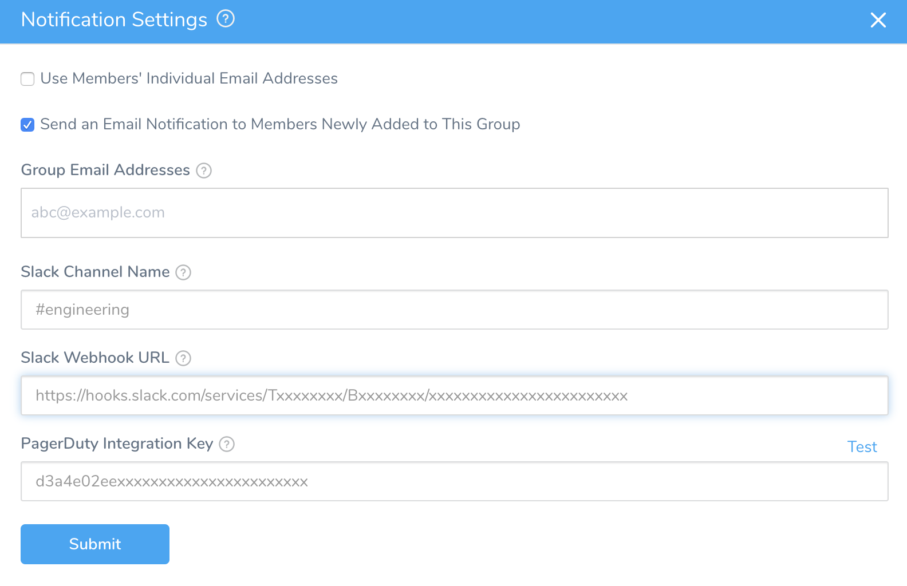

Currently, this feature is behind a Feature Flag. Contact [Harness Support](mailto:support@harness.io) to enable the feature. Feature Flags can only be removed for Harness Professional and Essentials editions. Once the feature is released to a general audience, it's available for Trial and Community Editions.Harness users can approve or reject Workflows and Pipelines directly from Slack.

To configure Harness notifications to Slack *without* enabling deployment approvals from Slack, see [Send Notifications Using Slack](https://docs.harness.io/article/4blpfqwfdc-send-notification-using-slack) and [Send Slack Messages from Workflows](https://docs.harness.io/article/4zd81qhhiu-slack-notifications).

### Step 1: Create Slack App

Create and configure an app in your Slack developer account at [https://api.slack.com](https://api.slack.com/).

For details on these steps, see Slack's [Incoming Webhooks](https://api.slack.com/incoming-webhooks) documentation.

When you create the app, do the following:

1. Name your app, assign it to a Workspace, and select **Create App**.

   
   
2. Select **Incoming Webhooks**.
3. Enable the **Activate Incoming Webhooks** slider:

   
   
4. Click **Add New Webhook to Workspace**.
5. At the **Confirm your identity** challenge, select the Slack channel to receive approval notifications. (To select an appropriate channel, see [Configure Harness User Notifications](#configure_notifications) below.)

   
   
6. Click **Install** (or **Authorize**) to confirm this setup.

### Step 2: Configure Harness API Endpoint in Slack

Configure the API endpoint from Harness for interactivity.

For details, see Slack's [Making Messages Interactive](https://api.slack.com/interactive-messages) documentation.

1. In Slack, select **Interactive Components**.
2. Enable the **Interactivity** slider:
3. Enter the **Request URL**, as either `http` or `https`. The **Request URL** is independent of the approval channel that we'll configure [below](#configure_notifications).  
  
    Harness SaaS users should enter a URL of the form shown above:  
    `https://app.harness.io/gateway/api/slack/approval?accountId=<accountID>`  
      
    On-prem users will instead have a URL of the form:  
    `https://<your-domain-name>.harness.io/gateway/api/slack/approval?accountId=<accountID>`

4. Click **Save**.
5. Return to the Slack app's **Incoming Webhooks** tab.
6. From the resulting app settings, copy the **Webhook URL** to your clipboard.

You've configured API endpoints in both your Slack app and Harness.

Now, you're ready to set up notifications for the Harness User Group, and the Slack channel, where you want to enable approvals.

### Step 3: Configure Harness User Notifications for Slack

Enabling Slack notifications in Harness is straightforward, but there are some important considerations:

* Select a Harness User Group that has appropriate permissions. These permissions must include **Application: Execute Workflow** and **Execute Pipeline** permissions for all relevant Applications.  
See [Application Permissions](https://docs.harness.io/article/ven0bvulsj#application_permissions) in [Managing Users and Groups (RBAC)](https://docs.harness.io/article/ven0bvulsj-users-and-permissions).
* You must create a Slack channel that has the same members as the User Group.
* You must manually keep the Slack channel's membership synchronized with the User Group's membership.
* You should normally configure this as a private Slack channel.

Any member of the Slack channel that you configure will be able to approve or reject deployments. This is why Harness emphasizes the importance of using a private channel, and of manually maintaining synchronization between your Harness User Group's membership and the Slack channel's membership.Once you have selected the appropriate User Group and Slack channel to use:

1. Open the User Group's notification settings. See [Add Notification Settings for User Groups](https://docs.harness.io/article/kf828e347t#step_add_notification_settings_for_user_groups).
2. In **Notification Settings**, specify the **Slack Channel Name**.
3. Paste in the **Slack Webhook URL** you copied above in [Step 2: Configure Harness API Endpoint in Slack](slack-approvals.md#step-2-configure-harness-api-endpoint-in-slack).

### Option: Approve ​Workflows via Slack

Once you've configured the URLs and channel notification settings above, members of the configured channel can approve or reject Workflow and Pipeline deployments directly from that channel.

To set up Slack approval within a Workflow:

1. Within a Workflow section, select **Add Step**.
2. Click **Approval.**
3. In **Ticketing System**, select **Harness UI**.
4. In the **User Groups** drop-down, select the group you enabled above in [Step 3: Configure Harness User Notifications for Slack](slack-approvals.md#step-3-configure-harness-user-notifications-for-slack).
5. Click **Submit.**

To see how approval of this step works in practice, see [Harness UI Approvals](approvals.md).

### Option: Approve Pipelines via Slack

To set up Slack approval within a Pipeline:

1. Add a stage to the Pipeline.
2. Click **Approval Step**.
3. In **Ticketing System**, select **Harness UI**.
4. Select the User Group you enabled above in [Step 3: Configure Harness User Notifications for Slack](slack-approvals.md#step-3-configure-harness-user-notifications-for-slack)
5. Set a **Timeout** and click **Submit**.

To see how approval of this step works in practice, see [Harness UI Approvals](approvals.md).

### See Also

* [Send Notifications Using Slack](https://docs.harness.io/article/4blpfqwfdc-send-notification-using-slack)
* [Send Slack Messages from Workflows](https://docs.harness.io/article/4zd81qhhiu-slack-notifications)
* [Set Up Slack Notifications for CE](https://docs.harness.io/article/5xiwejal3p-set-up-slack-notifications)

