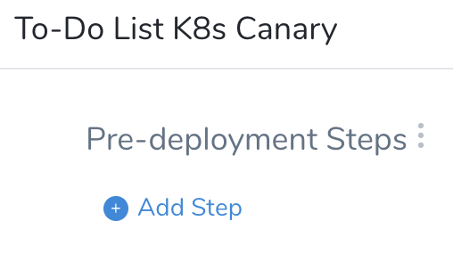
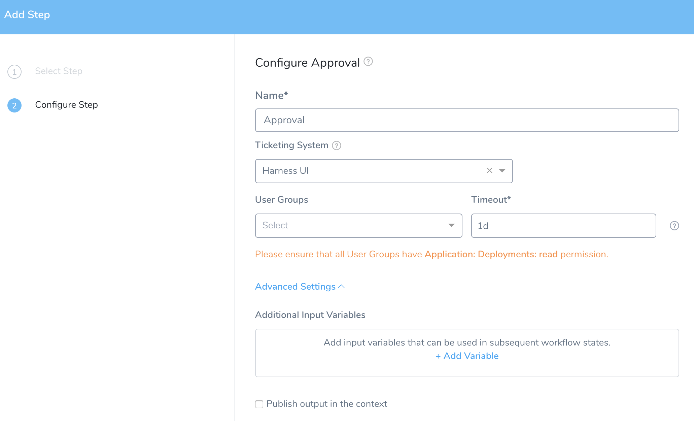
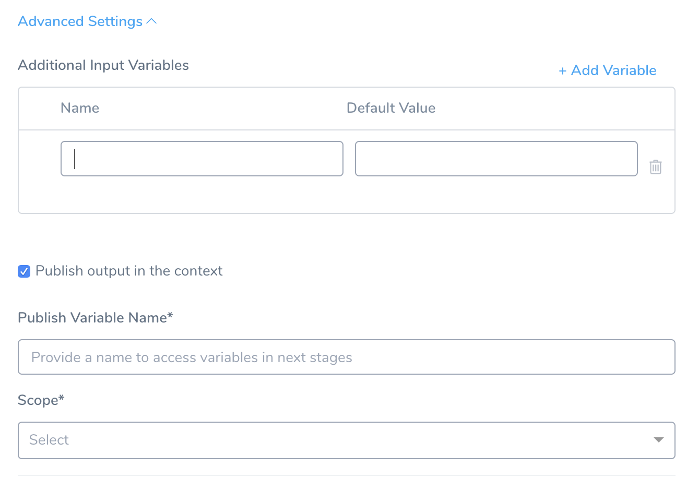
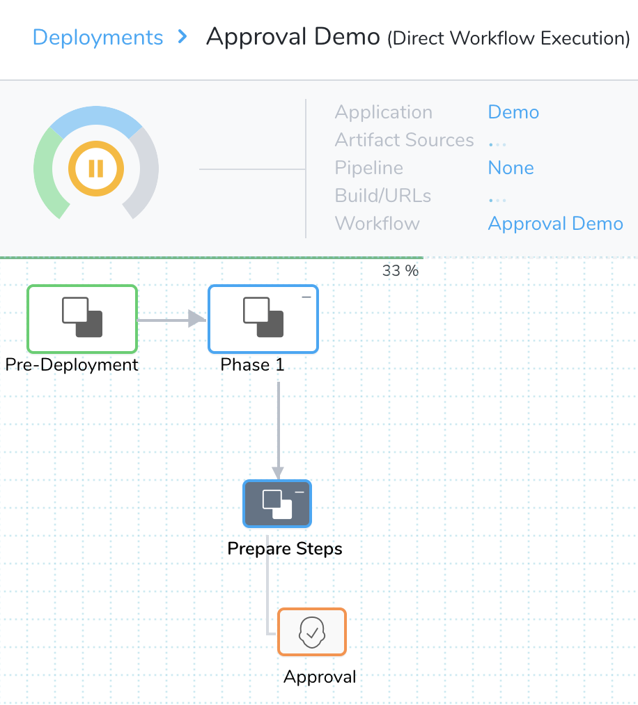
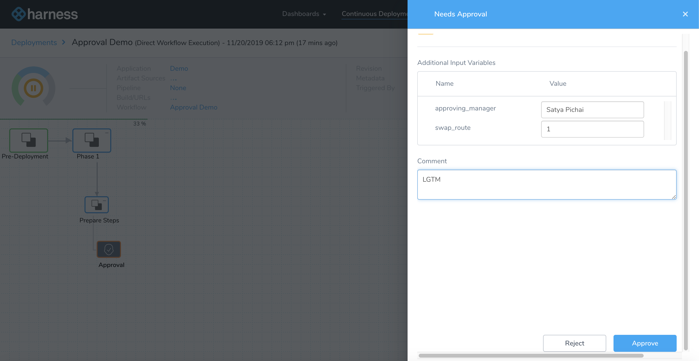
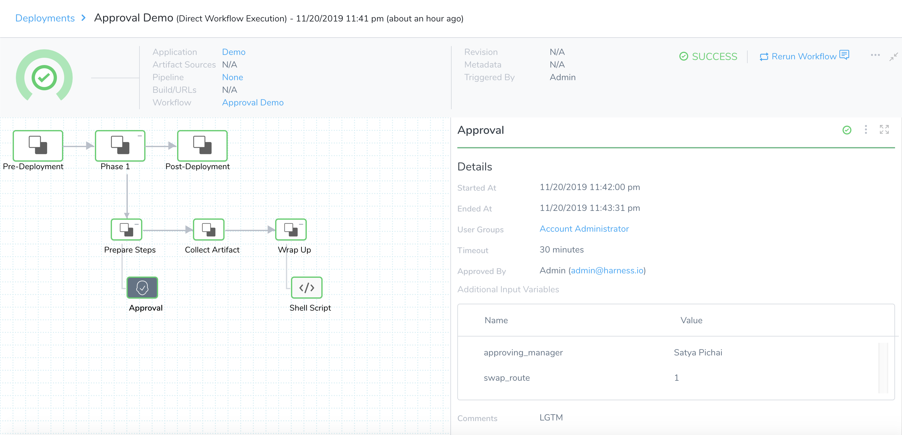

You can add predefined or user-defined variables in a Workflow Approval step. When the Workflow is deployed, these variables become available as inputs for logging and auditing and can be overwritten by approvers.

The available approval mechanisms are:

* [Jira Approvals](jira-based-approvals.md)
* [ServiceNow Approvals](service-now-ticketing-system.md)
* [Harness UI Approvals](approvals.md)
* [Custom Shell Script Approvals](shell-script-ticketing-system.md)

### Before You Begin

* [Workflows](../workflows/workflow-configuration.md)
* [Pipelines](../pipelines/pipeline-configuration.md)
* [Create Pipeline Templates](../pipelines/templatize-pipelines.md)

### Step 1: Add an Approval Step in a Workflow

1. In your Workflow, click **Add Step**.

    
   
2. Select **Approval**. You can search or click **Flow Control** and select **Approval**.
3. Click **Next**.  

   The Add Step settings appear.

   
   
4. In **Configure Approval**, enter **Name**.
5. Select **Harness UI** in the **Ticketing System**.You can use **Jira Service Desk**, **ServiceNow**, and **Custom Shell Script** based approvals as well. For more information on how to add these approvals, see [Jira Approvals](jira-based-approvals.md), [ServiceNow Approvals](service-now-ticketing-system.md), and [Custom Shell Script Approvals](shell-script-ticketing-system.md).
6. Select one or more **User Group(s)** to notify for the approval requests.
7. Enter the time duration that Harness should wait for the approval or rejection before killing the deployment process. You can use `**w**`  for week, `**d**`  for day, `**h**`  for hour, `**m**`  for minutes, `**s**`  for seconds and `**ms**` for milliseconds. For example, 1d for one day.
8. Click **Advanced Settings** to set the additional settings.

   
   
9. Click **Add Variable** to define variables. To define a new variable, enter a **Name** and a **Default Value**. You can use this variable combined with its parent variable name to reference the variable elsewhere.
10. In **Publish Variable Name**, enter a parent name for the collection of subordinate variables that you can reference with its child variables (as you defined in the previous step). This parent name helps to avoid conflicts when there are subordinate variables of the same name within the same scope.
11. Set the **Scope** for the variables that you defined in the previous step. You can choose, **Phase**, **Workflow**, or **Pipeline**.
12. Click **Submit** to save this Approval step, along with its variables.

### Step 2: Approve Workflows

Workflow uses the Approval variables as defined in the **Add an Approval Step in a Workflow** option, when it deploys. Deployment pauses at the Approval step.

1. Click **Approval** step.  
   
   A user (in one of the User Groups configured as approvers) can click the Approval step. The **Needs Approval** settings appear.
   
   

2. Enter your comments, and click **Approve.**

Once this step is approved, the Workflow can continue deployment.

### Option: Use Approval Variables in Other Workflow Steps

Approval variables can be defined only within Workflow Approval steps, but they can be referenced in other Workflow steps, such as the [Shell Script](../workflows/capture-shell-script-step-output.md) step.

For all of the following examples, `published_name` refers to the name you entered in the **Publish Variable Name** setting in the Approval step.

`${published_name.variables.var_name}`

* Use the `.variables.` prefix when referring to an **Additional Input Variable** that was defined in a Workflow Approval step.

`${approvedBy.name}` — (Deprecated)

* The name of the Harness user that approved a Workflow approval step.

`${approvedBy.email}` — (Deprecated)

* The email address of the Harness user that approved a Workflow approval step.

`${published_name.approvedBy.name}`

* The name of the Harness user that approved a Workflow approval step.
* As of December, 2019, this—and the other Approval variables below—must be preceded by a published output variable name (`published_name`).

`${published_name.approvedBy.email}`

* The email address of the Harness user that approved a Workflow approval step.

`${published_name.approvedOn}`

* The epoch time at which a Workflow approval step was approved.

`${published_name.comments}`

* Free-text comments that a user entered when approving (or rejecting) a Workflow approval step.

`${published_name.timeoutMillis}`

* Timeout (in milliseconds) set for this approval step.

`${published_name.approvalStateType}`

* The ticketing system used for this approval: USER\_GROUP, JIRA, SERVICENOW, and SHELL\_SCRIPT.

`${published_name.approvalStatus}`

* The approval's outcome. Can take the values SUCCESS or REJECTED.

`${published_name.userGroups[<index>].name}`

* An array of User Groups that were added in a Workflow's approval step.
* For example, if two User Groups were added, you can access those groups' names as `${published_name.userGroups[0].name}` and `${published_name.userGroups[1].name}`.

### See Also

* [Pass Variables between Workflows](../expressions/how-to-pass-variables-between-workflows.md)
* [Passing Variables into Workflows and Pipelines from Triggers](../expressions/passing-variable-into-workflows.md)

