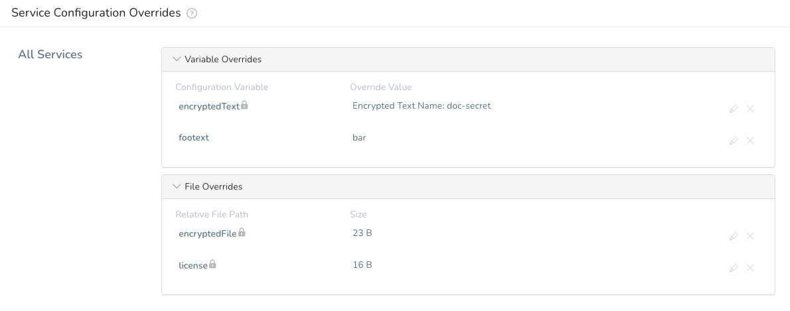

This topic describes how to create a Harness Environment-level variable that is not set in a Service, but is available in any Workflow using the Environment. 

This is helpful when you have want Environment-specific variables that will apply to all Services, but don't want to set up Config Vars in every Service. 

For example, let's say you have many Services using Tomcat that all connect to a backend database. The JDBC port will be different for different Environments, such as QA/SIT/UAT/PROD. Instead of defining a Service-level JDBC\_PORT variable for every Service, you can just create one JDBC\_PORT variable in each Environment. When each Environment is used in a Workflow, it supplies a different value for the JDBC\_PORT variable.

### Before You Begin

* [Built-in Variables List](https://docs.harness.io/article/aza65y4af6-built-in-variables-list)
* [Override a Service Configuration in an Environment](override-service-files-and-variables-in-environments.md)
* [Add Service Config Variables](../setup-services/add-service-level-config-variables.md)
* [Add Service Config Files](../setup-services/add-service-level-configuration-files.md)

### Supported Platforms and Technologies

See [Supported Platforms and Technologies](https://docs.harness.io/article/220d0ojx5y-supported-platforms).

### Step 1: Create a Service Configuration Override for All Services

1. In a Harness Application, click **Environments**.
2. In an **Environment**, in **Service Configuration Overrides**, click **Add Configuration Overrides**.  
The **Service Configuration Override** settings appear.
3. In **Service**, select **All Services** (at the bottom of the list). You can also select a specific Service. You simply aren't overriding its Service Config Variables or Files.
4. In **Override Type**, select **Variable Override** or **File Override**.

### Option: Variable Override

1. In **Configuration Variables**, enter a name for the variable.  
This is the name you will use to reference this variable later using the expression `${serviceVariable.ConfigurationVariablesName}` or `${environmentVariable.ConfigurationVariablesName}`.
2. In **Type**, select **Text** or **Encrypted Text**.
3. In **Override Value**, enter the value for the variable or select/add a new Encrypted Text variable.
4. Click **Submit**.

### Option: File Override

1. Click **Choose File**, and then select the file to add.  
To select a Harness [Encrypted Text file](https://docs.harness.io/article/nt5vchhka4-use-encrypted-file-secrets), click **Encrypt File**, and then select the file.
2. In **Relative File Path**, enter the name of the file. You can also enter the path where it will be placed on the target host(s).  
This is the name you will use to reference this file later using the expression `${configFile.getAsString("RelativeFilePathName")}`.
3. Click **Submit**.

### Step 2: Use the Variable or File in a Workflow

1. In a new or existing Workflow, select the Environment in the Workflow's settings.
2. Add a step to the Workflow that will use the Environment. For example, a [Shell Script](../workflows/capture-shell-script-step-output.md) step.
3. Reference the Environment variable using an expression.

For Variable Overrides, use the following for unencrypted or encrypted variables: `${serviceVariable.ConfigurationVariablesName}` or `${environmentVariable.ConfigurationVariablesName}`.

For File Overrides, use the following for unencrypted or encrypted files:

* `${configFile.getAsString("RelativeFilePathName")}` — standard text string.
* `${configFile.getAsBase64("RelativeFilePathName")}` — Base64 encoded.

### Review: Example Deployment

Let's look at an example where encrypted and unencrypted variables and files.

Here is an Environment with 4 Environment-level variables and files:



Here is a Shell Script step in a Workflow referencing them:


```
echo "Encrypted text Env var: " ${serviceVariable.encryptedText}  
  
echo "Unencrypted text Env var: " ${serviceVariable.footext}  
  
echo "Encrypted text Env var: " ${environmentVariable.encryptedText}  
  
echo "Unencrypted text Env var: " ${environmentVariable.footext}  
  
cat <<EOF  
Encrypted file Env var:  
${configFile.getAsString("encryptedFile")}  
EOF  
cat <<EOF  
Unencrypted file Env var:  
${configFile.getAsString("license")}  
EOF
```
When you deploy the Workflow, the output shows the variables and file contents:


```
Executing command ...  
Encrypted text Env var:  **************  
Unencrypted text Env var:  bar  
Encrypted text Env var:  **************  
Unencrypted text Env var:  bar  
  
Encrypted file Env var:  
this is a file secret  
  
Unencrypted file Env var:  
this is a secret  
Command completed with ExitCode (0)
```
### Configure As Code

To see how to configure the settings in this topic using YAML, configure the settings in the UI first, and then click the **YAML** editor button.

