Infrastructure Definition replaces [Service Infrastructures](service-infrastructures.md) as the method for defining your target infrastructure.The Infrastructure Definition is where you specify the target infrastructure for your deployment. The target infrastructure can be an existing infrastructure or an infrastructure provisioner, such as Terraform or CloudFormation, set up as a Harness [Infrastructure Provisioner](../infrastructure-provisioner/add-an-infra-provisioner.md).

When you create a Harness Workflow, you pick the Infrastructure Definition you want to use as the target deployment environment.

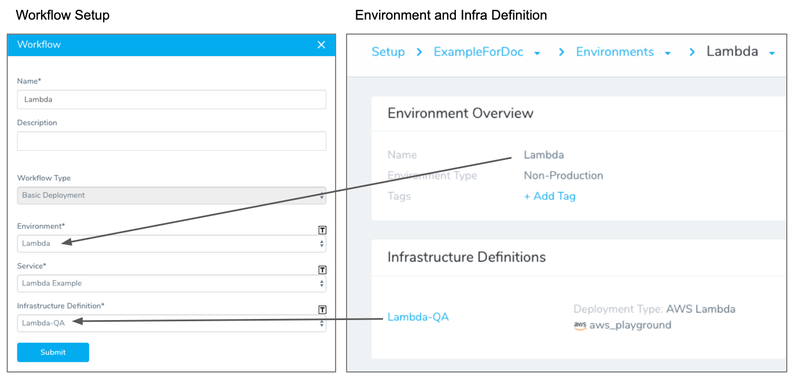

In this topic:

* [Before You Begin](infrastructure-definitions.md#before-you-begin)
* [Step: Add an Infrastructure Definition](infrastructure-definitions.md#step-add-an-infrastructure-definition)
* [Option 1: Scope to Specific Services](infrastructure-definitions.md#option-1-scope-to-specific-services)
* [Option 2: Use Expressions in Infrastructure Definitions](infrastructure-definitions.md#option-2-use-expressions-in-infrastructure-definitions)
* [Next Steps](infrastructure-definitions.md#next-steps)

### Before You Begin

* [Add Environment](environment-configuration.md)

### Step: Add an Infrastructure Definition

To add an Infrastructure Definition, do the following:

1. In your Harness Application, open or create an Environment.
2. In the Environment, you can see the **Infrastructure Definitions** section.

  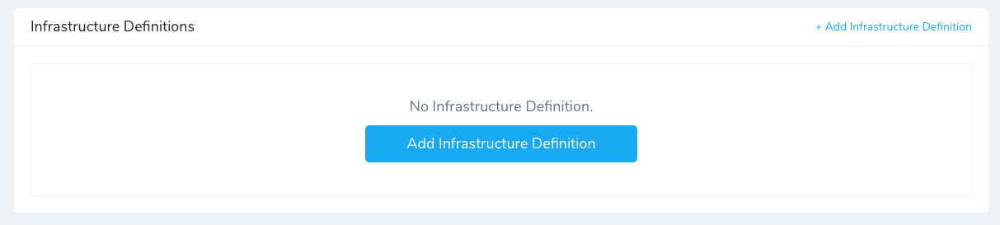

3. Click **Add Infrastructure Definition**. The **Infrastructure Definition** settings appear.

  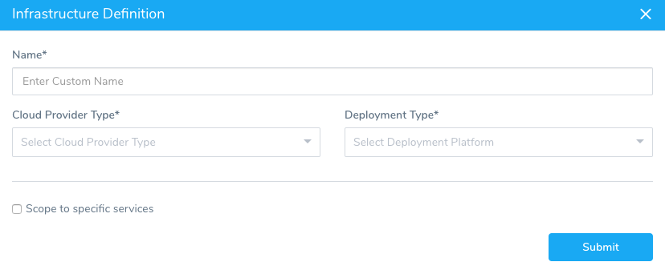

4. In **Name**, enter name for the Infrastructure Definition.
5. In **Cloud Provider Type**, select the type of Cloud Provider.  
**Which Type do I Use?** Pick the same type of Cloud Provider as the Cloud Provider you want this Infrastructure Definition to use to connect to your target infrastructure. For example, if the target infrastructure is in AWS, select Amazon Web Services.
6. In **Deployment Type**, select the type of deployment that matches the target infrastructure type. For example, if you are defining an infrastructure for AWS Lambda, then your **Deployment Type** would be **AWS Lambda**. If you are defining a Kubernetes cluster, then the **Deployment Type** would be **Kubernetes**.

That's the initial configuration of the Infrastructure Definition. The remaining settings depend on the Cloud Provider Type and Deployment Type you selected. If you selected AWS-related types, the remaining settings are AWS-related. If you select Kubernetes-related types, you will have Kubernetes cluster settings to provide.

### Option 1: Scope to Specific Services

The **Scope to specific Services** setting in the Infrastructure Definition enables you to scope this Infrastructure Definition to specific Harness Services.

This enables you to create one Infrastructure Definition and apply it to multiple Services. This will make the Infrastructure Definition available whenever a Workflow (or Phase) is set up for one of the Services.

For example, here is an Infrastructure Definition named **Lambda-QA** scoped to the Service named **AWS Lambda**. Next is a Workflow where the **AWS Lambda** Service has been selected.

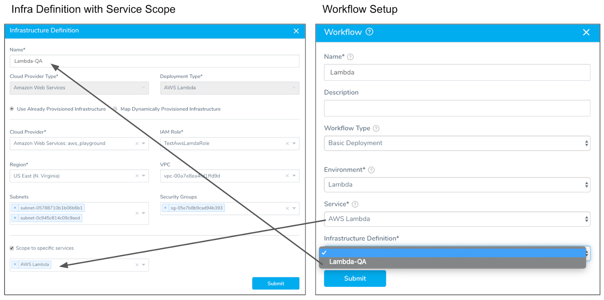

You can see that since the **AWS Lambda** Service was selected in the Workflow setup, the Infrastructure Definition **Lambda-QA** is available in the Infrastructure Definition setting.

This is because the **Lambda-QA** Infrastructure Definition is scoped to the **AWS Lambda** Service.

If **Scope to specific Services** is not used, the Infrastructure Definition is available to all Workflows using Services that match the Infrastructure Definition **Deployment Type**.When you deploy a Workflow, its Service is added to the **Scope to specific Services** setting in the Infrastructure Definition.

To prevent conflicts with multiple Workflows deploying to the same Infrastructure Definition ***simultaneously***, Harness uses Workflow queuing. For more information, see [Workflow Queuing](../workflows/workflow-queuing.md).When creating Infrastructure Definitions, you might want to simply leave the **Scope to specific Services** setting empty until you have set up the Services you want to deploy to the Infrastructure Definition, and then enter the Services in the **Scope to specific Services** setting.

#### Unscoped Infrastructure Definitions

When **Scope to specific Services** is not selected, you can use it with any Services.

When you create a Workflow, any *unscoped* Infrastructure Definitions are available. The Infrastructure Definitions that appear in the Workflow setup match the type of Service you select.

In the following example, the Infrastructure Definition is not scoped to a Service. In the **Workflow Phase** dialog, the Infrastructure Definition is available because its **Deployment Type** matches the Service selected in the Workflow Phase setup (Kubernetes).

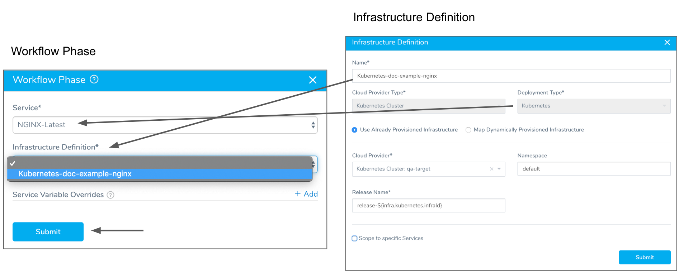

When the Workflow is deployed, the Service is automatically added to the **Service Infrastructure Mapping** of the Infrastructure Definition, regardless of whether the deployment was successful:

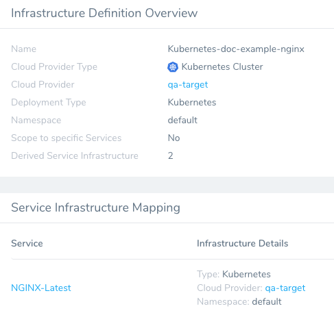

When additional Workflows use the Infrastructure Definition and deploy, they will be automatically added to the **Service Infrastructure Mapping** of the Infrastructure Definition also. Their deployment status is also listed:

#### Service Infrastructure Mapping

Once a Service has been deployed using an Infrastructure Definition, the Service and its details are displayed in **Service Infrastructure Mapping**.

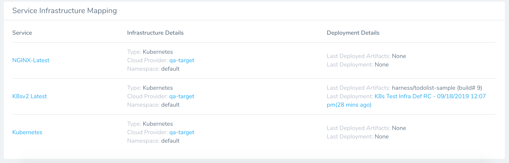

**Service Infrastructure Mapping** helps you keep track of the Services using the Infrastructure Definition.

Services are listed in **Service Infrastructure Mapping** even if deployment fails because deployment infrastructure mapping gets created before deployment proceeds.

### Option 2: Use Expressions in Infrastructure Definitions

You can use expressions for many Infrastructure Definition settings. This enables you to use a single Infrastructure Definition in multiple Workflows. In each Workflow, you can replace the expression with a specific value.

For example, here is the Infrastructure Definition for a Kubernetes cluster. In the **Namespace** field we have the expression `${workflow.variables.namespace}`:

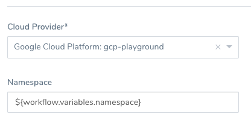

In each Workflow that uses this Infrastructure Definition, you can add a Workflow variable that replaces the namespace expression with a hardcoded value:

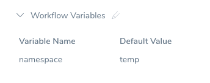

You could also have a non-fixed Workflow variable, and have the value entered during deployment manually...

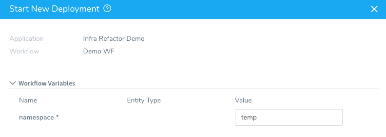

...or you can have the value passed in by a Trigger.

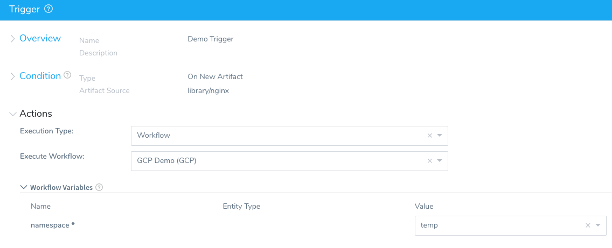

#### Service Variables

Currently, Service variables cannot be automatically filled in Infrastructure Definition fields. Typically, automatically-filled Service variables appear when you begin typing `${` in a field. Until they are supported, you can enter them manually by typing `${serviceVariable.var_name}` where `var_name` is the Service variable name.

If an Infrastructure Definition is scoped to specific Services, only use Service variables from those Services.

If an Infrastructure Definition is not scoped, and therefore available to any Service of the same type, you can use Service variables from any Service of the same type.

### Next Steps

* [Add Workflows](https://docs.harness.io/category/add-workflows)
* [Templatize a Workflow](../workflows/templatize-a-workflow-new-template.md)
* [Deploy a Workflow to Multiple Infrastructures Simultaneously](https://docs.harness.io/article/bc65k2imoi-deploy-to-multiple-infrastructures)

