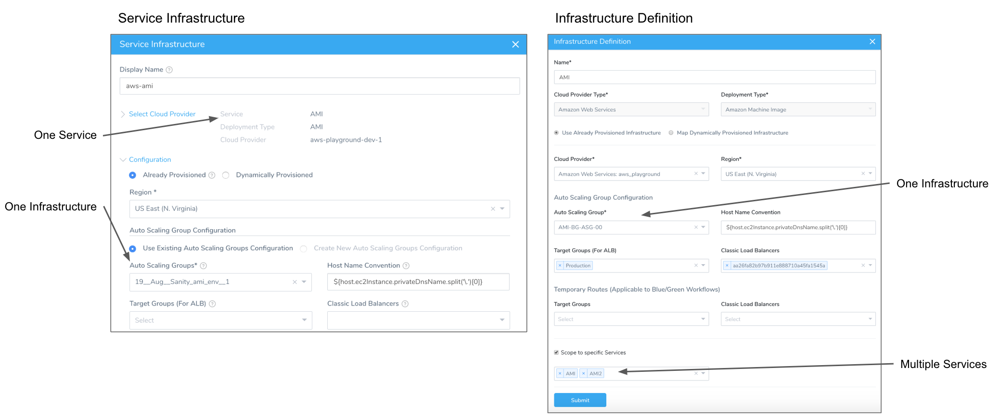
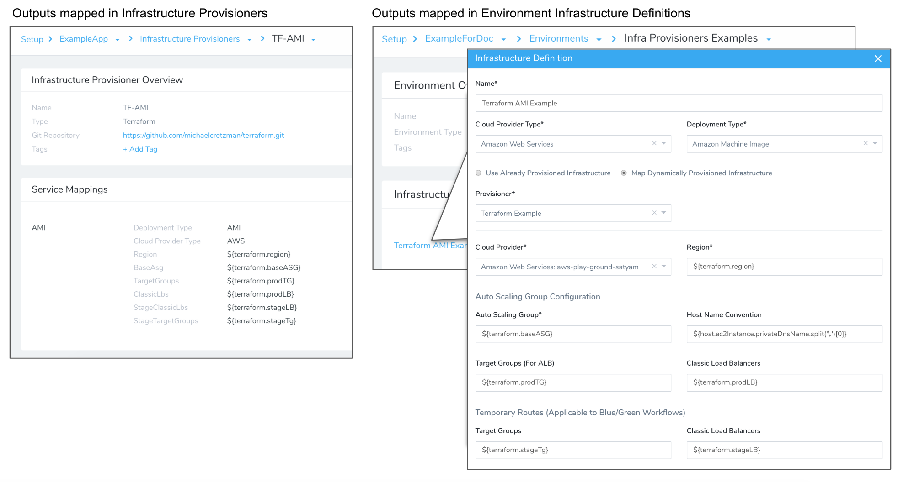
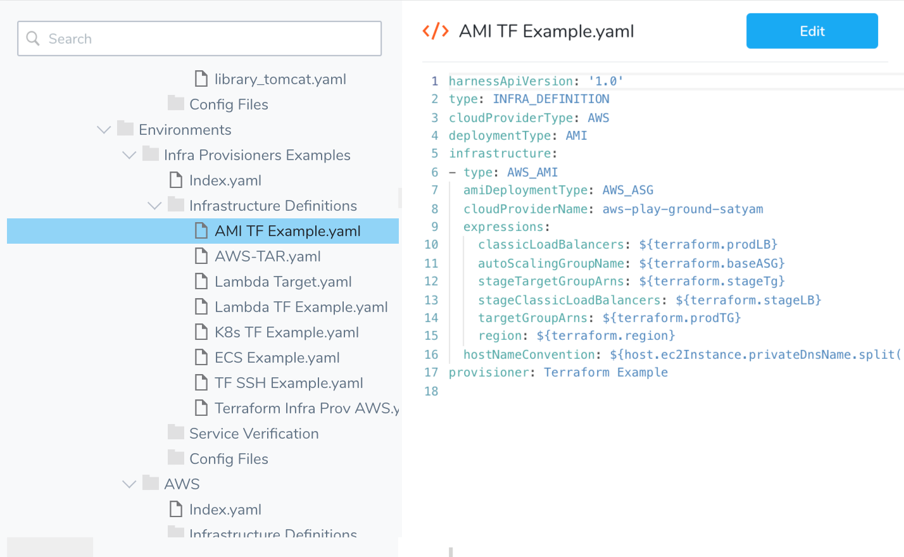

Harness [Infrastructure Definitions](infrastructure-definitions.md) replace Service Infrastructures and provide the benefits described below.

**How do I migrate?** Contact Harness Support at [support@harness.io](mailto:support@harness.io?subject=Migrating to Infrastructure Definitions).

### Overview of Changes

Here is a quick summary of the changes from Service Infrastructures to Infrastructure Definitions:

|  |  |
| --- | --- |
| **Service Infrastructure** | **Infrastructure Definitions** |
| **One-to-One:**Each Service Infrastructure is tied to one Harness Service. | **One-to-Many:**Each Infrastructure Definition can be used by multiple Harness Services of the same Deployment Type. |
| **Single-Cluster Infrastructure:**Need to create multiple Service Infrastructures for the same ECS or Kubernetes cluster. | **Multi-Cluster Infrastructure:**A single Infrastructure Definition for a cluster can be shared by all the microservices you want deployed to the cluster. |
| **Cannot Control Scope:**Cannot scope two or more Services to the same Service Infrastructure. | **Scope Control:**You can choose to scope the Infrastructure Definition to one or more Services, manually or automatically following deployment. |
| **Manual Mapping:**You must manually set up each Service Infrastructure for each Service. | **Mapped Automatically:**If the Infrastructure Definition is *unscoped* (not limited to specific Services), when a Workflow using a Service and Infrastructure Definition is deployed, the Service is automatically mapped to the Infrastructure Definition. |

To avoid collisions when multiple Workflows are deploying to the same Infrastructure Definition, Harness employs [Workflow Queuing](../workflows/workflow-queuing.md).

### What Will Happen When I Migrate?

Once you migrate to Infrastructure Definitions, the following changes will appear in your Harness account.

#### Service Infrastructures Replaced by Infrastructure Definitions

New Infrastructure Definitions will be scoped to the Service that was used by the Service Infrastructure. See [Scope to Specific Services](infrastructure-definitions.md#scope-to-specific-services).

For example, if you had two Service Infrastructures for the same Service, you will now have two Infrastructure Definitions, each scoped to that Service.

#### Service Mappings Moved to Infrastructure Definitions

Service Mappings in an Infrastructure Provisioner used by a Service Infrastructure are moved into the Infrastructure Definition that replaced the Service Infrastructure.

See [Infrastructure Provisioner Service Mappings moved to Infrastructure Definitions](migrating-from-service-infrastructures-to-infrastructure-definitions.md#infrastructure-provisioner-service-mappings-moved-to-infrastructure-definitions) below.

### Optimize Infrastructure Setup

Service Infrastructures were a one-to-one mapping of one Harness Service and one Harness Service Infrastructure. You had to create a separate Service Infrastructure for each Service. If you wanted to deploy many Services to the same infrastructure, you had to create a new Service Infrastructure for each Service—a repetitive process.

Infrastructure Definitions decouple infrastructures from Harness Services, allowing you to create one Infrastructure Definition and share it with *many* Services. There is no need to repeatedly set up Service Infrastructures for multiple Services.

You can scope an Infrastructure Definition to as many Services as needed, or leave the Infrastructure Definition *unscoped*, which allows it to be used by any Workflow deploying a Service of the same Deployment Type (Kubernetes, AMI, ECS, etc).

### Infrastructure Provisioner Service Mappings moved to Infrastructure Definitions

Infrastructure Definitions also replace the Service Mappings that were previously set up in Harness [Infrastructure Provisioners](../infrastructure-provisioner/add-an-infra-provisioner.md).

Service Mappings mapped provisioner outputs to the required settings Harness needs to provision infrastructure, such as VPC regions and Kubernetes namespaces.

With Infrastructure Definitions, provisioner outputs are mapped in Infrastructure Definitions that use Harness Infrastructure Provisioners. This way, mappings are part of the Infrastructure Definitions that use the provisioner and mappings are performed once and applied to any Services that use the Infrastructure Definitions.

Here is an example of a Terraform Service Mapping using the old Service Infrastructure method, and how the same mapping is now performed using an Infrastructure Definition:

The YAML settings for Service Mappings are also moved to the new Infrastructure Definitions:

