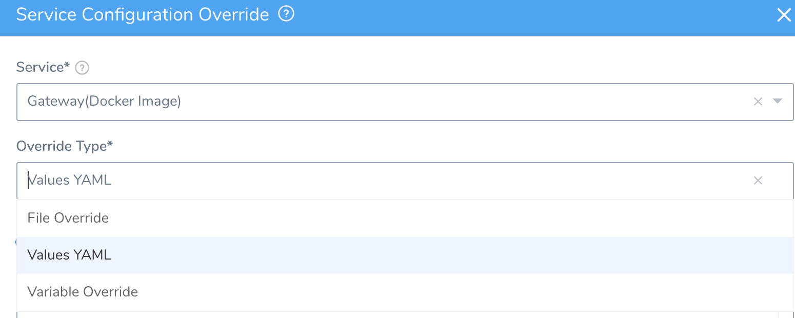
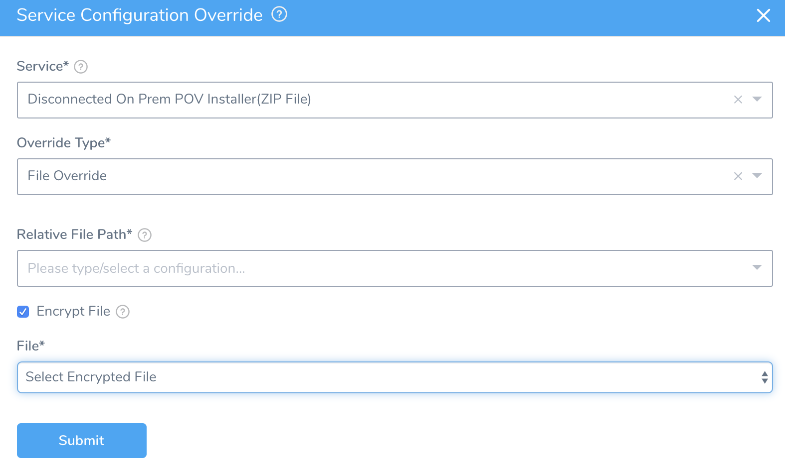
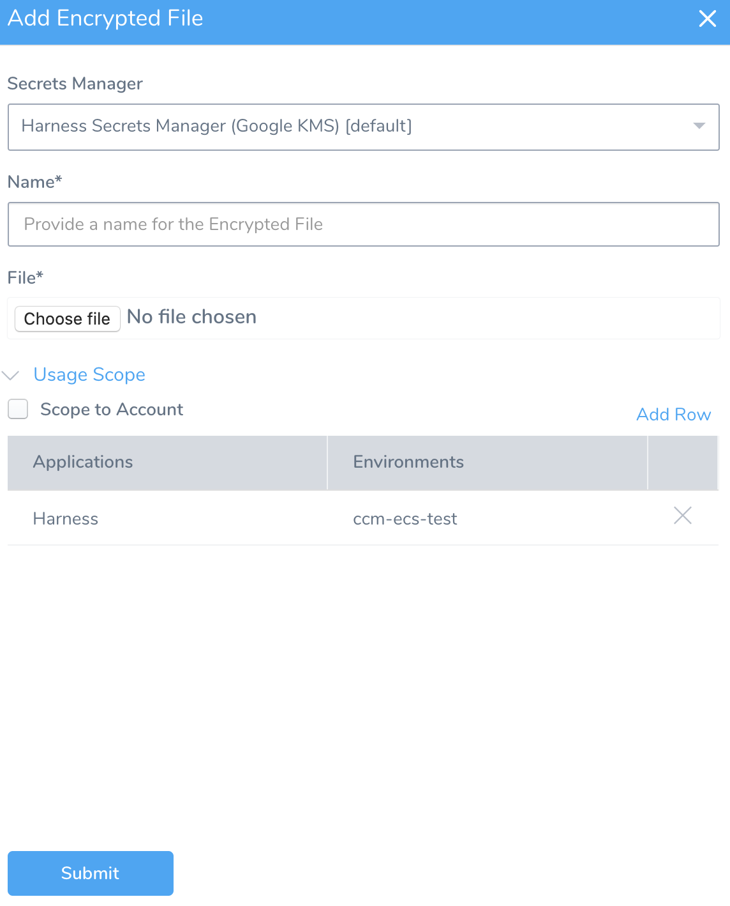
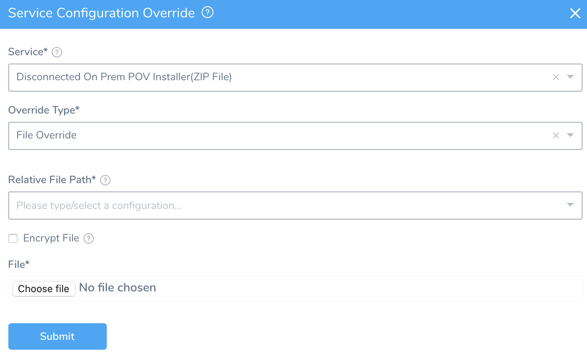
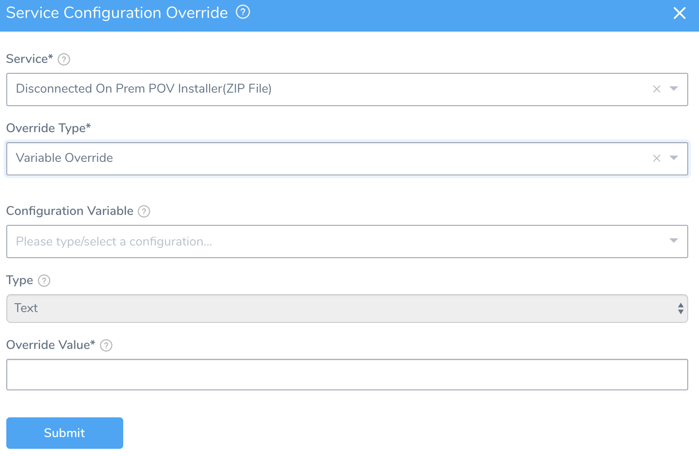
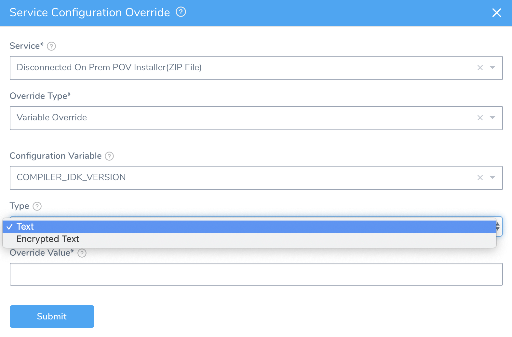

In a Harness Environment's **Service Configuration Overrides** section, you can override the settings of the Services that are deployed to that Environment.

This enables a Service to keep its settings but have them changed when deployed to an Environment.

You can also create an Environment variable or file that can be used by any Workflow but is not related to a Service-level setting. See [Create Environment-level Variables and Files for All Services](environment-level-variables-for-all-services.md).

### Before You Begin

* [Add Environment](environment-configuration.md)
* [Add an Infrastructure Definition](infrastructure-definitions.md)

### Limitations

* You cannot use an empty string in an override.

### Review: Override Type Options

1. From the **Environment**, go to the **Service Configuration Overrides** section, and click **Add Configuration Overrides**. The **Service Configuration Override** settings appear.
2. In **Service**, select the Service you want to override.
3. Select one of the **Override Type** options:
  * File Override
  * Variable Override
  * Values YAML

  

### Option 1: File Override

1. In **Override Type**, select **File Override**.
2. In **Relative File Path**, select the file to overwrite from the Service's **Config Files**.
3. Select the **Encrypt File** checkbox, to overwrite the Service's Config File using an existing encrypted file from Harness Secrets Management.

   

4. You can select the encrypted file from the drop-down menu or **Add New Encrypt File**. For more information on adding new encrypt file, see [Use Encrypted File Secrets](https://docs.harness.io/article/nt5vchhka4-use-encrypted-file-secrets).

   

5. If you do not select the **Encrypt File** option, then choose the **File** to overwrite the Service's **Config Files** and click **Submit**.

Make sure you have the **update** permission on the Environment before you try to add the Service Config File. See [Managing Users and Groups (RBAC)](https://docs.harness.io/article/ven0bvulsj-users-and-permissions) for more information about assigning permissions.

### Option 2: Variable Override

1. In **Override Type**, select **Variable Override**. The **Variable Override** options appear.

  

2. In **Configuration Variable**, select the variable from the Service's **Config Variables** to overwrite.
3. In **Type**, select **Text** or **Encrypted Text**.

  

4. In **Override Value**, enter the value to overwrite the variable value in the Service. If you selected **Encrypted Text** in Type, you can select an Encrypted Text values defined in [Secrets Management](https://docs.harness.io/article/au38zpufhr-secret-management) and click **Submit**.

### Platform-Specific Options

* For Kubernetes, Helm charts, and OpenShift, see [Override Harness Kubernetes Service Settings](https://docs.harness.io/article/ycacqs7tlx-override-harness-kubernetes-service-settings).
* For PCF, see [PCF Manifests Override](https://docs.harness.io/article/r0vp331jnq-override-pcf-manifests-and-config-variables-and-files#option_2_pcf_manifests_override).

