You can pass values from a Harness Trigger into a Harness Workflow to be used during Workflow steps or configuration, and as part of a Pipeline.

This process can be valuable when you want to use information from the Trigger condition as parameters in your Workflow at runtime.

For information on variables in Harness, see [Variables and Expressions in Harness](https://docs.harness.io/article/9dvxcegm90-variables).An example is using a Github or Bitbucket push or pull request as a Trigger condition and passing push or pull request information to a Workflow via the Trigger.

In the Workflow, you could take the branch name from the push or pull request and use it to create a namespace in a Helm chart, thereby creating a new Kubernetes namespace for each branch during deployment.

The Workflow can be templated (also called *templatized*) and each user that has a branch on the repo can initiate the Trigger with a push or pull request. For more information on using Workflows as templates, see [Template a Workflow](../workflows/workflow-configuration.md#template-a-workflow).

### Permissions Required

The [Administer Other Account Functions](https://docs.harness.io/article/ven0bvulsj-users-and-permissions) account permission is required to template the Environment setting in a Workflow.

### Passing Variables Overview

To pass variable values from a Trigger into a Workflow, perform the following steps:

1. Create a Workflow.
2. Add one or more text variables to the Workflow. You can also template the Workflow, thereby creating entity variables in **Workflow Variables**.
3. Use the variables in your Workflow steps or configuration.
4. Create a Trigger.
5. Select the Trigger condition, such as a Git pull request.
6. Select your Workflow as the target for the Trigger. This will expose the Workflow variables in your Trigger.
7. In the Trigger, use variable values from the Trigger condition to define the Workflow variables, such as values passed in from the Git pull request.
8. Use the Trigger URL to initiate the Trigger. For example, add the Trigger URL to the Git repo as a Webhook.

These steps are demonstrated in detail below.

### Before You Begin

* [Add a Workflow](../workflows/workflow-configuration.md)
* [Add a Trigger](../triggers/add-a-trigger-2.md)
* [Variables and Expressions in Harness](https://docs.harness.io/article/9dvxcegm90-variables)

### Set Up Workflow with Variables

The following procedure creates Workflow variables in an existing Workflow.

You can also add variables for Workflow entities such as Service, Environment, and Infrastructure Definition using the template option, described in [Using Templated Workflow Variables](#using_templated_workflow_variables).

To set up Workflow variables, do the following:

1. In a Workflow, click the pencil icon next to **Workflow Variables.** **Workflow Variables** appear.

    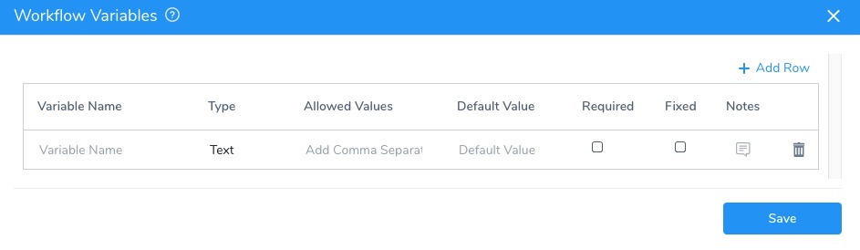

    **Workflow Variables** have the following settings.

    |  |  |
    | --- | --- |
    | **Field** | **Description** |
    | **Variable Name** | Enter a name for the variable. When the variable is used in a Trigger or elsewhere in the Harness Application, the variable name is used.The syntax for variable names is `${workflow.variables.`*`name`*`}`. For example, if you created a variable named **Url**, the variable name is `${workflow.variables.Url}`. |
    | **Type** | Select **Text**. |
    | **Default Value** | Enter a value for the variable. A value is not mandatory. If you will be placing a value in the variable via a Trigger, you will typically leave **Default Value** empty. |
    | **Required** | Select this option to enforce that a value for the variable is provided before the Workflow is executed. |
    | **Fixed** | Select this option if the value of the variable specified here must not be changed. If you will be placing a value in the variable via a Trigger, you will not enable **Fixed**. |
    | **Description** | Provide a description of the variable that lets others know its purpose and requirements. |

1. When you have added your variables, click **SUBMIT**. The **Workflow Variables** section of the Workflow displays the new variables.
2. Use the variables in your Workflow.
3. Next, create a Trigger to execute this Workflow and provide a value for the variables, as described below.

### Using Templated Workflow Variables

In most cases where you want to pass variables into a Workflow from a Trigger, you will template a Workflow, creating Workflow variables for its primary settings.

Once you create a Workflow, you can go back to its settings and click the template button (**T**).

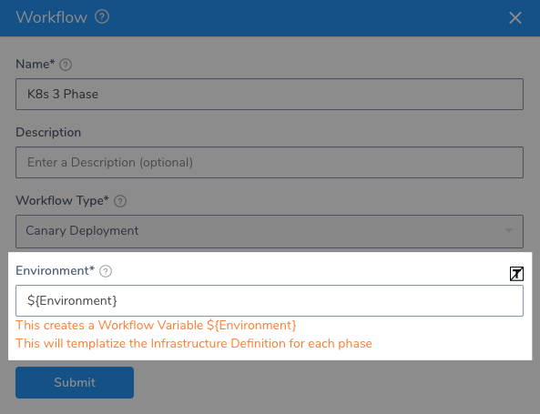

This creates a Workflow variable for that setting, and any dependent settings. For example, when you template a Workflow Environment, its Infrastructure Definitions are also templated.

Here is a Workflow with templated Environment and Infrastructure Definitions, as well as two regular Workflow variables.

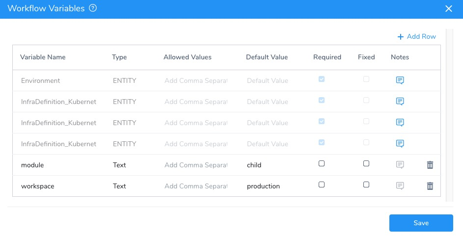

To use entity variables in a [Shell Script](../workflows/capture-shell-script-step-output.md) step, you follow the standard Workflow variable syntax: `${workflow.variables.`*`name`*`}`. For example, if you created an Environment entity variable, the variable expression is `${workflow.variables.Environment}`.

### Populate Workflow Variables in a Trigger

The following procedure creates a Trigger that executes a Workflow and populates its Workflow variables. In this example, we use Git release information to populate the variables.

To create a Trigger that populates Workflow variables, do the following:

1. Click **Setup**.
2. Click the Application that contains the Workflow or Pipeline you want to Trigger.
3. Click **Triggers**.
4. Click **Add Trigger**. The **Trigger** dialog appears.

   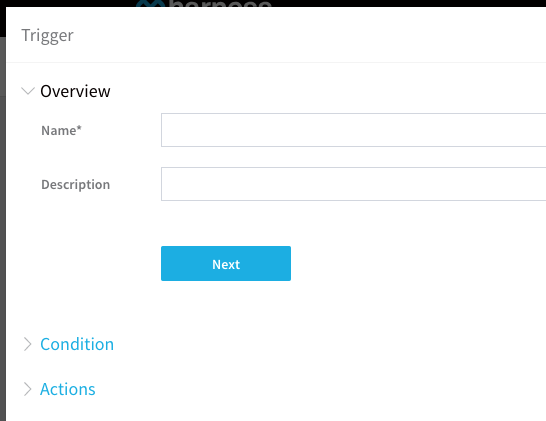
   
5. In **Name**, enter name for the Trigger that helps others understand its function, and click **Next**.
6. In **Condition**, select the condition that will execute the Trigger. The actions available to the Trigger depend on which condition you select. For this example, click **On Webhook Event**.
7. In **Repository Type**, click **Github** or **BitBucket**. The variables you can enter in **Actions** depend on which Git provider you select.
8. In **Event Type**, select **On Release**. The event type you select determines what variables you can use in **Actions**.
9. In **Action**, select **Published**.
10. Click **Next**. The **Actions** settings appear.
11. In **Execution Type**, select **Workflow**. You can also select **Pipeline**. If you select **Pipeline**, the Workflow variables for all of the Workflows in the Pipeline will be available.
12. In **Execute Workflow**. select the Workflow you created. The **Workflow Variables** section displays the variables you defined in the Workflow.
13. For Workflow variables, click in the **Value** field. The available options are listed. For templated Workflow variables (for example, Environment), scroll to the bottom to see custom values.  
    These are the builtin variables you can use to obtain information from the Git release.
    
    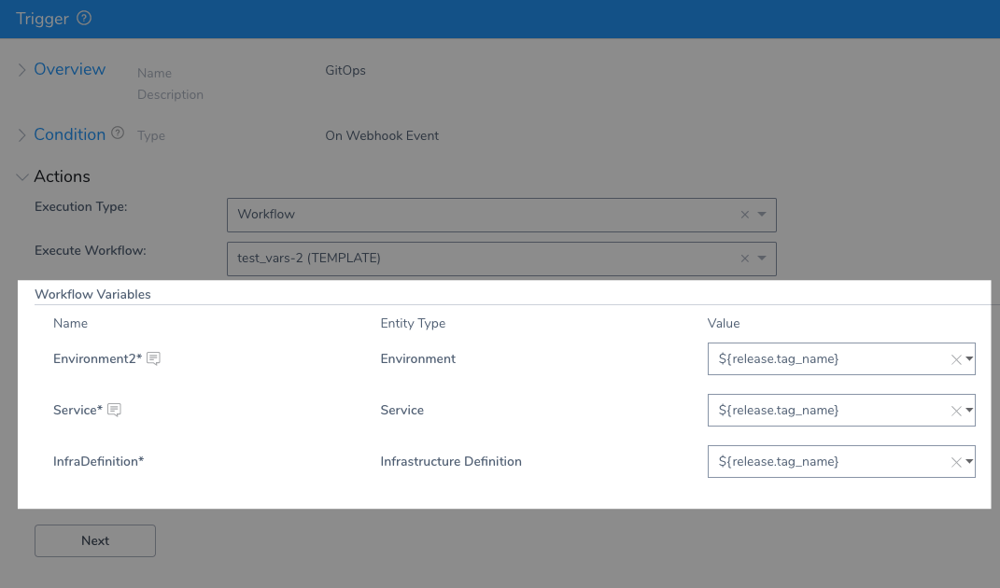
    
14. Select a variable to use. For example, if you had a Harness Environment named after each Git release tag and you wanted to use the name of the tag to pick the matching Environment, you could select the variable named `${release.tag_name}` to obtain the branch name.  
Whenever you specify an Environment you also have to specify an Infrastructure Definition.
15. When you are done, click **Next**, and then click **SUBMIT**.

The final step is to take the Trigger's **Github Webhook** URL and add it to your repo.

1. In **Triggers**, in the listing for your Trigger, click **Github Webhook** (or **Bitbucket Webhook**).

   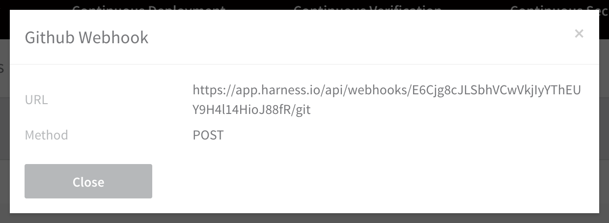
   
2. Copy the URL and use it in Github to execute the Trigger. Ensure the Webhook events (pushes, pull requests, releases, etc) are selected in your repo.

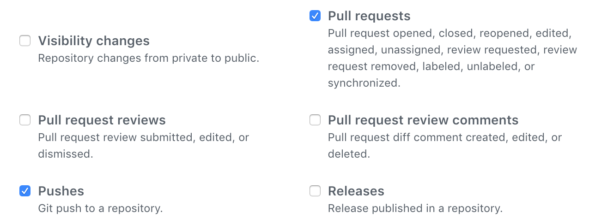

### Push and Pull Request Variables

The following list of Git push and pull request variables are available in a Trigger, and can be passed to the Workflows (and Pipelines) executed by the Trigger.

For information on any of the values in the GitHub or Bitbucket response payload, see the [GitHub REST API V3](https://developer.github.com/v3/) and [Bitbucket API](https://developer.atlassian.com/bitbucket/api/2/reference/resource/). You can see an example payload from GitHub at [Webhook payload example](https://developer.github.com/v3/activity/events/types/#webhook-payload-example).

The expressions used in `${...}` evaluate to values in the Git repo provider JSON. They will be different for each Git provider.

Enter an expression that maps to the JSON element you want to reference.

The following table provides some examples for Bitbucket.

|  |  |
| --- | --- |
| **Variables** | **Description of Values** |
| `${ref}` | Obtain the ref string from the push or pull request. |
| `${ref.split(‘/’)[2]}` | Splits a ref string into its substrings based on the / delimiter and limits the number of strings returned to two. For more information on the Java split() method see [split](https://docs.oracle.com/javase/8/docs/api/java/lang/String.html#split-java.lang.String-) in the Java docs. |
| `${commits[0].id}` | Commit ID of commit. |
| `${head_commit.id}` | Head ID of commit. |
| `${repository.name}` | Repo name. |
| `${repository.id}` | Repo ID. |
| `${pullrequest.id}` | Pull request ID. For example: `"id": 222571186`. |
| `${pullrequest.title}` | Output title. |
| `${pullrequest.fromRef.branch.name}` | The head branch where the changes are on. |
| `${pullrequest.toRef.branch.name}` | The branch where the changes will be merged. |
| `${pullrequest.fromRef.repository.project.name}` | The repo project where the changes are on. |
| `${pullrequest.toRef.repository.project.name}` | The repo project where the changes will be merged. |
| `${pullrequest.fromRef.repository.owner.username}` | The username for the repo where the changes are on. |
| `${pullrequest.toRef.repository.owner.username}` | The username for the repo where the changes will be merged. |
| `${pullrequest.fromRef.commit.hash}` | The `merge_commit_sha` for the commit from the branch. |
| `${pullrequest.toRef.commit.hash}` | The `merge_commit_sha` for the commit to the merged branch. |

You can also add text before and after the variable. You simply type in the text, such as `${pull_request.id}-sometext`.

### Passing Variables Along a Pipeline

When you have multiple Workflows in a Pipeline, you can pass variables into each Workflow in the Pipeline via the Trigger for the Pipeline, and you can pass in variables to be used in every Workflow in the Pipeline.

For example, let's say you wanted all the Workflows in a Pipeline to use the same **Environment** and **​​​​Infrastructure Definition**, and the names of the Environment and ​Infrastructure Definition are based on a repo branch name. When a Trigger executes the Pipeline in response to a Git push event, you want the Trigger to pass in the branch name to each Workflow's **Environment** and **Infrastructure Definition**.

First, you could create an **Environment** and **Infrastructure Definition** using the branch name for the **Environment** and the branch name plus a suffix `-catalog` for the **Infrastructure Definition**:

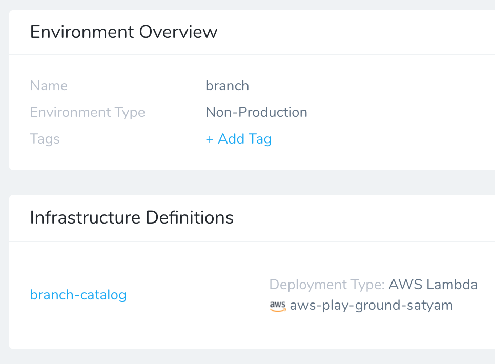

In a Workflow, open its setup dialog and click the [T] next to Environment and Infrastructure Definition to create Workflow variables for those entities:

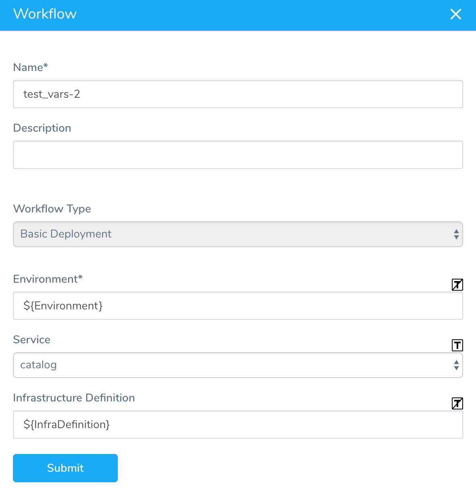

You can ensure that the variables are named `Environment` and `ServiceInfra` or `InfraDefinition`. Click **Submit** and then look at the Workflow Variables section for the new variables:

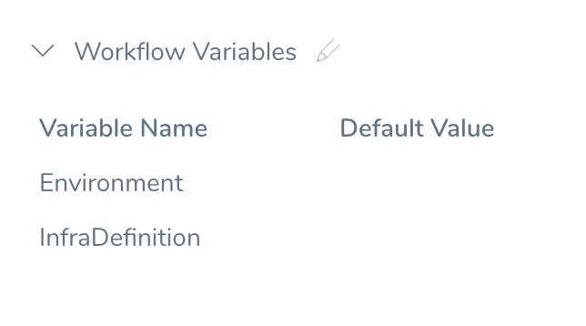

You can clone this Workflow to make additional Workflows for your Pipeline, and then change each Workflow as needed, leaving the entity variables for **Environment** and **Infrastructure Definition** the same.

Next, you create a Pipeline and add each Workflow. When you select the Workflow in the Pipeline, the **Workflow Variables** are required because they are entity settings. You then enter the same variable names you used in the Workflows, `${Environment}` and `${InfraDefinition}`:

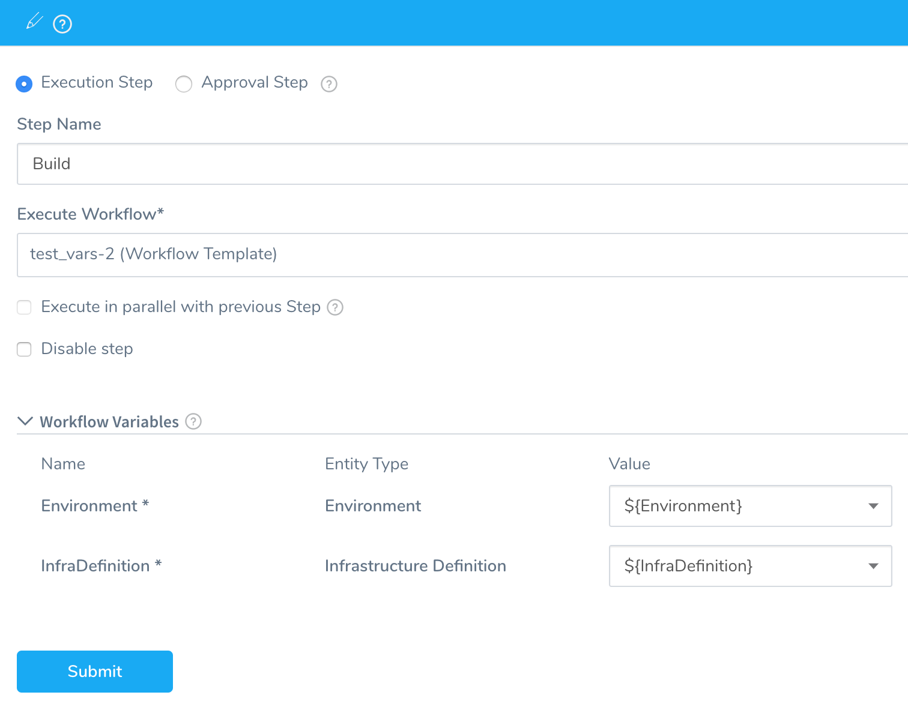

Lastly, you create a Trigger for the Pipeline. When you select the Pipeline in the Trigger, the required **Workflow Variables** appear. You will only see two variables for all of the Workflows in the Pipeline because they used the same names.

Next, you can enter variables in the **Value** column for each variable, such as `${ref.split(‘/’)[2]}` to use a repo branch name for the **Environment** variable and `${ref.split(‘/’)[2]}-catalog` to use a repo branch name and add the suffix `-catalog` for **InfraDefinition**:

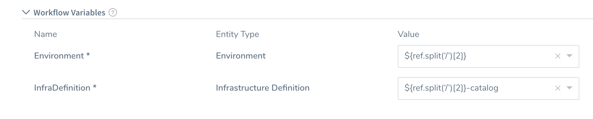

Now, when the Trigger is executed, it will pass the variable values to the **Environment** and **Infrastructure Definition** settings in all Workflows in the Pipeline.

### See Also

[Triggers and Queued Workflows](../triggers/add-a-trigger-2.md#triggers-and-queued-workflows)

