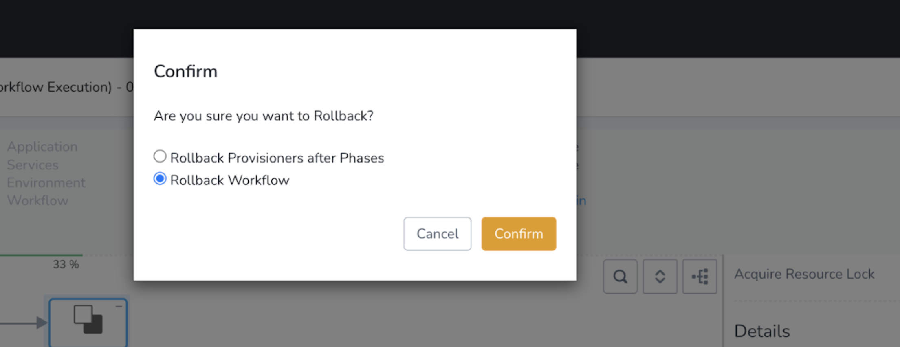

This article provides a general overview of Harness support for Infrastructure Provisioners. For detailed Harness Infrastructure Provisioner guides, see:

* [Terrform Provisioner](https://docs.harness.io/article/9pvvgcdbjh-terrform-provisioner)
* [Using the Terraform Apply Command](https://docs.harness.io/article/jaxppd8w9j-using-the-terraform-apply-command)
* [Shell Script Provisioner](../infrastructure-provisioner/ssh-provisioner-category/shell-script-provisioner.md)
* [CloudFormation Provisioner](https://docs.harness.io/article/78g32khjcu-cloud-formation-provisioner)

You can create any resource using Terraform, and output values can be published for use in Harness Workflows and Pipelines. Harness supports first-class [Service Mapping](#service_mappings) for AWS-based infrastructures (SSH, ASG, ECS, Lambda) and Google Kubernetes (GKE). Google Kubernetes is not supported for CloudFormation, as CloudFormation is used for provisioning infrastructure on AWS only.

### Overview

Harness Infrastructure Provisioners define deployment infrastructure blueprints from known Infrastructure-as-Code technologies, such as Terraform and CloudFormation, and map their output settings to provision the infrastructure. Infrastructure Provisioners enable Harness Workflows to provision infrastructure on the fly when deploying Services.

Typically, when creating your Harness deployment, there is an assumption that you already have an infrastructure in place where you want to deploy your Services. In some cases, you will want to use an Infrastructure Provisioner to define this infrastructure on the fly.

Add an Infrastructure Provisioner such as [CloudFormation](https://aws.amazon.com/cloudformation/) or [Terraform](https://www.terraform.io/intro/index.html) as a blueprint for the system, networking, and security infrastructure for the service(s) you deploy. Define components such as load balancer, VPC, subnets, firewall rules, security groups, and so on. When Harness deploys your microservice, it will build your infrastructure according to this blueprint.

After you set up an Infrastructure Provisioner in your Harness Application, you can add it as a **Pre-Deployment** step in a Workflow or as an Infrastructure Definition in an Environment. Once configured, your Workflow can deploy multiple Services, each using the same Infrastructure Provisioner as a blueprint, and passing in Service-specific input variables to create Service-specific deployments using the single Infrastructure Provisioner.

See also [Application Checklist](../applications/application-configuration.md), [Add a Service](../setup-services/service-configuration.md), [Add an Environment](../environments/environment-configuration.md), [Add a Workflow](../workflows/workflow-configuration.md).

### Provisioning Process with Harness Variables

Infrastructure provisioner templates include inputs and outputs that Harness uses for provisioning:

* **Inputs -** Typically, provisioner inputs are information needed to access the target environment, such access and secret keys. In Harness, you can write values from Harness [Secrets Management](https://docs.harness.io/article/au38zpufhr-secret-management) or [Workflow variables](../workflows/workflow-configuration.md#add-workflow-variables) to template inputs to be used at runtime.
* **Outputs -** In order for Harness to create infrastructure using your provisioner, you map template outputs (VPCs, regions, subnets, etc) to Harness Infrastructure Provisioner **Service Mappings**, and the outputs are used to provision as the Service is deployed.

The process is as follows:

1. You create a Harness Infrastructure Provisioner using your infrastructure provisioner templates. You identify the inputs your template requires, such as access keys, and map the template outputs to the fields Harness requires for the different cloud platforms (VPC, subnets, etc).
2. You set up the Harness Environment and Workflow that will use your Infrastructure Provisioner. For the Environment, you simply identify that the Infrastructure Definition uses a Harness Infrastructure Provisioner. For the Workflow, you configure the input variables that Harness will pass to the Infrastructure Provisioner (access keys, etc).
3. When Harness deploys the Workflow, it uses the infrastructure provisioner (Terraform, CloudFormation, Shell Script) to provision as part of the Pre-Deployment Steps, using the inputs and outputs you configured to provision on the target cloud platform or physical datacenter.
4. Once provisioning has occurred, the Workflow deploys the Service to the provisioned infrastructure.

### Before You Begin

* [Harness Key Concepts](https://docs.harness.io/article/4o7oqwih6h-harness-key-concepts)

### Add an Infrastructure Provisioner

To add an infrastructure provisioner, do the following:

1. Click **Setup**.
2. Click the application where you want to add an infrastructure provisioner.
3. Click **Infrastructure Provisioners**.  
The **Infrastructure Provisioners** page appears.
4. Click **Add Infrastructure Provisioner**, and select **Terraform**, **CloudFormation**, or **Shell Script**.  
Below are the options for each infrastructure provisioner type.

### CloudFormation

For all information on using Harness CloudFormation Infrastructure Provisioner, see [CloudFormation Provisioner](https://docs.harness.io/article/78g32khjcu-cloud-formation-provisioner).

### Terraform

For all information on using Harness Terraform Infrastructure Provisioner, see [Terraform Provisioner](https://docs.harness.io/article/9pvvgcdbjh-terrform-provisioner).

### Shell Script

Harness has first-class support for Terraform and AWS CloudFormation provisioners, but to support different provisioners, or your existing shell script implementations, Harness includes the [Shell Script Infrastructure Provisioner](../infrastructure-provisioner/ssh-provisioner-category/shell-script-provisioner.md).

### Output Mappings

Harness can map output values from your provisioner script to the settings Harness requires to provision an infrastructure. These mappings are optional.

You can create any resource using Terraform and output values can be published for use in Harness Workflow and Pipelines. Harness supports first class output mapping for AWS-based infrastructures (SSH, ASG, ECS, Lambda) and Google Kubernetes (GKE). Google Kubernetes is not supported for CloudFormation as CloudFormation is for provisioning infrastructure on AWS only.Most infrastructure resources have attributes associated with them, and outputs are a way to easily extract and query that information. For example, in a Terraform template, outputs specify values that will be provided to the user when Terraform applies the template, such as region, VPCs, and subnets.

If you have been running your deployments manually, you might not have outputs configured in your template files. To configure Service Mappings, you will need to add these output variables to your template.When you use Terraform or CloudFormation with Harness, you can map the template outputs with Harness settings so that a single Infrastructure Provisioner can be used by many of the deployments you have configured in Harness.

For more information, see Terraform [Service Mappings](https://docs.harness.io/article/9pvvgcdbjh-terrform-provisioner#service_mappings) and [Infrastructure Definition](https://docs.harness.io/article/9pvvgcdbjh-terrform-provisioner#infrastructure_definition), CloudFormation [Service Mappings](https://docs.harness.io/article/78g32khjcu-cloud-formation-provisioner#service_mappings) and [Infrastructure Definition Mappings](https://docs.harness.io/article/78g32khjcu-cloud-formation-provisioner#infrastructure_definition_service_mappings), or Shell Script Provisioner [Service Mappings](../infrastructure-provisioner/ssh-provisioner-category/shell-script-provisioner.md#service-mappings) and [Environment Setup and Infrastructure Definitions](../infrastructure-provisioner/ssh-provisioner-category/shell-script-provisioner.md#environment-setup-and-infrastructure-definitions).

### Rollback

By default, Harness performs rollback for pre-deployment provisioned resources first, followed by rollback for the deployment Phases of a Workflow. The Phases of a Workflow are rolled back in reverse order, with last Phase rolled back first.

#### Rollback Provisioned Resources after Rolling Back Phases

Currently, this feature is behind the Feature Flag `ROLLBACK_PROVISIONER_AFTER_PHASES`. Contact [Harness Support](mailto:support@harness.io) to enable the feature.As part of a [Workflow Failure Strategy](../workflows/define-workflow-failure-strategy-new-template.md), you can set Harness to perform rollback of pre-deployment provisioned resources after it has rolled back the Phases of a Workflow.



### Set Up with YAML

You can set up an infrastructure provisioner quickly using the Harness code editor.

For information about syncing the Harness code editor with Git, see [Configuration as Code](https://docs.harness.io/article/htvzryeqjw-configuration-as-code).To set up an infrastructure provisioner using code, do the following:

1. In the Git repo for Harness, open your application folder.
2. Inside your application folder, add a new folder named **Provisioners**.
3. Add a YAML file with the name that describes your provisioner, like **DEV**, and save it.
4. Open the YAML file and define your provisioner. Below are examples for CloudFormation and Terraform. Once you have added the YAML, sync your Git repo with Harness via **Configuration As Code**. The code editor appears and displays your provisioner.

#### CloudFormation Example


```
harnessApiVersion: '1.0'  
type: CLOUD_FORMATION  
mappingBlueprints:  
- cloudProviderType: AWS  
  deploymentType: SSH  
  nodeFilteringType: AWS_INSTANCE_FILTER  
  properties:  
  - name: region  
  - name: region  
  - name: securityGroups  
    value: ${cloudformation.security_group}  
  - name: subnets  
    value: ${cloudformation.subnet}  
  - name: tags  
    value: ${cloudformation.aws_ssh_tags}  
  - name: vpcs  
    value: ${cloudformation.vpc}  
  serviceName: TAR-file  
name: DEV-CF  
sourceType: TEMPLATE_URL  
templateFilePath: https://s3.amazon.aws.com/path  
variables:  
- name: access key  
  valueType: ENCRYPTED_TEXT  
- name: secret key  
  valueType: ENCRYPTED_TEXT
```
#### Terraform Example


```
harnessApiVersion: '1.0'  
type: TERRAFORM  
description: module for front-end deployment infra  
mappingBlueprints:  
- cloudProviderType: AWS  
  deploymentType: SSH  
  nodeFilteringType: AWS_INSTANCE_FILTER  
  properties:  
  - name: region  
    value: ${terraform.region}  
  - name: securityGroups  
    value: ${terraform.security_group}  
  - name: subnets  
    value: ${terraform.Subnet}  
  - name: tags  
    value: ${terraform.aws_ssh_tags}  
  - name: vpcs  
    value: ${terraform.VPCs}  
  serviceName: TAR-file  
name: front-end  
path: terraform-CV  
sourceRepoSettingName: git  
variables:  
- name: access key  
  valueType: ENCRYPTED_TEXT  
- name: secret key  
  valueType: ENCRYPTED_TEXT
```
