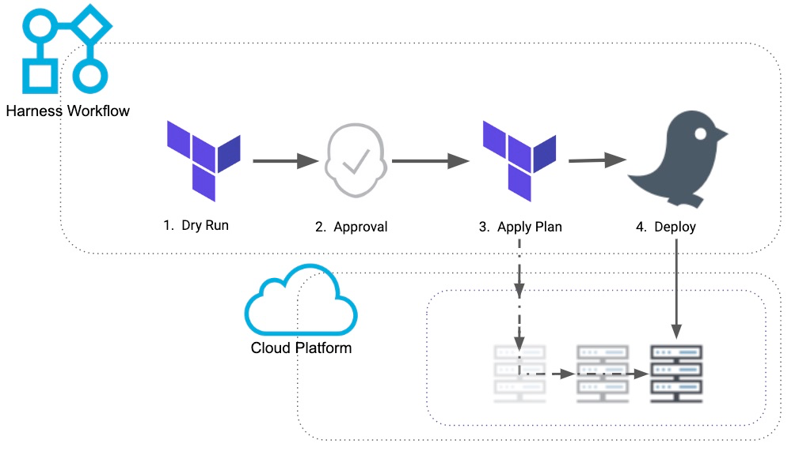
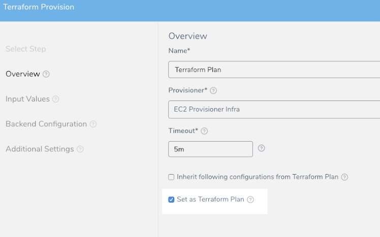
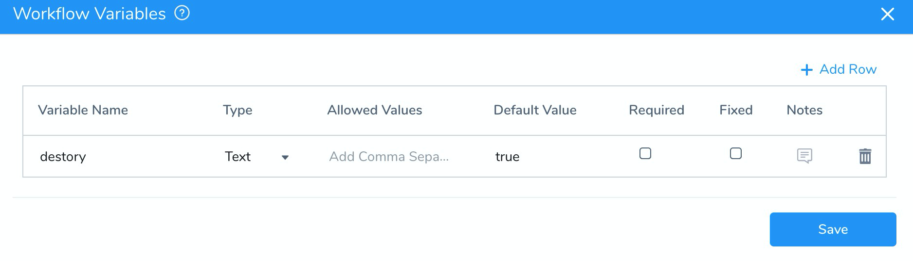
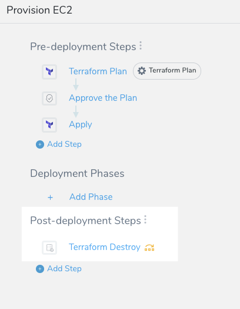
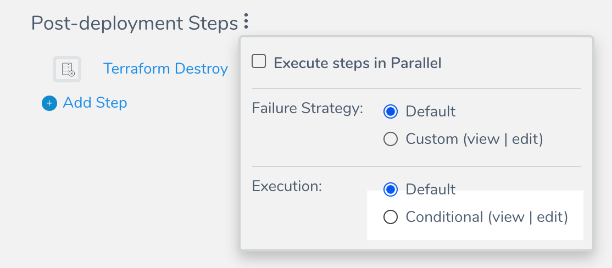
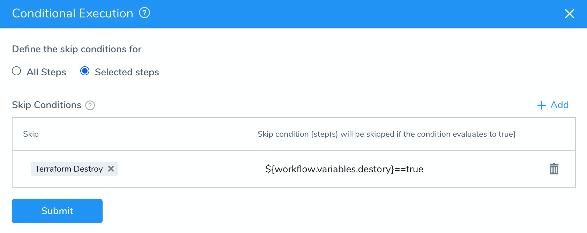
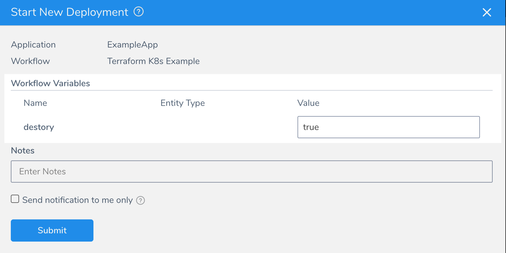
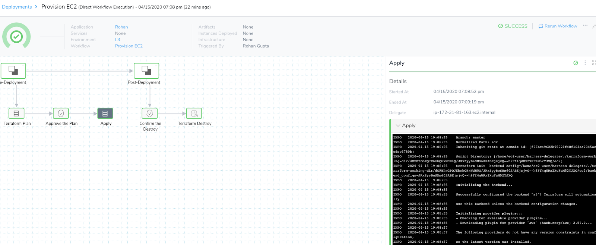

Typically, when you provision infrastructure using Harness, you do it as part of a deployment, as described in [Terraform How-tos](https://docs.harness.io/article/9pvvgcdbjh-terrform-provisioner), [CloudFormation How-tos](https://docs.harness.io/article/78g32khjcu-cloud-formation-provisioner), and [Shell Script Provisioner](../infrastructure-provisioner/ssh-provisioner-category/shell-script-provisioner.md).

Here's an illustration using Terraform:

Some Harness customers want to provision infrastructure without deploying to it. They only want to provision infrastructure and maintain the infrastructure separate from the Application development team.

A common example is when an infra team manages the Terraform and CloudFormation provisioned resources and configures the Harness Cloud Provider for App teams to leverage. Any resource requirements for those Cloud Providers can be managed through the infrastructure provisioning Workflows.

This topic explains how to perform Terraform provisioning without deploying any services to the provisioned infrastructure. The same steps can be applied using CloudFormation or Shell Script provisioners.

### Before You Begin

If you want to reproduce the steps in this topic, ensure you have the following:

* You must have a working Terraform of CloudFormation setup (scripts, templates, etc).
* Configure a Harness [Terraform](https://docs.harness.io/article/9pvvgcdbjh-terrform-provisioner). [CloudFormation](https://docs.harness.io/article/78g32khjcu-cloud-formation-provisioner), or [Shell Script](../infrastructure-provisioner/ssh-provisioner-category/shell-script-provisioner.md) Infrastructure Provisioner.
* Harness Application.

### Review: Harness Infrastructure Provisioning

Please review the Harness documentation on provisioning infrastructure:

* [Terraform Provisioning with Harness](https://docs.harness.io/article/hh52ews03d-terraform-provisioning-with-harness)
* [CloudFormation Provisioning with Harness](https://docs.harness.io/article/qj0ems5hmg-cloud-formation-provisioning-with-harness)
* [Shell Script Provisioning with Harness](https://docs.harness.io/article/drculfgwwn-shell-script-provisioning-with-harness)

For those interested in provisioning a Kubernetes cluster, see [Provision Kubernetes Infrastructures](https://docs.harness.io/article/huajnezo0r-provision-kubernetes-infrastructures).

### Step 1: Set Up Pre-deployment Steps

Here are the Workflow pre-deployment steps we will create:

All of the following Workflow steps are added to the **Pre-deployment Steps** section.

1. Create a Canary Workflow in your Harness Application. You don't need to have a Harness Service to create a Canary Workflow, so this Workflow can be leveraged freely.

:::note
**Deployment Strategies Supported** — For most deployments, Harness Infrastructure Provisioners are only supported in Canary and Multi-Service types. For AMI/ASG and ECS deployments, Infrastructure Provisioners are also supported in Blue/Green deployments.
:::

2. Add the [Terraform Provision Step](https://docs.harness.io/article/uxwih21ps1-terraform-provisioner-step) to the **Pre-deployment Steps** section.

3. Set the Terraform Provision step as the Terraform plan using the **Set as Terraform Plan** option. See [Perform a Terraform Dry Run](https://docs.harness.io/article/xthfj92dys-terraform-dry-run).

  When you're done, the step will look something like this:

  

4. Add an Approval step after the Terraform plan step. See [Jira Approvals](../approvals/jira-based-approvals.md), [ServiceNow Approvals](../approvals/service-now-ticketing-system.md), and [Harness UI Approvals](../approvals/approvals.md). When the Workflow is deployed, a user will need to verify that the Terraform plan is correct before applying the new resources via a Terraform Apply step.

5. Add the [Terraform Apply Step](https://docs.harness.io/article/jaxppd8w9j-using-the-terraform-apply-command) after the Approval step to provision the infrastructure. Ensure the **Inherit following configurations from Terraform Plan** option is selected.

Your Workflow should now look something like this:

### Step 2: Remove Infra Using Variables

We will be adding a Terraform Destroy step to the **Post-deployment Steps** of the Workflow later. This is added because some infrastructure engineers want to test out and view their infrastructure before actually applying it.

Before we do this, we'll add a Workflow variable that will allow us to control whether we run the destroy steps.

When the Workflow is deployed, you can select **true** or **false** for the destroy steps, thereby enabling or disabling the removal of the provisioned infrastructure.

1. Create a [Workflow variable](../workflows/add-workflow-variables-new-template.md) named **destroy** and set its default value to **true**.

Next, when you add the Terraform Destroy step in the **Post-deployment Steps**, you can set a condition on the step using this Workflow variable (described below).

### Step 3: Set Up Post-deployment Steps

Now we will set up the steps to run after the infrastructure is provisioned.

Here is the Workflow Post-Deployment step we will create:

1. In **Post-deployment Steps**, add a [Terraform Destroy](https://docs.harness.io/article/4egyxnse9r-terraform-destroy) step.
2. Next, click more options (︙) in the **Pre-deployment Steps** heading, and in **Execution**, select **Conditional**.

   
   
3. In **Define the skip conditions** **for**, select **Selected steps**, and then click **Add**. To learn more, see [Skip Workflow Steps](../workflows/skip-workflow-steps.md).
4. In **Skip**, select the **Terraform Destroy** step, and in **Skip condition**, enter `${workflow.variables.destory}==true`.

  

When you deploy the Workflow, you can enter `true` to skip the Terraform Destroy step or `false` to run it.

An alternative method to using the conditional technique is just adding an Approval step before they Destroy step. This forces a developer to review the resources created in the respective platform console.

If something doesn’t look right, they can reject the approval, and Harness will rollback Terraform to the previous state. If the Approval is accepted, then Harness will run Terraform Destroy.

This Approval technique is designed for testing the Terraform configuration. The other method is more for continuous minor updates to an existing Terraform or CloudFormation configuration.

### Option: Git-based Terraform Setup

Some development teams want to manage all of their Terraform configuration in Github. Any changes to Terraform happen in Github and can be traced via the commit.

In addition, there is an added benefit of defined variables. Users don’t have to pass in input based on a Workflow variable. Everything will be picked up via their tfvars file or hardcoded values in the Terraform.

By keeping the approval of changes at the GitHub level, development teams can manage their Terraform code and mitigate unapproved configurations before provisioning with Harness.

This reduces the number of approval steps required in the Workflow. It makes the Workflow execution more self-service and developers don’t have to rely on another team or another user to approve the Workflow because the configuration was approved via PR in Github.

See [Onboard Teams Using GitOps](../../harness-git-based/onboard-teams-using-git-ops.md).

### Step 4: Configure Overrides

In CloudFormation or Terraform, the most common way to override configuration is with Workflow Variables. These Workflow variables can be passed as inputs.

This technique can be very valuable when playing around with instance size, instance type, or the number of instances an infrastructure engineer wants to provision.

Some users leverage tfvars files as inputs so they don’t need to pass in variables at runtime. They can just edit a tfvars file and have Harness pull the desired configuration from it.

This option reduces the manual input into Harness. It also keeps everything in version control so the user can revert a change they didn’t like with the tfvars file.

### Step 5: Run the Workflow and View Outputs

1. Deploy the Canary Workflow. You will see the Workflow variable you added.

  
  
2. Enter **true** to skip the Terraform Destroy step or **false** to run it, and click **Submit**.

The deployment goes through the Workflow steps, including any Approvals you added, and displays the logs.

You should be able to view the plan, apply, and destroy steps.

### Next Steps

* Review [Terraform documentation](https://docs.harness.io/article/9pvvgcdbjh-terrform-provisioner) on Harness.
* Check out our Community article on Harness and Terraform:  [Harness ❤️ Terraform](https://community.harness.io/t/harness-terraform/232)

