Harness has first-class support for Terraform and AWS CloudFormation provisioners, but to support different provisioners, or your existing shell script implementations, Harness includes the Shell Script Infrastructure Provisioner.

This document explains how to use the Harness Shell Script Infrastructure Provisioner in your Harness Application.

The Shell Script Provisioner supports the following deployment platforms: Physical Data Centers, AWS EC2, ECS, Lambda, and Kubernetes on Google Cloud Platform (GKE).

### Overview

When you set up a Shell Script Provisioner in Harness, you add a shell script that the Harness Delegate uses to query your provisioner for a JSON collection describing your infrastructure (VPCs, DNS names, subnets, etc). Normally, the JSON will exist in your custom provisioner, such as a database, but for this topic, we'll use AWS as an example.

For example, here is a shell script that pulls EC2 instance information from AWS:


```
apt-get -y install awscli  
aws configure set aws_access_key_id $access_key  
aws configure set aws_secret_access_key $secret_key  
aws configure set region us-east-1  
aws ec2 describe-instances --filters Name=tag:Name,Values=harness-provisioner > "$PROVISIONER_OUTPUT_PATH"
```
The Harness environment variable `"$PROVISIONER_OUTPUT_PATH"` is initialized by Harness and stores the JSON collection returned by your script.

Currently, Harness supports Bash shell scripts. PowerShell will be added soon.This script returns a JSON array describing the instances:


```
{  
  "Instances": [  
    {  
      ...  
      "Status": "online",  
      "InstanceId": "4d6d1710-ded9-42a1-b08e-b043ad7af1e2",  
      "SshKeyName": "US-West-2",  
      "InfrastructureClass": "ec2",  
      "RootDeviceVolumeId": "vol-d08ec6c1",  
      "InstanceType": "t1.micro",  
      "CreatedAt": "2015-02-24T20:52:49+00:00",  
      "AmiId": "ami-35501205",  
      "PublicDnsName": "ec2-192-0-2-0.us-west-2.compute.amazonaws.com",  
      "Hostname": "ip-192-0-2-0",  
      "Ec2InstanceId": "i-5cd23551",  
      "SubnetId": "subnet-b8de0ddd",  
      "SecurityGroupIds": [  
        "sg-c4d3f0a1"  
      ...  
    },  
  ]  
}
```
Next, in Harness, you map the keys from the JSON host objects to Shell Script Provisioner fields to tell Harness where to obtain the values for your infrastructure settings, such as hostname and subnet.

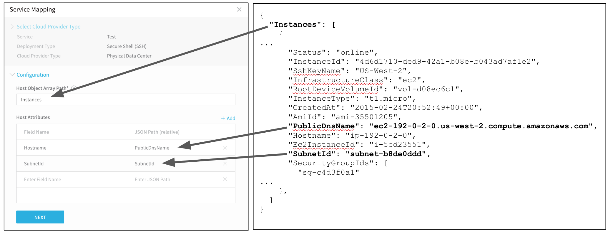

At runtime, Harness queries your provisioner using your script and stores the returned JSON collection on the Harness Delegate as a file. Harness then uses the JSON key values to define the instructure for your deployment environment as it creates that environment in your target platform.

Here is a high-level summary of the setup steps involved:

1. **Delegate and Cloud Provider** - Install a Harness Delegate where it can connect to your infrastructure provisioner and query it for the JSON infrastructure information. Add a Harness Cloud Provider that connects to the platform where the infrastructure will be deployed.
2. **Application and Service** - Create a Harness Application to manage your deployment. Add a Service to your Application. The type of Service you select determines how you map JSON keys in the Shell Script Provisioner **Service Mappings**. For example, an ECS Service will require different mapping settings than a Kubernetes Service.
3. **JSON and Script Prep** - Prepare the JSON file to be retrieved by Harness. Prepare the shell script to pull the JSON to Harness.
4. **Shell Script Provisioner** - Add a Shell Script provisioner to your Application.
	1. Add the shell script to the Shell Script provisioner to query your provisioner and retrieve the JSON infrastructure information.
	2. Add Service Mappings. The mapping method depends on the Service and Deployment Type you select.
5. **Environment** - Add an Environment to your Application that uses the Shell Script Provisioner in its Infrastructure Definition.
6. **Workflow** - Add a Workflow to your Application that applies the Shell Script Provisioner.

### Delegate and Cloud Provider Setup

To use the Harness Shell Script Provisioner there are certain Delegate and Cloud Provider setup steps that must be performed.

#### Delegate Requirements

To deploy using a Shell Script Provisioner, ensure the following Delegate configuration is set up:

* Install a Harness Delegate on a host that can connect to the provisioner your shell script will query. Once you have installed your Delegate, open a terminal on its host and run your shell script to ensure that it will execute at runtime.
* Ensure the same Delegate, or another Delegate, can connect to your target deployment environment.

For information on setting up the Harness Delegate, see [Delegate Installation and Management](https://docs.harness.io/article/h9tkwmkrm7-delegate-installation).

#### Cloud Provider Requirements

Harness Cloud Providers are used in the Harness Environment, in **Infrastructure Definition**. You will select the **Cloud Provider** to use when deploying your Infrastructure Definition.

To ensure that your Cloud Provider and Infrastructure Provisioner are in sync, this topic will show you how to do the following:

1. Set up a Cloud Provider (AWS, Physical Data Center, etc) for your connection to your deployment environment. For more information, see [Add Cloud Providers](https://docs.harness.io/article/whwnovprrb-cloud-providers).
2. Later, when you set up your Environment Infrastructure Definition, select the same Cloud Provider.

#### Delegate and Cloud Provider Setup

The simplest method to ensure that your Delegate and Cloud Provider support your Infrastructure Provisioner is to install a Delegate in your deployment environment, verify that its host can connect to the provisioner you plan to query, and then use the same Delegate for the Cloud Provider authentication credentials. This method uses Delegate Selectors or the Delegate name. For more information, see [Delegate Installation and Management](https://docs.harness.io/article/h9tkwmkrm7-delegate-installation).

To set up your Delegate and Cloud Provider, do the following:

1. Install the Delegate.
	1. In Harness, click **Setup**, and then click **Harness Delegates**.
	2. Click **Download Delegate** and select the Delegate type.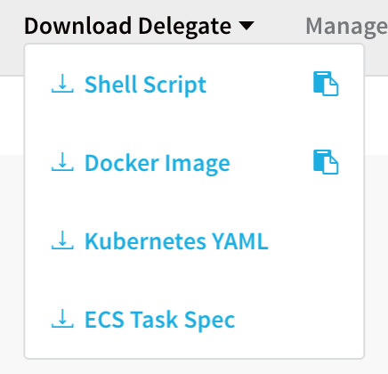
	3. There are different installation steps depending on which Delegate type you select. For details on setting up each type, see [Delegate Installation and Management](https://docs.harness.io/article/h9tkwmkrm7-delegate-installation).
	4. Once the Delegate is installed, open a terminal on its host and test the shell script you plan to use to pull the provisioner JSON collection. For example, the following script obtains the JSON for AWS EC2 instances:
      ```
      apt-get -y install awscli  
      aws configure set aws_access_key_id $access_key  
      aws configure set aws_secret_access_key $secret_key  
      aws configure set region us-east-1  
      aws ec2 describe-instances --filters Name=tag:Name,Values=harness-provisioner
      ```
	5. Verify that the script returns the JSON collection. If it does, then the Delegate will be successful when executing the script at runtime. If the script fails, troubleshoot the network connection between the Delegate host and the provisioner host or service.
  
2. Add the Cloud Provider.
	1. In Harness, click **Setup**, and then click **Cloud Providers**.
	2. Click **Add Cloud Provider**. The **Cloud Provider** dialog appears.
	3. Select the Cloud Provider type you want to use.
	4. In **Display Name**, enter the name to identify the Cloud Provider when you select it in your Harness Environment later.  
	   For a Physical Data Center Cloud Provider, no credentials are required here. Instead, you add an SSH secret in Harness Secrets Management, and select that later in your Harness Environment in **Connection Attributes**. For more information, see [Secrets Management](https://docs.harness.io/article/au38zpufhr-secret-management).
	5. Click **SUBMIT** when you are done.

##### SSH Connection Credentials

When you set up a Physical Data Center Cloud Provider in Harness, you do not enter SSH credentials. Instead, you add SSH credentials in Harness Secrets Management. For example, here is a SSH Configuration from Secrets Management.

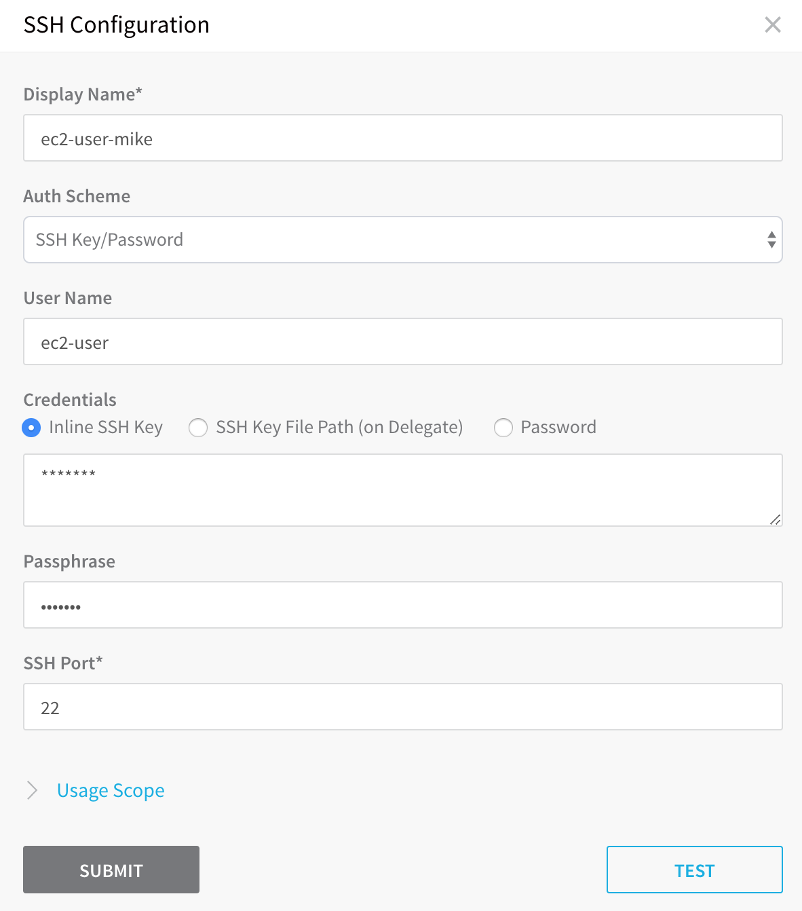

For steps on adding SSH credentials, see [Secrets Management](https://docs.harness.io/article/au38zpufhr-secret-management).

### Application and Service Setup

Any Harness Application and Service setup can be used with a Harness Infrastructure Provisioner. If you do not already have an Application and Service set up, use the following articles:

* [Application Checklist](../../applications/application-configuration.md)
* [Services](../../setup-services/service-configuration.md)

### Shell Script Provisioner Setup

This section will walk you through a detailed setup of a Shell Script Provisioner for a deployment to a Physical Data Center, and provide examples of the other supported platforms.

For all of the supported platforms, setting up the Shell Script Infrastructure Provisioner involves the following steps:

1. Add your shell script to pull the JSON collection from your provisioner.
2. Map the relevant JSON keys from the JSON to your Harness fields.

To set up a Shell Script Infrastructure Provisioner, do the following:

1. In your Harness Application, click **Infrastructure Provisioners**.
2. Click **Add Infrastructure Provisioner**, and then click **Shell Script**.

   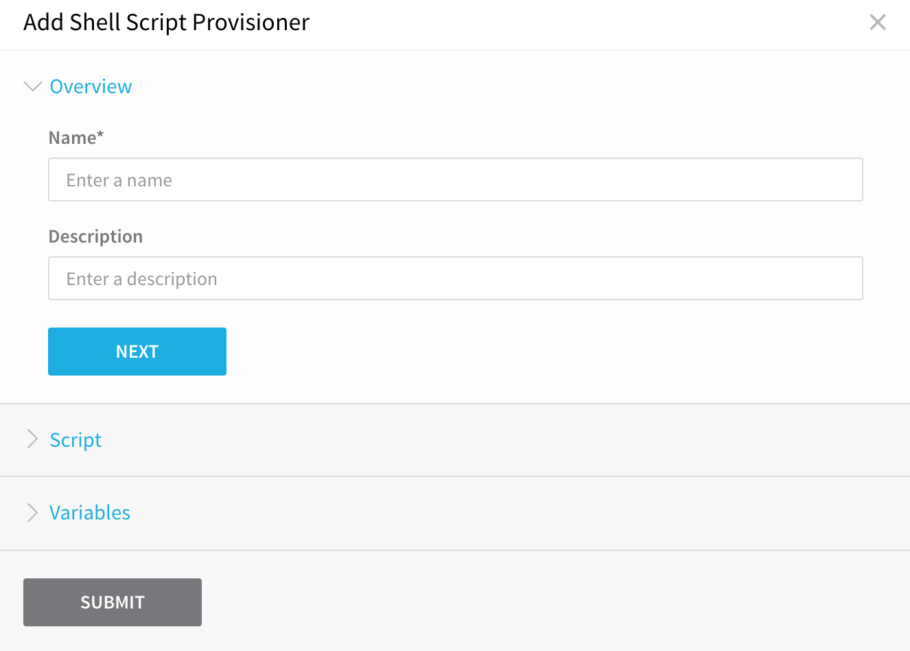
   
   In this dialog, you will enter the shell script to pull the JSON collection from your provisioner.
   
3. In **Name**, enter a name for the Shell Script Provisioner, such as **Example Shell Script Provisioner**. You will use this name later when you select this Shell Script Provisioner in your Harness Environment and Workflow.
4. Click **NEXT**. The **Script** section appears.

   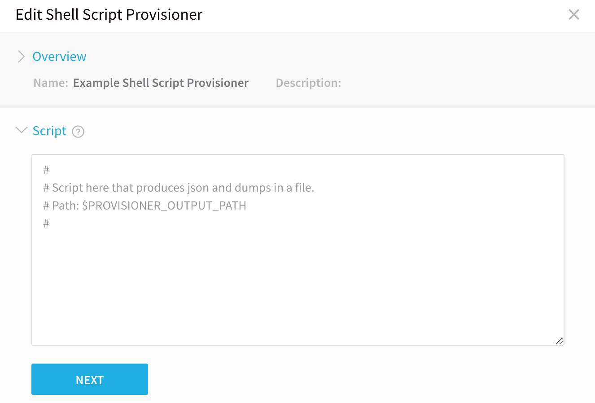
   
5. In **Script**, enter the shell script to pull the JSON collection from your provisioner. This shell script will be executed at runtime by the Harness Delegate on its host. This should be a shell script you have run on the Delegate host to ensure that the host can connect to your provisioner.

Let's look at an example script:


```
apt-get -y install awscli  
aws configure set aws_access_key_id $access_key  
aws configure set aws_secret_access_key $secret_key  
aws configure set region us-west-1  
aws ec2 describe-instances --instance-ids i-0beacf0f260edd19f > "$PROVISIONER_OUTPUT_PATH"
```
The script should return a JSON array containing the host information Harness needs to provision, such as:


```
{  
  "Instances": [  
    {  
      ...  
      "Status": "online",  
      "InstanceId": "4d6d1710-ded9-42a1-b08e-b043ad7af1e2",  
      "SshKeyName": "US-West-2",  
      "InfrastructureClass": "ec2",  
      "RootDeviceVolumeId": "vol-d08ec6c1",  
      "InstanceType": "t1.micro",  
      "CreatedAt": "2015-02-24T20:52:49+00:00",  
      "AmiId": "ami-35501205",  
      "PublicDnsName": "ec2-192-0-2-0.us-west-2.compute.amazonaws.com",  
      "Hostname": "ip-192-0-2-0",  
      "Ec2InstanceId": "i-5cd23551",  
      "SubnetId": "subnet-b8de0ddd",  
      "SecurityGroupIds": [  
        "sg-c4d3f0a1"  
      ...  
    },  
  ]  
} 
```
The environment variable `"$PROVISIONER_OUTPUT_PATH"` is initialized by Harness and stores the JSON collection returned by your script. You are simply writing a file to `"$PROVISIONER_OUTPUT_PATH"`.

Put quotes around `$PROVISIONER_OUTPUT_PATH` as a best practice. The quotes are only required if the value of the variable will have spaces in it, but they cause no problem in any case.The above example uses AWS, but the example is included here to demonstrate a simple script to obtain a JSON collection.

There are two access key variables in the script example, `$access_key` and `$secret_key`. You can set these variables here and when this Infrastructure Provisioner is added to a Workflow, a user will select the Harness Encrypted Text secrets to use for each variable. We'll do this next.

1. Once you have entered your script, click **NEXT**. The **Variables** section appears.

   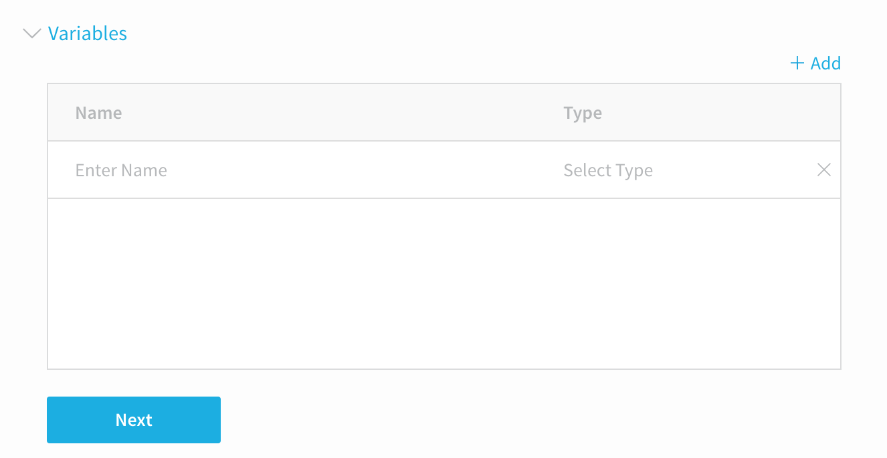
   
2. Click in the **Name** column, and enter the key name without the `$`, such as `access_key`.
3. Click in the **Type** column, and choose **Encrypted Text**.
4. Repeat the steps for the other variable, `secret_key`. When you are done, the **Variables** section will look something like this:

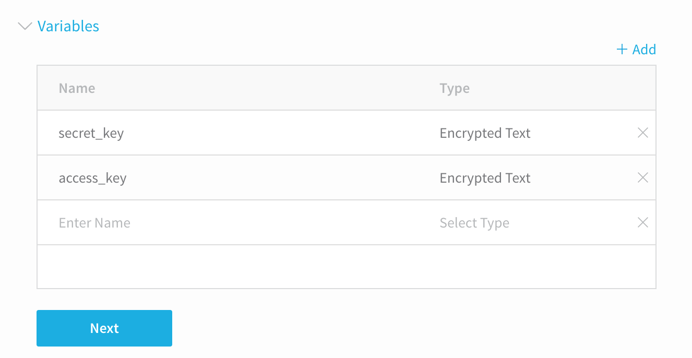

When you select the Provisioner in a Harness Workflow, you will be prompted to provide the values for the variables. You can select secrets from the Harness Secrets Management. See [Secrets Management](https://docs.harness.io/article/au38zpufhr-secret-management). Selecting the Provisioner in a Harness Workflow is covered later in this topic.As an alternative, you can reference secrets directly in your script using the Harness variable, `${secrets.getValue("<name>")}`. For example:


```
apt-get -y install awscli  
aws configure set aws_access_key_id ${secrets.getValue("access_key")}  
aws configure set aws_secret_access_key ${secrets.getValue("secret_key")}  
aws configure set region us-west-1  
aws ec2 describe-instances --instance-ids i-0beacf0f260edd19f > "$PROVISIONER_OUTPUT_PATH"
```
Ensure that the Usage Scope for any Harness Secret you use is set to the Application using the Infrastructure Provisioner. For more information, see [Secrets Management](https://docs.harness.io/article/au38zpufhr-secret-management).

When you have entered your variables in the Shell Script Provisioner **Variables** section, click **NEXT**, and then click **SUBMIT**. The Shell Script Provisioner appears.

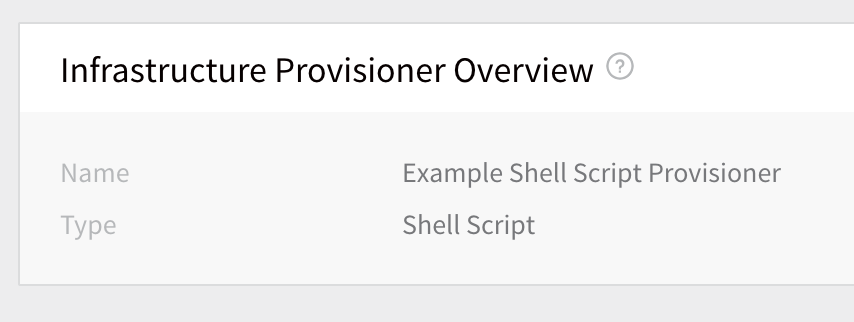

### Environment Setup and Infrastructure Definitions

With Infrastructure Definitions, you map Shell Script script outputs as part of the Infrastructure Definition in a Harness Environment.

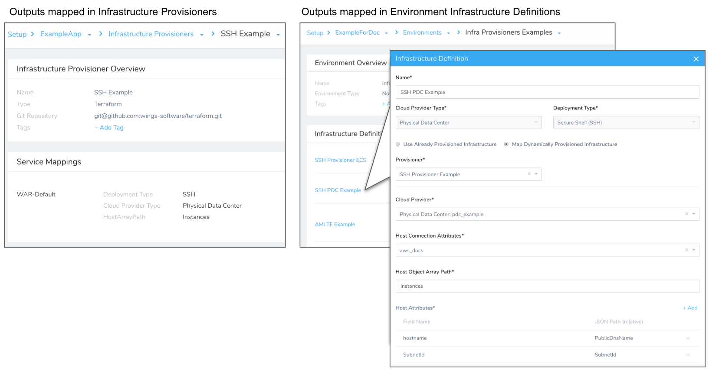

In this section we will show you how to set up an Infrastructure Definition that maps the keys from the JSON collection your provisioner script returns with the platform-specific keys needed by Harness for deployment.

For Service mappings in an ​Infrastructure Definition, you map the keys from the JSON collection your script returns with the platform-specific keys needed by Harness for deployment.

For example, to deploy to a Physical Data Center, Harness requires that you provide a key from the JSON collection and map it to a Harness **Hostname** field. You can add any additional mappings that will help your deployment.

The following Service mapping maps a `PublicDnsName` key to the **Hostname** field in Harness, and a `SubnetId` key from the JSON to a **SubnetId** field in Harness.

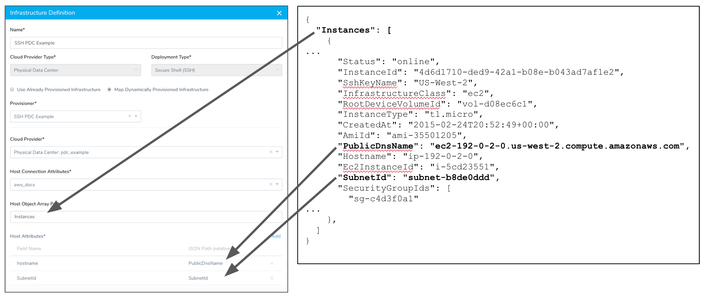

The type of service mappings required depend on what Deployment Type and Cloud Provider Type you use in Infrastructure Definition. A Service mapping to a Physical Data Center will require different mappings than an AWS Cloud Provider.

In this section, we provide examples of mappings for different Deployment Types and Cloud Providers.

##### Physical Data Center

This section describes how to configure a Service Mapping that uses a **Physical Data Center** Cloud Provider.

The following information is required for the Service Mapping:

* **Hostname** - Harness requires the JSON key that indicates the hostname value.

To set up a Service Mapping for a Physical Data Center Cloud Provider, do the following:

1. In your Harness Application, in your Environment , click add Infrastructure Definition. The Infrastructure Definition dialog appears.

   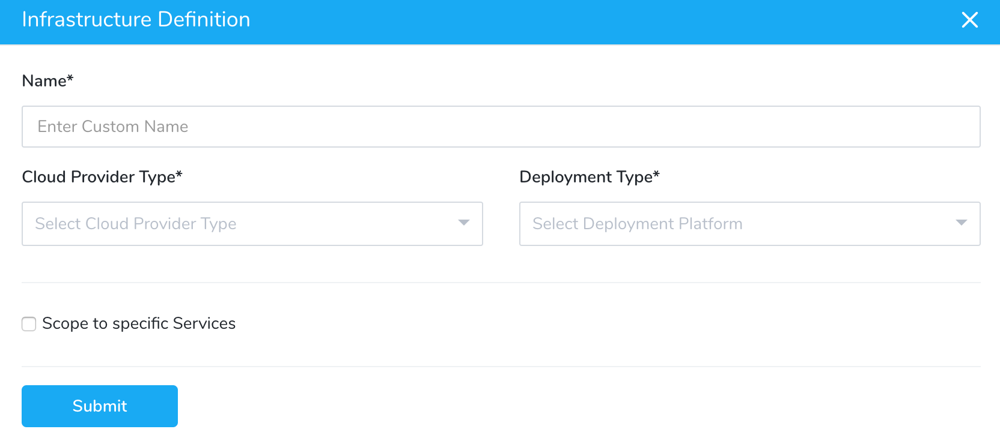
   
2. In **Name**, enter the name of the Infrastructure Definition. This is the name you will select when you create a Workflow or Workflow Phase.
3. In **Cloud Provider Type**, select **Physical Data Center**.
4. In **Deployment Type**, select **Secure Shell (SSH)**.
5. Select **Map Dynamically Provisioned Infrastructure** to use the Shell Script Infrastructure Provisioner you created.
6. In **Provisioner**, select the Shell Script Infrastructure Provisioner you created.
7. In **Cloud Provider**, select the Cloud Provider you set up to connect Harness to your Physical Data Center.
8. In **Host Connection Attributes**, select the SSH credentials you set up in [SSH Connection Credentials](shell-script-provisioner.md#ssh-connection-credentials).
9. In **Host Object Array Path**, enter the JSON path to the JSON array object for the host.

    For example, the following JSON object contains an Instances array with two items (the JSON is abbreviated):


        ```
        {  
          "Instances": [  
            {  
              "StackId": "71c7ca72-55ae-4b6a-8ee1-a8dcded3fa0f",  
              ...  
              "InfrastructureClass": "ec2",  
              "RootDeviceVolumeId": "vol-d08ec6c1",  
              "SubnetId": "subnet-b8de0ddd",  
              "InstanceType": "t1.micro",  
              "CreatedAt": "2015-02-24T20:52:49+00:00",  
              "AmiId": "ami-35501205",  
              "Hostname": "ip-192-0-2-0",  
              "Ec2InstanceId": "i-5cd23551",  
              "PublicDns": "ec2-192-0-2-0.us-west-2.compute.amazonaws.com",  
              "SecurityGroupIds": [  
                "sg-c4d3f0a1"  
              ],  
              ...  
            },  
            {  
              "StackId": "71c7ca72-55ae-4b6a-8ee1-a8dcded3fa0f",  
              ...  
              "InfrastructureClass": "ec2",  
              "RootDeviceVolumeId": "vol-e09dd5f1",  
              "SubnetId": "subnet-b8de0ddd",  
              "InstanceProfileArn": "arn:aws:iam::123456789102:instance-profile/aws-opsworks-ec2-role",  
              "InstanceType": "c3.large",  
              "CreatedAt": "2015-02-24T21:29:33+00:00",  
              "AmiId": "ami-9fc29baf",  
              "SshHostDsaKeyFingerprint": "fc:87:95:c3:f5:e1:3b:9f:d2:06:6e:62:9a:35:27:e8",  
              "Ec2InstanceId": "i-8d2dca80",  
              "PublicDns": "ec2-192-0-2-1.us-west-2.compute.amazonaws.com",  
              "SecurityGroupIds": [  
                "sg-b022add5",  
                "sg-b122add4"  
              ],  
              ...  
            }  
          ]  
        }
        ```
   We want to point to the first item in the JSON file using its index, and so we use `Instances`.

   To ensure that you referring to the correct item in your array, test your **Host Object Array Path** using your JSON collection and an online validator such as [JSON Editor Online](https://jsoneditoronline.org/).In **Host Object Array Path**, the path will look like this:

   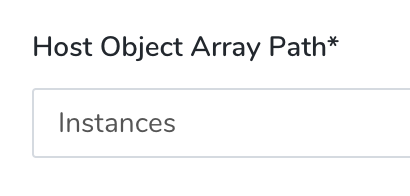

   Now that you have provided a path to the host object, you can map its JSON keys in **Host Attributes**. For Physical Data Center, only the **Hostname** field is mandatory.

   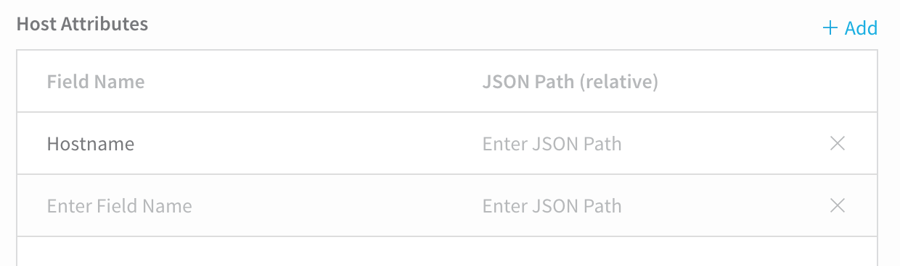

10. In the row for **Hostname**, click **Enter JSON Path**, and enter the name of the key in the JSON array that lists the hostname you want to use. For example, you could use key name **PublicDnsName** from the earlier example:

    ```
     {  
      "Instances": [  
        {  
          "StackId": "71c7ca72-55ae-4b6a-8ee1-a8dcded3fa0f",  
          ...  
          "SubnetId": "subnet-b8de0ddd",  
          "InstanceType": "t1.micro",  
          "CreatedAt": "2015-02-24T20:52:49+00:00",  
          "AmiId": "ami-35501205",  
          "Hostname": "ip-192-0-2-0",  
          "Ec2InstanceId": "i-5cd23551",  
          "**PublicDnsName**": "ec2-192-0-2-0.us-west-2.compute.amazonaws.com",  
          "SecurityGroupIds": [  
            "sg-c4d3f0a1"  
          ],  
          ...  
        },
    ```

11. Map any other key names you want to use when creating the host(s) in the infrastructure. The following image shows how you can map multiple keys to **Host Attributes**.

   

   You can reference any mapped Field Name after the **Select Nodes** step in your Workflow using the expression `${host.properties.<name>}`, such as `${host.properties.SubnetId}`. For example, you could add a Shell Script step to a Workflow that outputs the values for all the mapped Fields.
   
12. Click **NEXT**, and then click **SUBMIT**. The Infrastructure Definition and its Service mapping is listed:

   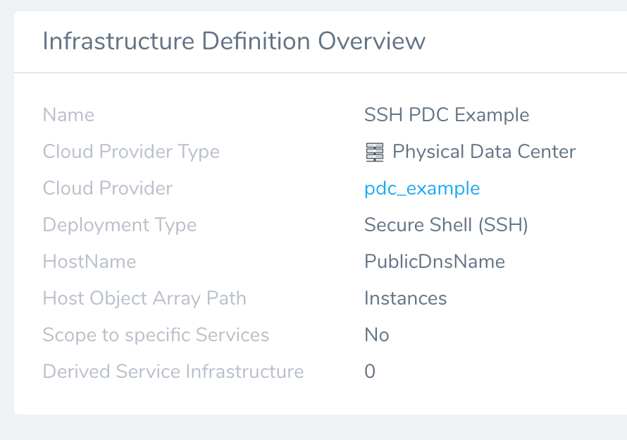

Now that the Infrastructure Provisioner and an Infrastructure Definition with a Service mapping are created, you can use it in the Environment and Workflow of your Harness Application.

##### AWS ECS

You can set up mappings like you did with the Physical Data Center with other Harness Cloud Providers, such as AWS ECS. In every case, you simply need to provide the path to the JSON key you want to map to the required Harness fields.

Here is an example of an AWS ECS EC2 mapping where each field contains a JSON path to a specific key.

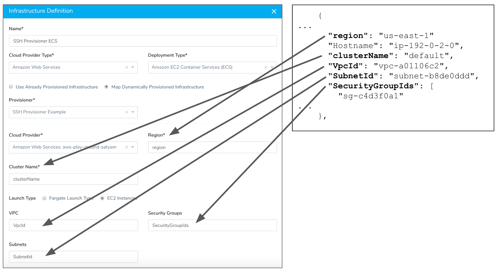

##### Kubernetes on Google Cloud

Mapping to Kubernetes on Google Cloud (GKE) simply requires the Kubernetes cluster name and namespace.

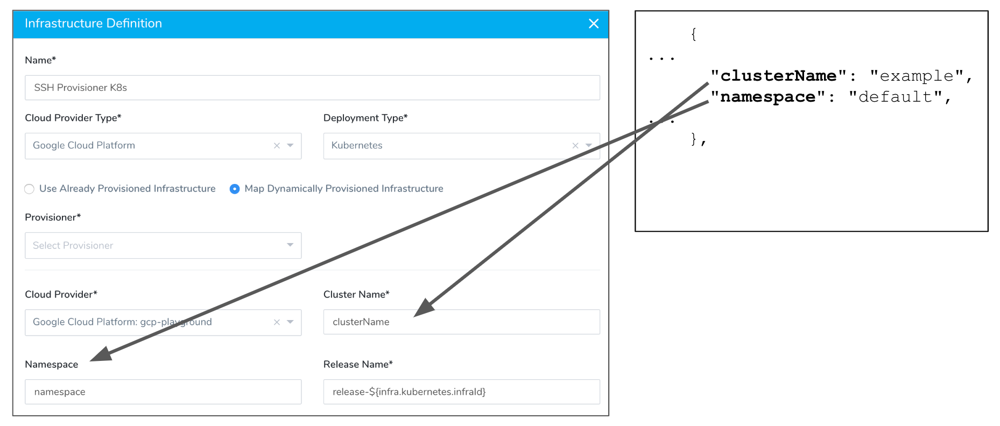

### Workflow Setup

The Shell Script Provisioner is supported in Canary and Basic Deployment type Workflows. For AMI/ASG and ECS deployments, it is also supported in Blue/Green Deployment type Workflows.Once your Shell Script Infrastructure Provisioner has been added to an Environment in your Harness Application, it can be used in Workflows.

For Canary Deployments, you add the Shell Script Infrastructure Provisioner as a pre-deployment step in the Workflow.

In this section we will look at how to use a Shell Script Infrastructure Provisioner in a Canary Workflow.

#### Canary Workflow

Using the Shell Script Infrastructure Provisioner in a Canary Workflow involves adding the Shell Script Infrastructure Provisioner as a pre-deployment step before the phases of the Workflow, or within each phase.

In this section, we'll create a Canary Workflow and add the Shell Script Infrastructure Provisioner as a pre-deployment step before the first phase of the Workflow.

To use the Shell Script Infrastructure Provisioner in a Canary Workflow, do the following:

1. In the Harness Application containing your Shell Script Infrastructure Provisioner, click **Workflows**.
2. Click **Add Workflow**.
3. In the **Workflow** dialog, add a name, and then, in **Workflow Type**, select **Canary Deployment**. The dialog fields change for a Canary deployment.
4. In **Environment**, select the Environment where you used your Shell Script Infrastructure Provisioner to dynamically provision the Infrastructure Definition. When you are done, the dialog will look something like this:

   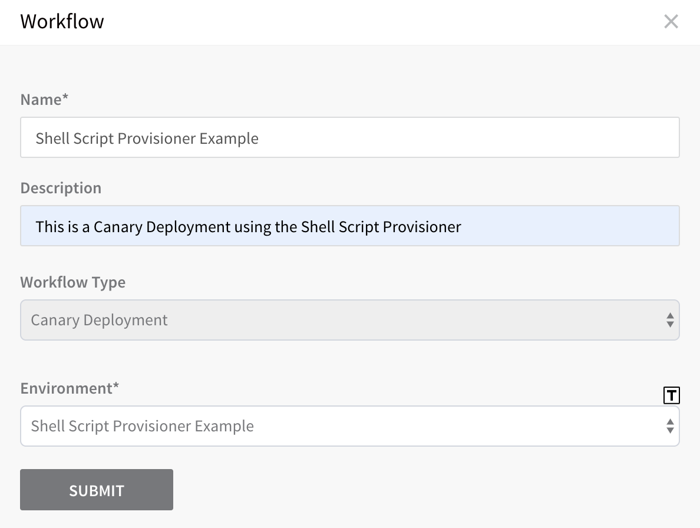
   
5. Click **SUBMIT**. The Workflow appears. At the top of the Workflow steps is the **Pre-deployment Steps** where we will add the Shell Script Provisioner.
6. In **Pre-deployment Steps**, click **Add Step**. The **Add Command** dialog appears. In the dialog, under **Provisioners**, the Shell Script Provisioner is listed.

    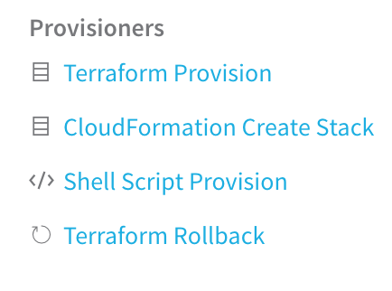
    
7. Click **Shell Script Provision**. The **Shell Script Provision** settings appear.

   
   
8. In **Provisioner**, select the Shell Script Provisioner you created.
9. In **Timeout**, enter how long you want Harness to attempt to use the provisioner before failing the deployment. If the Delegate cannot reach the provisioner at all, or if the script does not work, it will fail immediately.
10. In **Delegate Selectors**, enter the Selectors of the Delegate(s) you want to execute this step. See [Select Delegates with Selectors](https://docs.harness.io/article/c3fvixpgsl-select-delegates-for-specific-tasks-with-selectors).
11. Click **Output in the Context**. The **Output in the Context** settings appear.

    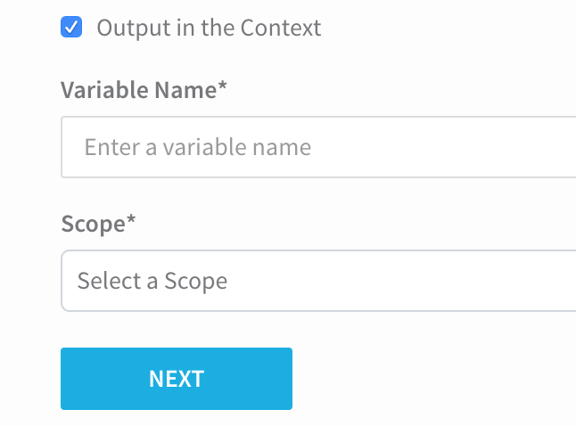
    
    The **Output in the Context** settings let you take the shell script output from your Shell Script Provisioner and assign it to a variable. Next, you can scope the variable to Pipeline, Workflow, or Phase.
12. To use the **Output in the Context** settings, in **Variable Name**, enter a name such as **demo**, and in **Scope**, select **Workflow**, and then click **NEXT**.  
Now you can display the output of the shell script within its scope by using the format `${context.var_name}`, such as `${context.demo}`.  
  
For example, here is the setup for the **Output in the Context** settings, the use of the variable `${context.demo}` in a Shell Script step elsewhere in the Workflow, and the output in the deployed Shell Script step.


13. Click **NEXT**. The **Variables** section appears. If you used variables in your Shell Script Provisioner, the variables are listed in the **Variables** section. You must provide values for the variables.  
  
For example, the following image shows a Shell Script Provisioner with two variables, `access_key` and `secret_key`, on the right, and their corresponding settings in the **Variables** section of the Canary Workflow step on the left: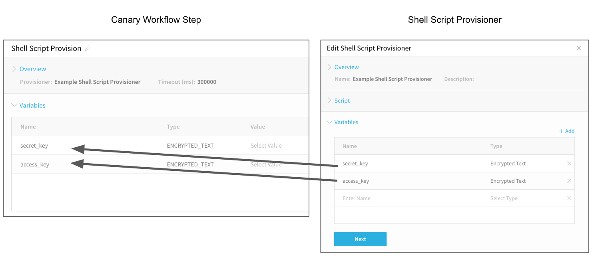


14. For each variable, click in the **Value** column and add or select a value. If the variable is just text, enter a value. If the variable is encrypted text, the available values in the dropdown are taken from the Encrypted Text entries in Harness Secrets Management. For more information, see [Secrets Management](https://docs.harness.io/article/au38zpufhr-secret-management). When you are finished, the Variables section will look something like this: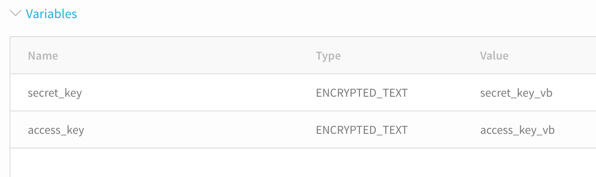

You can use Workflow variables in the **Value** settings. See [Set Workflow Variables](../../workflows/add-workflow-variables-new-template.md).1. Click **NEXT**, and then click **SUBMIT**. The Shell Script Provisioner step is added to the Workflow.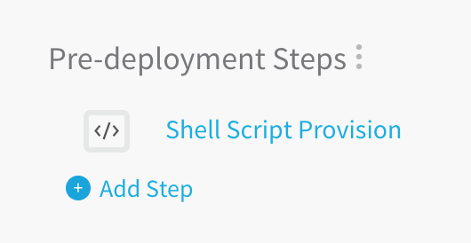

The Shell Script Provisioner is now added as a step in the Workflow.

For each Phase in a Canary Workflow, you specify a Service and Infrastructure Definition for the Phase execution. You can specify the same Infrastructure Definition that uses your Shell Script Provisioner.

For example, in the Workflow, in **Deployment Phases**, click **Add Phase**. The **Workflow Phase** dialog appears.

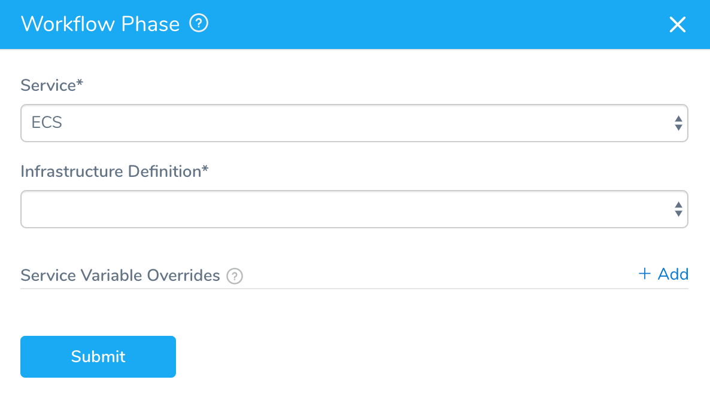

In **Service**, select the Service to be deployed in this Phase. The Service must be the same Service type that is used in the Infrastructure Definition that uses your Shell Script Provisioner.

In **Infrastructure Definition**, select the Infrastructure Definition that uses your Shell Script Provisioner.

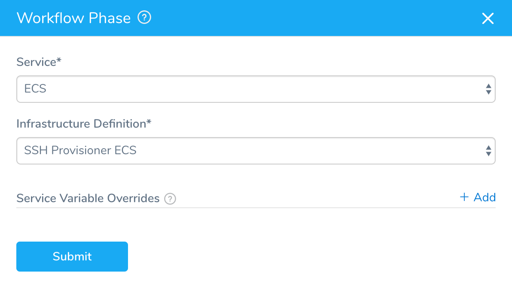

Click **SUBMIT**. The Phase is created using the Infrastructure Definition that uses your Shell Script Provisioner.

Add any other Canary Workflow Phases you require, and then Deploy your Workflow. The Workflow will use the Shell Script Provisioner to create the Service Mappings it requires and create the infrastructure for your deployment.

### Deployment Example

The following Canary Workflow deployment uses the Shell Script Provisioner as part of its deployment.

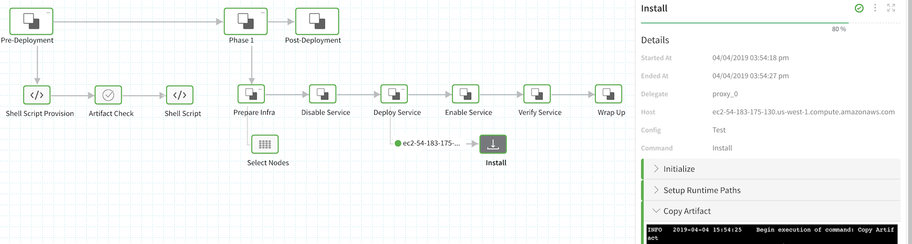

Let's look at each stage of the deployment.

In the **Pre-Deployment** phase, you can see the **Shell Script Provision** step using the Shell Script Provisioner script to obtain the JSON array.


In this example, the **Shell Script Provision** step setting, **Output in the Context**, was used to put the Shell Script Provisioner script JSON output into a variable, and echo that variable in a **Shell Script** step in the Workflow. If you click the **Shell Script** step in the Workflow, the JSON obtained by the Shell Script Provisioner script is displayed:


Next, in **Phase 1** of the Canary Workflow, we can see in the result of the **Service Mapping** from our Shell Script Provisioner (or [Infrastructure Definition](../../environments/environment-configuration.md#add-an-infrastructure-definition)) in the **Select Nodes** step. The following images show how the JSON key `PublicDnsName` was mapped to the Harness field `Hostname`, which is then used to select the node for deployment.

Here is an example using Service Mapping in the Infrastructure Provisioner:


Here is an example using the [Infrastructure Definition](../../environments/environment-configuration.md#add-an-infrastructure-definition) Service mapping:

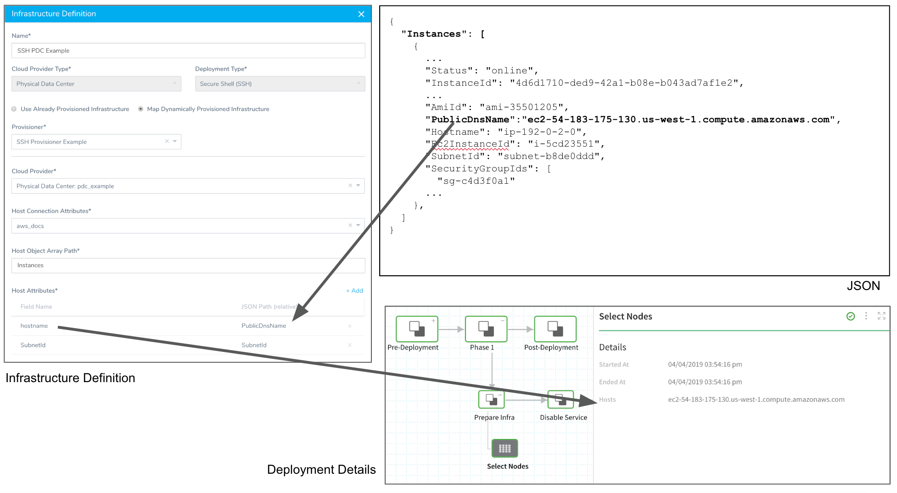

Lastly, in the **Install** step of the Workflow, you can see that the same hostname identifies the target host where the artifact was deployed successfully.

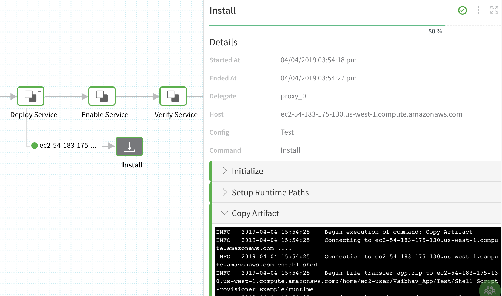

Now you have seen an example of how the Shell Script Provisioner was used to provision the deployment environment and target host using a simple JSON array.

### Next Steps

* [Variables and Expressions in Harness](https://docs.harness.io/article/9dvxcegm90-variables)
* [Continuous Verification](https://docs.harness.io/article/myw4h9u05l-verification-providers-list)

