Pipelines define your release process using multiple Workflows and Approvals in sequential and/or parallel stages. Pipelines can involve multiple Services, Environments, and Workflows. A Pipeline can be triggered either manually or using [Triggers](../triggers/add-a-trigger-2.md).

### Before You Begin

* [Create an Application](../applications/application-configuration.md)
* [Add a Service](../setup-services/service-configuration.md)
* [Add an Environment](../environments/environment-configuration.md)
* [Add a Workflow](../workflows/workflow-configuration.md)

### Visual Summary

<!-- Video:
https://harness-1.wistia.com/medias/rpv5vwzpxz-->
<docvideo src="https://fast.wistia.com/embed/iframe/46qa6qox0t" />

### Step 1: Add a Pipeline

To add a Pipeline, perform the following steps:

1. Click **Setup** and then select the Application that you want to deploy.
2. Click **Pipelines** and then click **Add Pipeline**. The **Add Pipeline** settings appear.

   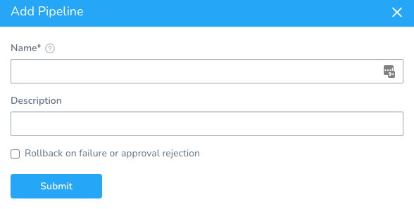

   For the **Rollback on failure or approval rejection** option, see [Rollback on failure or approval rejection](#rollback_on_failure_or_approval_rejection) below.

3. Enter a **Name** for your Pipeline. This name is used for selecting the Pipeline on the Deployments page.
4. Enter **Description** for your Pipeline and click **Submit**. The following settings appear.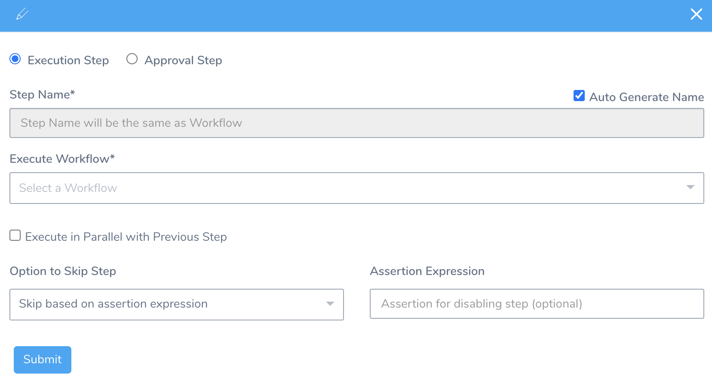
5. Select the **Execution Step** to execute this stage when the Pipeline runs.

	 1. In **Step Name**, enter the name for this stage. This name acts as a subheading to the stage name. You can also select the **Auto Generate Name** checkbox to generate the name automatically.
	 
	 2. In **Execute Workflow**, select the Workflow to execute in this Pipeline. The Workflows in your Application are listed.
	 
	 3. Select **Execute in Parallel with Previous Step** checkbox to execute steps in parallel.
	 
	 4. Select **Do not skip**, **Skip always**, or **Skip based on assertion expression** for setting the skip option. For more information, see [Skip Execution](skip-conditions.md#skip-execution).
	 
	 5. Enter Assertion Expression. It enables you to specify an expression that determines whether the stage should execute. For more information, see [Assertion Expression](skip-conditions.md#skip-based-on-assertion-expression).
	 
	 6. For **Runtime Input Settings**, see [Option: Runtime Input Settings](#option_runtime_input_settings).
	 
6. Select **Approval Step** to require approval before the next stage executes. You can use Harness UI, Jira, Custom Shell Script, or ServiceNow Approval mechanisms. For more information on Approvals, see [Add Approvals](https://docs.harness.io/category/add-approvals).
7. Click **Submit**. The Pipeline Stage and its steps are added to the Pipeline.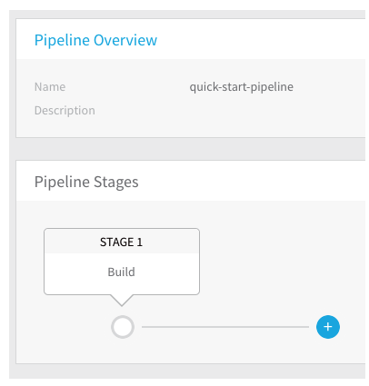
8. You can add multiple Stages, and insert new Stages between the existing Stages. Pipelines Stages can be Workflows or Approvals. To add another stage to the Pipeline, in **Pipeline Stages**, click **+** and then follow the same [Steps](https://docs.harness.io/article/8j8yd7hky4-create-a-pipeline#step_1_add_a_pipeline).

#### Rollback on failure or approval rejection

Currently, this feature is behind the feature flag `SPG_PIPELINE_ROLLBACK`. Contact [Harness Support](mailto:support@harness.io) to enable the feature.When you create a new Pipeline you have the option of enabling the **Rollback on failure or approval rejection** setting.

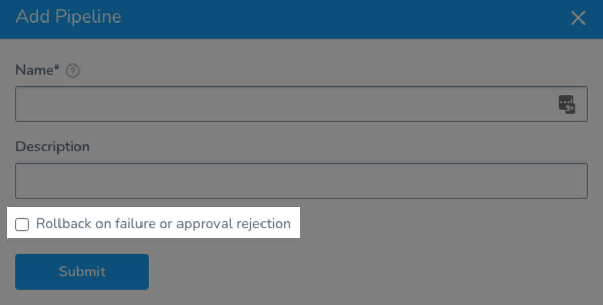

When the **Rollback on failure or approval rejection** is enabled, if any stage in the Pipeline fails to execute, all previous stages are also rolled back.

For example, in the following Pipeline, there are two stages, **deploy** and an **Approval** stage:

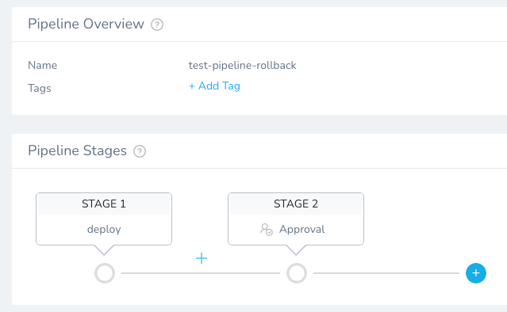

During execution, the Approval stage was rejected, so the previous stage, **deploy**, was rolled back by stage 3, **Rollback-deploy**.

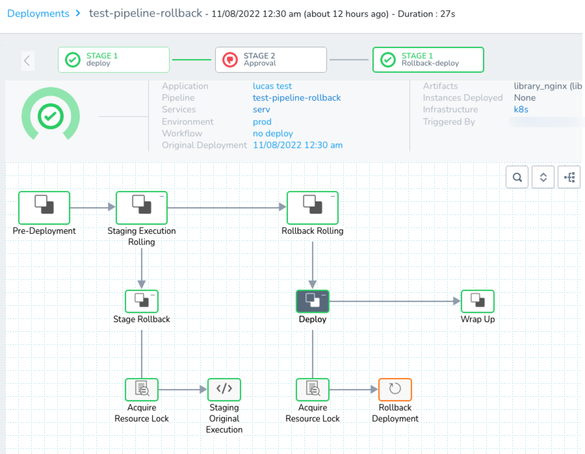

If the Workflows in previous stages have Rollback steps, those steps will be run.

### Step 2: Deploy a Pipeline

Once you have set up a Pipeline, you can deploy it, running all the stages within the Pipeline.

1. In your Application, select the Pipeline that you want to deploy. The **Pipeline Overview** page appears.
2. Click **Deploy** to run the Pipeline. The **Start New Deployment** dialog appears.  
  
   When you set up the Pipeline stage(s), you picked the Workflow(s) the Pipeline will execute. The Workflow you selected is linked to a Service, Environment, and Infrastructure Definition.  
		  
   **Start New Deployment** is configured with the settings linked to the Workflows included in the Pipeline.  
		  
   If you have [Workflow Variables](../workflows/add-workflow-variables-new-template.md) or [templatized settings](templatize-pipelines.md), you are prompted to provide values for them.

   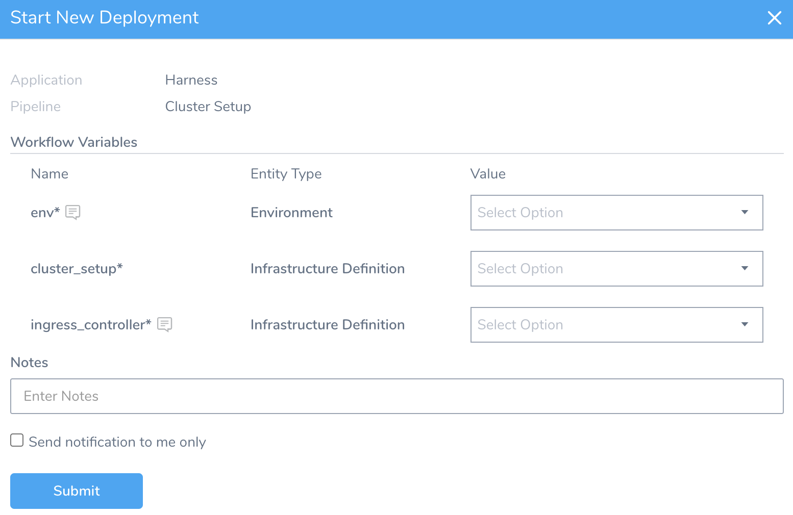

   You can enter a value for the variable or use a Harness expression. See [What is a Harness Variable Expression?](https://docs.harness.io/article/9dvxcegm90-variables).
		
3. Click **Submit**. The Pipeline is deployed and the deployment details are displayed in the **Deployments** page. You can click each phase in the process to see logs and other details of the process.

   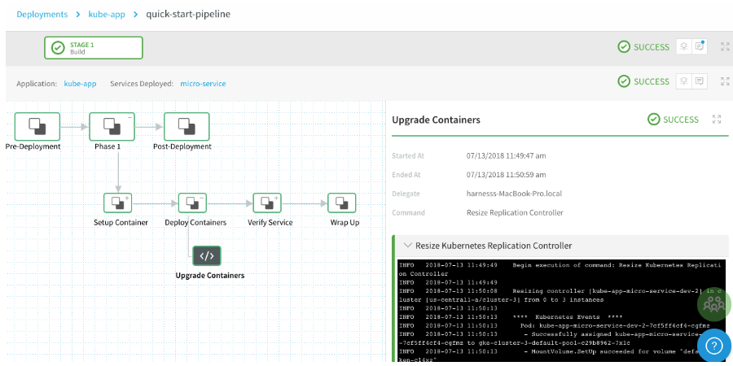

### Option: Runtime Input Settings

Sometimes, the inputs and settings for all of the Workflows in a Pipeline are not known before you deploy. Some inputs and settings can depend on the execution of the previous stages in the Pipeline.

For example, you might have an Approval step as part of the Workflow or Pipeline. Once the approval is received, you want to resume the next stage of the Pipeline execution by providing new inputs.

To do this, when you add an Execution Step stage to your Pipeline, use **Runtime Input Settings**.

1. Select **Runtime Input** for each Workflow variable that you want to make a runtime input.
2. For each variable value, enter a variable name or use a Harness expression. See [What is a Harness Variable Expression?](https://docs.harness.io/article/9dvxcegm90-variables). When the Pipeline is deployed, you can add runtime values.
3. In **Timeout**, enter how long Harness should wait for you to submit values before applying the selection in **Action after Timeout**.
4. In **Action after Timeout**, select what Harness should do if the timeout occurs:
	1. **End Execution:** This option will fail the stage of the deployment and initiate rollback.
	2. **Continue with Default Values:** This option will use the values you entered in the Workflow Variable **Default Value** setting. If there are no default values, you must provide values.
5. In **User Groups**, select the [Harness User Group(s)](https://docs.harness.io/article/ven0bvulsj-users-and-permissions) to notify of the time.

During Pipeline execution, you are prompted for any Workflow variables you selected as a **Runtime Input**.

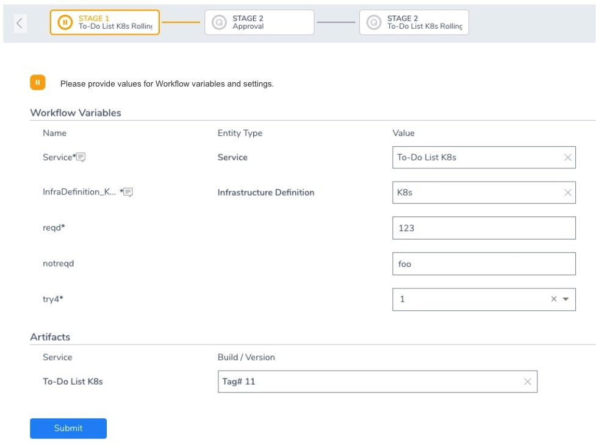

You can enter a value for the variable or use a Harness expression.

You will be prompted for each Workflow in the Pipeline where you have used **Runtime Inputs**.

Later, if you choose to rerun a Pipeline, the Pipeline will run using the runtime inputs you provided the last time it ran.

### Step 3: Abort or Rollback a Running Deployment

If you deploy a Pipeline and choose the **Abort** option during the running deployment, the **Rollback Steps** for the Workflow(s) in the Pipeline are not executed. Abort stops the deployment execution without rollback or clean up. To execute the **Rollback Steps**, click the **Rollback** button.

|  |  |
| --- | --- |
| **Abort Button** | **Rollback Button** |
| 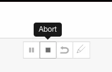 | 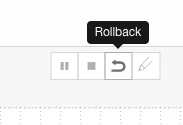 |

### Incomplete Pipelines

If a Workflow in a Pipeline is incomplete (missing information in a Workflow step), then the Pipeline Stage for that Workflow will indicate that the Workflow is incomplete:

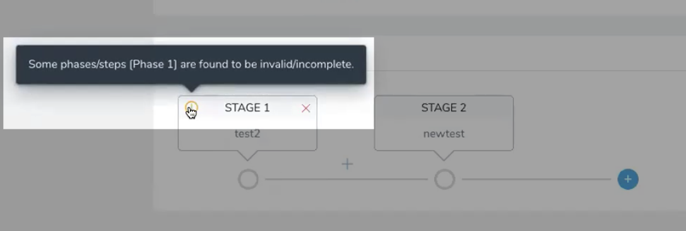

Open the incomplete Workflow, complete it, and then return to the Pipeline.

#### Workflow Variables and Incomplete Pipelines

Another example of an incomplete Pipeline is a Workflow stage with Workflow variables that have not been given default values.

Also, if you add a new Workflow variable to a Workflow that is already in a Pipeline, that Pipeline is marked incomplete. You must open the Workflow in the Pipeline, enter a value for the new Workflow variable, and then submit the stage.

If you try to deploy a Pipeline with an incomplete Workflow, Harness will prevent you.

Simply fix the Workflow and then deploy the Pipeline.

### Review: RBAC for Pipelines

Pipeline follows standard Harness RBAC as described in [Managing Users and Groups (RBAC)](https://docs.harness.io/article/ven0bvulsj-users-and-permissions).

Your ability to read, create, delete, and update Pipelines depends on the **Pipeline** Application Permissions of your User Group.

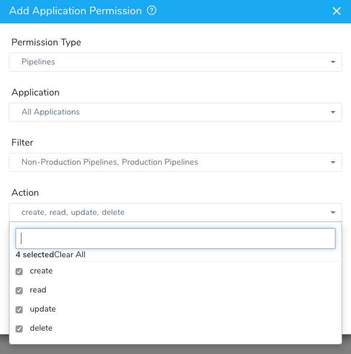

Your ability to deploy Pipelines also depends on your **Deployments** Application Permissions.

### Next Steps

* [Create Pipeline Templates](templatize-pipelines.md)
* [Resume Pipeline Deployments](https://docs.harness.io/article/4dvyslwbun-resume-a-pipeline-deployment)
* [Pipeline Governance](https://docs.harness.io/article/zhqccv0pff-pipeline-governance)

