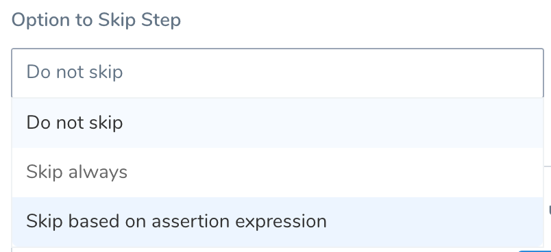
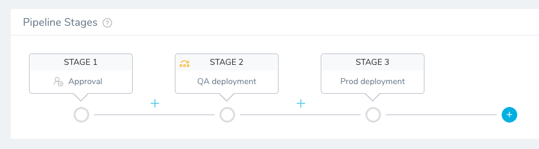
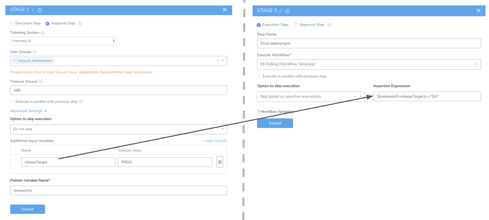
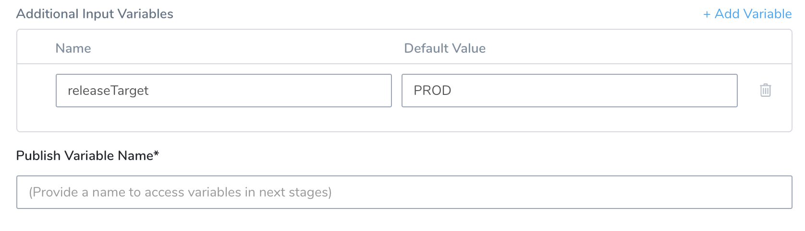
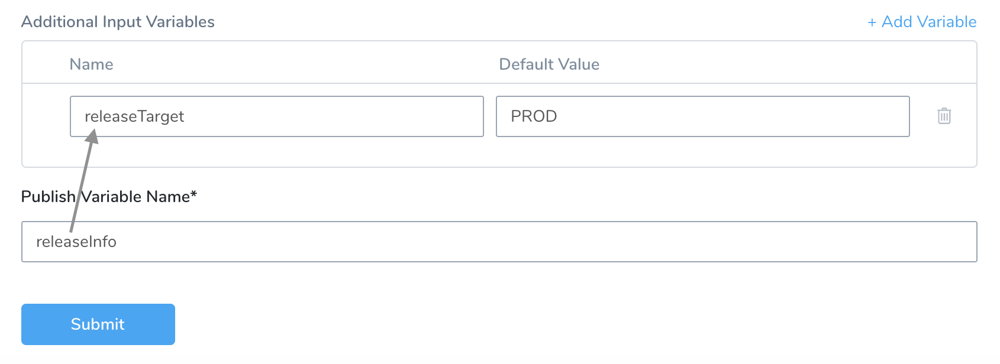
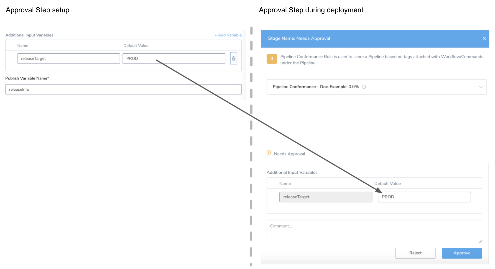
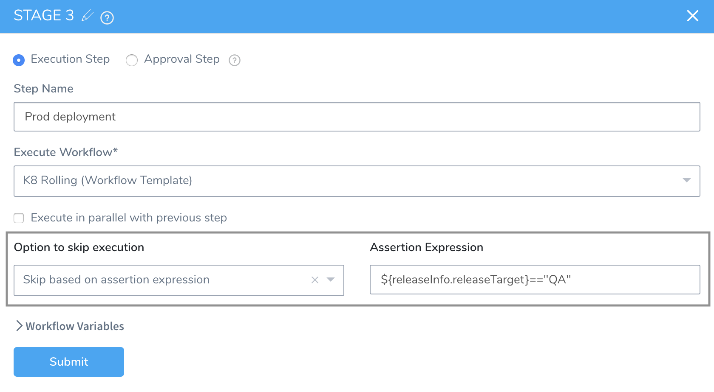
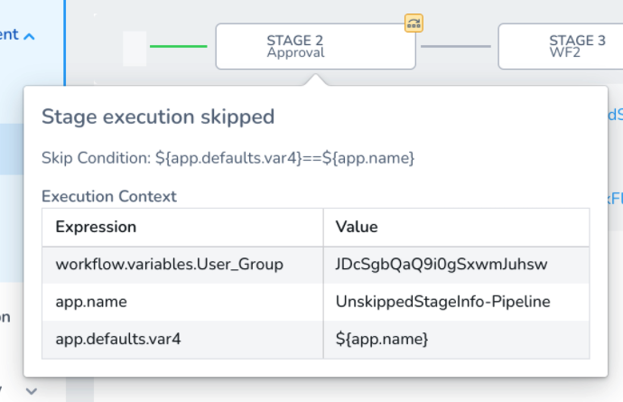
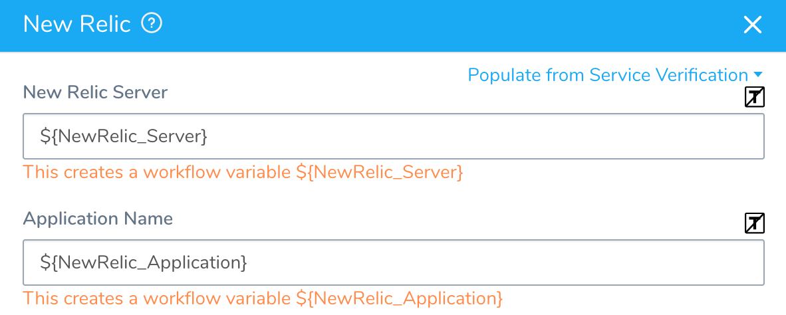

You might want to skip the execution of specific Pipeline Stages based on different conditions, such as a script output, a specific Git branch, or a specific release.

You can use skip conditions to control how Pipeline stages execute. For example, you could evaluate a branch name to determine which Stage to run. If the branch name is not **master**, you could skip a Workflow that deploys from the master branch.

You can also apply skip conditions to steps in a Workflow. See [Skip Workflow Steps](../workflows/skip-workflow-steps.md).

### Before You Begin

* [Pipelines](pipeline-configuration.md)
* [Approvals](../approvals/approvals.md)

### Limitations

* Harness does not support the Ternary conditional `?:` operator from [JEXL](http://commons.apache.org/proper/commons-jexl/reference/syntax.html#Operators).
* You can use the following variable expressions in **Assertion Expression**:
	+ Approval input variables from earlier Approval Stages. This is described below.
	+ Published output variables from Workflow [Shell Script](../workflows/capture-shell-script-step-output.md) and [HTTP](../workflows/using-the-http-command.md) steps that are scoped to **Pipeline**.
	+ [Built-in Harness Application and Pipeline variable expressions](https://docs.harness.io/article/9dvxcegm90-variables). These are available because they are readable before deploying the Pipeline.
* In **Assertion Expression**, you can only use variable expressions that Harness can resolve before Workflow deployment. Pipeline Skip Conditions are evaluated before the Workflow is deployed.   
For example, artifact information is only readable when you select, or Harness pulls, the artifact at Workflow deployment runtime. Therefore, artifact expressions should not be used in the **Assertion Expression**.
* The **Assertion Expression** setting allows you to test using multiple operators, not just equality. For example, `${release.test} > 1` would also be a valid **Assertion Expression** entry.

### Review: Skip Conditions

Skip conditions enable you to disable the execution of individual Pipeline Stages (such as Workflows).

You can set a Stage to be skipped or conditionally execute Stages based on expressions evaluated when the Pipeline runs. You can use them in scenarios like these:

* Set a Stage to never execute. This is useful when you want to add new Stages to a Pipeline’s structure, but prevent those Stages from executing while they are still under development.
* Set a Stage to execute conditionally, based on the value assigned to a variable in an earlier stage of the same Pipeline.

Use the **Option to Skip Step** setting to select the condition under which this Pipeline Stage should execute:

The options are:

* **Do not skip** — This is the default behavior. Harness will not override execution. The Stage will simply execute.
* **Skip always** — The stage will never execute. With this option, you can maintain a Stage within a Pipeline, but disable it temporarily or indefinitely.
* **Skip based on assertion expression** — This option enables you to specify an expression that determines whether the Stage should execute.

The Do not skip and Skip always options are easy to understand. The rest of this topic will focus on the **Skip based on assertion expression** option.

#### Skip Always and Workflow Variables

Normally, when you execute a Pipeline containing a Workflow that uses [Workflow variables](../workflows/add-workflow-variables-new-template.md), such as a [templated Workflow](../workflows/templatize-a-workflow-new-template.md), the Workflow variables are mandatory: values for the variables must be provided in order to deploy the Pipeline.

If you select the **Skip always** option in **Option to skip execution** for a Workflow in a Pipeline, then Workflow variables in the skipped Workflow are no longer mandatory. The Pipeline may be deployed without providing variables.

### Skip Based on Assertion Expression

Use the **Skip based on assertion expression** option to conditionally skip a Pipeline stage based on an expression.

Harness supports the [Java Expression Language (JEXL)](https://commons.apache.org/proper/commons-jexl/reference/syntax.html). You can use JEXL operators and regex in your expressions.

To enable this option, you can define a new variable in an Approval stage, or use the variables listed in [Limitations](#limitations) above.

Next, in any subsequent stage, you evaluate the expression to determine whether to execute the stage.

Remember when an assertion evaluates to **false**, the Stage is not skipped. When it evaluates to **true**, it is skipped.For example, let's look at a Pipeline with a variable defined in Stage 1 and then evaluated in Stage 3:

In the following image, you can see the variable defined in Stage 1, and then in Stage 3 you can see an expression using the variable:

Let's walk through the steps of setting up this variable and using it in **Skip based on assertion expression**.

#### Step 1: Create Input Variable

In an [Approval](../approvals/approvals.md) stage within a Pipeline, you define an input variable as follows:

1. Click **Advanced Settings**.

   
	 
2. In **Additional Input Variables**, click **Add**.
3. Give your new variable a **Name** and **Default Value**. You will use the name to reference the variable in one or more subsequent Execution or Approval Stages in the Pipeline. You will use the value in an expression to determine whether the Stage should execute.

   

4. In **Publish Variable Name**, enter a parent name for the **Additional Input Variables**. The parent name helps to avoid conflicts when referencing variables of the same name within the same Pipeline.  
  
   In this example, the parent name is set to `releaseInfo`, and the input variable's name is `releaseTarget`. So, in subsequent Pipeline Stages, you can reference this variable as `releaseInfo.releaseTarget`. Its default value is set as `PROD`.

 :::note 
 If you use multiple Approval Steps, ensure that the names entered in **Publish Variable Name** are unique in each Approval Step. If you use the same name in **Publish Variable Name** in multiple Approval Steps, and error will occur and the step will fail.
 :::
	 
5. To add more input variables, click **Add Variable**.  
   All variables defined in this Stage share the same parent name, prepended from the **Publish Variable Name** field.
6. Click **Submit** to save this Stage, along with its variables. Now you can use these variables in assertion expressions within Execution and Approval stages, or modify the variables, as described below.

#### Step 2: Modify Value During Deployment

When you deploy this Pipeline, the Approval Stage lets authorized approvers modify the variable value. Authorized approvers are members of User Groups selected in the Approval Stage's **User Group(s)** setting.

In the example below, the `releaseTarget` variable appears with its **Default Value** of `PROD`. Approvers can change the value here before clicking **Approve**.

#### Step 3: Evaluate Assertion Expression

To use the variable value to determine whether a Stage executes, in a subsequent Stage in the same Pipeline, in **Option to skip execution**, select **Skip based on assertion expression**.

In **Assertion Expression**, reference the `releaseInfo.releaseTarget` variable that we defined earlier in the Approval Stage using the expression `${releaseInfo.releaseTarget}`.

In this example, the value `QA` is used in the assertion:

When we first created this input variable, we set its value to `PROD`.

During deployment, if we assume that this value has not been changed in any intermediate Stage—remember that users change a variable's value in an Approval Stage—the assertion expression will be evaluated as *false*.

In this case, this Pipeline stage will *not* be skipped, because the skip condition (the assertion expression) has not been met. Therefore, Harness will attempt to execute the stage.

Remember when an assertion evaluates to **false**, the Stage is not skipped. When it evaluates to **true**, it is skipped.

### Review: Skip Condition Info In Deployments Page

On a Harness deployment's page, when you hover a Pipeline stage that uses a skip condition, the skip conditions expressions are displayed:

### Notes

If a skip condition uses the templated variable of a User Groups or New Relic setting, the condition should use the ID of the User Group and New Relic setting, and not the name.

For example, in the following [templated New Relic Workflow step](../../continuous-verification/new-relic-verification/4-verify-deployments-with-new-relic.md#review-templatize-new-relic-verification), the **New Relic Server** (Harness Verification Provider) and **Application Name** settings are templated:

If you reference those settings in a Pipeline skip condition, you must use the ID of the server (Harness Verification Provider) or Application in your condition expression. Do not use the Harness Verification Provider or Application name.

### See Also

* [Using Variables in Workflow Approvals](../approvals/use-variables-for-workflow-approval.md)

