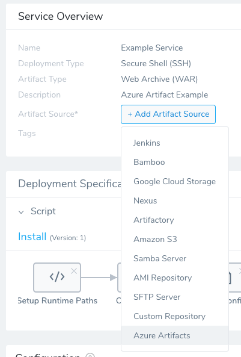
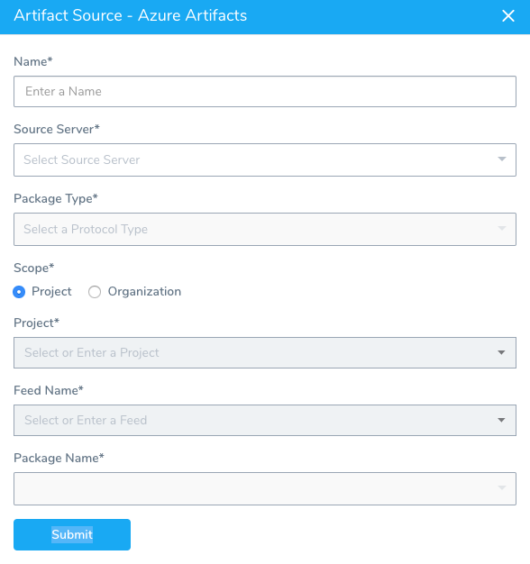
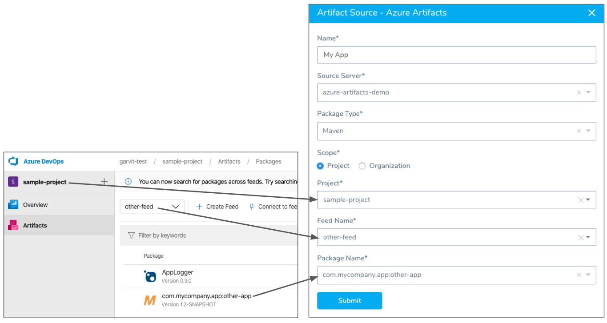

To add an Azure DevOps Artifact source to a Harness Service, you add an Azure DevOps Artifact Server as a Harness Connector, and then use that Connector in your Service to add the Azure DevOps organization, project, feed, and package name.

### Before You Begin

* [Azure DevOps Artifacts](https://docs.harness.io/article/7dghbx1dbl-configuring-artifact-server#azure_dev_ops_artifacts)

### Step 1: Ensure an Azure Artifacts Connector is Set Up

Before you can add an Azure DevOps artifact feeds to your Harness Service, you need to add a Harness Connector for your Azure DevOps organization.

Use the information in [Azure DevOps Artifacts](https://docs.harness.io/article/7dghbx1dbl-configuring-artifact-server#azure_dev_ops_artifacts) to set up the Connector in Harness.

### Step 2: Add Azure Artifacts Package Feed to the Harness Service

Azure Artifacts are available for Secure Shell (SSH), AWS CodeDeploy, WinRM, and Pivotal Cloud Foundry (PCF) Harness Service deployment types.

The package types supported currently are NuGet and Maven. If you choose the Maven package type you can also use ZIP or WAR. If you use ZIP or WAR, then select ZIP or WAR as the type in your Harness Service Artifact Type.To use a Docker image on Azure, you can use Azure Container Registry Artifact Source. See [Add a Docker Artifact Source](add-a-docker-image-service.md).

In your Harness Service, do the following:

1. In **Service Overview**, click **Add Artifact Source**, and then click **Azure Artifacts**.

   

   **Azure Artifacts** appears.

   

4. In **Name**, enter a name that identifies the artifact feed you are adding.
5. In **Source Server**, select the Azure DevOps Artifact Server you added to connect Harness to your Azure DevOps Artifacts. For more information, see [Azure DevOps Artifacts](https://docs.harness.io/article/7dghbx1dbl-configuring-artifact-server#azure_dev_ops_artifacts).
6. In **Package Type**, select the package type. Only supported types are listed.
7. In **Scope**, select **Project** or **Organization**. If you selected Organization, Harness uses the organization specified in the **Azure DevOps URL** setting in the **Source Server** you selected.

	a. If you selected **Project**, in **Project**, select the name of the Azure Artifact project containing the feed you want to add.
	
8. In **Feed Name**, select the name of the feed for your artifact.
9. In **Package Name**, select the name of the package for your artifact.

   Here is an example of a completed Azure Artifacts setup.

   

10. Click **Submit**. The Artifact Source is added to the Service.

You can use Artifact History to manually pull a list of builds and version.

### Next Steps

* [Service Types and Artifact Sources](service-types-and-artifact-sources.md)

