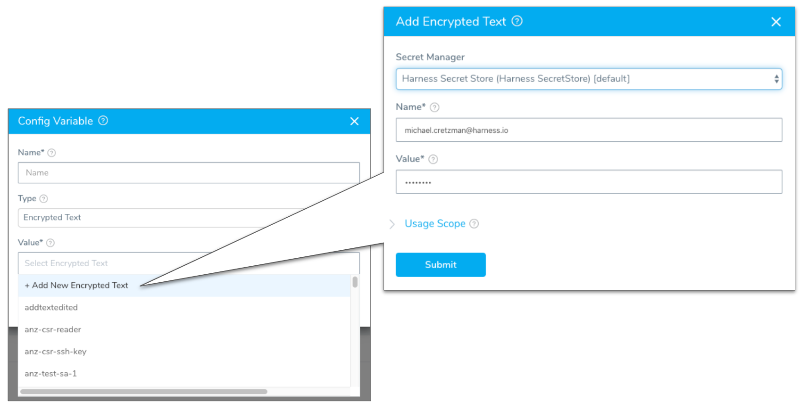
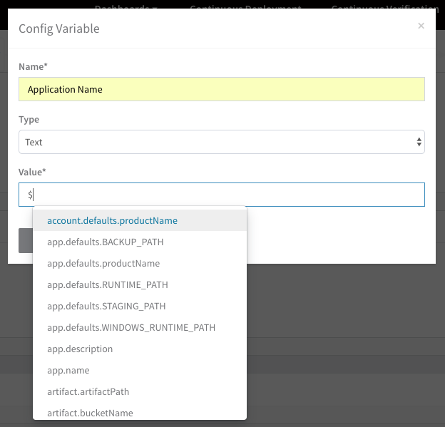
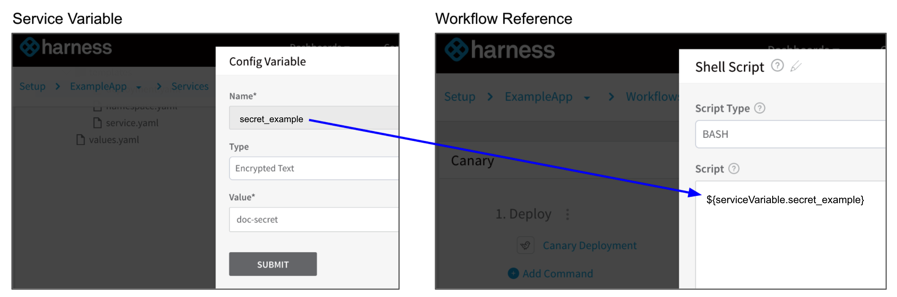

You can add Service Config variables to use throughout your Service configuration settings, and referenced anywhere the Service is used in a Workflow.

During deployment, the Service Config variables are created as environment variables wherever the commands are executed (on the target hosts or Delegate hosts).

Only Service Config Variables are added as environment variables and can be output with `env`. Workflow and other variables are not added as environment variables.Service variables can be overwritten at the Environment level. See [Override a Service Configuration](../environments/environment-configuration.md#override-a-service-configuration).

For information about how configuration variables and files are used in a Kubernetes deployment, see [Kubernetes Deployments Overview](https://docs.harness.io/article/pc6qglyp5h-kubernetes-deployments-overview). For information on using Harness variables and expressions, see [Variables and Expressions in Harness](https://docs.harness.io/article/9dvxcegm90-variables).

### Before You Begin

* Read the [Create an Application](../applications/application-configuration.md) topic to get an overview of how Harness organizes Services.
* Read the [Add a Service](service-configuration.md) topic to understand the process to add a Service to an Application.
* Read [Configuration as Code](https://docs.harness.io/article/htvzryeqjw-configuration-as-code) to see how you can quickly configure your Harness Service using your existing YAML in Git.

### Limitations

* You cannot use an empty value for a Service Config Variable.

### Step 1: Use Config Variables

To use Service-level variables, do the following:

1. In **Configuration**, in **Config Variables**, click **Add Variable**. The **Config Variable** dialog appears.
2. In **Name**, enter a name for your variable. This is the name you will use to reference your variable anywhere in your service.

   :::note
   Config variable names may only contain `a-z, A-Z, 0-9, _`. They cannot contain hyphens. The following keywords are reserved, and cannot be used as a variable name or property when using the dot operator: `or and eq ne lt gt le ge div mod not null true false new var return`.
   :::
   
3. In **Type**, select **Text** or **Encrypted Text**.  
  
    If you selected **Text**, enter a string in **Value**. When you reference this variable in the Service configuration, you use `${serviceVariable.var_name}`.  
      
    If you select **Encrypted Text**, the Value field becomes a drop-down and you can select any of the Encrypted Text you have configured in Secrets Management. For more information, see [Secrets Management](https://docs.harness.io/article/au38zpufhr-secret-management).  
    You can also click **Add New Encrypted Text** to create a new secret. This brings up the option of selecting the Secret Manager to use when storing the new encrypted variable.

    

    When you reference this encrypted variable in the Service configuration, you use `${serviceVariable.var_name}`.  
      
    You can also use Harness variables in the **Value** field. To use a variable, enter **$** and see the available variables.

    

    For example, to add Workflow variables, enter `${workflow` and the available Workflow variables are displayed. For more information about variables, see [Variables and Expressions in Harness](https://docs.harness.io/article/9dvxcegm90-variables).
  
4. Click **SUBMIT**. The variable is added to **Config Variables**.

5. To reference the variable is any text field in your Service configuration, type **$** and Harness will provide a drop down of all variables. Begin typing the name of your variable to find it and select it.

### Step 2: Reference Service Variables and Secrets

Use a Service Variable either as a text or as a secret (using one of the secrets in [Secrets Management](https://docs.harness.io/article/au38zpufhr-secret-management)) in other Harness Application components such as Workflows by entering `${serviceVariable.` and selecting the variables.

:::note
* Service variables cannot be referenced in the **Pre-deployment Steps** of a Workflow. Services are not used in pre-deployment and, consequently, their variables are not available. Service variables can be used in **Prepare Infra** steps in a Basic deployment Workflow.

* Build Workflows do not use Harness Services. Consequently, Service variables and Service variable overrides cannot be used in a Build Workflow.
:::

### Referencing Service Config Variables as Environment Variables

The Service Config Variables are added as environment variables wherever the commands using them are executed. 

If the command is executed on the Delegate host, then the Service Config Variables are added as environment variables on that host. If the command is executed on the target host, then the Service Config Variables are added as environment variables on that host.

:::note
Only Service Config Variables are added as environment variables and can be output with `env`. Workflow and other variables are not added as environment variables.
:::

For example, if you have a Service Config Variable named **jarName**, Harness creates an environment variable name **jarName** that can be referenced in two ways:

* As a Service variable: `${serviceVariable.jarName}`. There is no escaping done by Harness for Service variables.
* As an environment variable: `${jarName}`. Escaping is done by Harness automatically.

### Override Values YAML

For information on Helm Values YAML, see [Override Harness Kubernetes Service Settings](https://docs.harness.io/article/ycacqs7tlx-override-harness-kubernetes-service-settings) and [Helm Deployments Overview](https://docs.harness.io/article/ii558ppikj-helm-deployments-overview).

### Notes

If you create a new secret from within Service Config Variables, Harness automatically sets the scope of the secret to your Harness Application.

