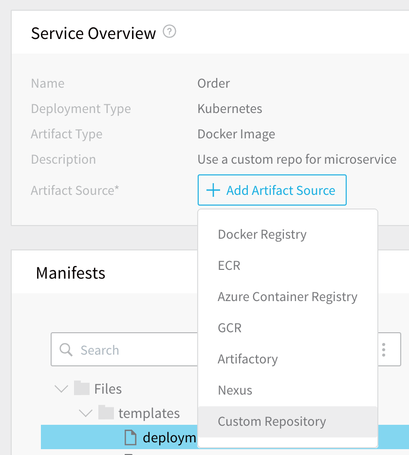
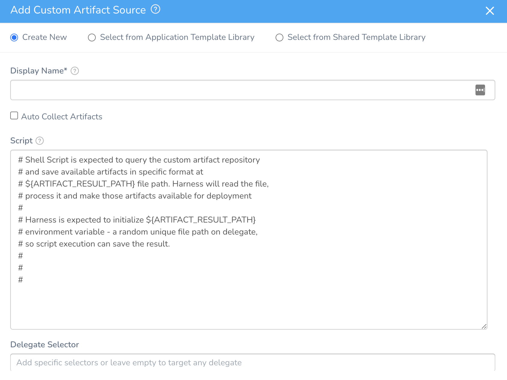
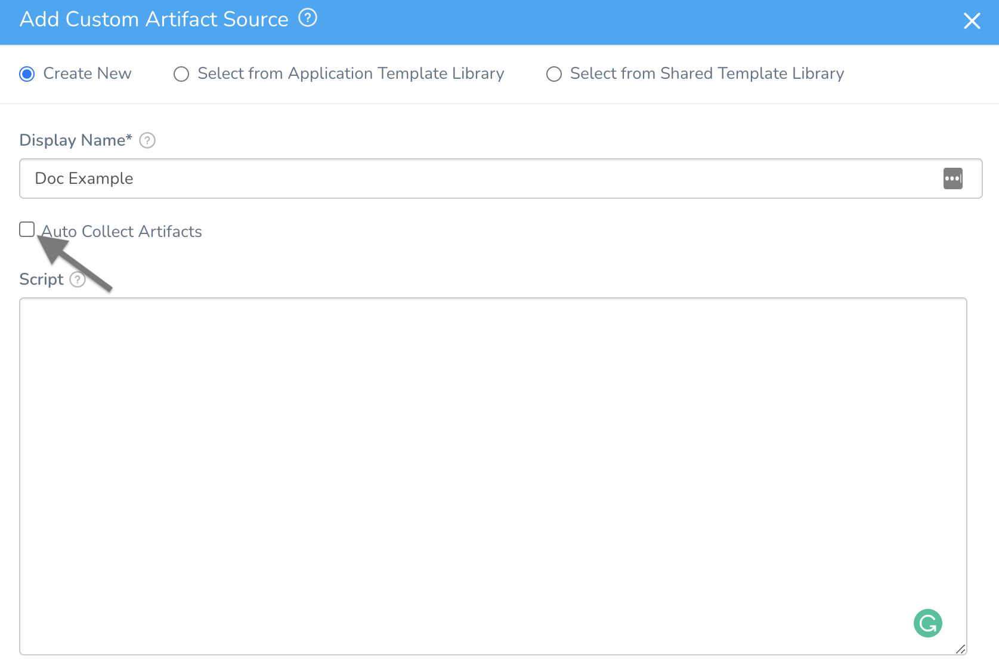
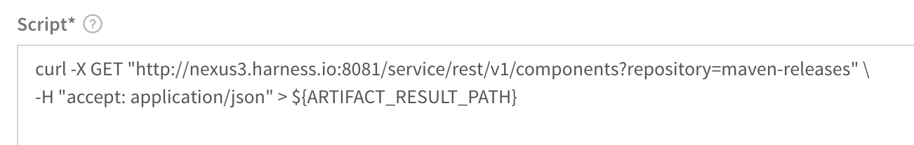
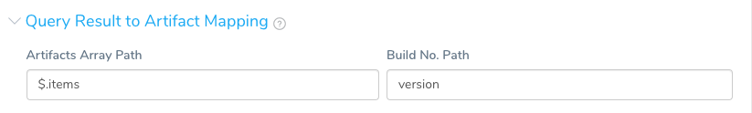
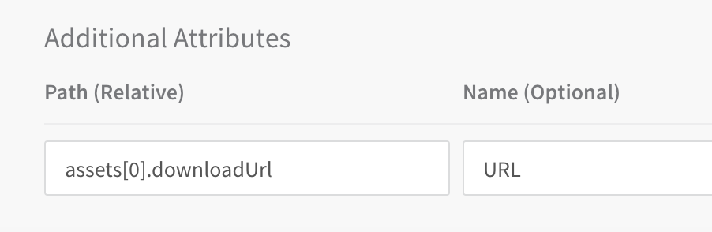
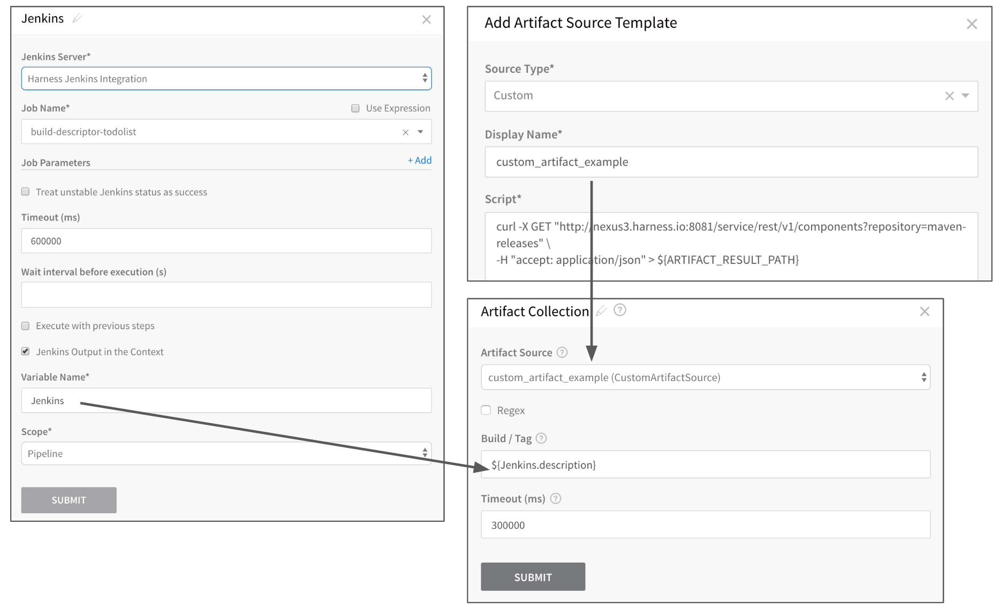
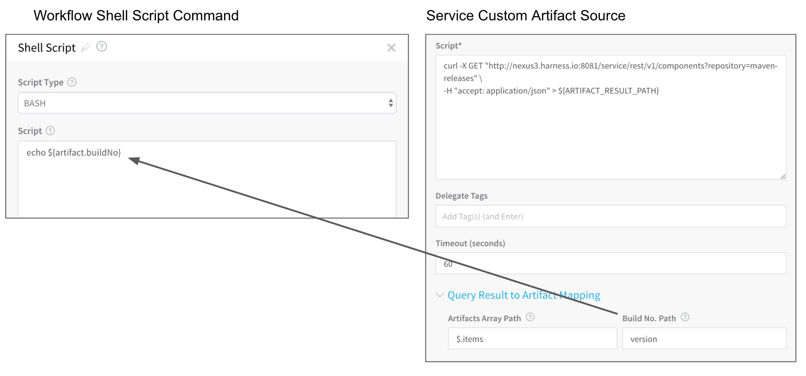
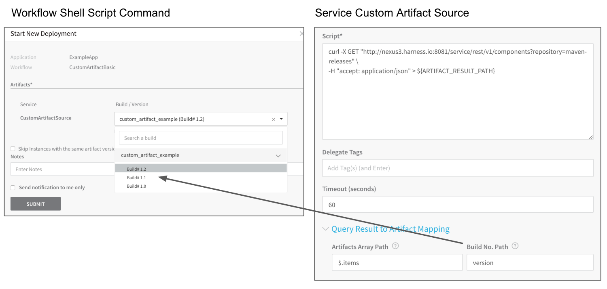

For enterprises that use a custom repository, Harness provides the Custom Artifact Source to add their custom repository to the Service.

To use this artifact source, you provide a script to query your artifact server via its API (for example, REST) and then Harness stores the output on the Harness Delegate in the Harness-initialized variable `${ARTIFACT_RESULT_PATH}`. The output must be a JSON array, with a mandatory key for a Build Number. You then map a key from your JSON output to the Build Number.

### Before You Begin

* Read the [Create an Application](../applications/application-configuration.md) topic to get an overview of how Harness organizes Services.
* Read the [Add a Service](service-configuration.md) topic to understand the process to add a Service to an Application.
* Read [Configuration as Code](https://docs.harness.io/article/htvzryeqjw-configuration-as-code) to see how you can quickly configure your Harness Service using your existing YAML in Git.

### Step 1: Add an Artifact Source

To add a Custom Artifact Source, do the following:

1. In your Harness Application, open the Service where you want to use a Custom Artifact Source.
2. Click **Add Artifact Source**, and then click **Custom Repository**.

The **Add Custom Artifact Source** dialog appears.

Fill out the Add Custom Artifact Source dialog fields.

### Step 2: Source Type

Select **Custom**.

### Step 3: Display Name

Enter a name to identify this custom artifact source. You will use this name when picking the artifact builds and versions during deployment.

### Step 4: Script

Enter a shell script that pulls the artifact from the custom repo to a file path on the Harness Delegate host.

You can leave the **Script** empty by not selecting **Auto Collect Artifacts**.



You cannot use Harness [Service Configuration](add-service-level-config-variables.md) variables in the script.The shell script you enter will query the custom artifact repository for your artifact, and output the result to a file on the Harness Delegate host using the environment variable `ARTIFACT_RESULT_PATH`, initialized by Harness. `ARTIFACT_RESULT_PATH` is a random, unique file path created on the Delegate by Harness.

You must delete the Artifact Source and re-add it to re-collect the Artifacts if the Artifact Source or its script information has been changed.

The script you enter should result in a JSON array, for example:


```
{  
  "items" : [ {  
    "id" : "bWF2ZW4tcmVsZWFzXXXXXXXXXXXXXkOGVmMzU2YWE0ZTliMmZlNDY",  
    "repository" : "maven-releases",  
    "format" : "maven2",  
    "group" : "mygroup",  
    "name" : "myartifact",  
    "version" : "1.0",  
    "assets" : [ {  
      "downloadUrl" : "http://nexus3.harness.io:8081/repository/maven-releases/mygroup/myartifact/1.0/myartifact-1.0.war",  
      "path" : "mygroup/myartifact/1.0/myartifact-1.0.war",  
      "id" : "bWF2ZW4tcmVsZWFzXXXXXXXXXXXXXkOGVmMzU2YWE0ZTliMmZlNDY",  
      "repository" : "maven-releases",  
      "format" : "maven2",  
      "checksum" : {  
        "sha1" : "da39a3eXXXXXXXXXXXXX95601890afd80709",  
        "md5" : "d41d8cdXXXXXXXXXXXXX998ecf8427e"  
      }  
    }, {  
      "downloadUrl" : "http://nexus3.harness.io:8081/repository/maven-releases/mygroup/myartifact/1.0/myartifact-1.0.war.md5",  
      "path" : "mygroup/myartifact/1.0/myartifact-1.0.war.md5",  
      "id" : "bWF2ZW4tcmVXXXXXXXXXXXXXYmE3YTE1OTYwNzUxZTE4ZjQ",  
      "repository" : "maven-releases",  
      "format" : "maven2",  
      "checksum" : {  
        "sha1" : "67a74306XXXXXXXXXXXXX570f4d093747",  
        "md5" : "74beXXXXXXXXXXXXX56088456"  
      }  
....
```
Harness will read the file, process it, and make the artifacts available for deployment in your Workflows and Pipelines.

The following example pulls an artifact from a repo and outputs it to the `ARTIFACT_RESULT_PATH`:


```
curl -X GET "http://nexus3.harness.io:8081/service/rest/v1/components?repository=maven-releases" \  
-H "accept: application/json" > ${ARTIFACT_RESULT_PATH}
```
Here is an example using a Harness encrypted text secret for credentials:


```
curl -u 'harness' ${secrets.getValue("repo_password")} https://myrepo.example.io/todolist/json/ > ${ARTIFACT_RESULT_PATH}
```
For more information, see [Secrets Management](https://docs.harness.io/article/au38zpufhr-secret-management).

The expected output from the shell script is a JSON structure with an array, where every element represents an artifact object. You map the array object using **Query Result to Artifact Mapping**.

### Step 5: Delegate Selectors

Enter Delegate Selector names of one or more Harness Delegates to use when executing the script. The Delegates you identify should have network access to the custom repo in order to obtain any artifacts. See [Delegate Selectors](https://docs.harness.io/article/h9tkwmkrm7-delegate-installation#delegate_selectors).

### Step 6: Timeout

Enter a time limit for the script to execute before failing the artifact retrieval.

### Step 7: Query Result to Artifact Mapping

Use the **Query Result to Artifact Mapping** section to map the JSON key from your script to the artifact Build Number.



In **Artifacts Array Path**, enter the root object of the array. For example, if your array object starts with `{"items" : [ {...},{...}` then enter `$.items` in **Artifacts Array Path**.

Next, in **Build No. Path**, enter the key to use as the buildNo, such as `version`.

Once mapped, you can reference the build number using the expression `${artifact.buildNo}`.

#### Additional Attributes

In **Additional Attributes**, you can map any additional values from your JSON array.



For example, if a subsection of your array contains the download URL, such as `"assets":[ {"downloadUrl"...` you enter `assets[0].downloadUrl` in **Path** and `URL` in **Name**. Later in your Workflow you can reference the URL with `${artifact.metadata.URL}`.

### Option 1: Use the Artifact Collection Command

Typically, a Build Workflow is used in a Pipeline to perform standard CI (continuous integration) of an artifact and is followed by another Workflow to perform the deployment of the built artifact.

The way the Build Workflow performs CI is to run a **Jenkins** or **Shell Script** command to execute the build and store a variable with the build information, and then the **Artifact Collection** command collects the built artifact using the output variable and deposits it to the artifact repo. For information on the Jenkins and Shell Script commands, see [Using the Jenkins Command](../workflows/using-the-jenkins-command.md) and [Using the Shell Script Command](../workflows/capture-shell-script-step-output.md).

The following image shows the Jenkins step build and store a variable named **Jenkins**, and then the Artifact Collection step uses the Custom Artifact Source and the `${Jenkins.description}` variable to reference the new build.



Now that the artifact is collected, a second Workflow can deploy the artifact.

The `${Jenkins.description}` requires that Jenkins have the [Description Setter](https://wiki.jenkins.io/display/JENKINS/Description+Setter+Plugin) plugin installed. See [Harness Built-in Parameter Variables](../workflows/using-the-jenkins-command.md#harness-built-in-parameter-variables) for Jenkins.

### Option 2: Use the Shell Script Command

For any Workflow type, you can reference the Custom Artifact Source using the Shell Script command and a variable reference to the build number, `${artifact.buildNo}`:



### Step 8: Select the Build for Deployment

When you deploy the Workflows with a Service that uses a Custom Artifact Source, you can select which artifact build to select.

If the [Custom artifact source script](#step_4_script) is empty, the deployment proceeds with the version you enter, and the same details are available in the artifact variable, which can be accessed using `${artifact.*}`.​​



### Artifactory Example

This topic used Nexus for its examples, but another example might be helpful.

For example, here is a script for Artifactory:


```
curl -X POST \  
  https://harness.jfrog.io/harness/api/search/aql \  
  -H 'Authorization: Basic xxxxxxx=' \  
  -H 'Content-Type: text/plain' \  
  -H 'cache-control: no-cache' \  
  -d 'items.find({"repo":{"$eq":"example-maven"}})' | jq '.' > ${ARTIFACT_RESULT_PATH}
```
For the remaining settings, you would use the following:

* Artifacts Array Path: `$.results`
* Build No. Path: `name`
* Additional Attributes:
	+ Path (Relative): `path`
	+ Name (Optional): `${path}`

This example uses jq which is in most operating system packaging repositories. If you need to install it, see your operating system instructions. For Ubuntu, installation is:


```
sudo apt update  
sudo apt install jq
```
