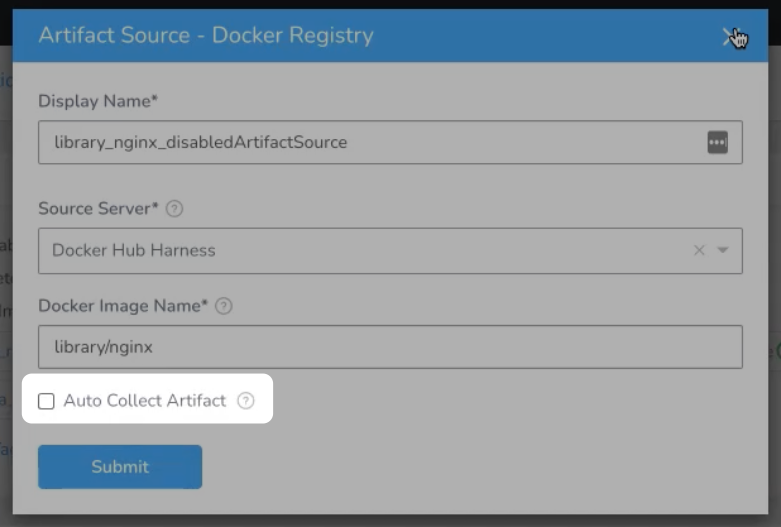
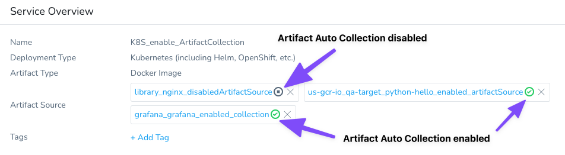
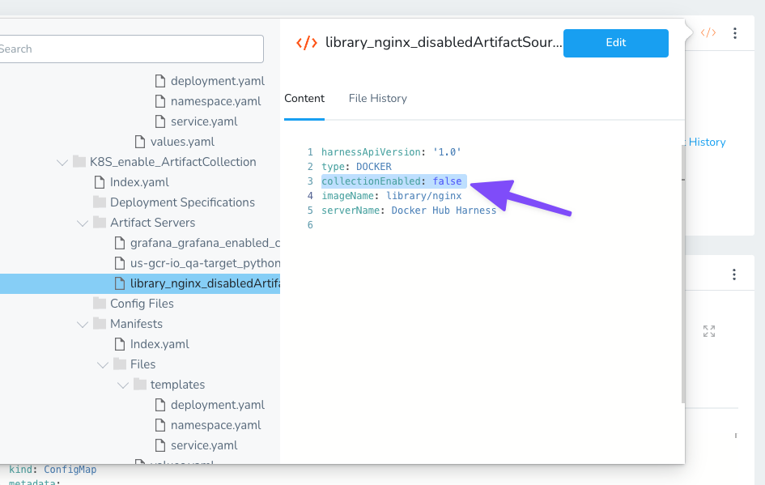
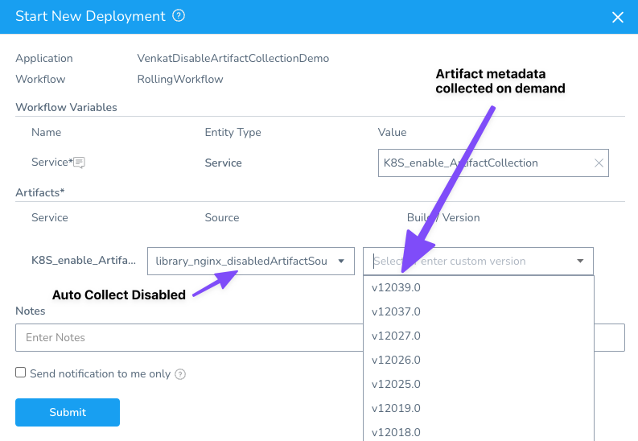
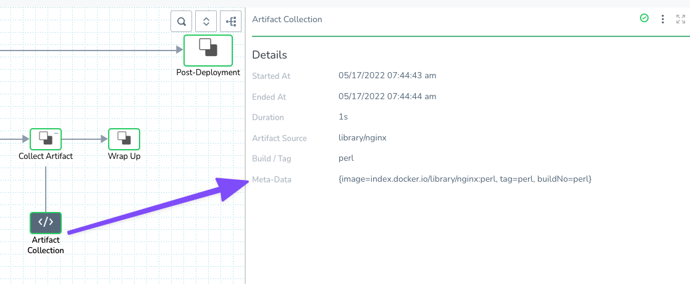

Currently, this feature is behind the feature flag `ARTIFACT_COLLECTION_CONFIGURABLE`. Contact [Harness Support](mailto:support@harness.io) to enable the feature.In some cases, automatic collection of artifacts can cause issues like rate limit increases because of too many calls from the Harness Delegate to your artifact servers. 

You can enable or disable automatic artifact collection whenever you need. This topic will walk you through the process.

### Before You Begin

* [Add Specs and Artifacts using a Harness Service](service-configuration.md)

### Supported Platforms and Technologies

See [Supported Platforms and Technologies](https://docs.harness.io/article/220d0ojx5y-supported-platforms).

### Review: Artifact Auto Collection

Here's a summary of how the Artifact Auto Collection works in Harness:

* **Enabled:** If auto collection is enabled, Harness collects the artifacts using metadata when you set up the Artifact Source in a Harness Service.
* **Disabled:** If auto collection is disabled, Harness collects the artifact metadata from the repo on demand when you select the Artifact Source during deployment. Harness then stores the metadata in the Harness database.
	+ For example, when you deploy a Workflow/Pipeline and select an artifact that has auto collection disabled, Harness will fetch the artifact metadata (tags/versions) on demand at that moment.

### Step 1: Set Artifact Auto Collection on the Service

In the Service settings, in **Artifact Source**, you can enable/disable the **Auto Collect Artifact** setting.

When **Auto Collect Artifact** is disabled for an artifact, a stop icon is listed next to the artifact:

If **Auto Collect Artifact** is disabled for an artifact, you will see the following:

* No artifacts listed for that artifact in the **Artifact History** in that Service.
* If **Auto Collect Artifact** is disabled for all artifacts, **Artifact History** does not appear at all.
* No artifacts listed for that artifact in the **Manually Select an Artifact** settings.

#### Artifact Source YAML

The **Auto Collect Artifact** setting is described in the Artifact Servers YAML using the `collectionEnabled` label:

* Enabled: `collectionEnabled: true`
* Disabled: `collectionEnabled: false`

### Step 2: Select the Artifact Build/Version on New Deployments

When you deploy a Workflow/Pipeline that uses a Service with an artifact source that has **Auto Collect Artifact** disabled, you can select the artifact source in **Start New Deployment** (or when re-running a Workflow/Pipeline), and Harness will fetch the artifacts on demand.

If an artifact tag/version is not listed, but you know it is in the repo, you can enter its name in the **Build/Version** setting and Harness will fetch it during deployment. If Harness cannot find the artifact, you will see an error in the following format in the Pre-deployment stage of the Workflow: `Invalid request: Could not find requested build number [artifact name] for artifact stream type [artifact type]`.

### Review: Artifact Collection Workflow Step

In the deployed **Artifact Collection** Workflow step, you can see the metadata collected:

### Option: Triggers

In the **On New Artifact** and **On Webhook Event** Trigger types, only artifact sources with the **Auto Collect Artifact** setting enabled are listed.

### See Also

* [Using Custom Artifact Sources](custom-artifact-source.md)

