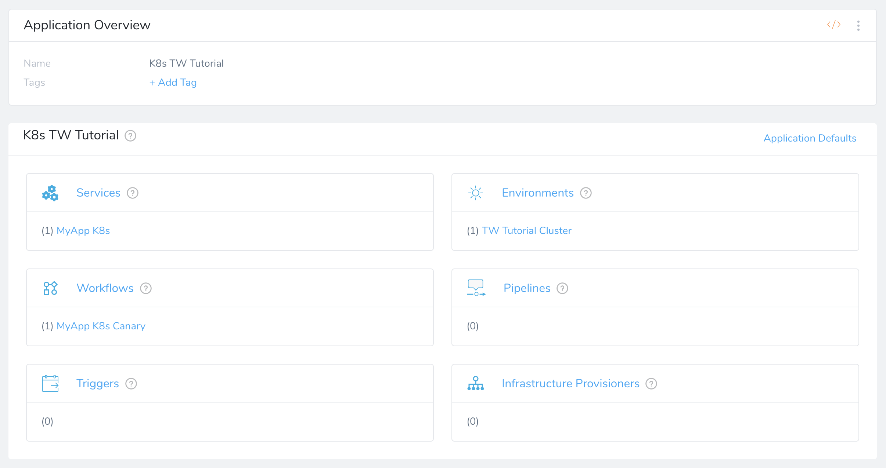
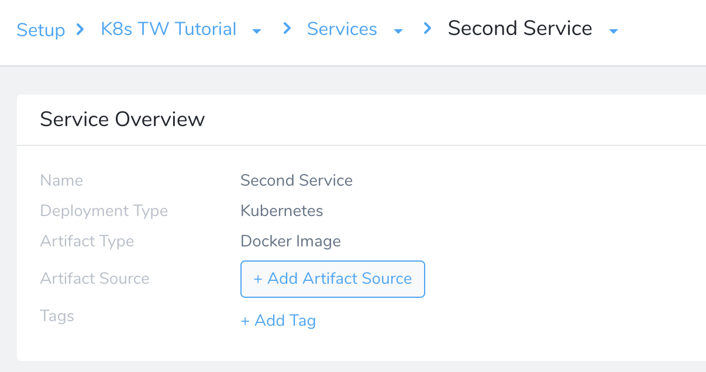
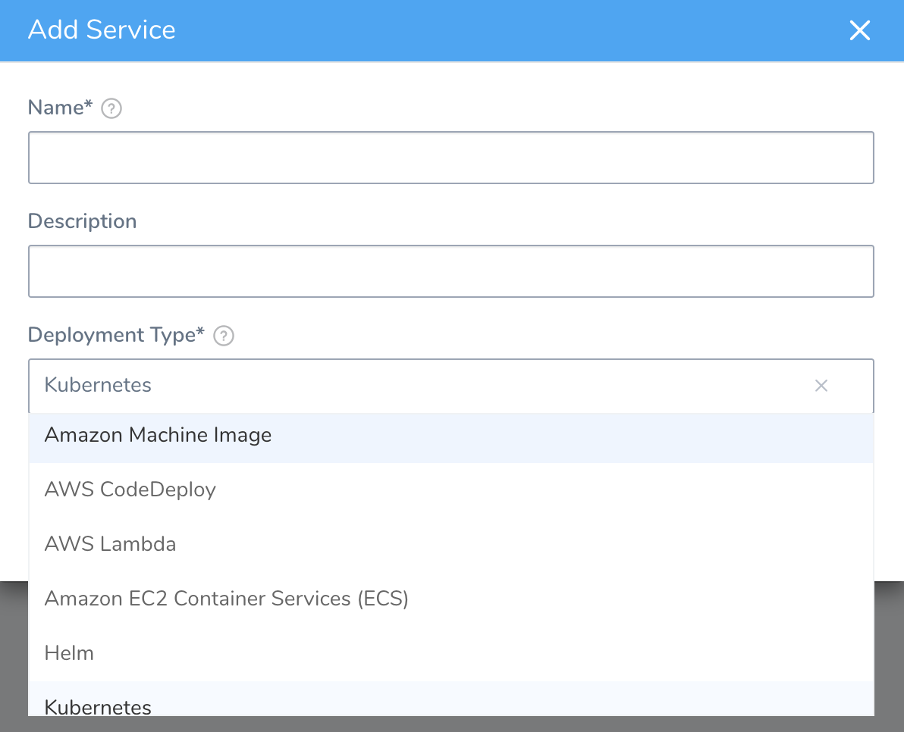
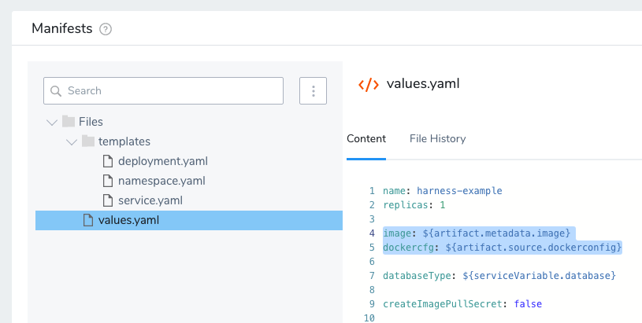
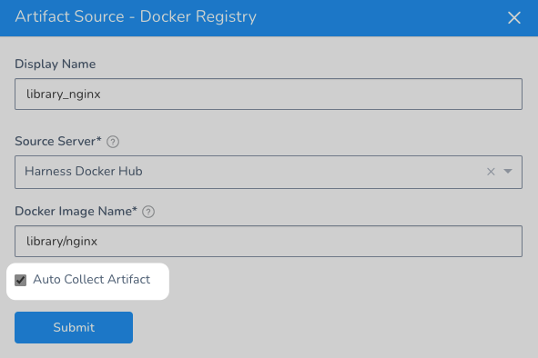
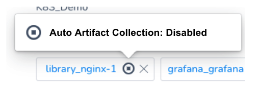
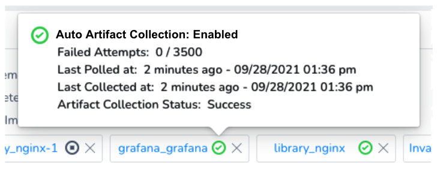
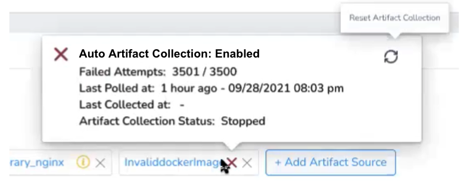
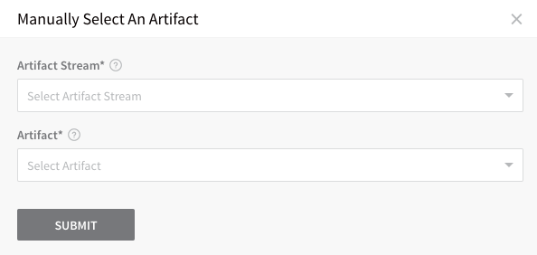

Services represent your microservices/apps. You define where the artifacts for those services come from, and you define the container specs, configuration variables, and files for those services.

This is a general overview of a Harness Service. For detailed deployment information for each type of Service, see [Deployments Overview](https://docs.harness.io/article/i3n6qr8p5i-deployments-overview) and select your deployment type.


### Before You Begin

* Read the [Create an Application](../applications/application-configuration.md) topic to get an overview of how Harness organizes Services.
* Read the [Add a Service](service-configuration.md) topic to understand the process to add a Service to an Application.
* Read [Configuration as Code](https://docs.harness.io/article/htvzryeqjw-configuration-as-code) to see how you can quickly configure your Harness Service using your existing YAML in Git.

### Step 1: Add a Service to a Harness Application

To add a service, do the following:

1. Click **Setup**, and then click the name of your application. The application entities appear.

   
   
2. Click **Services**, and then click **Add Service**. The **Service** dialog appears.

   
   
3. Select a **Deployment Type**. Each deployment type will set up a Service for its deployment platform. For example, selecting **Kubernetes** creates a Service with default Kubernetes manifest files.

4. Click **SUBMIT**. The **Service Overview** appears.

    
   
   In this new Service you will set up artifacts, container specs, and configuration files and variables.

### Step 2: Select Deployment Type

There are multiple Service types used in Harness, listed in the **Deployment Type** field, such as Kubernetes and Helm.



These Service types are discussed in detail in the deployment guides for those platforms. For more information, see [Deployments Overview](https://docs.harness.io/article/i3n6qr8p5i-deployments-overview).

### Step 3: Add an Artifact Source

Different Service types support different artifact sources, such as Docker or Amazon AMI. For details on different service types and artifact sources, see [Service Types and Artifact Sources](service-types-and-artifact-sources.md).

For most deployment types, you add an artifact source and then reference it in the Service or Workflow.

If you do not reference the artifact source somewhere in your Harness entities, via a Service spec or Shell Script Workflow step, for example, Harness does not use it.For example, in a Kubernetes Service, you add an Artifact Source for the Docker image you want to deploy. Here's an example using an nginx image on Docker Hub:


Next, you reference the artifact **image** and **dockercfg** secret in the Kubernetes manifest **values.yaml** file. Here's the default that is created automatically when you add a new Kubernetes Service:



And here are the values referenced using the Go templating expressions `{{.Values.image}}` and `{{.Values.dockercfg}}` in the Secret and Deployment manifests in the same Service:


```
{{- if .Values.createImagePullSecret}}  
apiVersion: v1  
kind: Secret  
metadata:  
  name: {{.Values.name}}-dockercfg  
  annotations:  
    harness.io/skip-versioning: true  
data:  
  .dockercfg: {{.Values.dockercfg}}  
type: kubernetes.io/dockercfg  
---  
{{- end}}  
...  
apiVersion: apps/v1  
kind: Deployment  
metadata:  
  name: {{.Values.name}}-deployment  
spec:  
  replicas: {{int .Values.replicas}}  
  selector:  
    matchLabels:  
      app: {{.Values.name}}  
  template:  
    metadata:  
      labels:  
        app: {{.Values.name}}  
    spec:  
      {{- if .Values.createImagePullSecret}}  
      imagePullSecrets:  
      - name: {{.Values.name}}-dockercfg  
      {{- end}}  
      containers:  
      - name: {{.Values.name}}  
        image: {{.Values.image}}  
        {{- if or .Values.env.config .Values.env.secrets}}  
        envFrom:  
        {{- if .Values.env.config}}  
        - configMapRef:  
            name: {{.Values.name}}  
        {{- end}}  
        {{- if .Values.env.secrets}}  
        - secretRef:  
            name: {{.Values.name}}  
        {{- end}}  
        {{- end}}
```
The above referencing of the artifact source is done automatically when you create a new Kubernetes Service, but it is important to remember that you must reference the artifact when you create your own manifests in Harness.

### Option: Configure Artifact Collection

Currently, this feature is behind the Feature Flag `ARTIFACT_COLLECTION_CONFIGURABLE`. Contact [Harness Support](mailto:support@harness.io) to enable the feature.You can control how Harness collects artifacts using the **Auto Collect Artifact** option in **Artifact Source**.



By default, artifact collection runs every 3 minutes. If you have shared resources such as artifact servers and secret managers you might notice a lot of API calls. This number of calls can lead to an increase in load and theoretically impact system stability. Also, some services have rate limiting that can be impacted.

The **Auto Collect Artifact** option in **Artifact Source** allows you to enable and disable artifact collection to prevent any issues. Also, Harness provides the following artifact collection information:

* **Failed Attempts:** the number of times artifact collection failed.

**Auto Collect Artifact** is automatically disabled if the number of failed collections exceeds 3500. You can reset artifact collection using the **Reset Artifact Collection** button in the status message.* **Last Polled At:** the last time Harness attempted to collect the artifact.
* **Last Collected At:** the last time Harness successfully collected the artifact.
* **Artifact Collection Status:** shows if the collection is successful, retrying, or failed.

Let's look at some examples. 

#### Disabled

When the **Auto Collect Artifact** option in **Artifact Source** is not selected, artifact collection is disabled.

Hover over the Artifact Source to see the status.



**Auto Collect Artifact** is automatically disabled if the number of failed collections exceeds 3500. You can reset artifact collection using the **Reset Artifact Collection** button in the status message.#### Enabled

When the **Auto Collect Artifact** option in **Artifact Source** is selected, artifact collection is enabled.

Hover over the Artifact Source to see the status.



#### Enabled and Retrying

When the **Auto Collect Artifact** option in **Artifact Source** is selected but collection failed, Harness will retry collection.

Hover over the Artifact Source to see the status.


#### Reset Artifact Collection when Maximum Failed Attempts Reached

If artifact collection failures have reached the maximum of 3500 attempts, you can reset artifact collection using the **Reset Artifact Collection** button in the status message.



#### Artifact Collection with Harness GraphQL

You can enable/disable artifact collection for an Artifact Source using Harness GraphQL API.

First, you'll need the Artifact Source Id. Obtain the Artifact Source Id by querying the Service:


```
query{  
  service(serviceId: "60HIgOKdTayQUh3F2dndVw"){  
    artifactSources{  
      id  
      name  
      artifacts(limit:10, offset:0){  
        nodes {  
          id  
          buildNo  
        }  
      }  
    }  
  }  
}
```
This will give you a response with all Artifact Sources for the Service. Save the Id of the Artifact Source you want to enable/disable collections for.

Next, use `setArtifactCollectionEnabled` to enable or disable the Artifact Source collection.

You set the `artifactCollectionEnabled` to `true` to enable collection or `false` to disable collection.


```
mutation {  
  setArtifactCollectionEnabled (input:{  
    clientMutationId:"abc",  
    appId:"d2GfddtSRHSmW2TpFhIreA",  
    artifactStreamId:"pXESnvkXSA210zrAlbCxPw",  
    artifactCollectionEnabled:true  
  })  
  {  
    clientMutationId  
    message  
  }  
}
```
The Artifact Source Id you collected earlier is used by `artifactStreamId`. The Application Id is entered in `appId`.

The response of the mutations will be something like this:


```
{  
  "data": {  
    "setArtifactCollectionEnabled": {  
      "clientMutationId": "abc",  
      "message": "Successfully set artifact collection enabled"  
    }  
  }  
}
```
### Option: Manually Select an Artifact

You can have Harness pull a list of builds and versions from an Artifact Source. Click **Artifact History**, and then **Manually pull artifact**. The **Manually Select An Artifact** dialog appears.



Select the artifact source in **Artifact Stream**, and then the artifact build in **Artifact**.

#### Deleted Artifacts Refreshed in Harness

Currently, Harness will update the list of artifacts from the following repo types and remove deleted items:

* Docker
* AMI
* Artifactory
* ECR
* GCR
* ACR
* Nexus
* Azure Machine Image

If you delete artifacts in another repo, such as S3, the list of artifacts in Harness is not updated.

### Container Specs and Manifests

You can use container specifications and manifests to configure a Service. For information on the specs and manifests available for the different Service types, see [Deployments Overview](https://docs.harness.io/article/i3n6qr8p5i-deployments-overview).

