This topic provides a matrix of Harness Service artifact types and their artifact sources. The matrix shows which Service artifact types support metadata-only sources, and which types support both metadata and file sources.

It also includes information on how to manage the different source types, and on how to copy, download, and install artifacts.

### Metadata and File Artifact Sources

Harness Services allows you to identify artifacts using their metadata. At deployment runtime, Harness uses the metadata to copy or download the artifact to the target hosts/containers.

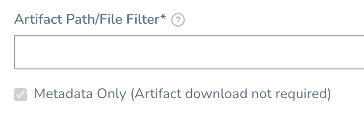

Artifact files without metadata were supported previously, and were downloaded to the Harness store, but are no longer supported.

#### Switching to Metadata Only

If you have file-based Artifact Sources currently set up in your Harness Services (meaning, without the Metadata Only option selected), these are still supported.

In the near future, only metadata sources will be supported. You can switch your current file-based sources to metadata in advance of this change.

If you switch to **Metadata Only**, it is not applied to previously collected artifacts.

#### Artifact Sizes and Limitations

Harness has a limit of a 1GB file upload. However, Harness directly streams from the artifact server if the file size is larger (even larger than 25GB).

For artifacts larger than 1GB, use the **Metadata Only** option in the Harness Service **Artifact Source** settings.

### Artifact Sources and Artifact Type Matrix

The following table lists the artifact types, such as Docker Image and AMI, and the Artifact Sources' support for metadata.

Legend:

* **M** - Metadata. This includes Docker image and registry information. For AMI, this means AMI ID-only.
* **Blank** - Not supported.

|  |  |  |  |  |  |  |  |  |  |  |  |
| --- | --- | --- | --- | --- | --- | --- | --- | --- | --- | --- | --- |
| **Sources** | **Docker Image**(Kubernetes/Helm/TAS) | **AWS** **AMI** | **AWS CodeDeploy** | **AWS Lambda** | **JAR** | **RPM** | **TAR** | **WAR** | **ZIP** | **TAS** | **IIS** |
| Jenkins |  |  | M | M | M | M | M | M | M | M | M |
| Docker Registry | M |  |  |  |  |  |  |  |  | M |  |
| Amazon S3 |  |  | M | M | M | M | M | M | M | M | M |
| Amazon AMI |  | M |  |  |  |  |  |  |  |  |  |
| Elastic Container Registry (ECR) | M |  |  |  |  |  |  |  |  | M |  |
| Azure Reg | M |  |  |  |  |  |  |  |  |  |  |
| Azure DevOps Artifact |  |  | M |  | M | M | M | M | M | M | M |
| GCS |  |  | M |  |  | M | M | M | M | M | M |
| GCR | M |  |  |  |  |  |  |  |  | M |  |
| Artifactory | M |  | M | M | M | M | M | M | M | M | M |
| Nexus | M |  | M | M | M | M | M | M | M | M | M |
| Bamboo |  |  | M |  | M | M | M | M | M | M | M |
| SMB |  |  | M |  | M | M | M | M | M | M | M |
| SFTP |  |  | M |  | M | M | M | M | M | M | M |

### Docker Image Artifacts

If the Artifact Source is **Docker**, at runtime the Harness Delegate will use the metadata to initiate a pull command from the deployment target host(s), and pull the artifact from the registry (Docker Registry, ECR, etc) to the target host.

To ensure the success of this artifact pull, the host(s) running the target host(s) **must** have network connectivity to the registry.

The **Copy Artifact** script in a Service does not apply to Docker artifacts. For Services using Docker artifacts, at runtime the Harness Delegate will execute a Docker pull on the target host to pull the artifact. Ensure the target host has network connectivity to the Docker artifact server.### Copy and Download of Metadata Artifact Sources

When copying or downloading artifacts, Harness uses metadata in the following ways.

#### Copy Artifact

The Copy Artifact command is supported for Artifact Sources that use Artifactory, Amazon S3, Jenkins, Bamboo, and Nexus.

The Copy Artifact command is added by default when you create a Harness Service using the deployment type **Secure Shell (SSH)**.

During deployment runtime, Harness uses the metadata to download the artifact to the Harness Delegate. The Delegate then copies the artifact to the target host(s).

Ensure that the Delegate has network connectivity to the Artifact Server.

#### Download Artifact

For SSH and WinRM Service types, the Download Artifact script is supported for many artifact sources, such as Amazon S3, Artifactory, Azure, and SMB and SFTP (Powershell-only) artifact sources.

The Download Artifact command is added by default when you create a Harness Service using the deployment type **Windows Remote Management (WinRM)**.

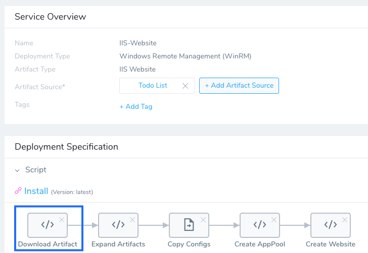

At deployment runtime, the Harness Delegate executes commands on the target host(s) to download the artifact directly to the target host(s). This is the process for file-based and metadata Artifact Sources. **The target host(s) must have network connectivity to the artifact server.**

Ensure that the target host has network connectivity to the Artifact Server.

### Exec Script

For all Service types, the Exec script can be added to the Service to use the artifact source metadata and copy or download the artifact.

#### Add an Exec Script

1. In the Service, click **Add Command**. The **Add Command** dialog appears.  
   
	 In **Command Type**, select the **Install**.

  
	
	The command is added to the Service. There is also an **Install** command in the Template Library that is preset with common variables.
	
	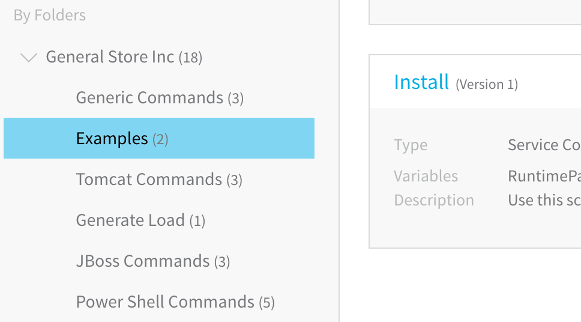
	
	For information on using the Template Library, see [Use Templates](https://docs.harness.io/article/ygi6d8epse-use-templates).
	
2. Hover over the **Add** button to see the available scripts.

   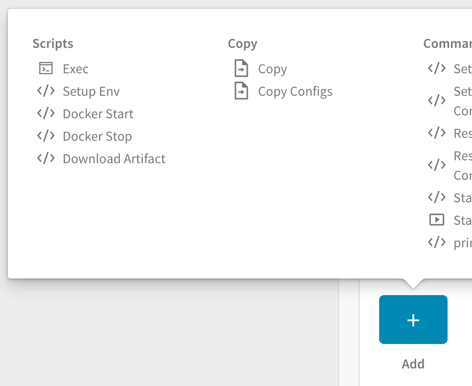
	 
3. Under **Scripts**, click **Exec**. The **Exec** dialog appears.

   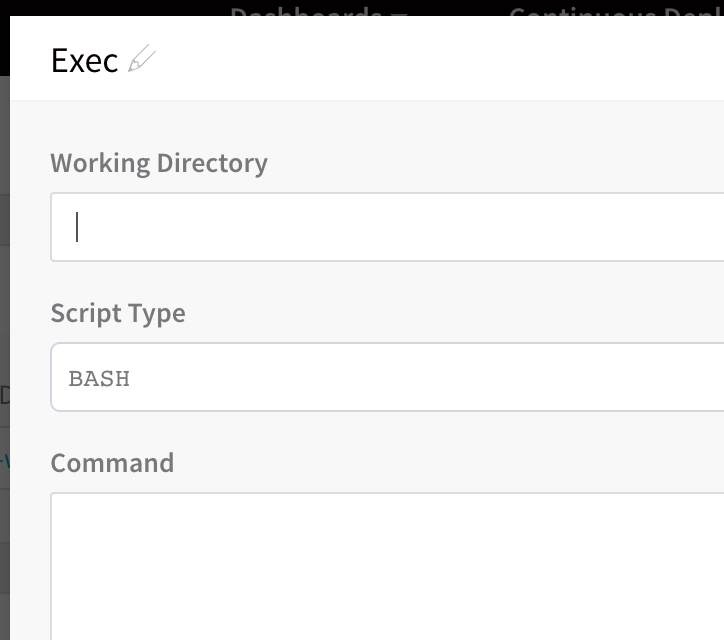
	 
4. In **Working Directory**, enter the working directory on the target host from which the Harness Delegate will run the Bash or PowerShell script, such as **/tmp** on Linux and **%TEMP%** on Windows. By default, and if **Working Directory** is left empty, the script is executed in the home directory.

5. Add the commands needed to install your microservice using the metadata and click **SUBMIT**. The **Exec** script is added to the Service.

   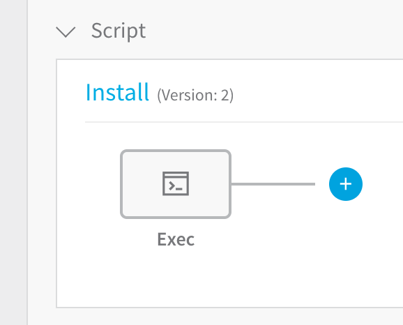

To build your **Exec** script, for example a cURL script, you can use the built-in Harness variables to refer to the Artifact Sources. For example, the built-in variable `${artifact.url}`. Simply enter `${` in the **Command** field to see the list of variables.

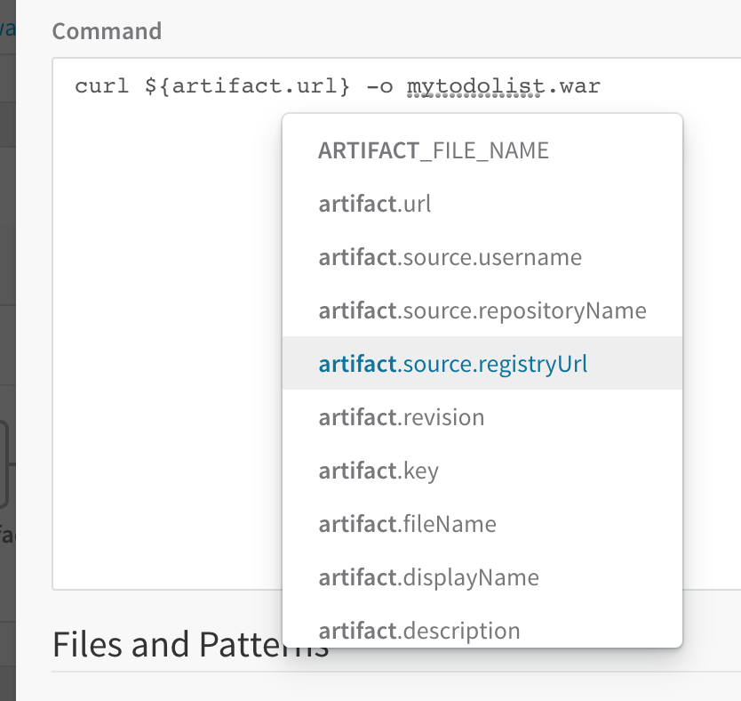

When you create a Workflow using this Service, such as a Basic Workflow, it will include an **Install** step that will execute the **Exec** script.

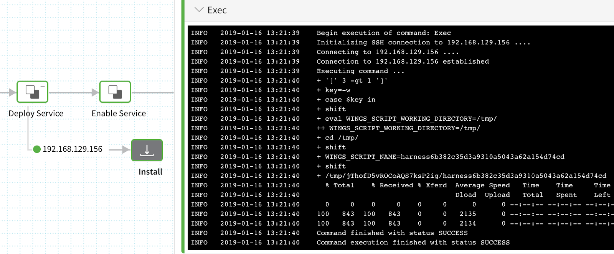

For a list of artifact-related built-in variables, see **Artifact** in the table in [Variables List](https://docs.harness.io/article/9dvxcegm90-variables#variables_list).

### Copy Artifact vs Download Artifact

The difference between the Copy Artifact and Download Artifact scripts is important to understand to ensure your deployment is successful:

* **Copy Artifact:** With Copy Artifact, the Delegate downloads the artifact (e.g. JAR file) and then copies it via SCP (secure copy) it to the target host(s). The Delegate **must** have connectivity with the Artifact Source (e.g. Nexus, Jenkins, Bamboo, etc).
* **Download Artifact:** With Download Artifact, Harness directly downloads the file onto the target host(s).
	+ **Connectivity:** The target host **must** have connectivity with the Artifact Source.
	+ **Credentials:** Since the target host performs the download and not the Delegate, the Harness AWS Cloud Provider used for the connection must use Access/Secret keys for its credentials. It cannot use the **Inherit IAM Role from Delegate** option. If you must use the **Inherit IAM Role from Delegate** option for your Connector, then use **Copy Artifact**.

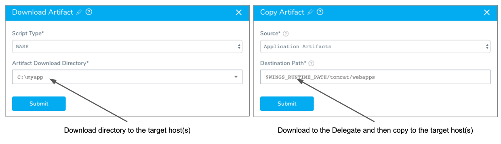

For WinRM, always use Metadata-only.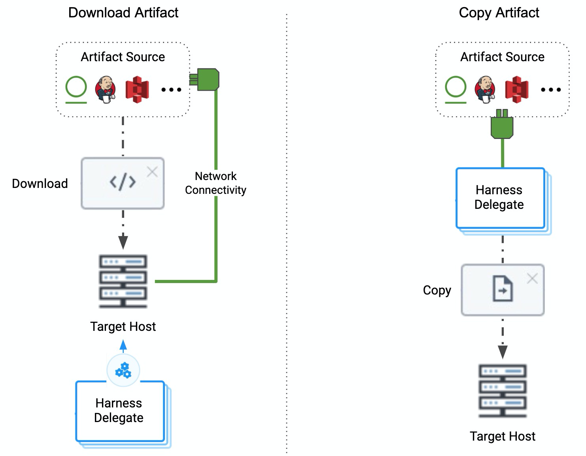

### Copy Artifact Script

The Copy Artifact command is supported for Artifact Sources that use Artifactory, Amazon S3, Jenkins, Bamboo, and Nexus. The command behaves as follows:

1. During deployment runtime, Harness uses the metadata to download the artifact to the Harness Delegate.
2. The Delegate then copies the artifact to the target host(s), such as Amazon S3.  
To ensure the success of this download, the host(s) running the Harness Delegate(s) **must** have network connectivity to the artifact server and the target deployment host(s).

For Jenkins and Bamboo to work with Copy Artifact, ensure that in the Jenkins or Bamboo artifact source settings, you enter the exact path to the *artifact* and not just a path to a folder. For example, `artifacts/target` will not work, but `artifacts/target/todolist.war` will work. For example: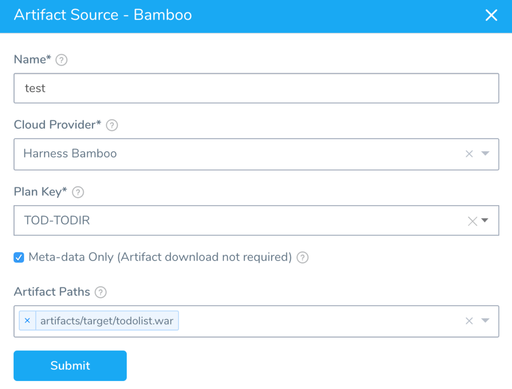

#### Adding a Copy Artifact Script

To add a Copy Artifact script in a Service, do the following:

1. Click **Add Command** and in **Command Type**, select the **Install**.

   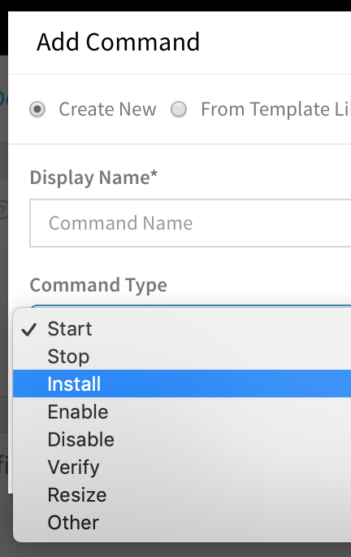

   The command is added to the Service.
   
2. Hover over the **Add** step to see the **Copy** script, and click **Copy**.

   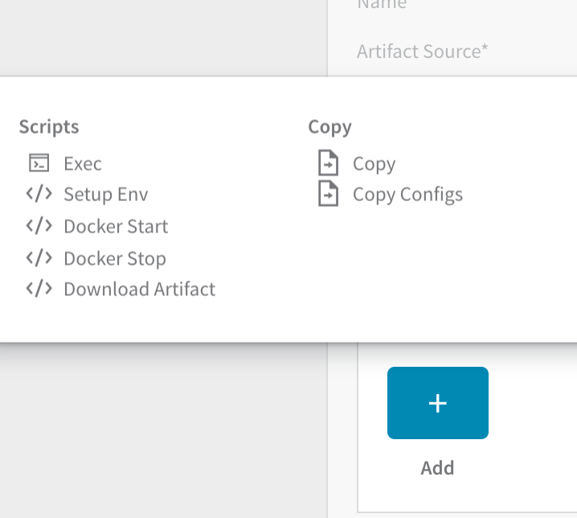

   The **Copy** script appears.

   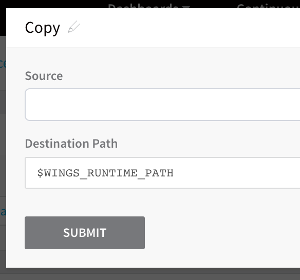

   The `$WINGS_RUNTIME_PATH` is the destination path for the artifact. The variable is a constant used at runtime. For more information, see [Constants](https://docs.harness.io/article/9dvxcegm90-variables#constants).
   
3. In **Source**, select **Application Artifacts**, and click **SUBMIT**. The **Copy** script is added to the Service.

   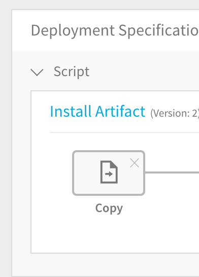

### Download Artifact Script

For SSH and WinRM Service types, the **Download Artifact** script is supported for many artifact sources, such as Amazon S3, Artifactory, Azure, and SMB and SFTP (Powershell-only) artifact sources.

For other Service types and artifact sources, add a new command and use the Exec script to download the artifact.

For SSH and WinRM Services that use artifact sources that are supported by Download Artifact, at deployment, the Harness Delegate will run the Download Artifact script on the deployment target host and download the artifact.

Here are the Download Artifact script settings:

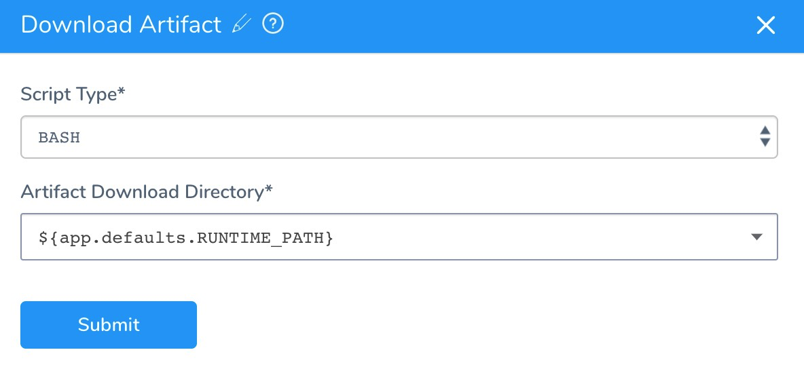

In **Artifact Download Directory**, a path using [Harness variable expressions](https://docs.harness.io/article/9dvxcegm90-variables) points to the **Application Defaults** variables.

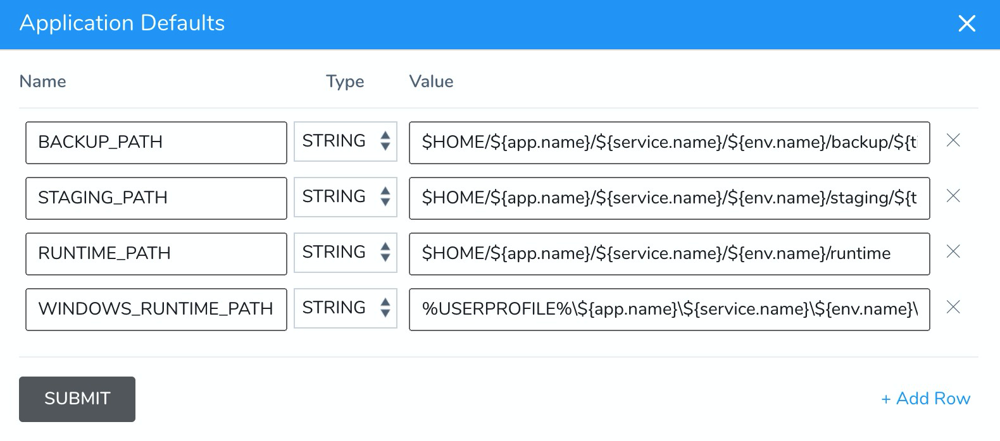

You can add an Application Defaults variable for the artifact sources that will be referenced by the Download Artifact script, and then use it wherever Download Artifact is used. For more information, see [Application Defaults Variables](https://docs.harness.io/article/9dvxcegm90-variables#application_default_variables).

You can also enter a path in **Artifact Download Directory** manually.

If the path in **Artifact Download Directory** is missing from the target host, then the script will fail.

### Copy and Download Artifact Provider Support

The following table lists the providers supported by the Copy and Download Artifact commands in a Service.

Legend:

* Y: Yes
* N: No
* N/A: Not Applicable

|  |  |  |  |
| --- | --- | --- | --- |
| **Provider** | **Repository/Package Types** | **Download Artifact****(WinRM or SSH Service types only)** | **Copy Artifact****(SSH Service type only)** |
| AWS S3 | All | Y | Y |
| Artifactory (JFrog) | Non-Docker | Y | Y |
|  | Docker | N/A | N/A |
| SMB | IIS related | Y | N/A |
| SFTP | IIS related | Y | N/A |
| Jenkins:Metadata-only | AllYou must specify an artifact in the **Artifact Paths** setting. [Jenkins and Bamboo Metadata and Artifact Paths](#jenkins_and_bamboo_metadata_and_artifact_paths) | Y | Y |
| Jenkins:Artifact is saved to Harness | All | Y | Y |
| Docker Registry | Docker | N/A | N/A |
| AWS AMI | AMI | N/A | N/A |
| AWS ECR | Docker | N/A | N/A |
| Google Cloud Storage | All | N/A | N/A |
| Google Container Registry | Docker | N/A | N/A |
| Nexus 2.x/ 3.x:Artifact is saved to Harness | Maven 2.0 | Y | Y |
|  | NPM | Y | Y |
|  | NuGet | Y | Y |
|  | Docker | N/A | N/A |
| Nexus 2.x/ 3.x:Metadata-only | Maven 2.0 | Y | Y |
|  | NPM | Y | Y |
|  | NuGet | Y | Y |
|  | Docker | N/A | N/A |
| Bamboo:Metadata-only | AllYou must specify an artifact in the **Artifact Paths** setting. See [Jenkins and Bamboo Metadata and Artifact Paths](#jenkins_and_bamboo_metadata_and_artifact_paths). | Y | Y |
| Bamboo:Artifact is saved to Harness | All | Y | Y |
| Azure Artifacts | Maven 2.0, NuGet | Y | Y |
| Custom Repository | All | N/A | N (use the Exec script to use the metadata to copy artifact to target host) |

### Jenkins and Bamboo Metadata and Artifact Paths

If you want to download the Jenkins or Bamboo artifact using the Download Artifact script, you must select an artifact path in the **Artifact Path** setting. This enables Harness to obtain the exact URLs for downloading the artifacts.

