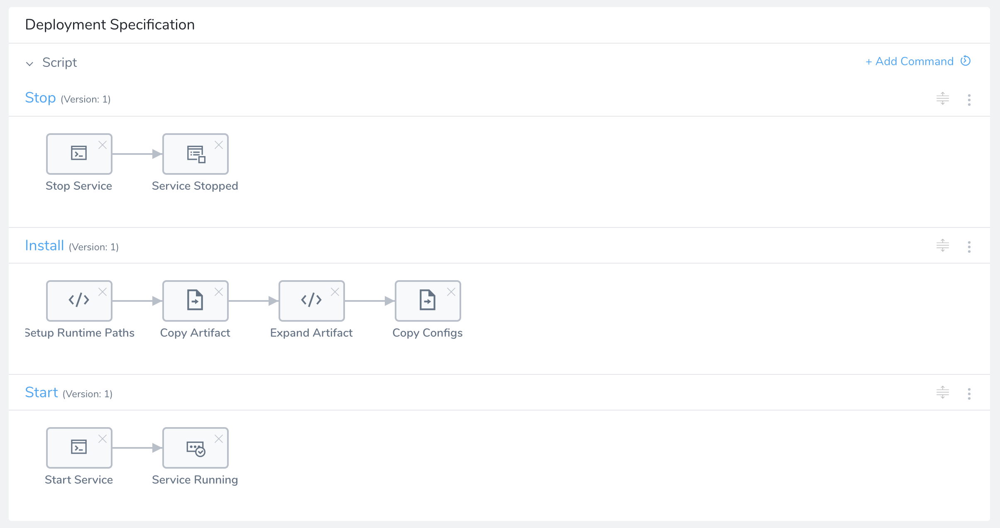
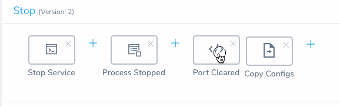
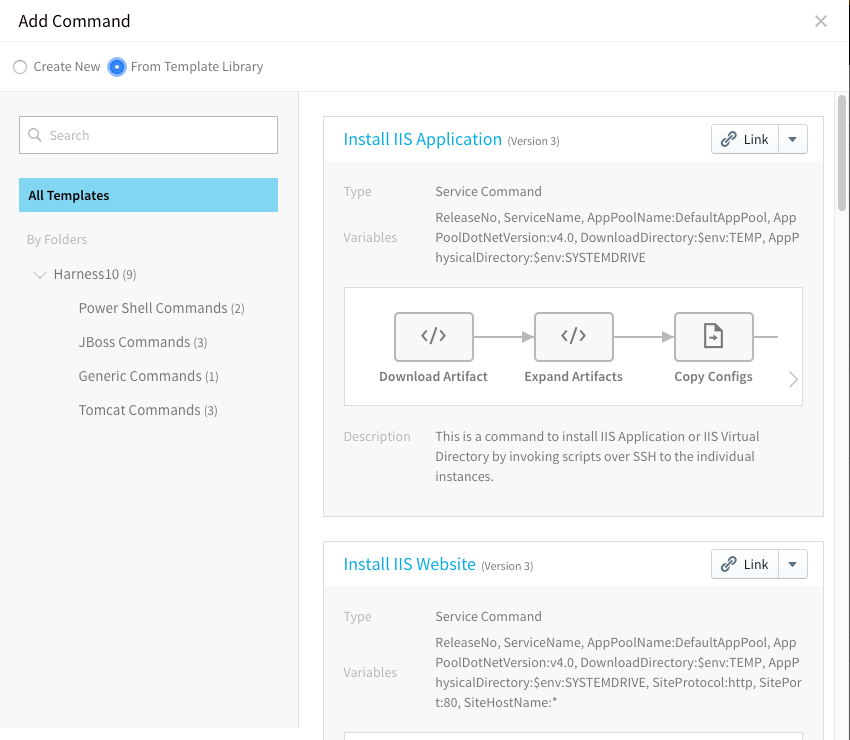
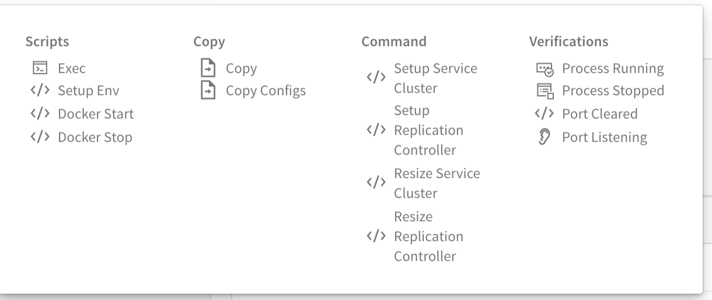
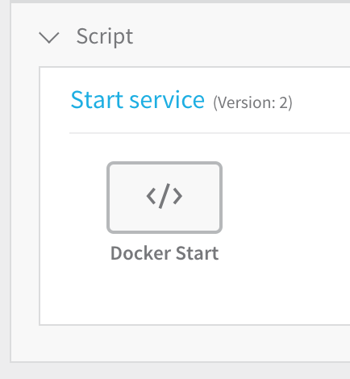
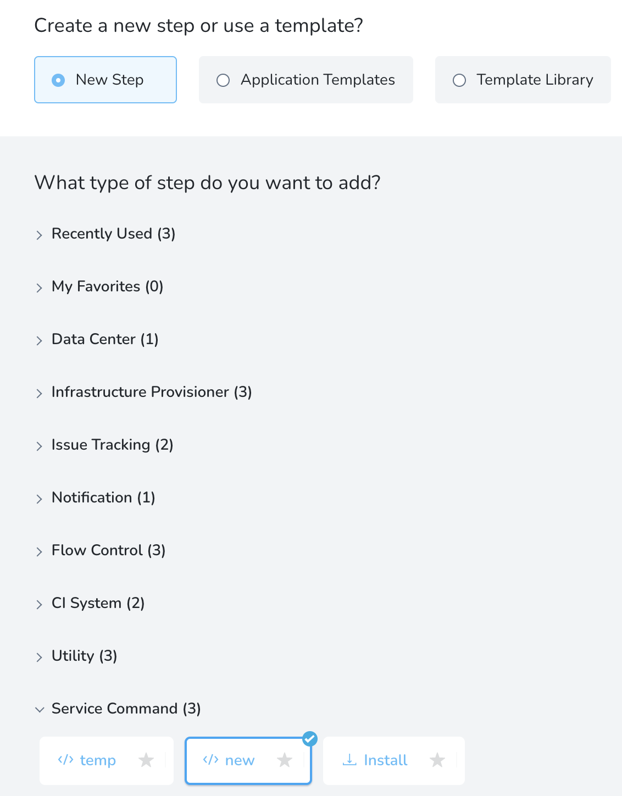
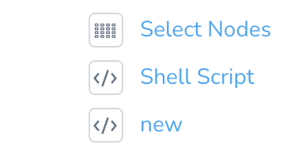
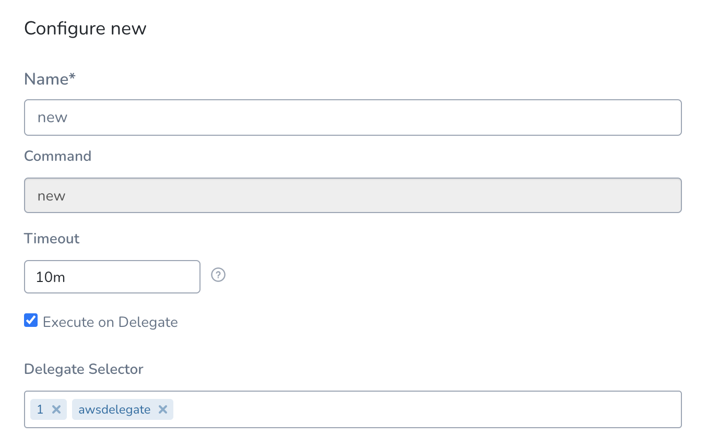

You can create and add Bash and PowerShell scripts as Services. You can use the options and templates available in Harness to use these scripts in your deployment.

### Before You Begin

* Read the [Create an Application](../applications/application-configuration.md) topic to get an overview of how Harness organizes Services.
* Read the [Add a Service](service-configuration.md) topic to understand the process to add a Service to an Application.
* Read [Configuration as Code](https://docs.harness.io/article/htvzryeqjw-configuration-as-code) to see how you can quickly configure your Harness Service using your existing YAML in Git.

### Option 1: Edit Default Commands

When you create a script-based Service, Harness automatically generates the commands needed to install and run the application in the Artifact Source on the target host(s). You can edit these default commands.

You can also add templates from the template library or add commands as shown in the following options.

#### Moving Commands

As part of the Deployment Specification steps (**Start**, **Install**, or **Stop**), you can drag and move a command in the place of another command or before or after another command. All the other commands are moved accordingly and the script is updated automatically.

### Option 2: Use Template Library

You can use the wealth of scripts available in the Template Library to rapidly develop your script. For more information, see [Use Templates](https://docs.harness.io/article/ygi6d8epse-use-templates).

1. In the **Script** section of **Deployment Specification**, click **Add Command**. The **Add Command** dialog appears.
2. Click **From Template Library**. The Template Library is displayed. Find the template you need.
3. Click **Link** or click the drop-down menu and choose **Copy**. You can link to a template or copy a template to your service. If you link to the template, when that version of the template is updated in the Template Library, your script is also updated. If you copy a template, there is no link to the Template Library. If you link to a template, you may only edit the template from the template dialog. You cannot edit the template in your service.
4. Edit the script if needed and click **SUBMIT**. The script is added to your service.Every time you edit a template, you create a new version of it. To switch versions, click the three dots ⋮ on the script title bar and choose **Manage Versions**.
5. To edit the variables used in the script, click **Variables**. The **Edit Command** dialog opens. Edit the variables and click **SUBMIT**.

### Option 3: Create a New Command

Harness provides multiple commands to manage the deployment of your application.

1. In the **Script** section of **Deployment Specification**, click **Add Command**. The **Add Command** dialog appears.
2. Click **Create New**.
3. In **Name**, enter a name for the new command that describes its function.
4. From **Command Type**, select the function of the command, such as **Start**, **Install**, **Disable**, etc.
5. Click **Submit**. The new command is added under **Script**.
6. Hover over the Add button to see the available commands.
7. Click a command from the list. The dialog for the command appears. For example, here is the dialog for the Docker Start command.  
The dialog contains a default script relating to it type. The script is prefigured for variables for common application information.
8. From Script Type, select **BASH** or **POWERSHELL**.
9. Modify the script is needed and click **SUBMIT**. The command is added to the Script section:
10. Repeat the above steps to add more commands to your script.

### Run Service Commands in a Workflow

One of the steps you can include in a Harness Workflow is a **Service Command** step. With the Service Command step, you can execute Workflow on Harness Delegate. You can use Delegate Selectors to identify which Harness Delegate to use.

This topic describes how to publish a Service Command output in a variable and use the published variable in a subsequent Workflow step.

1. In a Harness Application, open a Workflow and then click **Add Step**.
2. Select **N****ew Step** to select the Service Command.
3. Click **Submit**. The step is added.
4. Click on the step.
5. Set the **Timeout** period for your Service Command. If the command execution hangs beyond the timeout, Harness will fail the step.
6. Select **Execute on Delegate** option if you wish to execute Workflow on Harness Delegate. This option allow users to select Delegates on Service commands.If you do not select **Execute on Delegate** option then the node is selected from the Select Node. The Select Nodes step selects the target hosts from the [Infrastructure Definition](../environments/infrastructure-definitions.md) you defined. For more information, see [Select Nodes Workflow Step](https://docs.harness.io/article/9h1cqaxyp9-select-nodes-workflow-step).
7. In **Delegate Selector** enter the Selectors of the Delegates you want to use.  
  
You can use Selectors to select which Harness Delegates to use when executing the Service Command step. For more information, see [Select Delegates with Selectors](https://docs.harness.io/article/c3fvixpgsl-select-delegates-for-specific-tasks-with-selectors).
	* Harness will use Delegates matching the Selectors you select.
	* If you use one Selector, Harness will use any Delegate that has that Selector.
	* If you select two Selectors, a Delegate must have both Selectors to be selected. That Delegate might also have other Selectors, but it must have the two you selected.
	* Selectors can be used whether **Execute on Delegate** is enabled or not. The Shell Script command honors the Selector and executes the SSH connection to the specified target host via the selected Delegate.   
	An example where Selectors might be useful when **Execute on Delegate** is disabled: When you specify an IP address in **Target Host**, but you have 2 VPCs with the same subnet and duplicate IP numbers exist in both. Using Selectors, you can scope the the shell session towards the delegate in a specific VPC.
	* You can also use [Harness variable expressions](https://docs.harness.io/article/9dvxcegm90-variables). For example, if you have a Workflow variables named delegate, you can enter `$(workflow.variables.delegate)`. When you deploy the Workflow, you can provide a value for the variable that matches a Delegate Selector.
8. Click **Submit**.

