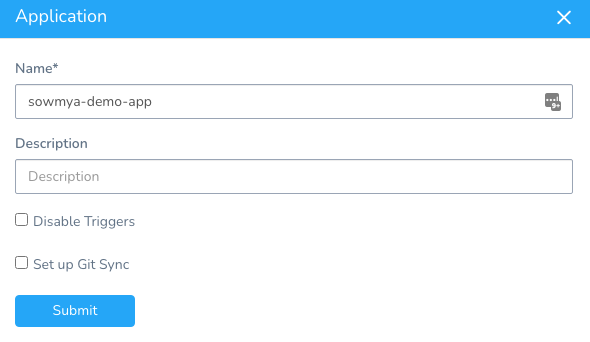
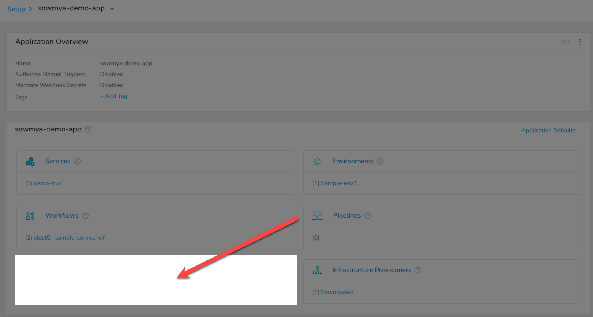
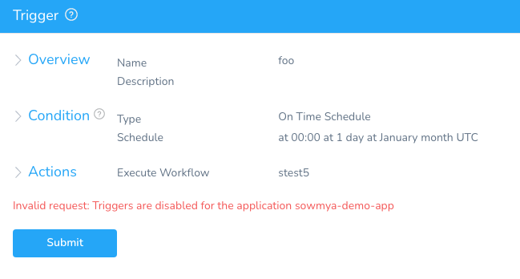
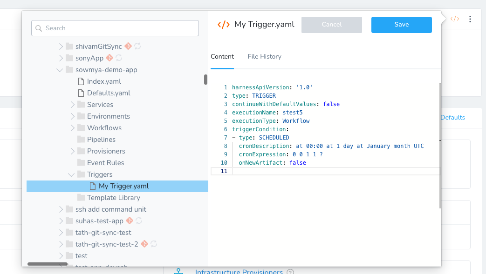
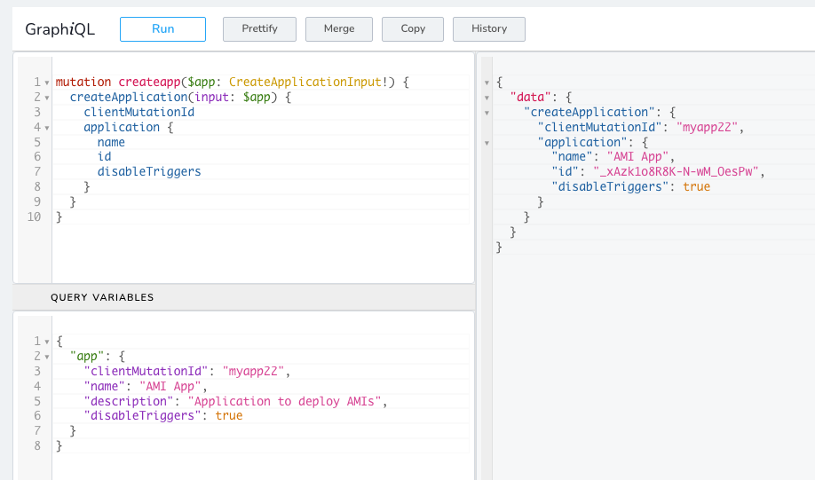
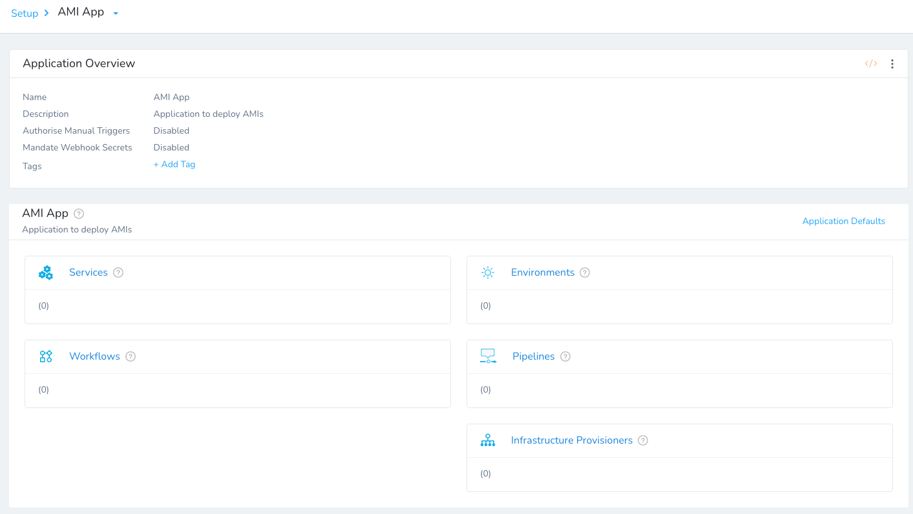

Currently, this feature is behind the feature flag `SPG_ALLOW_DISABLE_TRIGGERS`. Contact [Harness Support](mailto:support@harness.io) to enable the feature.By default, [Triggers](add-a-trigger-2.md) can be added and run on Harness Application Workflows and Pipelines. 

In some cases, you might want to disable Triggers across the entire Application to ensure that none of its Workflow or Pipelines are run.

This topic describes how to disable all Triggers for an Application.

### Disable Triggers in the Harness Manager

To disable all Triggers, you simply enable the **Disable Triggers** setting in the Application settings:

1. In your Application, click more options (⋮).
2. Select **Disable Triggers**.

   
   
3. Click **Submit**.

The Triggers section of the Application is now hidden.



If another User in your another tries to create a new Trigger before their UI is updated, they will see the error `Invalid request:` `Triggers are disabled for the application [Application Name]`.

For example:



Any Triggers can still be viewed in the Application YAML, but they cannot be run in the manager.



### Disable Triggers using Harness GraphQL API

You can use the `disableTriggers: Boolean` field of the `Application` object to enable or disable Triggers for an Application.



For example, here is the mutation and variables for a new Application that disables Triggers.

Mutation:


```
mutation createapp($app: CreateApplicationInput!) {  
  createApplication(input: $app) {  
    clientMutationId  
    application {  
      name  
      id  
      disableTriggers  
    }  
  }  
}
```
Query variables:


```
{  
  "app": {  
    "clientMutationId": "myapp22",  
    "name": "AMI App",  
    "description": "Application to deploy AMIs",  
    "disableTriggers": true  
  }  
}
```
You can see the new Application does not have Triggers enabled:

