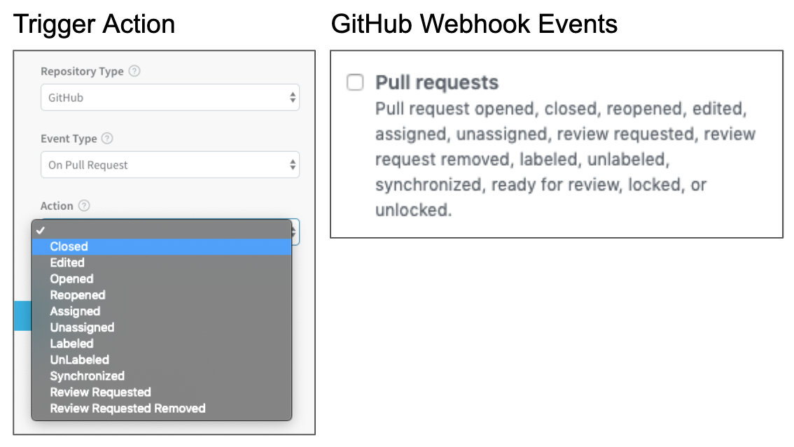
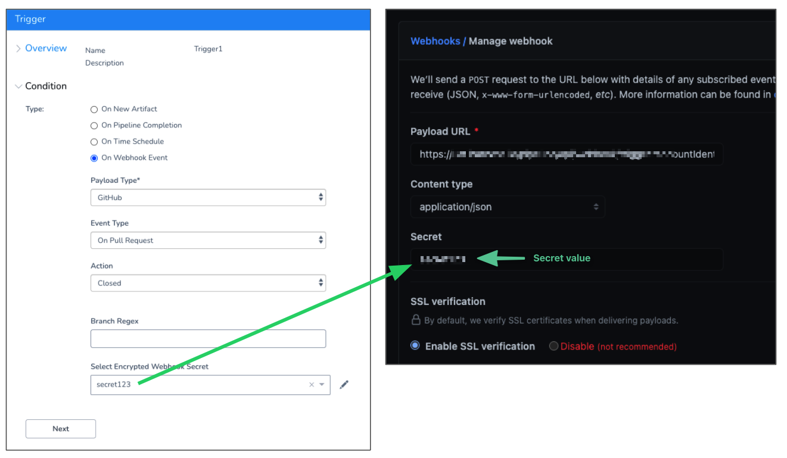
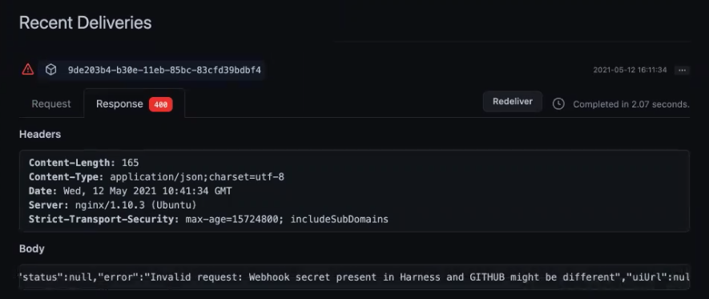
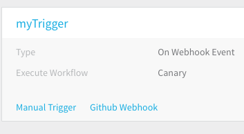
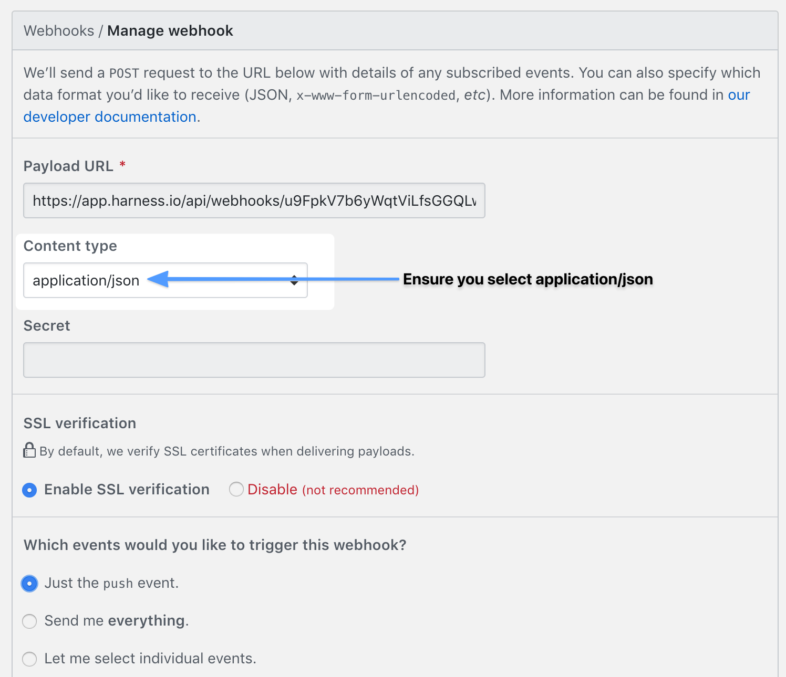
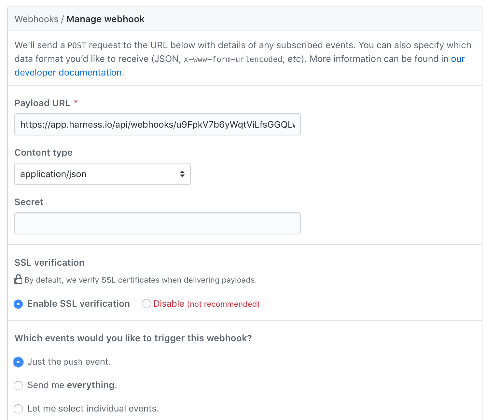
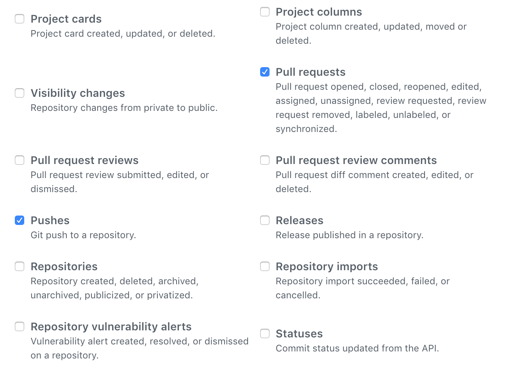

For GitHub, GitLab, and Bitbucket, you can trigger [Build Workflows](https://docs.harness.io/article/wqytbv2bfd-ci-cd-with-the-build-workflow) or a [Build and Deploy Pipeline](https://docs.harness.io/article/0tphhkfqx8-artifact-build-and-deploy-pipelines-overview) in response to a Git event using Webhooks using a Harness On Webhook Event Trigger.

For example, the first stage of the Build and Deploy Pipeline is a Build Workflow that builds the artifact from a Git repo. You can set a Harness Trigger to run once the artifact is built.

For Custom Git providers, you can trigger any type of Harness Workflow using a Harness On Webhook Event Trigger.

For GitHub, GitLab, and Bitbucket, this option is used to execute a Build Workflow or a Build Pipeline only. GitHub, GitLab, and Bitbucket Webhook-based Triggers are not intended for Workflows and Pipelines that **deploy** artifacts. They are designed for Build Workflows and Pipelines that build artifacts in response to Gt events.


## Before You Begin

* [Build Workflows](https://docs.harness.io/article/wqytbv2bfd-ci-cd-with-the-build-workflow)
* [Build and Deploy Pipeline](https://docs.harness.io/article/0tphhkfqx8-artifact-build-and-deploy-pipelines-overview)
* [Add a Service](../setup-services/service-configuration.md)
* [Workflows](../workflows/workflow-configuration.md)
* [Add Environment](../environments/environment-configuration.md)
* [Create a Pipeline](../pipelines/pipeline-configuration.md)

## Important Notes

* In the **Actions** section of the Trigger, the **Deploy only if files have changed** option is available for Workflows deploying Kubernetes or Native Helm Services only.
* Data retention for Webhook event details is 3 days.   
To see the event details, in the response of a Webhook request the `data` field contains the Id of the registered WebHook event. You can use the following API and the `eventId` to get the details of the WebHook Event:
```
curl -i -X GET \  
  'https://app.harness.io/gateway/pipeline/api/webhook/triggerProcessingDetails?accountIdentifier=<account Id>&eventId=<data Id>' \  
  -H 'x-api-key: <Harness API key>'
```

## Review: Git Webhook Triggers

You can create Harness Triggers that respond to certain Git events, and then add the Harness Trigger Git Webhook to your repo. When the specified event happens in your repo, the Harness Trigger is run.

Let's review Git Webhooks.

For GitHub, GitLab, and Bitbucket, this option is used to execute a Build Workflow or a Build Pipeline only.GitHub, GitLab, and Bitbucket Webhook-based Triggers are not intended for Workflows and Pipelines that **deploy** artifacts. They are designed for Build Workflows and Pipelines that build artifacts in response to Gt events.

For Custom Git providers, you can trigger any type of Workflow using a Harness On Webhook Event Trigger.Git Webhooks allow you to build or set up apps which subscribe to certain events in your git repo on github.com, bitbucket.org, and gitlab.com.

Each event corresponds to a certain set of actions that can happen to your organization and/or repository.

When one of those events is triggered, Git sends a HTTP POST payload to the Webhook's configured URL.

You can use a Harness Trigger **GitHub/Bitbucket/Gitlab Webhook** URL and execute a Harness deployment in response to a Git event.

The most common example: A Git event that merges code initiates the Trigger for a Harness Build and Deploy Pipeline.

The first stage of the Pipeline is a Build Workflow that builds and collects the artifact from the Artifact Source (which is linked to the Git repo). The final stage deploys the newly built artifact from the artifact source.

For details on the payloads of the different repo Webhooks, see GitHub [Event Types & Payloads](https://developer.github.com/v3/activity/events/types/), Bitbucket [Event Payloads](https://confluence.atlassian.com/bitbucket/event-payloads-740262817.html), and Gitlab [Events](https://docs.gitlab.com/ee/user/project/integrations/webhooks.html#events).

## Step 1: Add a Trigger

Typically, Triggers are set up after you have successfully deployed and tested a Workflow or Pipeline.

To add a trigger, do the following:

1. Ensure that you have a Harness Service, Environment, and Workflow set up. If you want to Trigger a Pipeline, you'll need one set up also.
2. In your Harness Application, click **Triggers**.
3. Click **Add Trigger**. The **Trigger** settings appear.
4. In **Name**, enter a name for the Trigger. This name will appear in the **Deployments** page to indicate the Trigger that initiated a deployment.
5. Click **Next**.

## Step 2: Select Repo and Event Type

A Git event that merges code initiates the Trigger for the Build and Deploy Pipeline.

The first stage of the Pipeline is a Build Workflow that builds and collects the artifact from the Artifact Source (which is linked to the Git repo).

In the Actions section, you select the Git repo provider and the event type you want to run the Trigger.

1. In **Condition**, select **On Webhook Event**.
2. In **Payload Type**, select the repository type (GitHub, Bitbucket, GitLab).
3. In **Event Type**, select the event type for the Webhook event.  
There are different options depending on the repo selected in **Payload Type**. See [Review: Payload and Event Type Matrix](#review_payload_and_event_type_matrix) below.

If you are using a repo other than GitHub, Bitbucket, or Gitlab (such as Jenkins or Bamboo), leave the **Payload Type** menu blank.

Harness will still generate a Webhook that you can use in your repo.

### Review: Payload and Event Type Matrix

The following table displays the payload and event types supported when you select the **On Webhook Event** option in a Trigger's **Condition** setting.

This option is used to execute a  [Build Workflow](https://docs.harness.io/article/wqytbv2bfd-ci-cd-with-the-build-workflow) or a  [Build Pipeline](https://docs.harness.io/article/181zspq0b6-build-and-deploy-pipelines-overview) only.For details on each event type and its actions, please consult the provider's documentation.


|  |  |
| --- | --- |
| **Payload Type** | **Event Type** |
| BitBucket | On Pull Request<br />On Repository<br />On Issue |
| GitHub | On Pull Request<br />On Push <br />On Delete <br />On Release <br />On Package |
| GitLab | On Pull Request <br />  <br /> On Push |
| Custom or no selection. <br /> This option is for repos other than the default Git providers. <br />  For example, Bamboo or Jenkins. | On Pull Request <br /> On Push |

## Option: Authenticate the Webhook

Currently, this feature is behind a Feature Flag. Contact [Harness Support](mailto:support@harness.io) to enable the feature. Feature Flags can only be removed for Harness Professional and Essentials editions. Once the feature is released to a general audience, it's available for Trial and Community Editions.  
  
See [New features added to Harness](https://changelog.harness.io/?categories=fix,improvement,new) and [Features behind Feature Flags](https://changelog.harness.io/?categories=early-access) (Early Access) for Feature Flag information.Your Git provider includes secret tokens that enable you to validate requests.

You can use a Harness secret in your Webhook secret setting. When the Git provider sends a POST request to the Harness URL in the Webhook, Harness will use the secret to validate the request.

In **Select Encrypted Webhook Secret**, create or select a Harness secret. See [Use Encrypted Text Secrets](https://docs.harness.io/article/ygyvp998mu-use-encrypted-text-secrets).

Later, when you set up the Webhook for this Trigger in your Git provider, enter the value of the Harness secret in the Webhook secret's settings. Do not enter the secret name.



If the secret value in the Webhook does not match the secret value in the Trigger, you will get a 400 response in your Git provider:



For more information on Webhook secrets, see the following Git provider docs:

* [GitHub](https://developer.github.com/webhooks/securing/)
* [GitLab](https://docs.gitlab.com/ee/user/project/integrations/webhooks.html)
* [Bitbucket](https://confluence.atlassian.com/bitbucketserver/managing-webhooks-in-bitbucket-server-938025878.html)

For details on using the Harness API to set up Trigger authentication, see [Use Trigger APIs](https://docs.harness.io/article/u21rkuzfod-use-trigger-apis).

### Authentication and Delegate Scoping

When Harness authenticates the Trigger, the Harness Delegate you have installed in your environment connects to the Secrets Manager you have set up in Harness.

If you have scoped the Delegate in anyway (such as to specific Applications), it might be too limited to retrieve the secret.

Either remove the limitation (remove all scopes) or map the **Key Management Service** task to the Delegate. See [Delegate Task Category Mapping](https://docs.harness.io/article/nzuhppobyg-map-tasks-to-delegates-and-profiles).

The **Task Category Map** feature replaces the **Command** setting in Delegate Scopes, which is deprecated and will be removed soon.

## Step 3: Select the Workflow or Pipeline to Deploy

For GitHub, GitLab, and Bitbucket, you can trigger [Build Workflows](https://docs.harness.io/article/wqytbv2bfd-ci-cd-with-the-build-workflow) or a [Build and Deploy Pipeline](https://docs.harness.io/article/0tphhkfqx8-artifact-build-and-deploy-pipelines-overview) in response to a Git event using Webhooks using a Harness On Webhook Event Trigger.

For Custom Git providers, you can trigger any type of Workflow using a Harness  Trigger.

1. In **Execution Type**, select **Workflow** or **Pipeline**.
2. In **Execute Workflow**/**Pipeline**, select the Workflow or Pipeline to deploy.

## Step 4: Provide Values for Workflow Variables

If the Workflow or Pipeline you selected to deploy uses Workflow variables, you will need to provide values for these variables.

You can also use variable expressions for these values. See [Passing Variables into Workflows from Triggers](../expressions/passing-variable-into-workflows.md).

## Option: Manual Triggers

You can manually deploy a Harness Workflow or Pipeline using a Manual Trigger. You can run a Trigger manually in the following ways:

* Using a URL provided by Harness.
* Using a curl command.
* Use a REST call to get deployment status.

See the following:

* [Get Deployment Status using REST](get-deployment-status-using-rest.md)
* [Trigger a Deployment using cURL](trigger-a-deployment-using-c-url.md)

## Step 5: Set Up the Github Webhook

Once your On Webhook Event Trigger is completed, the next step is to integrate it into your Git repo so that the Trigger is executed in response to the Git event.

1. In your Harness application, click **Triggers**.
2. In the bottom of each listed Trigger is a link for **GitHub Webhook**.

   
   
3. For the Trigger you want to use, click **GitHub Webhook**. The Trigger dialog appears.
4. Copy the Webhook and use it in GitHub to trigger the deployment.
5. Add the webhook to your Git repo.  
In GitHub and the other Git repos, when configuring the Webhook, you can choose which events you would like to receive payloads for. You can even opt-in to all current and future events.
6. In Content type, ensure you select **application/json**.

When you set up the Webhook in GitHub, modify the **Content type** to **application/json**. In **Which events would you like to trigger this webhook?**, you can select **Push events** and/or **Pull requests**.

|  |  |
| --- | --- |
| **Just the Push Event** | **Pushes and Pull Requests** |
|  |  |

Harness will examine any incoming payload to ensure that it meets the **Action** you set. You do not need to use the repo's Webhook event settings to match the **Action**. Simply use the Harness Webhook URL in the repo Webhook URL field.

## Configure As Code

To see how to configure the settings in this topic using YAML, configure the settings in the UI first, and then click the **YAML** editor button.

## Related Topics

* [Use Trigger APIs](https://docs.harness.io/article/u21rkuzfod-use-trigger-apis)
* [Passing Variables into Workflows from Triggers](../expressions/passing-variable-into-workflows.md)
* For information on using Triggers as part of Harness GitOps, see [Harness GitOps](../../harness-git-based/harness-git-ops.md).
* [Trigger Deployments When a New Artifact is Added to a Repo](trigger-a-deployment-on-new-artifact.md)
* [Schedule Deployments using Triggers](trigger-a-deployment-on-a-time-schedule.md)
* [Trigger Deployments when Pipelines Complete](trigger-a-deployment-on-pipeline-completion.md)
* [Trigger a Deployment using cURL](trigger-a-deployment-using-c-url.md)
* [Trigger a Deployment when a File Changes](trigger-a-deployment-when-a-file-changes.md)
* [Get Deployment Status using REST](get-deployment-status-using-rest.md)
* [Pause All Triggers using Deployment Freeze](freeze-triggers.md)

