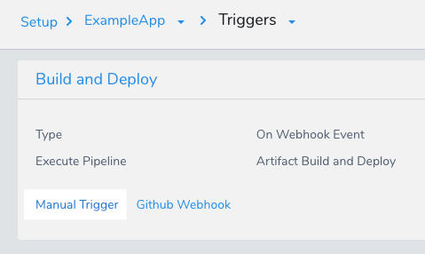
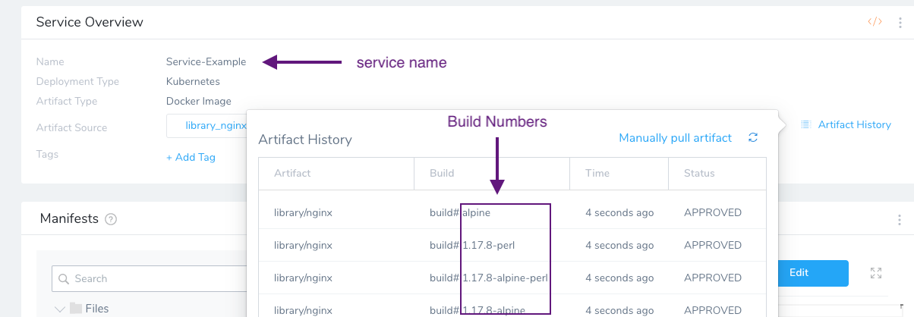
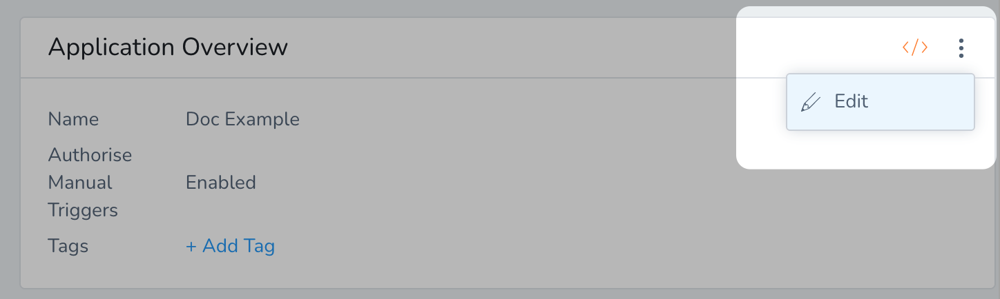

For GitHub, GitLab, and Bitbucket, you can trigger [Build Workflows](https://docs.harness.io/article/wqytbv2bfd-ci-cd-with-the-build-workflow) or a [Build and Deploy Pipeline](https://docs.harness.io/article/0tphhkfqx8-artifact-build-and-deploy-pipelines-overview) in response to a Git event using Webhooks using a Harness [On Webhook Event](trigger-a-deployment-on-git-event.md) Trigger.

For Custom Git providers, you can trigger any type of Workflow using a Harness [On Webhook Event](trigger-a-deployment-on-git-event.md) Trigger. This is described in [Trigger Deployments using Git Events](trigger-a-deployment-on-git-event.md).

Once you have created a Harness On Webhook Event Trigger, Harness creates a **Manual Trigger** for it.

You can do the following with a Manual Trigger:

* Start a deployment using a cURL command.
* Use a REST call to get deployment status. See [Get Deployment Status using REST](get-deployment-status-using-rest.md).
* Start a deployment using a URL provided by Harness. See [Trigger a Deployment using a URL](trigger-a-deployment-using-a-url.md).

This topic describes how to obtain and use the cURL command.

:::note
For GitHub, GitLab, and Bitbucket, this option is used to execute a Build Workflow or a Build Pipeline only.
:::

### Before You Begin

* [Build Workflows](https://docs.harness.io/article/wqytbv2bfd-ci-cd-with-the-build-workflow)
* [Build and Deploy Pipeline](https://docs.harness.io/article/0tphhkfqx8-artifact-build-and-deploy-pipelines-overview)
* [Add a Service](../setup-services/service-configuration.md)
* [Workflows](../workflows/workflow-configuration.md)
* [Add Environment](../environments/environment-configuration.md)
* [Create a Pipeline](../pipelines/pipeline-configuration.md)

:::note
In the **Actions** section of the Trigger, the **Deploy only if files have changed** option is available for Workflows deploying Kubernetes or Native Helm Services only.
:::

#### Data retention

Data retention for Webhook event details is 3 days.

#### Trigger Processing Details

To see the event details, in the response of a Webhook request the `data` field contains the Id of the registered WebHook event. You can use the following API and the `eventId` to get the details of the WebHook Event:

```
curl -i -X GET \  
  'https://app.harness.io/gateway/pipeline/api/webhook/triggerProcessingDetails?accountIdentifier=<account Id>&eventId=<data Id>' \  
  -H 'x-api-key: <Harness API key>'
```
If you want to access the `triggerProcessingDetails` endpoint, you should sleep your cURL command for up to 1 minute after the Trigger is fired. The result should be non-null quickly, but sleeping the cURL command ensures that you receive the data.

The process happens asynchronously: upon receiving the Trigger call, Harness registers it to a queue which is consumed every 5 seconds by one of its iterators. It is only after the event is consumed by the iterator that the data returned in `triggerProcessingDetails` is populated.

### Step 1: Create the Git Webhook Trigger

Follow the steps in [Trigger Deployments using Git Events](trigger-a-deployment-on-git-event.md).

When you are finished, the Trigger is displayed in the Triggers list, and includes a Manual Trigger option.



### Step 2: Get and Run the cURL Command

If you add an artifact source to the custom trigger payload that is different from the artifact source configured in the Trigger, it will not be honored. Harness will only honor the artifact source configured in the Trigger.Click **Manual Trigger**.

In the Manual Trigger, click **Show Curl Command**.

The curl command is displayed. It will look something like the this (private information has been replaced with **xxxxxx**):


```
curl -X POST -H 'content-type: application/json' \  
 --url https://app.harness.io/api/webhooks/xxxxxx \  
 -d '{"application":"xxxxxx","artifacts":[{"service":"micro-service","buildNumber":"micro-service_BUILD_NUMBER_PLACE_HOLDER"}]}'
```
Copy the curl command, replace the placeholders with actual values, and run it in a terminal.

To avoid a `zsh: no matches found` error, add quotes to the URL if it includes a `?`. For example:


```
curl -X POST -H 'content-type: application/json' --url 'https://app.harness.io/gateway/api/webhooks/2LdxLfQ71nZaOV4P3kluS3EBJb4TnFW7tS3KMMNM?accountId=xxxx' -d '{"application":"SgF_NViyTSKf74WkhGd0ZA"}'
```
### Review: Placeholders and Manual Settings

When you created a Trigger, if you selected values for parameters that are represented by placeholders in the cURL command, you do not need to add values for the cURL placeholders.

If you add values for the cURL placeholders, you will override manual settings in the Trigger.

This is also true for Triggers that execute templated Workflows and Pipelines. If you create a Trigger that executes a templated Workflow or Pipeline, you can select values for the templated settings in the Trigger, but you can still override them in the cURL command.

Let's look at a placeholder example:


```
curl -X POST -H 'content-type: application/json' \  
 --url https://app.harness.io/api/webhooks/xxxxxx \  
 -d '{"application":"xxxxxx","artifacts":[{"service":"micro-service","buildNumber":"micro-service_BUILD_NUMBER_PLACE_HOLDER"}]}'
```
The `artifacts` setting is optional. If you have an artifact hardcoded in your manifest and do not use a Harness Artifact Source, you will not need `artifacts`. Remove the **entire** `artifacts` section: `"artifacts":[{"service":"micro-service","buildNumber":"micro-service_BUILD_NUMBER_PLACE_HOLDER"}]}'`For `service`, enter the name of the Harness Service.

For `buildNumber`, enter the artifact build number from the Artifact History in the Service.



For example:


```
curl -X POST -H 'content-type: application/json' \  
 --url https://app.harness.io/api/webhooks/xxxxxx \  
 -d '{"application":"xxxxxx","artifacts":[{"service":"Service-Example","buildNumber":"1.17.8-perl"}]}'
```
The output will be something like this (private information has been replaced with **xxxxxx**):


```
{  
 "requestId":"-tcjMxQ_RJuDUktfl4AY0A",  
 "status":"RUNNING",  
 "error":null,  
 "uiUrl":"https://app.harness.io/#/account/xxxxxx/app/xxxxxx/pipeline-execution/-xxxxxx/workflow-execution/xxxxxx/details",  
 "apiUrl":"https://app.harness.io/gateway/api/external/v1/executions/-xxxxxx/status?accountId=xxxxxx&appId=xxxxxx"  
 }  

```
If the Service has multiple Artifact Sources, then you will have to enter the artifact you want to use.The **uiUrl** can be used directly in a browser.

See [Trigger a Deployment using a URL](trigger-a-deployment-using-a-url.md).

**apiUrl** can be used to track deployment status programmatically, such as using a REST call.

See [Get Deployment Status using REST](get-deployment-status-using-rest.md).

#### Placeholders and Workflow Variables

In the cURL command, placeholder values are added for any Workflow variables rather than the variables selected when creating the Trigger.

The placeholder values added to the cURL command override any existing values, including Workflow variables selected in the Trigger.

You can choose to ignore the placeholders and not pass values for any variables in the cURL command.

### Review: Workflow and Pipeline Links in Response

In the JSON response of a Workflow/Pipeline executed by a Webhook Trigger, the `uiSetupUrl` label displays the URL or the Workflow/Pipeline that was run.

Workflow example:


```
{  
   "requestId":"wmuS6c2pQBaiX38eOcN5fg",  
   "status":"RUNNING",  
   "error":null,  
   "uiUrl":"https://qa.harness.io/#/account/xxxxx/app/jL7IEwaKTPmfTlAVWIlHKQ/env/emINy3NOS-ONA1iTqf7wyQ/executions/wmuS6c2pQBaiX38eOcN5fg/details",  
   "uiSetupUrl":"https://qa.harness.io/#/account/xxxxx/app/jL7IEwaKTPmfTlAVWIlHKQ/workflows/X8rbeQ2oTDWkCyza3DR3Hg/details",  
   "apiUrl":"https://qa.harness.io/api/external/v1/executions/wmuS6c2pQBaiX38eOcN5fg/status?accountId=xxxxx&appId=jL7IEwaKTPmfTlAVWIlHKQ",  
   "message":null  
}
```
Pipeline example:


```
{  
   "requestId":"KmbgijMHQ76qyoRhtW-oBA",  
   "status":"RUNNING",  
   "error":null,  
   "uiUrl":"https://qa.harness.io/#/account/xxxxx/app/jL7IEwaKTPmfTlAVWIlHKQ/pipeline-execution/KmbgijMHQ76qyoRhtW-oBA/workflow-execution/undefined/details",  
   "uiSetupUrl":"https://qa.harness.io/#/account/xxxxx/app/jL7IEwaKTPmfTlAVWIlHKQ/pipelines/oMD0__89TpWAUQiru0jSpw/edit",  
   "apiUrl":"https://qa.harness.io/api/external/v1/executions/KmbgijMHQ76qyoRhtW-oBA/status?accountId=xxxxx&appId=jL7IEwaKTPmfTlAVWIlHKQ",  
   "message":null  
}
```
### Option: Enforce API Keys for Manual Triggers

Currently, this feature is behind the feature flag `WEBHOOK_TRIGGER_AUTHORIZATION`. Contact [Harness Support](mailto:support@harness.io) to enable the feature.Once you have On Webhook Event Trigger you can use a Manual Trigger to start a deployment using a cURL command provided by Harness.

By default, the cURL command does not require that you include Harness API keys. Harness provides the option to enforce the use of API keys in Manual Trigger cURL commands per Application.

By using Harness API keys in your cURL commands, you can enforce **authorization** on manual execution of your Triggers. Harness API keys let you select which Harness User Groups can run the Trigger.

#### Permissions Required

* **Account Permissions:** to enforce API keys for manual triggers, your Harness User account must belong to a User Group with the **Manage Applications** Account Permissions option enabled. See [Managing Users and Groups (RBAC)](https://docs.harness.io/article/ven0bvulsj-users-and-permissions).
* **Application Permissions:** to initiate any manual triggers (with or without using API keys), the Harness User account must belong to a User Group with the **Deployments** Permission Type and the **Execute Workflow** and/or **Execute Pipeline** Application Permissions.

#### Enforce API Keys for Manual Triggers

To enforce API keys for manual triggers, do the following:

In Harness, in **Security**, click **Access Management**.

Click **API Keys**, and then follow the steps in [API Keys](https://docs.harness.io/article/smloyragsm-api-keys) to create an API key. Or you can select an existing key.

Make sure your API key is assigned a User Group that only contains the Harness Users that you want to use this API key to run the Manual Trigger cURL command.

In the new or existing Harness Application containing your Triggers, click more options (︙) and select **Edit**.



Select **Authorize Manual Triggers**. Harness presents a warning:


> Warning: When you select "Authorize Manual Triggers" it will become mandatory to provide API keys in headers to authorize Manual Triggers invocation.

This means that every Manual Trigger cURL command now includes a placeholder for the API key (`x-api-key_placeholder`):


```
curl -X POST -H 'content-type: application/json'   
-H 'x-api-key: x-api-key_placeholder'   
--url https://app.harness.io/trigger-authorization/api/webhooks/o5w0h6H8Xmllbdp?accountId=wAwixrZwvnhuGVQOJ3sD   
-d '{"application":"T6fPlBO4TWKT-fCPXxamxA"}'
```
Replace the `x-api-key_placeholder` with the Harness API key.

That's it. Now you have authorization set up on your Manual Trigger.

Let's look at the two use cases:

* **Authorize Manual Triggers** **is disabled:** the standard Manual Trigger cURL command configuration is used. Manual Trigger cURL commands will not contain the API placeholder or require an API key. If an API key is still provided, Harness checks if the provided key is authorized to invoke the Trigger. Meaning, it checks to see if the User Group assigned to the key has the required Application Permissions (listed above). If User Group assigned to the key does not have the required Application Permissions, then the Trigger cannot be invoked and an error message appears.
* **Authorize Manual Triggers is enabled:** if the User Group assigned to the API key has the required Application Permissions (listed above), then the Trigger is invoked.

### Configure As Code

To see how to configure the settings in this topic using YAML, configure the settings in the UI first, and then click the **YAML** editor button.

### Related Topics

* [Passing Variables into Workflows from Triggers](../expressions/passing-variable-into-workflows.md)
* For information on using Triggers as part of Harness GitOps, see [Harness GitOps](../../harness-git-based/harness-git-ops.md).
* [Trigger Deployments When a New Artifact is Added to a Repo](trigger-a-deployment-on-new-artifact.md)
* [Schedule Deployments using Triggers](trigger-a-deployment-on-a-time-schedule.md)
* [Trigger Deployments when Pipelines Complete](trigger-a-deployment-on-pipeline-completion.md)
* [Get Deployment Status using REST](get-deployment-status-using-rest.md)
* [Trigger a Deployment when a File Changes](trigger-a-deployment-when-a-file-changes.md)
* [Trigger Deployments using Git Events](trigger-a-deployment-on-git-event.md)
* [Trigger a Deployment using a URL](trigger-a-deployment-using-a-url.md)
* [Pause All Triggers using Deployment Freeze](freeze-triggers.md)

