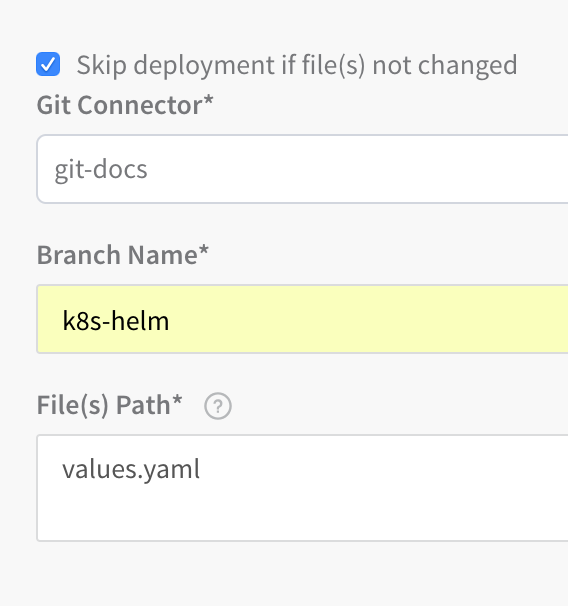

File-based repo Triggers are currently supported only for Native Helm and Helm-based Kubernetes deployments. For more information, see [Kubernetes or Helm?](https://docs.harness.io/article/i3n6qr8p5i-deployments-overview#kubernetes_or_helm).For [Build Workflows](https://docs.harness.io/article/wqytbv2bfd-ci-cd-with-the-build-workflow) or a  [Build and Deploy Pipeline](https://docs.harness.io/article/0tphhkfqx8-artifact-build-and-deploy-pipelines-overview), you can trigger deployments in response to a Git event using Webhooks. This is described in [Trigger Deployments using Git Events](trigger-a-deployment-on-git-event.md).

In some Webhook Trigger scenarios, you might set a Webhook on your repo to trigger a Workflow or Pipeline when a Push event occurs in the repo. However, you might want to initiate the Trigger only when **specific files** in the repo are changed.

For example, if you have a Trigger that executes a Helm Deployment workflow, and the Workflow uses a values.yaml file from a Git repo, you might want to initiate the Trigger only when that values.yaml file is changed.

This topic describes how to set up and run a file-based Trigger.

### Before You Begin

* [Build Workflows](https://docs.harness.io/article/wqytbv2bfd-ci-cd-with-the-build-workflow)
* [Build and Deploy Pipeline](https://docs.harness.io/article/0tphhkfqx8-artifact-build-and-deploy-pipelines-overview)
* [Add a Service](../setup-services/service-configuration.md)
* [Workflows](../workflows/workflow-configuration.md)
* [Add Environment](../environments/environment-configuration.md)
* [Create a Pipeline](../pipelines/pipeline-configuration.md)

### Limitations

In the **Actions** section of the Trigger, the **Deploy only if files have changed** option is displayed only if the following conditions are met:

* The Workflow selected deploys a Harness Kubernetes or Native Helm Service.
* The **On Push** event is selected.

For more information, see [Kubernetes or Helm?](https://docs.harness.io/article/i3n6qr8p5i-deployments-overview#kubernetes_or_helm).

### Step 1: Create the Git Webhook Trigger

Follow the steps in [Trigger Deployments using Git Events](trigger-a-deployment-on-git-event.md).

In **Condition**, select **On Webhook Event**.

In **Payload Type**, select the repository type (GitHub, Bitbucket, GitLab).

In **Event Type**, select the **On Push** Webhook event.

When you get to the **Actions** section, click **Deploy only if files have changed**.

The file-based, repo-related settings appear.

### Step 2: Select the Files to Watch

1. In **Git Connector**, select which of the SourceRepro Providers set up in Harness to use. These are the connections between Harness and your Git repos. For more information, see [Add SourceRepo Providers](https://docs.harness.io/article/ay9hlwbgwa-add-source-repo-providers).
2. In **Branch Name**, enter the name of the branch to use.
3. In **File Path**, enter the file name for the file that, when changed and Pushed, will execute this Trigger.  

   For multiple file paths, use commas or line breaks as separators. For example, `sample-manifests/values.yaml, index.yaml`.
	 
 :::note
 Wildcards are not supported for **Branch Name** or **File Path**.
 :::
	 
	 When you are done, the **Skip deployment if file(s) not changed** section will look something like this:
4. Click **Next** and then **Submit**.

Now you can add the Webhook for that Trigger to the repo you selected, as described in [Trigger Deployments using Git Events](trigger-a-deployment-on-git-event.md).

When the file you entered is changed and Pushed, the Trigger will execute.

### Review: Branch Regex Push and Pull

For merging changes, use the **On Pull Request** event type and not **On Push**. There is no source or destination in push. It has an old state and a new state. See [Event Payloads](https://support.atlassian.com/bitbucket-cloud/docs/event-payloads/) from Atlassian.

The On Pull Request has a source and a destination branch. See [Pull Request](https://confluence.atlassian.com/bitbucket/event-payloads-740262817.html#EventPayloads-entity_pullrequest) from Atlassian.

The following is a list of exactly which keys the **On Pull Request** and **On Push** events refer to:

* Github — push branch ref: `${ref.split('refs/heads/')[1]}`
* Github — pull branch ref: `${pull_request.head.ref}`
* GitLab — push branch ref: `${ref.split('refs/heads/')[1]}`
* GitLab — pull branch ref: `${object_attributes.source_branch}`
* BitBucket — push branch ref: `${push.changes[0].'new'.name}`
* BitBucket — push branch ref on-premises: `${changes[0].refId.split('refs/heads/')[1]}`
	+ You must also select event type as `Refs_changed`.
* BitBucket — pull branch ref: `${pullrequest.source.branch.name}`
* BitBucket — pull branch ref on-premises: `${pullRequest.fromRef.displayId}`

### Related Topics

* [Passing Variables into Workflows from Triggers](../expressions/passing-variable-into-workflows.md)
* For information on using Triggers as part of Harness Git integration, see [Onboard Teams Using Git](../../harness-git-based/onboard-teams-using-git-ops.md).
* [Trigger Deployments When a New Artifact is Added to a Repo](trigger-a-deployment-on-new-artifact.md)
* [Schedule Deployments using Triggers](trigger-a-deployment-on-a-time-schedule.md)
* [Trigger Deployments when Pipelines Complete](trigger-a-deployment-on-pipeline-completion.md)
* [Get Deployment Status using REST](get-deployment-status-using-rest.md)
* [Trigger a Deployment using a URL](trigger-a-deployment-using-a-url.md)
* [Trigger Deployments using Git Events](trigger-a-deployment-on-git-event.md)
* [Trigger a Deployment using cURL](trigger-a-deployment-using-c-url.md)
* [Pause All Triggers using Deployment Freeze](freeze-triggers.md)

