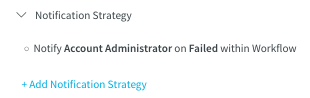
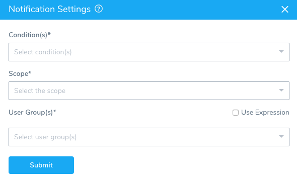
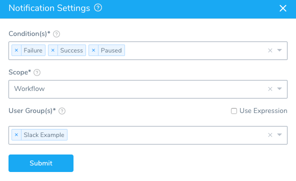
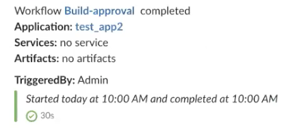
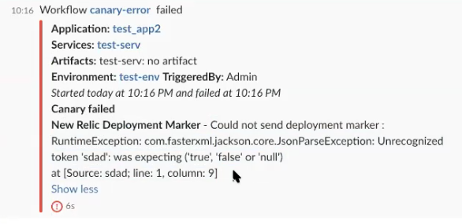
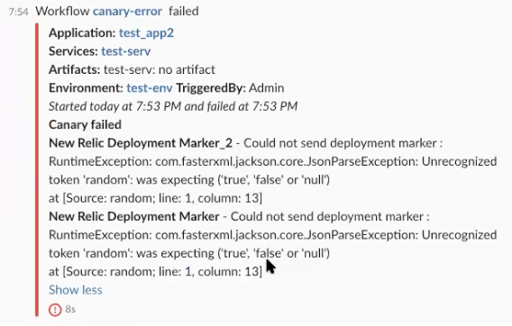

You can specify a notification strategy for a Workflow (or for a Workflow phase in a Canary or Multi-Service Workflow) that send notifications using different criteria.

## Before You Begin

* [Add a Workflow](tags-how-tos.md)

## Step: Add Notification

To add a notification strategy, do the following:

1. In a Workflow, click **Notification Strategy**. The default notification step appears.

   
	 
2. To edit the default strategy, click the pencil icon next to the strategy item.
3. To add a new notification strategy, click **Add Notification Strategy**. The **Notification Strategy** settings appear.

   

### Condition

Click the drop-down to select the condition that will execute the notification strategy (Failure, Success, Paused). Click all the conditions that apply. 

### Scope 

Select Workflow or Workflow Phase (for Canary or Multi-Service) as the scope for the condition(s) you selected.
* If you select **Workflow**, it applies to all Workflow settings, including Pre-deployment, Post-deployment, and all Workflow Phases.
* If you select **Workflow Phase**, it applies to Phases only. Pre-deployment, Post-deployment, and any settings outside of the Phases are not used.

### User Group
 
:::note
The default User Group is Account Administrator. You can change this, but it is always the default when a new Workflow is created.
:::

Select the User Group to notify when the condition is met within the scope. For information on setting up the notification channels for a User Group, see [User Notifications and Alert Settings](https://docs.harness.io/article/kf828e347t-notification-groups).

You can also enter variable expressions for Workflow variables.

You could create a Workflow variable named `StageOpsAdmin` and use that in **User Group**.

For the **Workflow** and **Workflow Phase** scopes, you can select [Workflow variables](add-workflow-variables-new-template.md) using a `${workflow.variables.varName}` expression.

:::note
You cannot use Service or Environment **Service Variables Overrides** in **User Group**. 
:::

#### Slack Notification Example

Once Slack has been configured in the Harness User Group [Notification Settings](https://docs.harness.io/article/kf828e347t-notification-groups), you can add the User Group in the Workflow **Notification Settings**:

When the Workflow deployment is completed, the Slack channel is notified:

In the event of a failure, the Slack is notified because we selected **Failure** as a **Condition**.

Notice that the error message is included in the Slack message. If multiple steps failed, they are included in the message:

