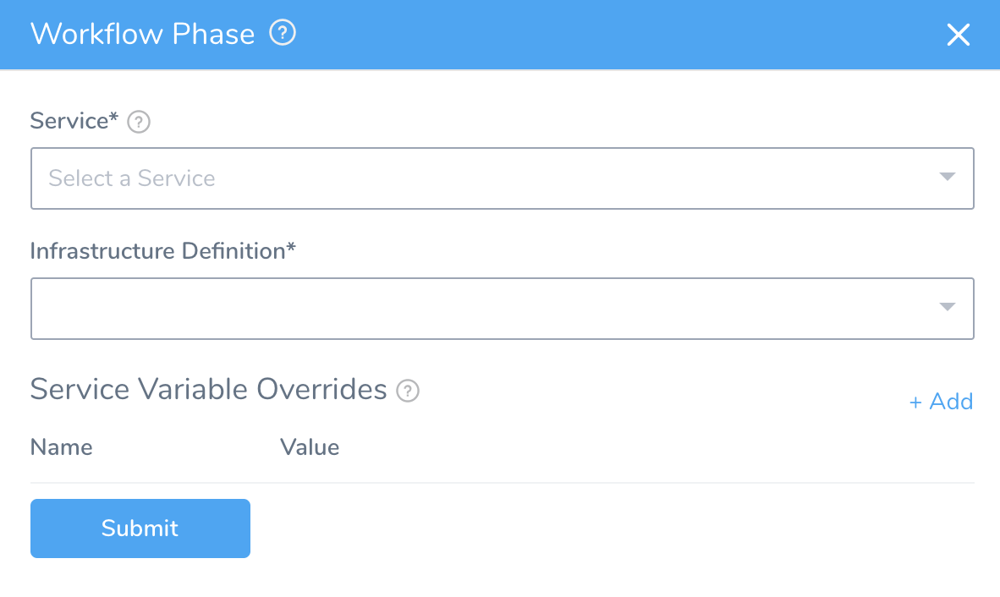

In multi-phase deployments, such as a Canary Deployment, Workflow steps are grouped into phases.

### Before You Begin

* [Workflows](workflow-configuration.md)
* [Add a Workflow](tags-how-tos.md)

### Step: Add a Phase to a Multi-phase Workflow

To add a phase to a multi-phase deployment, do the following:

1. In **Deployment Phases**, click **Add Phase**. The **Workflow Phase** settings appears.

   

2. In **Service**, select the Service to use for this phase.
3. In **Infrastructure Definition**, select the Infrastructure Definition where you want the Workflow Phase to deploy the Service.

   
   
4. If you want to override a variable that is defined in the Service you selected, in **Service Variable Overrides**, click **Add**. Enter the name of the variable to override, and the override value.

5. Click **Submit**. The new phase Workflow appears. Complete the phase Workflow as you would any other Workflow. You can also define the **Rollback Steps** for this phase.

6. When you are done, click the name of the Workflow in the breadcrumbs, to return to the Workflow overview and see the phase added to **Deployment Phases**.

### Next Steps

* [Verify Workflow](verify-workflow-new-template.md)

