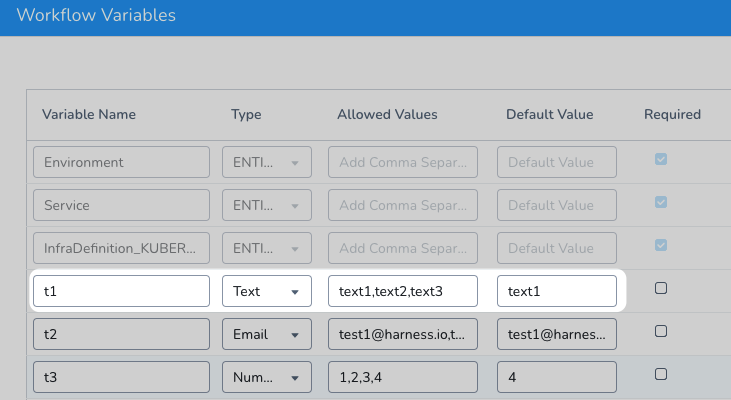
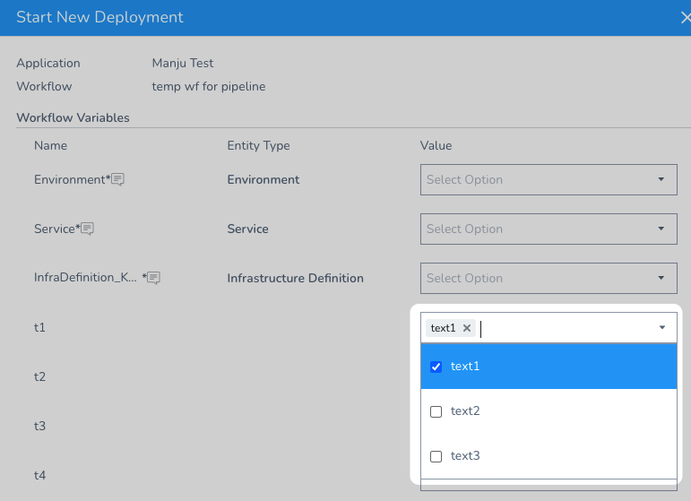

You can set variables in the **Workflow Variables** section of your Workflow, and use them in the Workflow step commands and settings.

New to Harness Variables? See [What is a Harness Variable Expression?](https://docs.harness.io/article/9dvxcegm90-variables)

You can also use them in some Harness Service settings in order to have their values replaced at the Workflow level.

You provide values for Workflow variables at deployment runtime for the Workflow or a Pipeline executing the Workflow.

### Before You Begin

* [Workflows](workflow-configuration.md)
* [What is a Harness Variable Expression?](https://docs.harness.io/article/9dvxcegm90-variables)
* [Variable Override Priority](https://docs.harness.io/article/benvea28uq-variable-override-priority)

### Review: Variable Types

There are several different types of Workflow variables you can add:

* **Entity**—If you have parameterized a Workflow Service, Environment, or Infrastructure Definition setting, it will appear in Workflow Variables with the type **ENTITY**. See [Templatize a Workflow](templatize-a-workflow-new-template.md).
* **Text**—A text-based variable.
* **Email**—Email addresses.
* **Number**—Numeric variable.

Only [Service Config Variables](../setup-services/add-service-level-config-variables.md) are added as environment variables and can be output with `env`. Workflow and other variables are not added as environment variables.

### Review: Multi-Select Values

Currently, this feature is behind a Feature Flag. Contact [Harness Support](mailto:support@harness.io) to enable the feature. Feature Flags can only be removed for Harness Professional and Essentials editions. Once the feature is released to a general audience, it's available for Trial and Community Editions.  
  
See [New features added to Harness](https://changelog.harness.io/?categories=fix,improvement,new) and [Features behind Feature Flags](https://changelog.harness.io/?categories=early-access) (Early Access) for Feature Flag information.For **Text** and **Email** types, in **Allowed Values**, you can enter multiple options by separating them by commas.

For example:

When you deploy the Workflow, the values appear as a dropdown, with the Default Value already selected:

The same options will be available when the Workflow is used in a Pipeline and Trigger.

You can also search for values by simply entering the search values in the dropdown.

When you type into the dropdown to search for Allowed Values, be sure to select one or more values and not hit Enter. If you hit Enter, your search term will be used and if it is not exactly the same as an Allowed Value, it will fail during execution.

### Review: Using a Workflow Variable across Pipeline Stages

If you use Workflow variables with the same name across a Pipeline's stages, the Workflow variables will always have the same value. The value is assigned when the first instance of the variable is evaluated at runtime.

When Harness runs a Pipeline, it will encounter the Workflow variable in the first stage where it is used. Harness will resolve that variable to a value. Each subsequent use the a Workflow variable with the same name in the same Pipeline will now also use that value.

It's important to understand how Workflow variables with the same name work in a Pipeline because you might want to change the value of the Workflow from stage to stage. But Harness will not do this because it only resolves the variable once and then uses that value for each instance of the Workflow variable with the same name.

### Step: Add Workflow Variables

To use Workflow variables, do the following:

1. In a Workflow, click the pencil icon next to **Workflow Variables**. The **Workflow Variables** dialog appears.

  

  **Workflow Variables** have the following settings.

  |  |  |
  | --- | --- |
  | **Field** | **Description** |
  | **Variable Name** | Enter a name for the variable. When the variable is referenced elsewhere in you Harness application, the variable name is used. |
  | **Type** | Select **Text**, **Email**, or **Number**.If you have parameterized a Workflow Service, Environment, or Infrastructure Definition setting, it will appear in Workflow Variables with the type **ENTITY**. |
  | **Allowed Values** | Enter a comma-separated list of values that users can select. The list will appear as a drop-down menu when the Workflow is deployed.See [Review: Multi-Select Values](add-workflow-variables-new-template.md#review-multi-select-values) above.You cannot template multi-value (drop-down) **Allowed Values** Workflow variables. |
  | **Default Value** | Enter a value for the variable. A value is not mandatory. |
  | **Required** | Select this option to enforce that a value for the variable is provided before the Workflow is executed. |
  | **Fixed** | Select this option if the value of the variable specified here must not be changed. |
  | **Description** | Provide a description of the variable that lets others know its purpose and requirements. |

2. In a Workflow step, use your variable by typing a dollar sign ($) and the first letter of your variable. The syntax for variable names is **${workflow.variables.*****name*****}**.

Harness will load matching variable names.

For example, if you created a variable named **Url**, the variable name is **${workflow.variables.Url}**.

When you deploy the Workflow, by itself or as part of a Pipeline, the variables are displayed in the Workflow execution step.

If the variables require values, you will enter the values when you add the Workflow to a Pipeline in the **Stage** settings or in the **New Deployment** setting when you deploy the Workflow individually.

### Notes

**Workflow variable expressions in Services** — You can use Workflow variable expressions in a Harness Service, but Harness does not autocomplete Workflow variables in a Service like it does in a Workflow. You will need to manually enter the Workflow variable expression in the Service: **${workflow.variables.*****name*****}**.

### Next Steps

* [Workflows](workflow-configuration.md)

