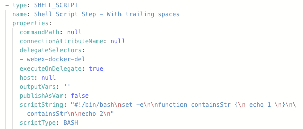
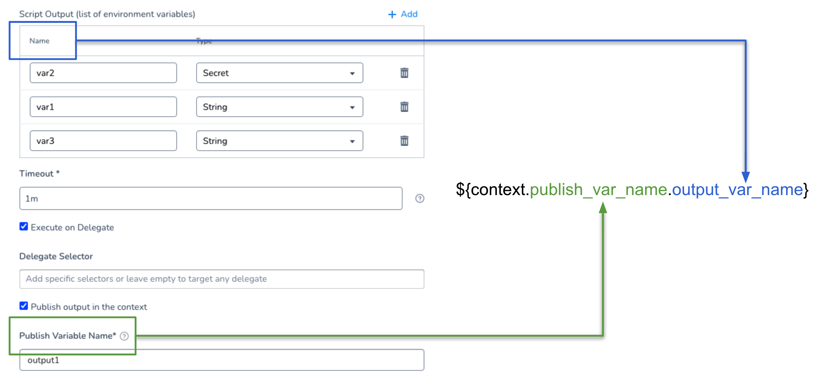
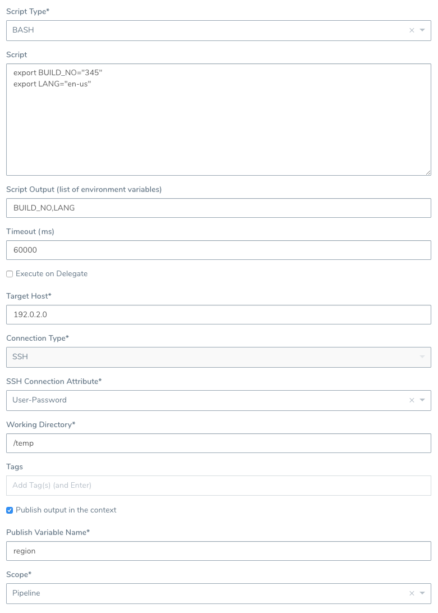
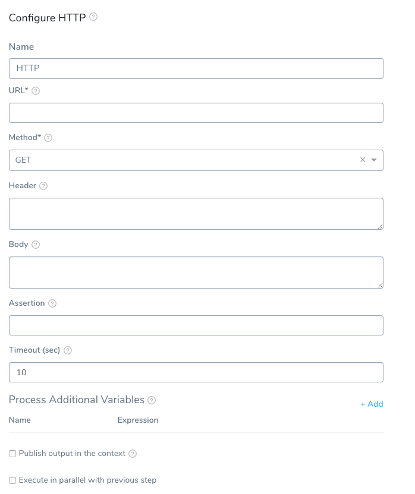
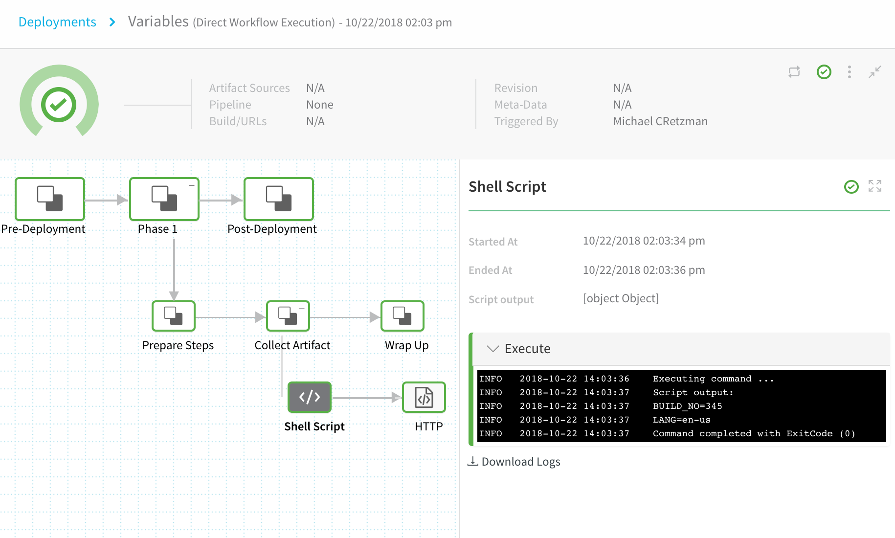
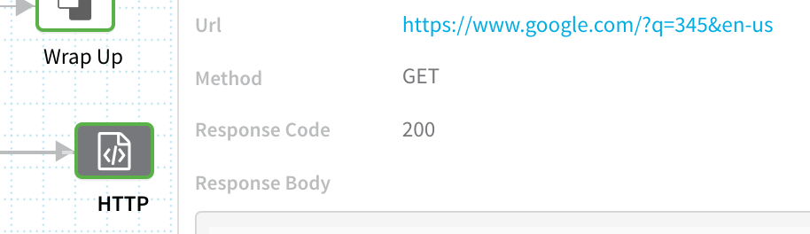
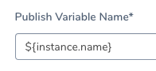
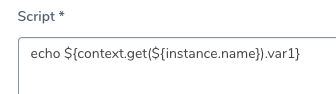

One of the steps you can include in a Harness Workflow is a **Shell Script** step.

With the Shell Script step, you can execute scripts in the shell session of the Workflow in the following ways:

* Execute bash scripts on the host running a Harness Delegate. You can use Delegate Selectors to identify which Harness Delegate to use.
* Execute bash or PowerShell scripts on a remote target host in the deployment Infrastructure Definition.

This topic provides a simple demonstration of how to create a bash script in a Shell Script step, publish its output in a variable, and use the published variable in a subsequent Workflow step.

### Before You Begin

* [Add a Workflow](workflow-configuration.md)
* [Variables and Expressions in Harness](https://docs.harness.io/article/9dvxcegm90-variables)
* [Secrets Management](https://docs.harness.io/article/au38zpufhr-secret-management) (for shell session execution credentials)

### Limitations

* Shell Script step names cannot contain dots. This is true for names entered in the Harness Manager UI or YAML via [Configure as Code](https://docs.harness.io/article/r5vya3dlt0-edit-the-code-in-harness) or [Git Sync](https://docs.harness.io/article/6mr74fm55h-harness-application-level-sync).
* If you add a trailing space at the end of any line on your script, Harness YAML transforms that into a single-line value with all control characters visible. For example, this script has a trailing space:
  
  

Here is what the resulting YAML looks like:



Remove any trailing spaces from your script to avoid this limitation. Here's what the YAML should look like when there are no trailing spaces:


### Review: Shell Script Step Overview

With the Shell Script command, you can execute scripts in the shell session of the Workflow in the following ways:

* Execute bash scripts on the host running a Harness Delegate. You can use Delegate Selectors to identify which Harness Delegate to use.
* Execute bash or PowerShell scripts on a remote target host in the deployment Infrastructure Definition.

You can run PowerShell scripts on a Harness Delegate, even though the Delegate must be run on Linux. Linux supports PowerShell using  [PowerShell core](https://docs.microsoft.com/en-us/powershell/scripting/install/installing-powershell-core-on-windows?view=powershell-7). You must install PowerShell on the Delegate using a Delegate Profile. See [PowerShell](https://docs.harness.io/article/nxhlbmbgkj-common-delegate-profile-scripts#power_shell) in Common Profile Scripts.

When executing a script, you can also **dynamically capture** the execution output from the script, providing runtime variables based on the script execution context, and export those to another step in the same workflow or another workflow in the same pipeline.

For example, you could use the Shell Script step to capture instance IDs in the deployment environment and then pass those IDs downstream to future workflow steps or phases, or even to other workflows executed in the same pipeline.

If you do not publish the output variables, you can still identify which ones you want to be displayed in the deployment details and logs.The Shell Script step uses Bash and PowerShell. This might cause an issue if your target operating system uses a different shell. For example, bash uses printenv while KornShell (ksh) has setenv. For other shells, like ksh, create command aliases.

#### Shell Script Steps and Failures

A failed Shell Script step does not prevent a Workflow deployment from succeeding.

The Shell Script step succeeds or fails based on the exit value of the script. A failed command in a script does not fail the script, unless you call `set -e` at the top.

#### What Information is Available to Capture?

Any information in the particular shell session of the workflow can be set, captured and exported using one or more Shell Script steps in that workflow. In addition, you can set and capture information available using the built-in Harness variables. For more information, see [Variables and Expressions in Harness](https://docs.harness.io/article/9dvxcegm90-variables).

A good example of information you can capture and export is the Harness variable `${instance.name}`, which gives you the name of the target host on which this script is executed at runtime.Capturing and exporting script output in the Shell Script step can be very powerful. For example, a Harness trigger could pass in a variable to a workflow (like a Git commitID), the Shell Step could use that value and info from its session in a complex function, and then export the output down the pipeline for further evaluation.

### Step 1: Add Your Script

When the script in the Shell Script command is run, Harness executes the script on the target host's operating system. Consequently, the behavior of the script depends on that host's system settings.

For this reason, you might wish to begin your script with a shebang line that identifies the shell language, such as `#!/bin/sh` (shell), `#!/bin/bash` (bash), or `#!/bin/dash` (dash). For more information, see the [Bash manual](https://www.gnu.org/software/bash/manual/html_node/index.html#SEC_Contents) from the GNU project.

To capture the shell script output in a variable, do the following:

1. In a Harness application, open a workflow. For this example, we will use a **Build** workflow.
2. In a workflow section, click **Add Command**. The **Add Command** dialog opens.
3. In **Add Command**, in **Others**, click **Shell Script**. The **Shell Script** settings appear.
4. In **Name**, enter a name for the step.

Shell Script step names cannot contain a dot. This is true for names entered in the Harness Manager UI or YAML via Configure as Code or Git Sync.

1. In **Script Type**, select **BASH** or **POWERSHELL**. In this example, we will use **BASH**.
2. In **Script**, enter a bash or PowerShell script. In this example, we will use a script that includes an export. For example, export the variable names `BUILD_NO`and `LANG`:  

```
export BUILD_NO="345"  
export LANG="en-us" 
```
You do not need to export the variables to use them with **Script Output** and **Publish output in the context**. You can simply declare them, like `BUILD_NO="345"`.For PowerShell, you could set an environment variable using $Env:  

```
$Env:BUILD_NO="345"
```
  
You must use quotes around the value because environment variables are Strings.

If you use Harness variable expressions in comments in your script, Harness will still attempt to evaluate and render the variable expressions. Do not use variable expressions that Harness cannot evaluate.

### Step 2: Specify Output Variables

In **Script Output**, enter the list of variables you want to use.

In **Name**, enter the name of the variables. In our example, we would enter **BUILD\_NO,LANG**.

In **Type**, you can select **String** or **Secret**.

Select **Secret** if you want to mask the output variable value in the deployment logs. The output variable value is masked in the logs using asterisks (\*\*\*\*).

The output variable value is masked in the log for the Shell Script step where you created the output variable, and in any step where you reference the output variable (`${context.publish_var_name.output_var_name}`).

### Step 3: Specify Where to Run the Script

If you wish to execute the script on the host running the Harness Delegate, enable **Execute on Delegate**.

Often, you will want to execute the script on a target host. If so, ensure **Execute on Delegate** is disabled.

If the Shell Script is executed on a target host (**Execute on Delegate** is disabled), then the Delegate that can reach the target host is used.

**For Kubernetes Workflows:** If the Shell Script is executed on the Delegate (**Execute on Delegate** is enabled), then Harness checks to see if `kubectl` is being used. If `kubectl` is being used, Harness checks that the Delegate can reach the Kubernetes cluster. If `kubectl` is not being used, any Delegate is used for the script.

In **Target Host**, enter the IP address or hostname of the remote host where you want to execute the script. The target host must be in the **Infrastructure Definition** selected when you created the workflow, and the Harness Delegate must have network access to the target host. You can also enter the variable `${instance.name}` and the script will execute on whichever target host is used during deployment.

#### Include Infrastructure Selectors

If your Workflow Infrastructure Definition's Cloud Provider uses a Delegate Selector, you can select this option so that its selected Delegate(s) are also used for this step.

If you have selected Delegates in the Shell Script **Delegate Selector** setting and enabled **Include Infrastructure Selectors**, then Harness will use the Delegates selected in both the Cloud Provider and Shell Script step.

See [Select Delegates with Selectors](https://docs.harness.io/article/c3fvixpgsl-select-delegates-for-specific-tasks-with-selectors).

### Step 4: Provide Execution Credentials

If you selected **BASH** in **Script Type**, **Connection Type** will contain **SSH**. If you selected **POWERSHELL** in **Script Type**, **Connection Type** will contain **WINRM**.

In **SSH Connection Attribute** (or **WinRM Connection Attribute**), select the execution credentials to use for the shell session. For information on setting up execution credentials, see [Add SSH Keys](https://docs.harness.io/article/gsp4s7abgc-add-ssh-keys) and [Add WinRM Connection Credentials](https://docs.harness.io/article/9fqa1vgar7-add-win-rm-connection-credentials).

**Template the SSH Connection Attribute** — Click the **[T]** button to template the **SSH Connection Attribute**. This will create a Workflow variable for the SSH Connection Attribute. When you deploy, you will provide a value for the variable. This enables you to select the SSH Connection Attribute at deployment runtime.### Step 5: Specify Working Directory on Remote Host

In **Working Directory**, specify the full folder path where the script is executed on the remote host, for example **/tmp** or **/home/ubuntu** for Linux or **%TEMP%** for Windows.

This Working Directory is assumed to exist. Harness won’t create the directory as part of this Shell Script step's execution.  
  
If **Working Directory** is empty, Harness uses the Application Defaults setting for `RUNTIME_PATH` or `WINDOWS_RUNTIME_PATH`. If this Application Defaults setting is not present then workflow will fail.   
  
See [Create Default Application Directories and Variables](../applications/set-default-application-directories-as-variables.md).

### Option 1: Select the Harness Delegate to Use

If your Workflow Infrastructure Definition's Cloud Provider uses a Delegate Selector (supported in Kubernetes Cluster and AWS Cloud Providers), then the Workflow uses the selected Delegate for all of its steps.

In some cases, you might want this Workflow step to use a specific Delegate. If so, do the following:

In **Delegate Selectors**, select the Selector for the Delegate(s) you want to use. You add Selectors to Delegates in order to ensure that they are used to execute the command. For more information, see [Select Delegates for Specific Tasks with Selectors](https://docs.harness.io/article/c3fvixpgsl-select-delegates-for-specific-tasks-with-selectors).

Selectors can be used whether **Execute on Delegate** is enabled or not. The Shell Script command honors the Selector and executes the SSH connection to the specified target host via the selected Delegate.

An example where Selectors might be useful when **Execute on Delegate** is disabled: When you specify an IP address in **Target Host**, but you have 2 VPCs with the same subnet and duplicate IP numbers exist in both. Using Selectors, you can scope the the shell session towards the delegate in a specific VPC.

Harness will use Delegates matching the Selectors you select.

If you use one Selector, Harness will use any Delegate that has that Selector.

If you select two Selectors, a Delegate must have both Selectors to be selected. That Delegate might also have other Selectors, but it must have the two you selected.

You can use expressions for Harness built-in variables or Account Default variables in **Delegate Selectors**. When the variable expression is resolved at deployment runtime, it must match an existing Delegate Selector.  
  
For example, if you have a Delegate Selector **prod** and the Workflow is using an Environment also named **prod**, the Delegate Selector can be `${env.name}`. This is very useful when you match Delegate Selectors to Application component names, such as Environments, Services, etc. It is also a way to template the Shell Script step.

### Step 6: Publish Output Variables

An error can occur if you are publishing output via the **Publish Variable Name** setting and your Shell Script step exits early from its script. See [Troubleshooting](#troubleshooting) below.To export the output variable(s) you entered in **Script Output** earlier, enable **Publish** **output in the context**. If you do not enable this, the variables you entered in **Script Output** will still be displayed in the deployment details and logs for the workflow.

In **Publish** **Variable Name**, enter a unique parent name for all of the output variables. You will use this name to reference the variable elsewhere.

The reference follows the format: `${context.publish_var_name.output_var_name}`.



For example, if the **Publish** **Variable Name** is **region**, you would reference **BUILD\_NO** with `${context.region.BUILD_NO}` or `${region.BUILD_NO}`.

In **Scope**, select **Pipeline**, **Workflow**, or **Phase**. The output variables are available within the scope you set here.

The scope you select is useful for preventing variable name conflicts. You might use a workflow with published variables in multiple pipelines, so scoping the variable to **Workflow** will prevent conflicts with other workflows in the pipeline.

Here is an example of a complete Shell Script command:

 

Click **SUBMIT**. The Shell Script is added to your workflow.

Next, use the output variables you defined in another command in your phase, workflow, or pipeline, as described below.

### Step 7: Use Published Output Variables

The following procedure demonstrates how to use the output variables you captured and published in the Shell Script command above.

Remember that where you can reference your published output variables depends on the scope you set in **Scope** in the **Shell Script** command.

To use published output variables, do the following:

In your Harness workflow, add a new command. For this example, we will use a **HTTP** command.

Click **Add Command**. In the **Add Step** dialog, click **HTTP**. The **HTTP** command dialog opens.

 

In **URL**, enter a URL that references the **Publish Variable Name** `region` and **Script** **Output** variable names `BUILD_NO` and `LANG` you published in the Shell Script command. For example, here is a search using the variables:

`https://www.google.com/?q=${context.region.BUILD_NO}&${context.region.LANG}`

Note the use of `context` is optional.

Fill out the rest of the **HTTP** dialog and click **SUBMIT**.

When you deploy your workflow, you will see both the Shell Script and HTTP steps using the output variables.

 

In the log for the **Shell Script** step, you can see the output variables:


```
INFO   2018-10-22 14:03:36    Executing command ...  
INFO   2018-10-22 14:03:37    Script output:   
INFO   2018-10-22 14:03:37    **BUILD\_NO=345**  
INFO   2018-10-22 14:03:37    **LANG=en-us**  
INFO   2018-10-22 14:03:37    Command completed with ExitCode (0)
```
In the log for the **HTTP** step, you see that the published variables that were used to create this URL

`https://www.google.com/?q=${context.region.BUILD_NO}&${context.region.LANG}`

Are now substituted with the output variable values to form the final URL

`https://www.google.com/?q=345&en-us`

 

### Option 2: Harness Expressions in Publish Variable Name

The **Publish Variable Name** setting is used to a unique parent name for all of the output variables.

In some cases, you might want to use one of Harness built-in expressions in **Publish Variable Name**. For example, `${instance.name}`:

 

When you reference the output variable later in your Workflow, you need to nest it in a `${context.get()}` method. For example, `${context.get(${instance.name}).var1}`:

 

### Notes

#### Reserved Keywords

The word `var` is a reserved word for Output and Publish Variable names in the Shell Script step.

If you must use `var`, you can use single quotes and `get()` when referencing the published output variable.

Instead of using `${test.var}` use `${test.get('var')}`.

#### Reserved Words for Export Variable Names

The following words cannot be used for names in **Publish Variable Name:**

* arm
* ami
* aws
* host
* setupSweepingOutputAppService
* terragrunt
* terraform
* shellScriptProvisioner
* deploymentInstanceData
* setupSweepingOutputEcs
* deploySweepingOutputEcs
* runTaskDeploySweepingOutputEcs
* setupSweepingOutputAmi
* setupSweepingOutputAmiAlb
* ecsAllPhaseRollbackDone
* Azure VMSS all phase rollback
* k8s
* pcfDeploySweepingOutput
* CloudFormationCompletionFlag
* terraformPlan
* terraformApply
* terraformDestroy
* Elastigroup all phase rollback
* setupSweepingOutputSpotinst
* setupSweepingOutputSpotinstAlb

#### Stopping Scripts After Failures

The Shell Script command will continue to process through the script even if a script step fails. To prevent this, you can simply include instructions to stop on failure in your script. For example:

* `set -e` - Exit immediately when a command fails.
* `set -o pipefail` - Sets the exit code of a pipeline to that of the rightmost command to exit with a non-zero status, or to a zero status if all commands of the pipeline exit successfully.
* `set -u` - Treat unset variables as an error and exit immediately.

For more information, see this article: [Writing Robust Bash Shell Scripts](https://www.davidpashley.com/articles/writing-robust-shell-scripts/).

#### Using Secrets in Scripts

You can use Harness secrets in your Shell Script steps.

See [Use Encrypted Text Secrets](https://docs.harness.io/article/ygyvp998mu-use-encrypted-text-secrets).

Basically, you use `${secrets.getValue("secret_name")}` to refer to the secret.

You must pay attention to the **Usage Scope** of the secret to ensure it is available where you need it. See **Review: Secret Scope** in the same topic.

### Troubleshooting

This section covers common problems experienced when using the Shell Script command.

#### Published Variables Not Available

This error happens when you are publishing output via the **Publish Variable Name** setting and your Shell Script step exits early from its script.

There are many errors that can result from this situation. For example, you might see an error such as:


```
FileNotFoundException inside shell script execution task
```
If you exit from the script (`exit 0`), values for the context cannot be read.

Instead, if you publish output variables in your Shell Script command, structure your script with `if...else` blocks to ensure it always runs to the end of the script.

### Shell Scripts and Security

Harness assumes that you trust your Harness users to add safe scripts to your Shell Script steps.

Please ensure that users adding scripts, as well as executing deployments that run the scripts, are trusted.

