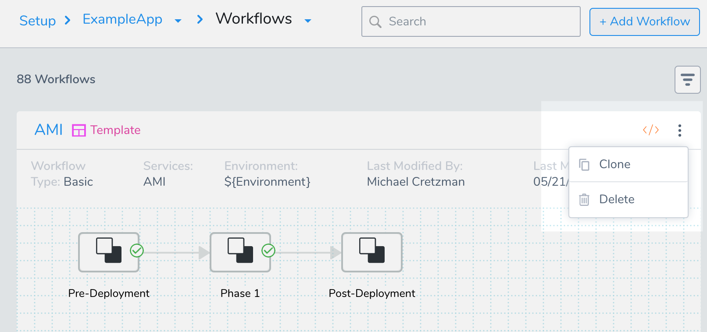
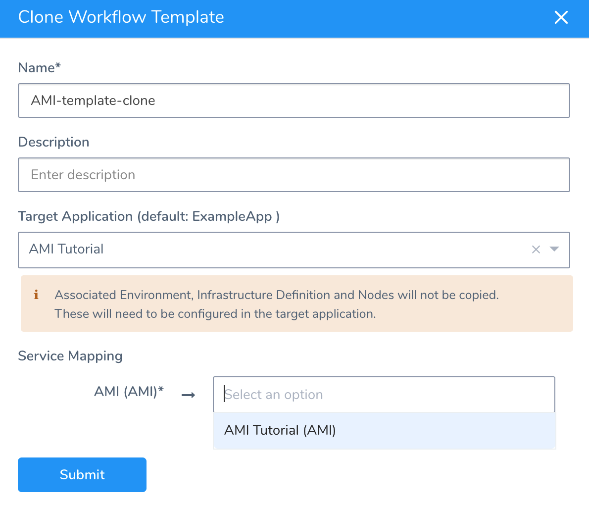

You can use a Workflow as a template for future Workflows by cloning the Workflow. When you clone a Workflow, you can select what application to clone the Workflow into. Cloning a Workflow can increase Workflow development rapidly, and ensure consistency in Workflows across applications.

### Before You Begin

* [Add a Workflow](tags-how-tos.md)

### Limitations

* [Harness Tags](https://docs.harness.io/article/mzcpqs3hrl-manage-tags) are not copied when you clone a Workflow.

### Step: Clone a Workflow

To clone a Workflow, do the following:

1. In the **Workflows** page, or in the page for an individual Workflow, click the More Options ⋮ menu.

   
   
2. Click **Clone**. The **Clone Workflow** dialog appears.
3. Give the Workflow a new name and description.
4. In **Target Application**, select the Application where you want the Workflow cloned. If you do not select an Application, the Workflow is cloned into its current Application.

   
   
   The Environment, Infrastructure Definition, and nodes used by the Workflow are not cloned into the target Application. You will need to set these up in the target Application.
   
5. In **Service Mapping**, select the Service in the target Application to use with the cloned Workflow.

   
   
6. Click **Submit**.
7. Navigate to the target Application and click the Workflow. It will have the **-clone** suffix.
8. Add the Environment, Service Infrastructure (or Infrastructure Definition), and nodes needed for the Workflow.

