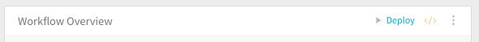
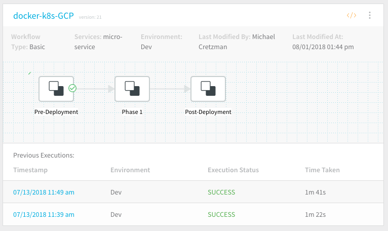

Typically, deployments are performed in [Pipelines](../pipelines/pipeline-configuration.md), which are collections of one or more Workflows, but you can also deploy individual Workflow.

In this topic:

* [Before You Begin](#before_you_begin)
* [Step: Deploy a Workflow](#deploy_a_workflow)
* [Next Steps](#next_steps)

### Before You Begin

* [Add a Workflow](tags-how-tos.md)

### Step: Deploy a Workflow

You can deploy individual Workflows using the **Deploy** button within each Workflow, as follows:

1. In a Workflow, click the **Deploy** button.
2. Provide values for any required variables. These are Workflow variables created in the **Workflow Variables** section of the Workflow.
3. Complete the **Start New Deployment** dialog and click **SUBMIT**. The Workflow is run according to the Workflow steps.
4. After a Workflow is deployed, its deployment information is available on the **Workflows** page.
5. Click a **Timestamp** for a Workflow to view a deployment.

For information about using Triggers to deploy Workflows, see [Triggers](../triggers/add-a-trigger-2.md) and [Triggers and Queued Workflows](../triggers/add-a-trigger-2.md#triggers-and-queued-workflows).

#### Abort or Rollback a Running Deployment

If you deploy a Workflow and choose the **Abort** option during the running deployment, the **Rollback Steps** for the Workflow are not executed. Abort stops the deployment execution without rollback or cleanup. To execute the **Rollback Steps**, click the **Rollback** button.

|  |  |
| --- | --- |
| **Abort Button** | **Rollback Button** |
|  |  |

#### Rollback of a Completed Deployment

With certain combinations of deployment type and platform, you have the option to roll back the most recent *successful* deployment to your Production Environment. For details, see [Post-Deployment Rollback](post-deployment-rollback.md).

### Next Steps

* [Clone a Workflow](clone-a-workflow.md)

