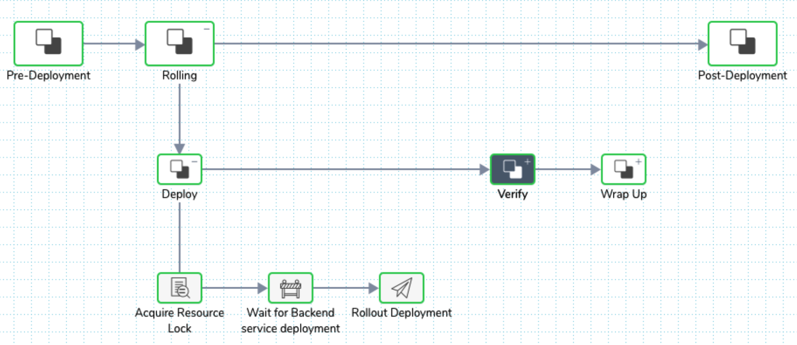
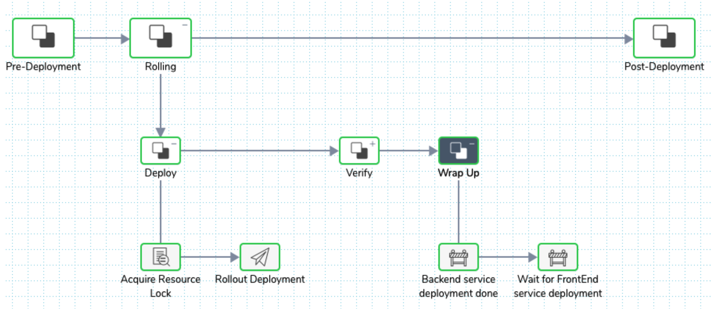
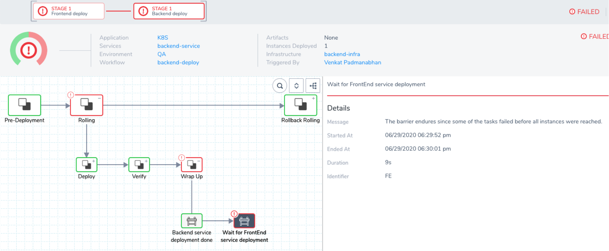
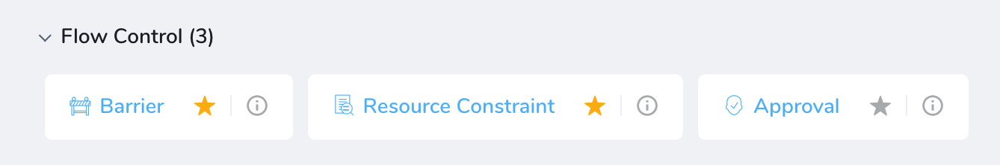
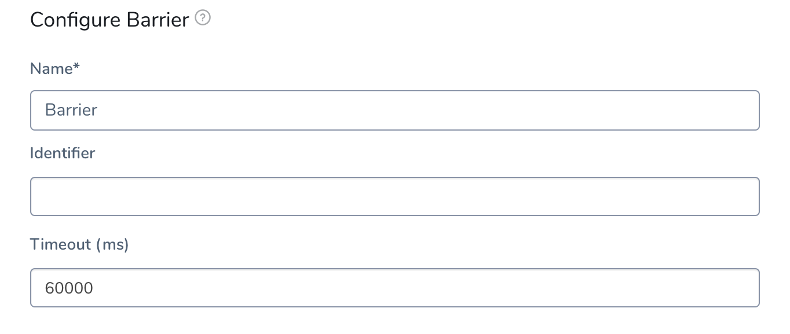
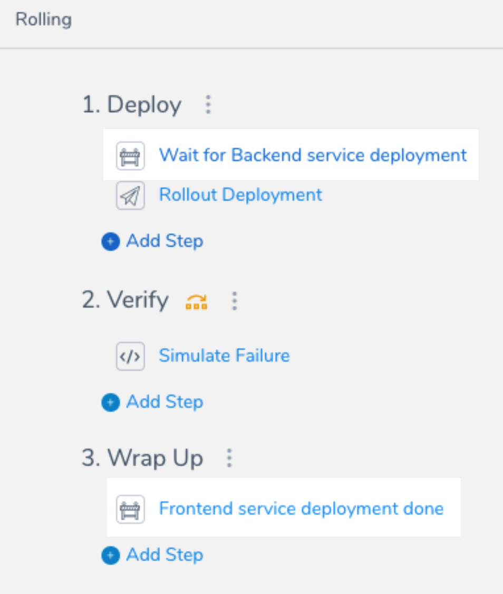
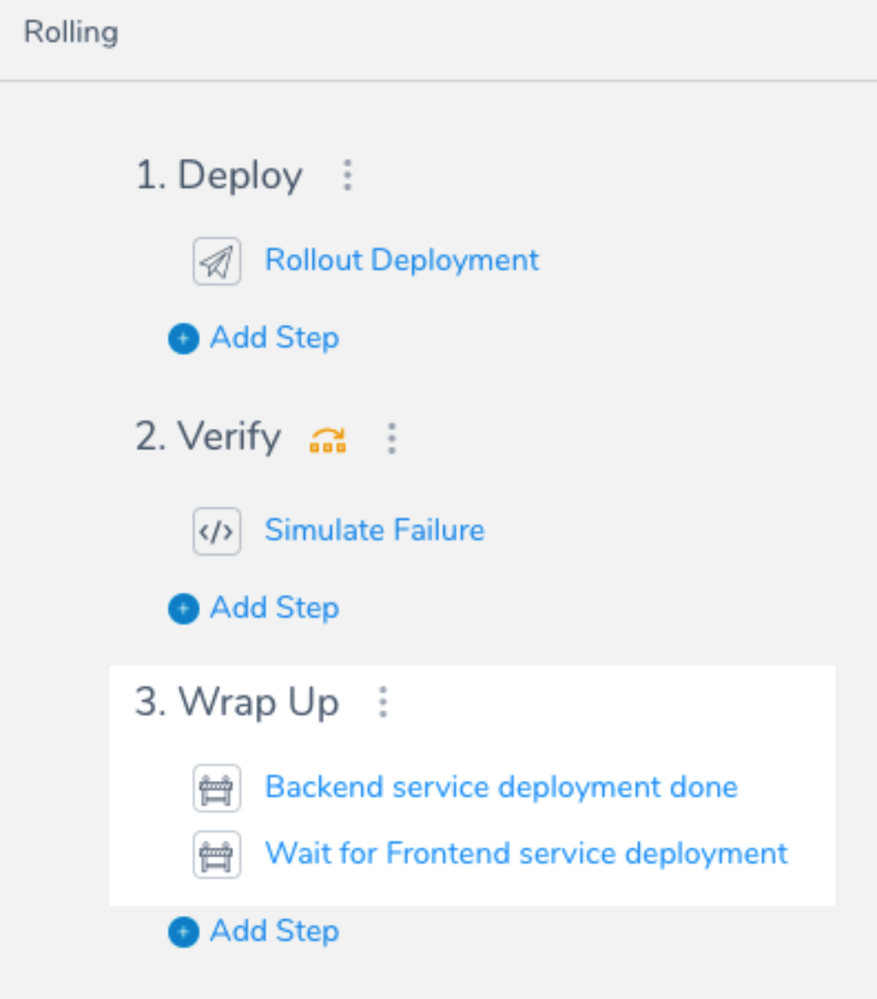
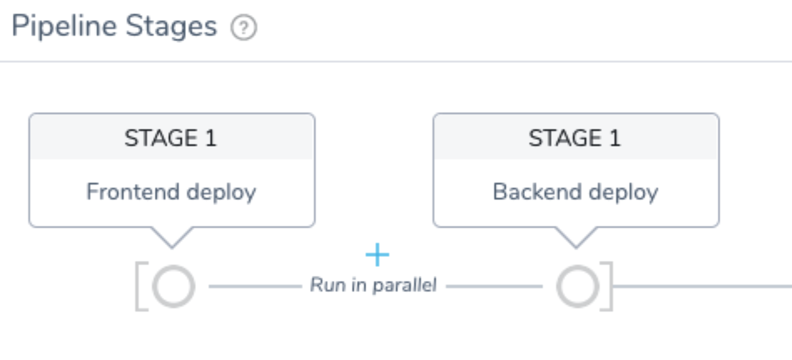

This topic covers a very common Barriers use case: deploying multiple microservices simultaneously (multi-service deployments).

In this scenario, each microservice is deployed by a different Workflow. For example, before executing integration tests, you might want to ensure all microservices for the application are deployed successfully. 

Using Barriers you can handle the synchronization of multi-service deployments in a simple and uniform way. 

### Before You Begin

If you want to reproduce this scenario, ensure that you have the following setup:

* Your target environment must have a Kubernetes cluster with two namespaces.
* Your Harness Application must have two Services—one for the frontend service and one for the backend service—that can be deployed to a Kubernetes cluster.
* Configure the Harness Kubernetes Cluster Cloud Provider, Environment, Infrastructure Definitions, and a [Rolling Deployment Workflow](https://docs.harness.io/article/dl0l34ge8l-create-a-kubernetes-rolling-deployment) to test each service deployment.
* Deploy the microservices in different namespaces. This is typically set up using separate Infrastructure Definitions in the Environment.

## Visual Summary

This example uses two Harness Services: a **Frontend Service** and a **Backend Service**. The goal is to have the Frontend Service deployment start only after the Backend Service is deployed successfully.

Similarly, if there is any error in deploying the frontend service, the backend service should rollback.

The picture below shows the frontend deployment Workflow using a Barrier named **Wait for Backend service deployment**.

The next screenshot shows the backend deployment Workflow using two Barriers:

* **Backend service deployment done**
* **Wait for FrontEnd service deployment**

Notice the order of the Barriers. For example, if you switch the sequence, the execution will result in a cyclic loop resulting in timeout error. 

Always ensure that there is no cyclical reference for Barriers.You can use multiple Barriers to synchronize the execution flow: the outcome from the dependent steps runs in a different Workflow that runs in parallel.

Here is a picture of a failed deployment with rollback of the backend caused by the frontend failure. Notice the error message in the details section.

## Review: Barriers

[Barriers](synchronize-workflows-in-your-pipeline-using-barrier.md) enable you to control the execution of multiple Workflows running in parallel. Using Barriers, complex release management processes can be easily implemented using Harness Pipelines. 

Barriers are available in **Flow Control** when adding a new Workflow step.

Here are the Barrier settings:

Be sure to use a descriptive name for the Barrier. Common phrases used are **Waiting for…**, **Completed…**, etc.

Define an **Identifier** that describes the purpose of the Barrier. The identifier is used to synchronize between the Workflows.

In this topic's example, the identifiers used were **BE** and **FE** to distinguish between backend and frontend.

For more complex deployments, identifiers such as **integration-test-started**, **integration-test-done**, etc, can be used.

Let's look at some common Barrier scenarios.

### Scenario 1: Multi-Service

This is the scenario we will describe in this topic. It is a very common scenario for testing an application consisting of many microservices.

As you will see, each microservice is deployed by a different Workflow. Before you execute any integration tests, you want to ensure all application microservices are deployed successfully. Using Barriers, you synch the microservice deployments in a simple and uniform way.

### Scenario 2: Multi-Environment

Deploy the same application version across multiple regions. If there is any failure in any one region, you would like to rollback all regions to the previous version automatically. Without this feature, you'll need complex, custom scripts. 

### Scenario 3: Application Compatibility

Using multiple environments to test applications where each environment varies in the OS patch level, Java patch version, or the infrastructure uses different cloud providers (AWS and GCP).

The ability to deploy the same version of the application across these environments successfully allows you to verify the portability of the application changes.

If these tasks were performed sequentially, or done selectivity for every major release, the cost to fix any issues discovered in any one environment is too high to resolve. This results in restricting the options for deployment, probably paying a higher support cost for running older versions of the OS or stack, thereby increasing the overall cost of operation.

Let us see how we can use Barriers for the most common scenario, Scenario 1.

## Step 1: Add Barrier to Frontend Workflow

Start with a [Kubernetes Rolling Workflow](https://docs.harness.io/article/dl0l34ge8l-create-a-kubernetes-rolling-deployment) and modify it to add Barriers as follows:

## Step 2: Add Barrier to Backend Workflow

Use a second Kubernetes Rolling Workflow and modify it to add Barriers as follows:

## Step 3: Create and Test Pipeline

Create a [Pipeline](../pipelines/pipeline-configuration.md) containing both the frontend and backend Workflows.

Configure the Workflows to run in parallel by enabling the **Execute in Parallel with Previous Step** setting on the second Workflow.

The frontend-deploy Workflow deploys to the frontend namespace and backend-deploy Workflow deploys to backend namespace.

Note that the order of the parallel Workflows in the Pipeline does not matter.

## Next Steps

* [Continuous Verification: Wait Before Execution](../../continuous-verification/continuous-verification-overview/concepts-cv/cv-strategies-and-best-practices.md#wait-before-execution)
* [Synchronize Workflow Deployments using Barriers](synchronize-workflows-in-your-pipeline-using-barrier.md)

