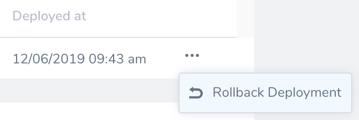
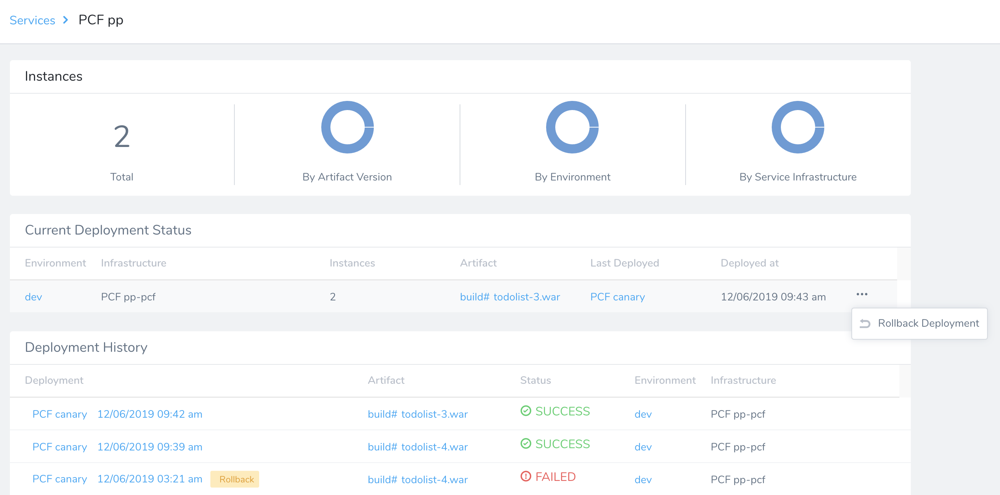
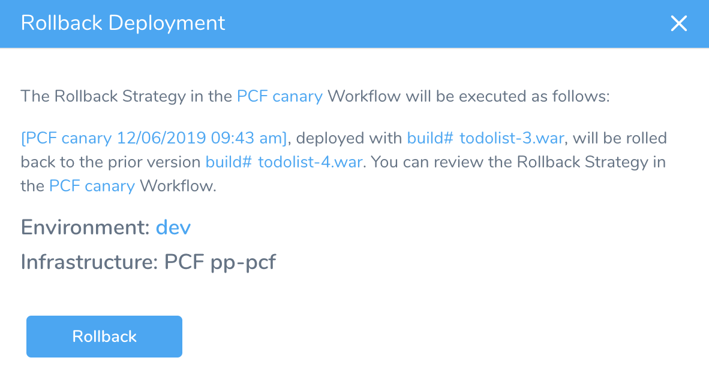
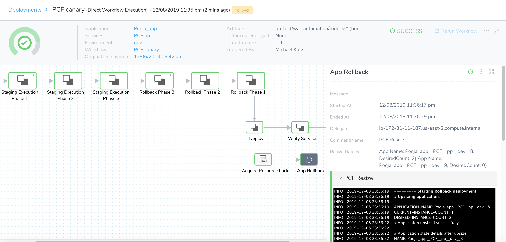
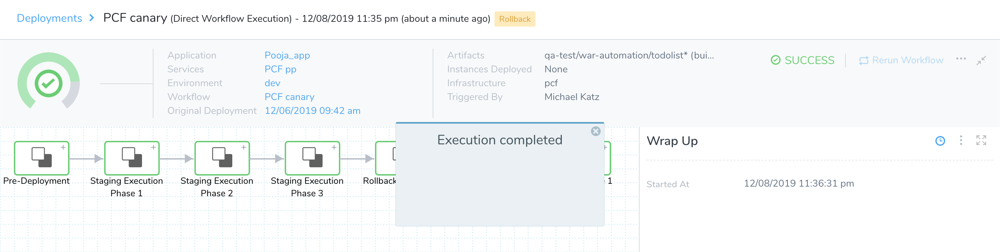
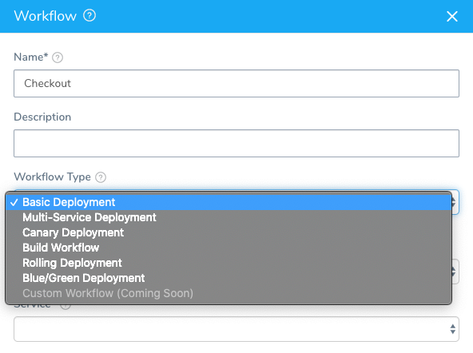
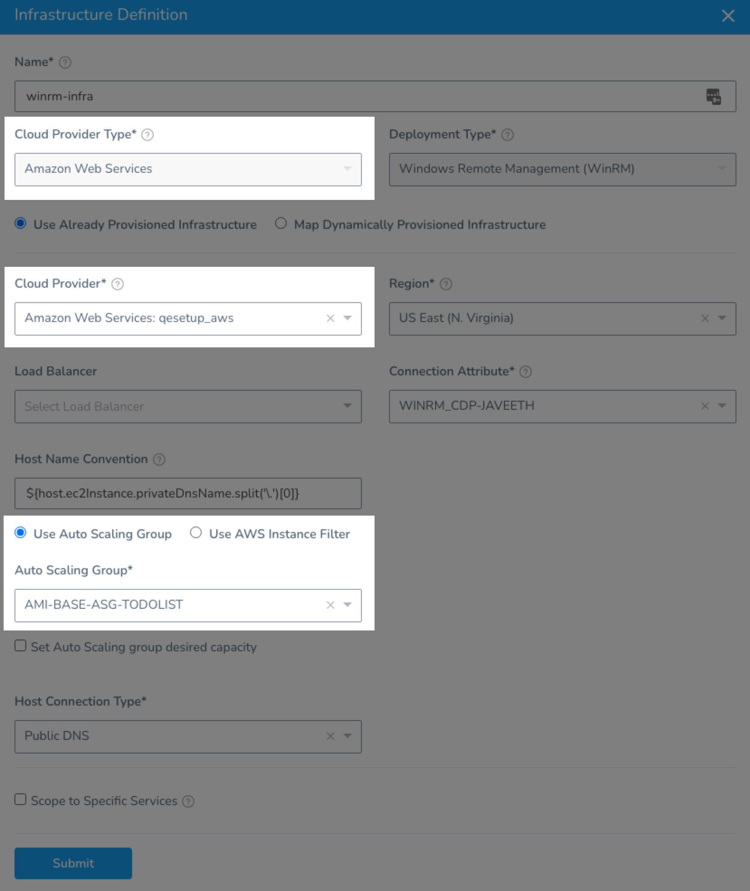

The **Rollback Deployment** option initiates a rollback of your most-recent successful deployment. This allows rapid, predictable recovery from a deployment that succeeded on technical criteria, but that you want to undo for other reasons.



### Limitations

* Post-deployment rollback is only supported in Workflows and Pipelines that deploy container images (Docker), AMI/ASG images, and traditional artifacts (ZIP, TAR, etc). Workflows and Pipelines that deploy only manifests or Helm charts with hardcoded artifacts in their specs are not supported.

### Review: Platform and Workflow Support

Rollback Deployment currently supports the following platforms and strategies:

* **Kubernetes** deployments: Basic, Blue/Green, Canary, Rolling Workflows.
* **SSH** deployments: Blue/Green, Canary, and Basic Workflows.
* **PCF (Pivotal Cloud Foundry)** deployments: Blue/Green, Canary, and Basic Workflows.
* **WinRM (IIS and .NET)** deployments: Blue/Green, Canary, and Basic Workflows.
* **ECS** deployments: all Workflow types, and both EC2 and Fargate clusters.
* **AMI/ASG** deployments: Blue/Green, Canary, and Basic Workflows.

Harness anticipates expanding this feature to other deployment platforms.

### Review: Required Permissions

The Rollback Deployment option requires the following User Group Account and Application permissions:

* **Account:** `Manage Applications`
* **Application:** `Rollback Workflow`


You can also add the **Rollback Workflow** Application permission via the GraphQL API:


```
mutation {  
  updateUserGroupPermissions(input: {  
    clientMutationId: "123"  
    userGroupId: "Gh9IDnVrQOSjckFbk_NJWg"  
    permissions: {  
      appPermissions: {  
        actions:[ROLLBACK_WORKFLOW]  
        permissionType: ALL  
        applications: {  
          filterType: ALL  
        }  
        deployments: {  
          filterTypes: NON_PRODUCTION_ENVIRONMENTS  
        }  
      }  
    }  
  }) {  
    clientMutationId  
  }  
}
```
#### Rollback Workflow added if Execute Workflow used Previously

All User Groups that had the **Execute Workflow** permission enabled will now have **Rollback Workflow** enabled, also. You can disable it if needed.

### Step 1: Rollback a Deployment

Before you begin, please review [Requirements and Warnings](post-deployment-rollback.md#requirements-and-warnings).To initiate a post-deployment rollback:

1. Open your [Services Dashboard](https://docs.harness.io/article/c3s245o7z8-main-and-services-dashboards#services_dashboard).
2. In the **Current Deployment Status** panel, click the More Options ⋮ menu beside the most-recent deployment. Then select **Rollback Deployment**.The **Rollback Deployment** option appears only for the current deployment.
3. In the resulting confirmation dialog, verify the deployment's details. If everything looks correct, click **Rollback**.Harness then invokes the Workflow's configured [Rollback Strategy](workflow-configuration.md#rollback-steps), executing the same Rollback Steps as if the deployment had failed.Once the rollback completes, your deployed instances will be returned to the state they were in before the most-recent deployment.

### Requirements and Warnings

**Rollback Deployment** will execute Rollback Steps on your deployment according to the Workflow's current configuration. Make sure the Workflow (including any variables) has not been reconfigured since this most-recent deployment, or the rollback can have unpredictable results.A deployment's **Rerun** option will be unavailable during, and following, a post-deployment rollback.In order to use Post-Deployment rollback, the following requirements must be met:

* There must be at least two successful deployments of the Workflow.
* The **Workflow Type** cannot be a **Multi-Service Deployment.**
* A user's ability to invoke the **Rollback Deployment** option is based on their [User Group](https://docs.harness.io/article/ven0bvulsj-users-and-permissions) membership, and on corresponding role-based permissions.

### AWS ASG Deployments

Currently, this feature is behind the feature flag `WINRM_ASG_ROLLBACK`. Contact [Harness Support](mailto:support@harness.io) to enable the feature.By default, Harness rolls back the instances that are initially deployed. When using Post-Deployment rollback, this list of instances could differ from the initial list. 

When the feature flag `WINRM_ASG_ROLLBACK` is enabled, Harness will going through the list of all hosts specified in the ASG selected in the Infrastructure Definition and check whether the host has an active instance (triggered for rollback). If the host has an active instance, we include the host in rollback. 

This method ensures that all instances are rolled back, including those initially deployed and those instances that appeared due to the ASG.

Let's look at an example.

If a Workflow uses an Infrastructure Definition that includes an AWS Cloud Provider and and ASG, then its Post-Deployment rollback is handled in the following way.

For each deployment, Harness calculates the percentage of instances that are deployed in every Workflow phase relative to the number of all instances that have been deployed. Harness uses this percentage to calculate the number of instances for rollback relative to all active instances at that moment.

Let’s say before/during deployment, we have `i1,i2,...,i8` (8 instances) and we have a 4 phase Canary Workflow defined with these percentages:

1. [Split: 10%] phase 1 (10%) - `i1`
2. [Split: 20%] phase 2 (30%)- `i2,i3`
3. [Split: 30%] phase 3 (60%)- `i4,i5`
4. [Split: 40%] phase 4 (100%)- `i6,i7,i8`

During Post-Deployment rollback we have 15 instances, some old and some new.

`i1, i2, i3, i4, i7, i8, i9, i10, i11, i12, i13, i14, i15, i16, i17`

Here's how rollback works:

1. **Rollback phase 4,** Harness rolls backs `i7, i8, i9, i10, i11, i12`. For phase 4, Harness deployed 3 instances of 8, which is 37.5%. Harness will rollback 37.5% of all active instances:  
n = 15 \* 37.5% = 5.625  
This is rounded to 6 (two old and four new).
2. **Rollback phase 3,** Harness rolls back `i4, i13, i14, i15`. For phase 3, Harness deployed 2 instances of 8, which is 25%. Harness will rollback 25% of all active instances:  
n = 15 \* 25% = 3.75  
This is rounded to 4 (one old and three new).
3. **Rollback phase 2,** Harness rolls back `i2, i3, i16, i17`. For phase 2, Harness deployed 2 instances of 8, which is 25%. Harness will rollback 25% of all active instances:  
n = 15 \* 25% = 3.75  
This is rounded to 4 (two old and two new).
4. **Rollback phase 1,** Harness rolls back `i1`. In the last rollback phase, Harness rolls back all instances that are left (only i1).

