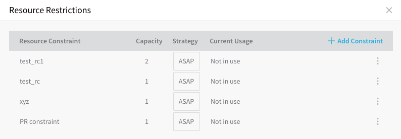
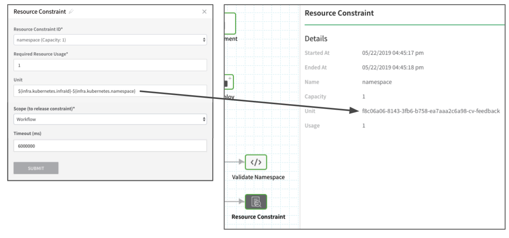

To queue the number of resources Harness requests during a deployment, and prevent multiple Workflows, Workflow Phases, or Pipelines requesting the same deployment environment resources at the same time, you can place capacity limits on the resources Harness requests.

For example, a deployment cloud environment (AWS, GCP, Azure, etc) might limit host access to 5 at a time. You can use Resource Guard to ensure that the Workflow only requests access to 5 at the same time during deployment.

Another common example is deploying multiple artifacts to a single Kubernetes namespace because the same Workflow is deployed by two people simultaneously. To avoid collision, and queue deployments, you can set a maximum capacity of one request to the namespace at a time.

Resource Guards are Account-wide. This ensures that if a Resource Guard is placed in one Workflow, it will restrict any other Workflow in the Account from using the resource until it is safe to use.

### Control Resource Usage

Resource Guards are set up at the Harness Account level, and may be used throughout all Applications.

To create a Resource Guard, do the following:

1. In Harness, click **Setup**.
2. In **Account**, click the vertical ellipsis, and then click **Resource Guard**.

   The **Resource Restrictions** settings appear.

   1. Click **Add Constraint**.
   
3. Fill out the constraint fields:

    * **Resource Constraint** - Enter a name for your resource constraint. You will use this name to select the Resource Constraint in a Workflow.
    * **Capacity** - The maximum number of resources that may be consumed simultaneously.
    * **Strategy** - Choose **FIFO** if you want the resource requests to be selected in the order they arrived. Choose **ASAP** if you want Harness to select the first pending resource request that matches the number of available resources.  
    As an **ASAP** example, imagine you have two resource requests: the first needs 2 hosts, and the second request needs 1 host. When 1 host becomes available, the second request is given the host as its request matches the number of available resources first.

The **Current Usage** value identifies if the resource restriction is applied a Workflow.

### Apply Constraints in Workflows

You can use your Resource Guards anywhere they are needed in a Workflow to queue resource requests.

Only add Resource Guards to Workflow sections where the resource you reference can be obtained. For example, if you add Resource Guards to the **Pre-deployment Steps**. then Services and Infrastructure Definition cannot be referenced as Harness has not selected those at this stage of the Workflow.To apply a Resource Guards to a Workflow, do the following:

1. In a Workflow, click **Add Step**. The **Resource Constraint** dialog appears.
2. Fill out the constraint settings and click **SUBMIT**. The settings are described below.

#### Resource Constraint ID

Select the **Resource Guard** to use at this stage of the Workflow. Note the capacity of the restriction. This is the maximum number of resources that may be consumed simultaneously.

#### Required Resource Usage

Enter the number of resources that are required at this step in the Workflow. If the number is more than the Capacity of the Resource Guard you selected, the Workflow will remain at this step until the required resource usage has been reached. This is how you queue resource usage.

For example, if the **Capacity** is 4 and the **Required Resource Usage** is 5, Harness will use 4 resources simultaneously and wait until 1 resource becomes free so that it can use it for the 5th required resource.

#### Unit

The resource unit is any value that can identify a resource uniquely. You can use Harness built-in variables by entering `$` and selecting from the list.

If you leave **Unit** empty, the Resource Constraint will be applied to all resources across your account.For example, to queue the services deployed to a Kubernetes namespace, you can enter `${infra.kubernetes.namespace}` in **Unit** and set the Resource Restraint Capacity to **1**.

To queue the services deployed to a particular Harness Infrastructure Definition that uses the namespace, you would enter `${infra.kubernetes.infraId}-${infra.kubernetes.namespace}` in **Unit**.

The following image shows the **Resource Constraint** step in the Workflow with **Unit** set to `${infra.kubernetes.infraId}-${infra.kubernetes.namespace}` and the results of the deployed Workflow:

#### Scope

Currently, the **Pipeline** option is behind the feature flag `RESOURCE_CONSTRAINT_SCOPE_PIPELINE_ENABLED`. Contact [Harness Support](mailto:support@harness.io) to enable the feature. Scope this constraint to a Workflow, Workflow Phase, or Pipeline.

The scope determines what must be completed before the resource can be used by another Workflow, Workflow Phase, or Pipeline.

For example, let's look at selecting **Pipeline** in **Resource Constraint**. Once selected, this Workflow is added to Pipeline A and Pipeline B. 

Pipeline A is run and then Pipeline B is run immediately afterwards. Pipeline B will not be able to use the same deployment environment resources as Pipeline A until Pipeline A is fully executed. Pipeline B is queued until Pipeline A is complete. Once Pipeline A completes, Pipeline B proceeds.

#### Timeout

Enter how long the Resource Guard should run before failing the step. If the timeout is reached before the Resource Guard is able to process all resource requests, it will fail the Workflow and rollback will occur.

