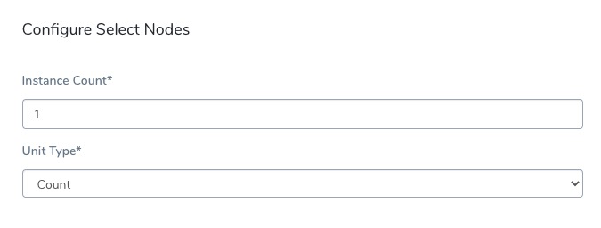
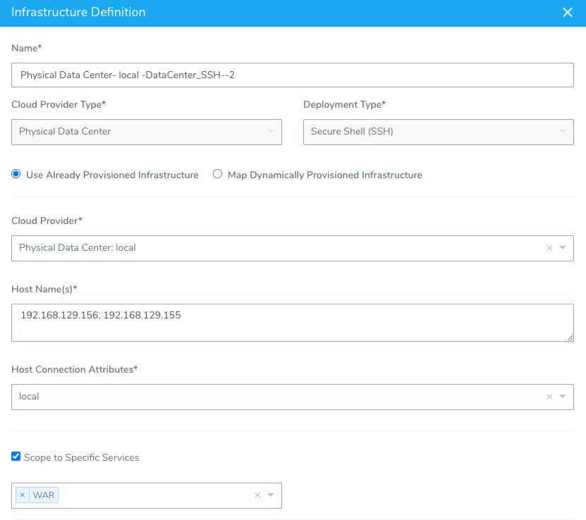
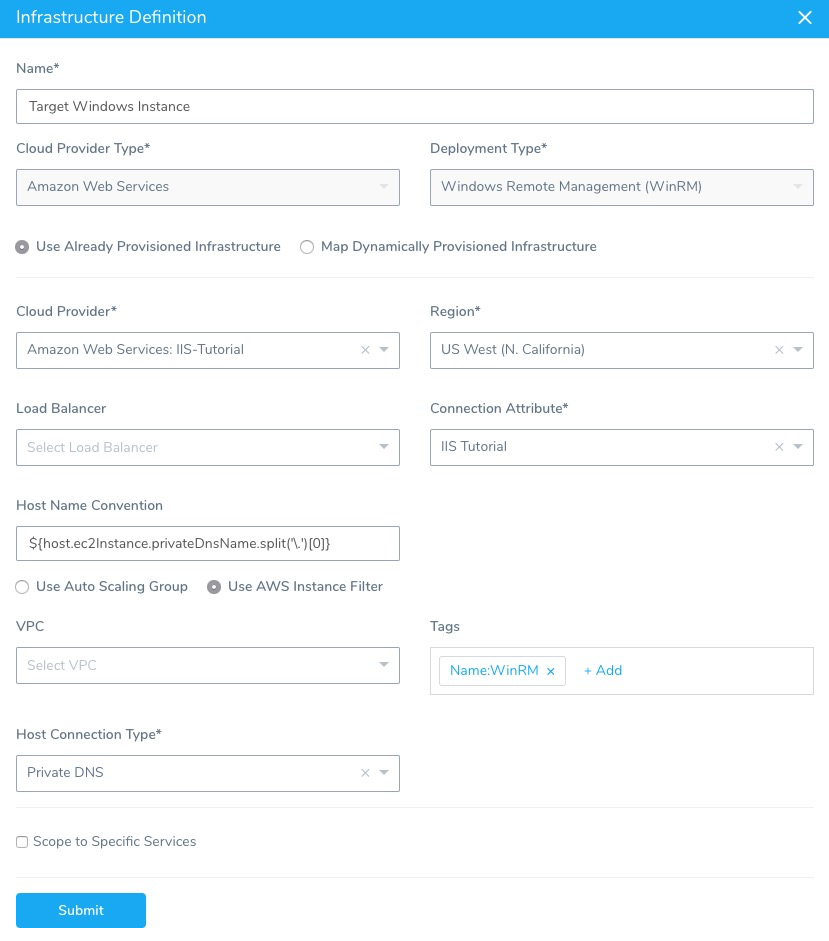

This topic explains how to configure the Select Nodes step in a Rolling deployment Workflow.

Rolling deployments are supported for most platforms. This topic is only concerned with the Rolling deployment Workflows that include the **Select Nodes** step. For a list of all platforms that support Rolling deployments, see [Supported Platforms and Technologies](https://docs.harness.io/article/220d0ojx5y-supported-platforms).

### Before You Begin

* [Harness Key Concepts](https://docs.harness.io/article/4o7oqwih6h-harness-key-concepts)
* [Deployment Concepts and Strategies](https://docs.harness.io/article/325x7awntc-deployment-concepts-and-strategies)

### Step 1: Create a Rolling Workflow

A Rolling Workflow with Select Nodes is supported for the following Harness Service deployment types:

* Secure Shell (SSH)
* WinRM (IIS .NET)

When you have created a Rolling Workflow for one of these Service types, the **Select Nodes** step is added to the **Prepare Infra** section automatically.

### Step 2: Enter the Number of Rolling Instances

In **Select Nodes**, the **Instance Count** setting refers to the number (count or percentage) of nodes to use when performing the rolling deployment.

For example, if you enter **1 Count**, Harness will deploy to 1 node, and then roll onto the next node.

If you enter **2 Count**, Harness will deploy to 2 nodes, and then roll onto the next node.

If you select **Percentage** in **Unit Type**, Harness calculates the percentage of available target hosts at deployment runtime.

The number of available nodes is determined by the Infrastructure Definition used by the Workflow.

For example, in the Infrastructure Definition for the **Secure Shell (SSH)** deployment type, you enter the hostnames/IP addresses for the target nodes in **Host Names**:

In the Infrastructure Definition for the **Windows Remote Management (WinRM)** deployment type, you can identify the hosts using **Tags**:

In both types, you need at least nodes to perform a proper Rolling deployment.

### Option: Select Host Not in Infrastructure Definition

Currently, this feature is behind the feature flag `DEPLOY_TO_INLINE_HOSTS` and available in SSH and WinRM deployments only. Contact [Harness Support](mailto:support@harness.io) to enable the feature.The nodes that appear in the Select Nodes **Host Name(s)** setting are taken from the Workflow's Infrastructure Definition, but you can enter in alternate or additional nodes. 

In the following example, host1 and host2 are from the Workflow's Infrastructure Definition, and the remaining hosts are entered manually.

You can also enter [Workflow variable expressions](add-workflow-variables-new-template.md) that are resolved at runtime. The Workflow variables can be a list of hosts.

### Next Steps

* [Traditional Deployments Overview](https://docs.harness.io/article/6pwni5f9el-traditional-deployments-overview)
* [IIS (.NET) Quickstart](https://docs.harness.io/article/2oo63r9rwb-iis-net-quickstart)

