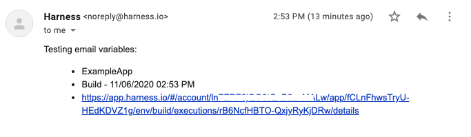

You can use the Email Workflow step to send an email to registered Harness User email addresses as part of your Workflow.

The Email step is different than the Workflow Notification Strategy, which notifies Harness User Groups of different Workflow conditions. See [Add a Workflow Notification Strategy](add-notification-strategy-new-template.md).

### Before You Begin

* [Workflows](workflow-configuration.md)
* [Add a Workflow Notification Strategy](add-notification-strategy-new-template.md)
* [Add SMTP Collaboration Provider](https://docs.harness.io/article/8nkhcbjnh7-add-smtp-collaboration-provider)

### Limitations

* You can only use email addresses that are **registered** to Harness User accounts. This helps to ensure secure communication from your Workflow. If the Email step uses an unregistered email address, it will not be sent to the unregistered email address.
* If the email is addressed to registered and unregistered addresses, only the registered addresses receive the email.
* The email that is received does not show the Harness User that executed the Workflow as the **from** or **reply-to** settings.

### Supported Platforms and Technologies

See [Supported Platforms and Technologies](https://docs.harness.io/article/220d0ojx5y-supported-platforms).

### Option: Use Your Own SMTP Server

By default, emails are sent using the built-in Harness default SMTP server.

To use your own SMTP server, follow the steps in [Add SMTP Collaboration Provider](https://docs.harness.io/article/8nkhcbjnh7-add-smtp-collaboration-provider).

Configuring your SMTP server is required only if you are using [Harness On-Prem](https://docs.harness.io/article/gng086569h-harness-on-premise-versions).

### Step 1: Add the Email Step

You can add the Email step to any section of a Workflow that allows steps.

1. In your Harness Workflow, click **Add Step**.
2. Click **Email** and then click **Next**.
3. In **Name**, enter a name for the step.

### Step 2: Enter Addresses and Message

1. In **To** and **CC**, enter one or more email addresses of Harness Users. Email addresses are comma-separated.
2. Provide a **Subject** and **Body** message.

The **Body** setting supports HTML. The **Subject** setting does not.

### Option: Use Variable Expressions in Body

You can use [Harness variables expressions](https://docs.harness.io/article/9dvxcegm90-variables) in the Body of the message.

You can use built-in Harness expressions to display information about the deployment:


```
Testing email variables:  
<ul>  
  <li>${app.name}</li>  
  <li>${workflow.displayName}</li>  
  <li>${deploymentUrl}</li>  
</ul>
```
Which are displayed in the delivered message:



You can use [Workflow variables](add-workflow-variables-new-template.md) also. You can use [Service Config variables](../setup-services/add-service-level-config-variables.md) but the Email step must be in a Workflow phase where the Service is used, and not in a Pre-deployment section of the Workflow.

### Configure As Code

To see how to configure the settings in this topic using YAML, configure the settings in the UI first, and then click the **YAML** editor button.

