Using [ServiceNow](https://docs.servicenow.com/) (SNOW) tickets from one or more ServiceNow instances, you can track and audit the progress of Harness deployments and Pipelines, and can approve or reject Pipeline stages.

### Video Summary

### ServiceNow Collaboration Provider

To use ServiceNow integration in your Workflow or Pipeline, you must first add a ServiceNow account as a Harness Collaboration Provider. For instructions and required permissions, see [Add ServiceNow Collaboration Provider](https://docs.harness.io/article/vftxcr51xx-add-service-now-collaboration-provider).

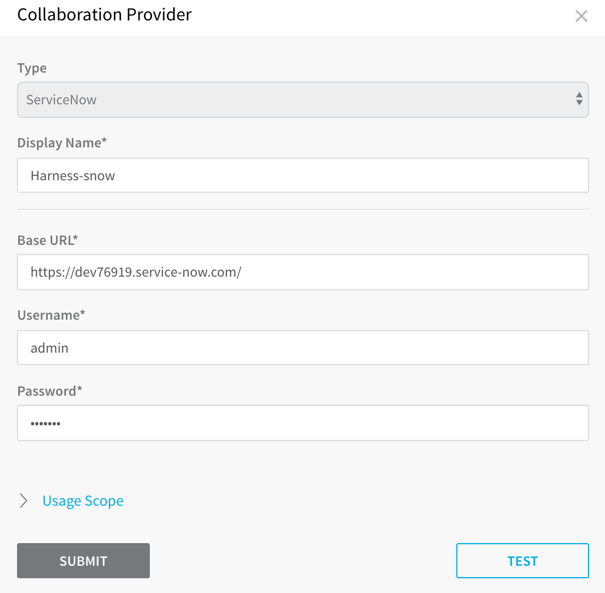Once you have added a ServiceNow account to Harness, you can integrate ServiceNow into your Workflows and Pipelines.

### UTC Timezone Only

The ServiceNow API only allows date time and time values in the UTC timezone. Consequently, input for any datetime/time fields in Harness ServiceNow steps must be provided in UTC format irrespective of time zone settings in your ServiceNow account.

The timezone settings govern the display value of the settings not their actual value.

The display values in the Harness UI depend on ServiceNow timezone settings.
### Create ServiceNow Tickets in a Workflow

You can create and update ServiceNow tickets during the execution of a Harness Pipeline Stage or Workflow. This section will cover creating and updating tickets in a Workflow. We will create a ServiceNow ticket in an existing Workflow's **Pre-deployment Steps**, and then update the same ticket in the **Post-deployment Steps** as the Workflow completes.

To use a ServiceNow ticket as part of a Workflow, do the following:

1. Ensure that you have added a ServiceNow account as a Harness Collaboration Provider, as described in [Add ServiceNow Collaboration Provider](https://docs.harness.io/article/vftxcr51xx-add-service-now-collaboration-provider).
2. Open an existing Harness Workflow, or create a new one. In this example, we are using a Canary Deployment Workflow.
3. In **Pre-deployment Steps**, click **Add Step**.
4. In the **Add Command** dialog, click **ServiceNow**.

   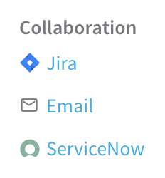
   
   The **ServiceNow** dialog appears.
   
   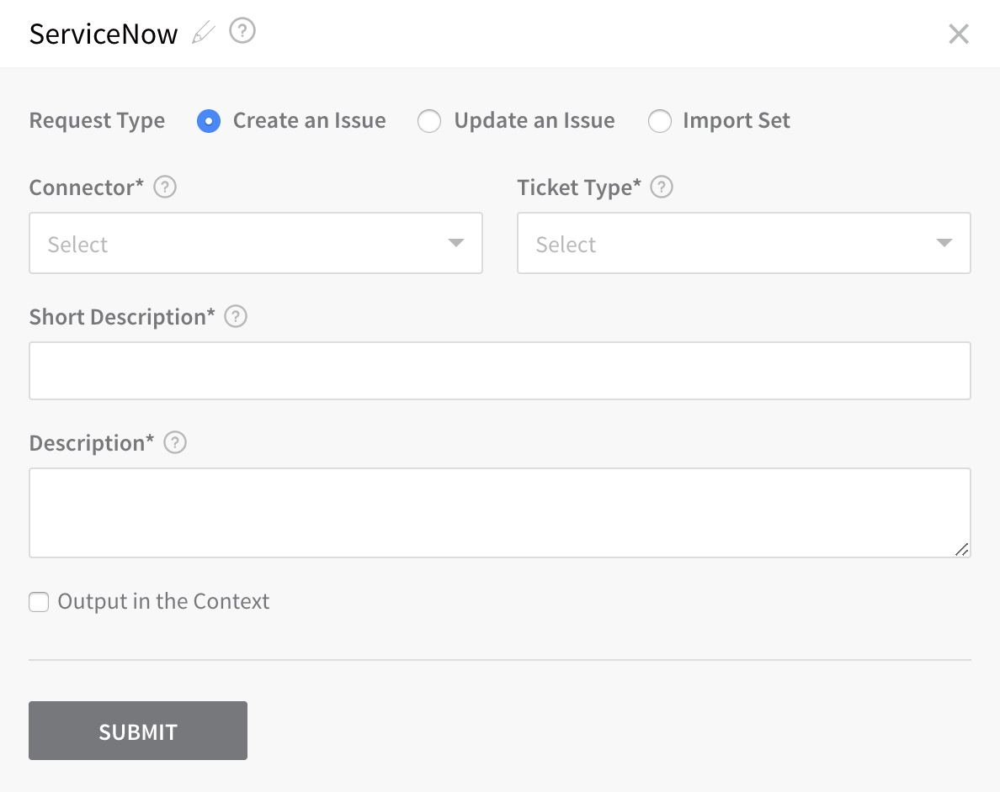

    The **ServiceNow** dialog has the following fields:

    * **Title** – By default, the step is titled ServiceNow. If you are creating a ServiceNow ticket, you might want to rename the step ServiceNow Creation, for example.
    * **Request Type** – Select **Create an Issue**. (The [Update an Issue](#update) and [Import Set](#import_set) options are discussed below.)
    * **Connector** – Select the ServiceNow account to use, by selecting the ServiceNow Collaboration Provider set up for that account. For more information, see [ServiceNow](https://docs.harness.io/article/cv98scx8pj-collaboration-providers#service_now).  
      
        When you select the ServiceNow Collaboration Provider, any account-specific fields in that ServiceNow account are pulled into the dialog. For example, here are the **Impact** and **Urgency fields**, with their values displayed:
        
        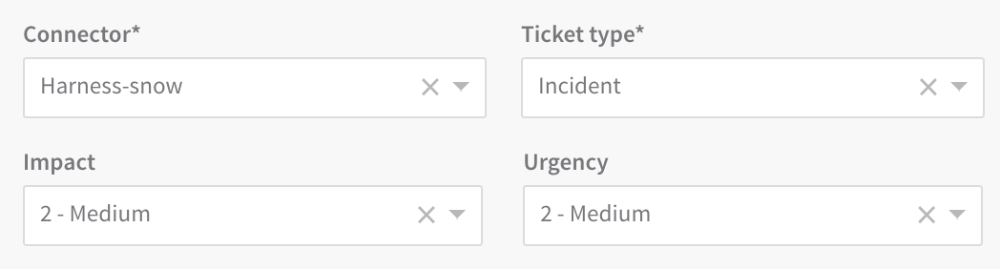
        
    * **Ticket Type** – Select a ServiceNow ticket type from the list of types.
    * **Short Description** – Add a description for the ticket you are creating. This will be the ticket title. (You can use Harness variables in the **Short Description** and **Description** fields. Simply type **$** and a list of available variables appears, as shown below.)

      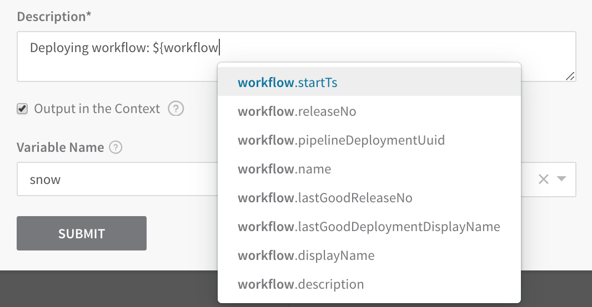
      
    * **Description** – Add the ticket description.
    * **Output in the Context** – Select this option to create a variable for the ServiceNow issue. You can reference this variable in another step in this Workflow, or in a Pipeline.
    
5. Select **Output in the Context**, and in **Variable Name**, enter a name, such as **snow**.
6. In **Scope**, select **Pipeline**, **Workflow**, or **Phase**. The **Pipeline** scope is the widest, and includes the **Workflow** and **Phase** scopes. Next widest is **Workflow**, which includes any phases within that Workflow. And finally, **Phase** scopes the variable to the Workflow phase in which it was created.  
  
For example, a variable with a **Pipeline** scope can be used by any step in the Pipeline which uses this Workflow, such as an **Approval Step**. For this example, we will use the **Pipeline** scope.  
  
Now that there is an output variable, you can add activity to the same ServiceNow ticket using the variable name. We will use this variable when we [update](#update) this ticket, but for now, note that the syntax to reference the variable is `${variable_name.issueNumber}`. For example, `${snow.issueNumber}`.

Presently, the only ServiceNow issue element you can reference is the issue ID, using `issueNumber`. Harness will be adding more issue element variables in the near future.When the **ServiceNow** dialog is complete, it will look something like this:

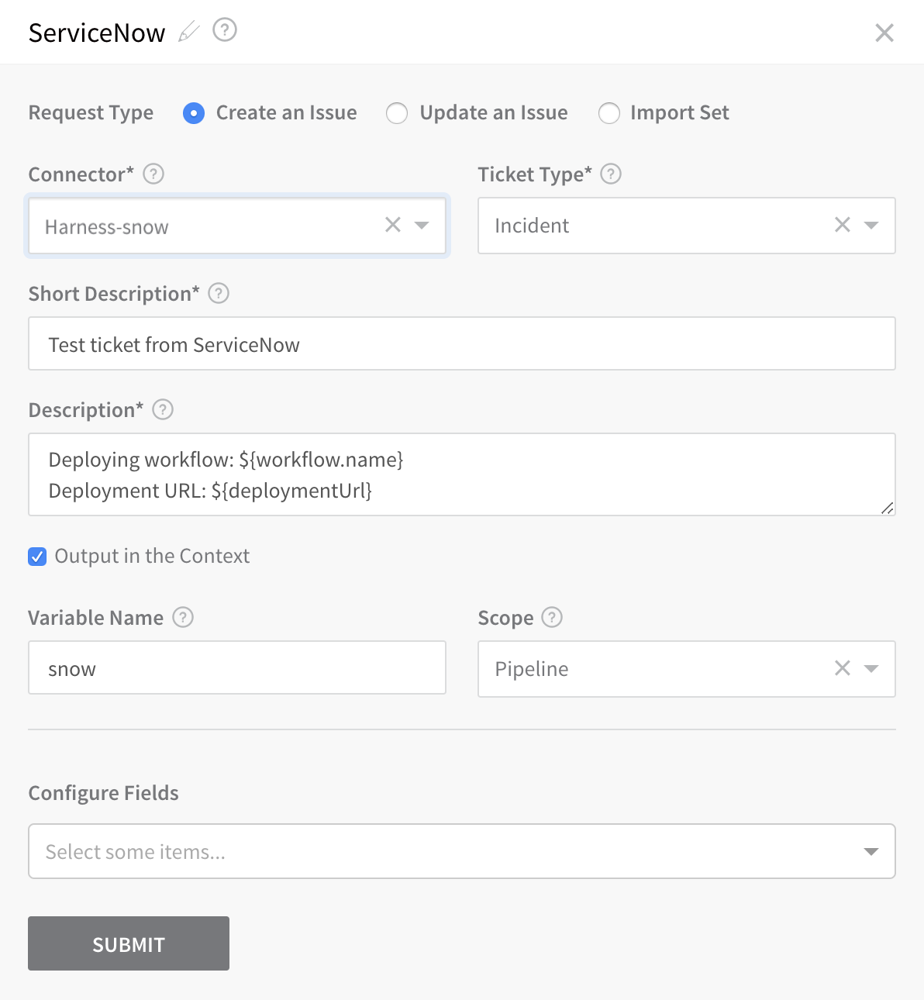Note the use of Harness variables in the **Description** field:


```
Deploying Workflow: ${workflow.name}  
Deployment URL: ${deploymentUrl}
```
The variables will be replaced at runtime with deployment information. For more information on Harness variables, see [Variables and Expressions in Harness](https://docs.harness.io/article/9dvxcegm90-variables).

Once the Workflow is deployed, the Harness Manager **Deployments** page displays a link to the ServiceNow ticket that the ServiceNow step created:

Click this link to view the ticket in ServiceNow.

To see the variables you used in the **Descriptions** field, click the **Details** section's More Options ⋮ menu, and select **View Execution Context**.

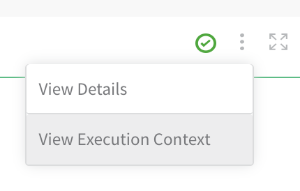The runtime output is displayed:

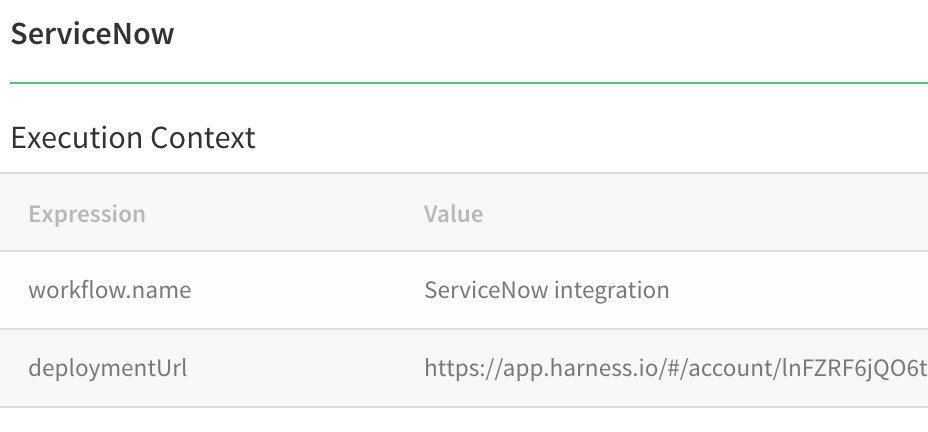 


#### Configure Custom Fields

A Workflow's **ServiceNow** dialog includes the **Configure Fields** option shown below. This multi-select drop-down enables you to access multiple custom fields from your ServiceNow integration.

Harness only shows English (EN) language fields fetched from your ServiceNow server. It does not support fields in other languages.Type the first few characters of a field name to quickly jump to that field. You can also scroll the list.

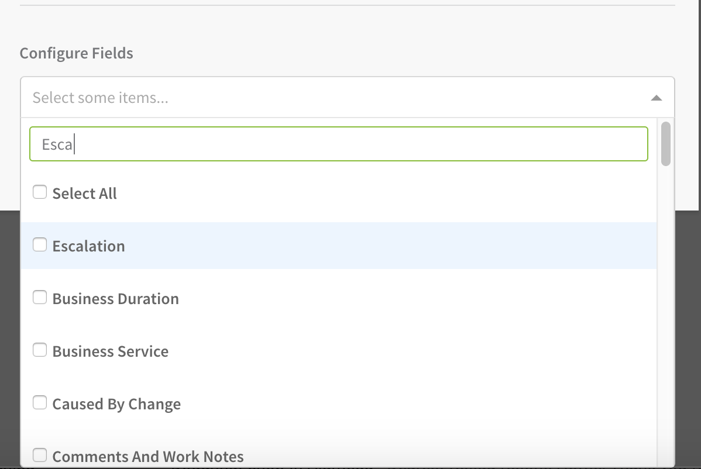Select each field that you want to add. You can also toggle the **Select All** check box to add, or remove, all custom fields.

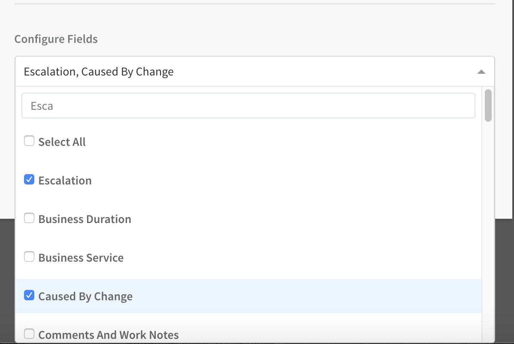When you close the drop-down, all of your selected fields are added to the dialog. You can now write static values, or variables, to these fields.

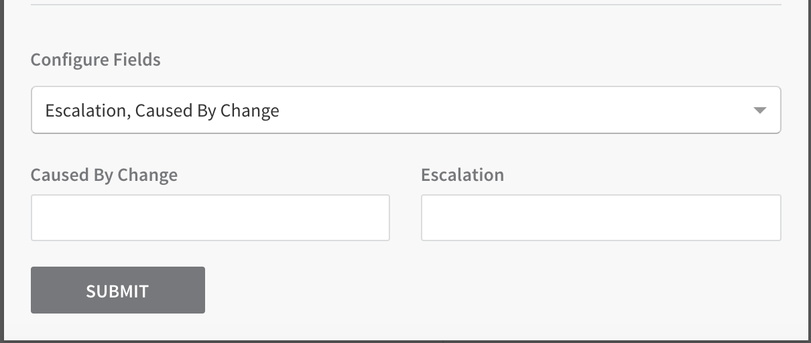


### Update ServiceNow Tickets

This section shows how to update the ServiceNow ticket in the **Post-deployment Steps** of the Workflow we used above.

1. In **Post-deployment Steps**, click **Add Step**, and click **ServiceNow**. The **ServiceNow** dialog appears.
2. In **Request Type**, click **Update an Issue**. The dialog changes to display the update settings.

   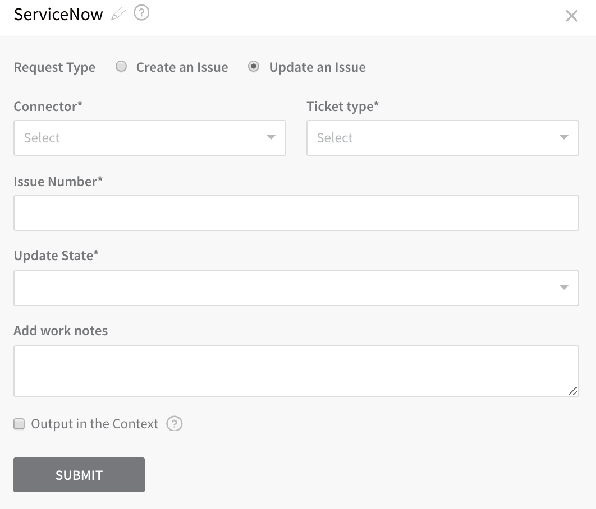
   
3. In **Connector**, select the same ServiceNow Collaboration Provider you used to create the ticket.
4. In **Ticket Type**, select the same type.
5. In **Issue Number**, use the output variable expression to identity the ticket you created in the ServiceNow step where you created the ticket. The output variable name was **snow**, so the variable is `${snow.issueNumber}`

   .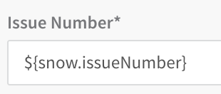
   
6. In **Update State**, update the ticket information.
7. In **Add work notes**, add any notes. You can also use Harness variables, for example: **Started progress on Workflow:** `${deploymentUrl}`.
8. You can also output this issue number using **Output in the Context** and change the scope.

When you are done, the dialog will look something like this:

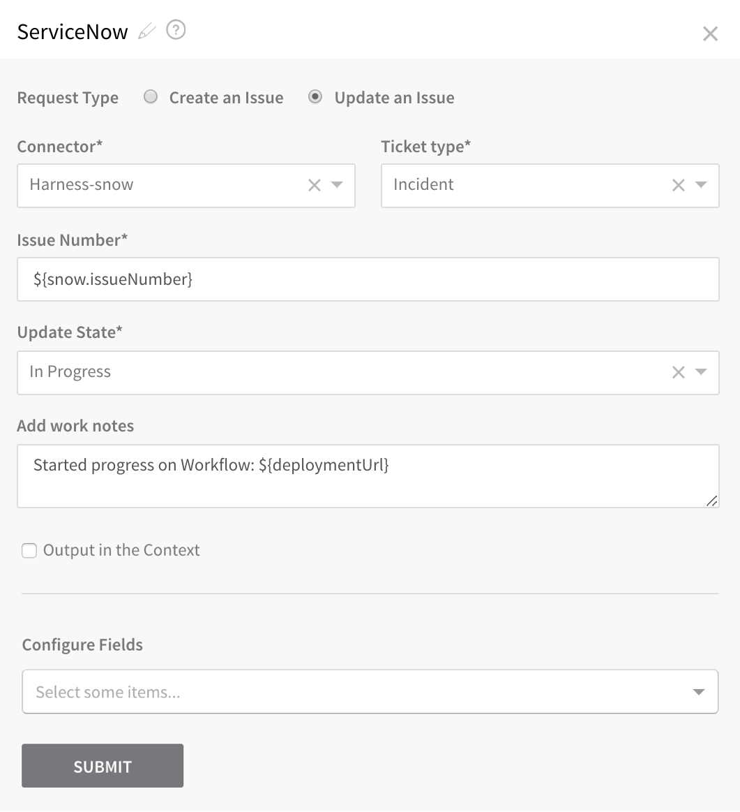

Click **SUBMIT**. Your Workflow now has a ServiceNow step in its **Pre** and **Post-deployment Steps**:

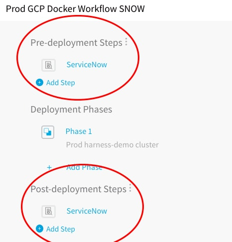

When Workflow is deployed, the ServiceNow steps are displayed.

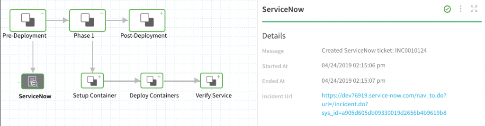

Clicking the link to the ServiceNow ticket takes you directly to the ticket in ServiceNow, and reveals all the activity logged during the Workflow steps:


Now you know how to create and update ServiceNow tickets in your Workflows. The following sections cover additional ticket creation and update options. Later, this topic will cover how to use ServiceNow tickets for [Pipeline Approval stages](#approvals).


### Import Set

The ServiceNow (Workflow) dialog's **Import Set** option is an alternative to **Create an Issue** or **Update an Issue**. This option invokes ServiceNow's Import Set API to create or update tickets via a ServiceNow staging table.

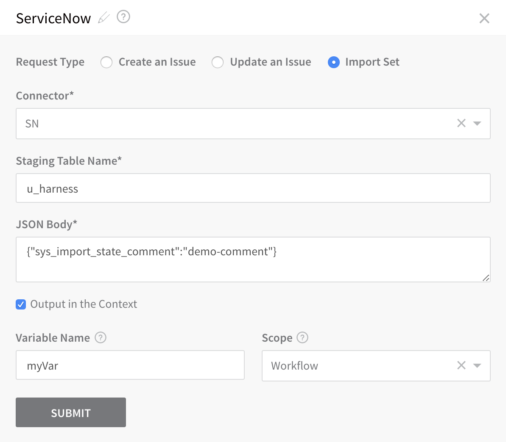

As shown in the Workflow step above, enabling the **Import Set** radio button exposes the following Import Set–specific fields in the dialog's body:

#### Staging Table Name

Specifies the staging table that will be used to import Harness data into ServiceNow. These intermediate tables' names are prefixed with **u\_**.

#### JSON Body

Contains the JSON that this Workflow step will pass when it makes a call to ServiceNow's Import Set API. The example above creates a Change Request with comment based on the **u\_harness** table's transformation map.

You can use [Harness variable expressions](https://docs.harness.io/article/9dvxcegm90-variables) in the JSON of **JSON Body**. For example, you could create a Workflow variable named `importset` and then reference it in **JSON Body** as `{"u_example":"${workflow.variables.importset}"}`.

For details on the table requirements and naming, see [Create a table](https://docs.servicenow.com/en-US/bundle/sandiego-platform-administration/page/administer/table-administration/task/t_CreateATable.html) from ServiceNow.

#### Transform Table Maps

Within ServiceNow, Transform Table Maps determine how data will be written from the staging table to existing target tables. Map rows determine whether the transformation will create or update a ticket, and determine the ticket type.


Here, Harness' Deployments page shows successful execution of the Workflow step configured above:

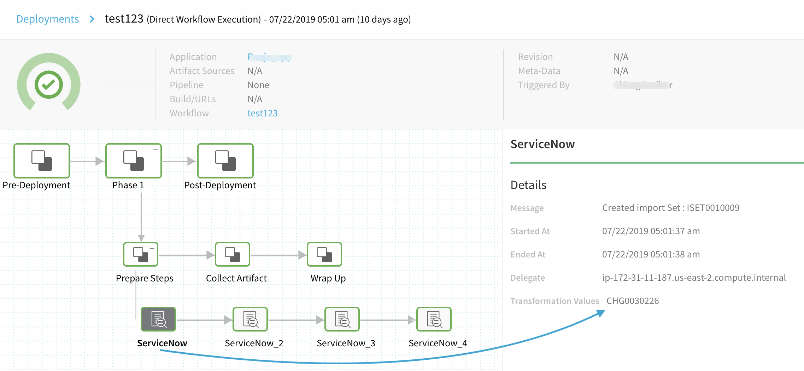

The highlighted **Transformation Values** field indicates the import set's output values. These values are available in the Harness variable `myVar.transformationValues[0]` . The same Workflow's steps 1–4 will access this variable, under [Change Requests/Change Tasks](#changes) below.


### Change Requests/Change Tasks

Harness incorporates ServiceNow's hierarchy of Change Requests and linked Change Tasks. Shown below is a Workflow step that creates a new ticket of type **Change Task**, linked to an existing Change Request.

We've specified the **Change Request Number** using the `myVar` variable shown in earlier the [Import Set](#import_set) example, and have also created a new output variable, `myVar2`:


Once the Change Task is created in ServiceNow, we can update it in a later Workflow step, by selecting **Update an Issue** and **Ticket Type: Change Task**. To identify the Change Task ticket to update, we can either enter an **Issue Number**, or (as shown in this example) we can use the output variable `myVar.transformationValues[0]` created in the [previous Workflow step](#import_set).

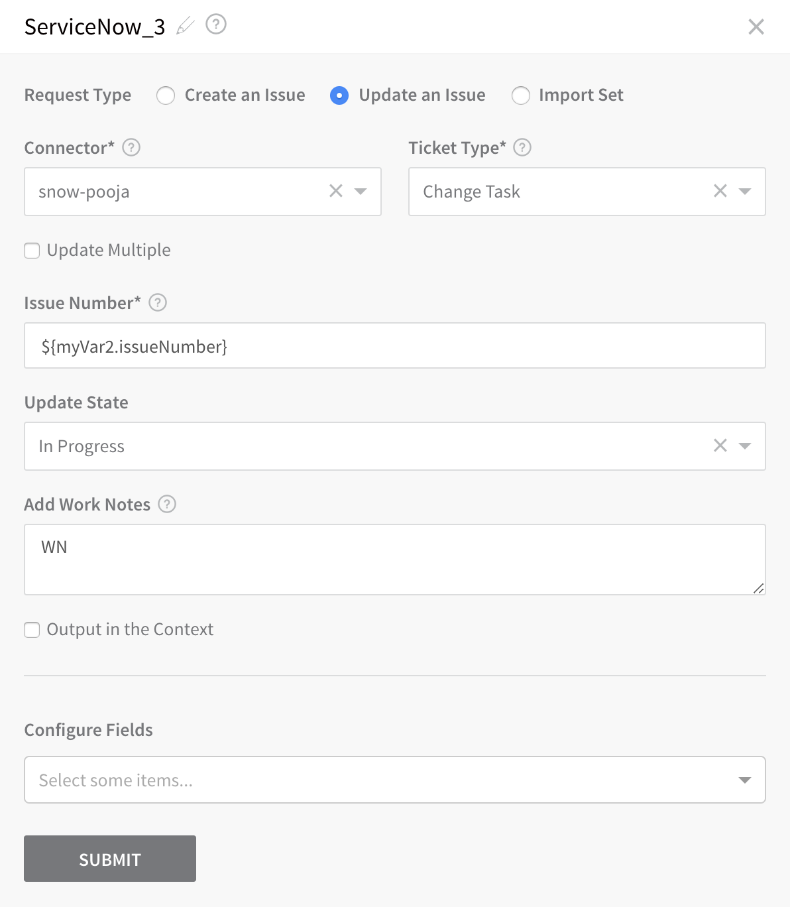

For Change Tasks only, you can select the **Update Multiple** check box. This exposes the **Change Task Type** drop-down shown below. In this example, all Change Tasks of type **Planning** will be updated with the selected **Update State**, and with the contents of the **Add Work Notes** field.

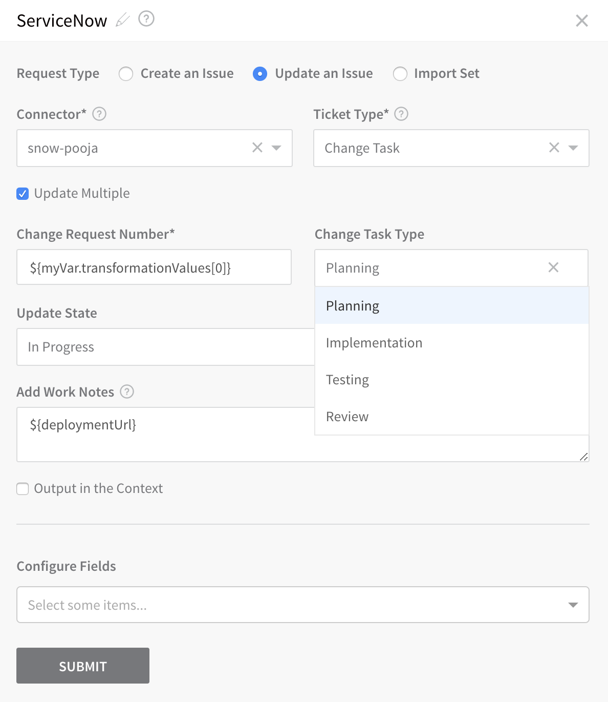

Once all Change Tasks have been resolved, you can close the associated Change Request by selecting **Update an Issue** and **Ticket Type: Change**. Here, we're specifying the **Issue Number** using our original variable.

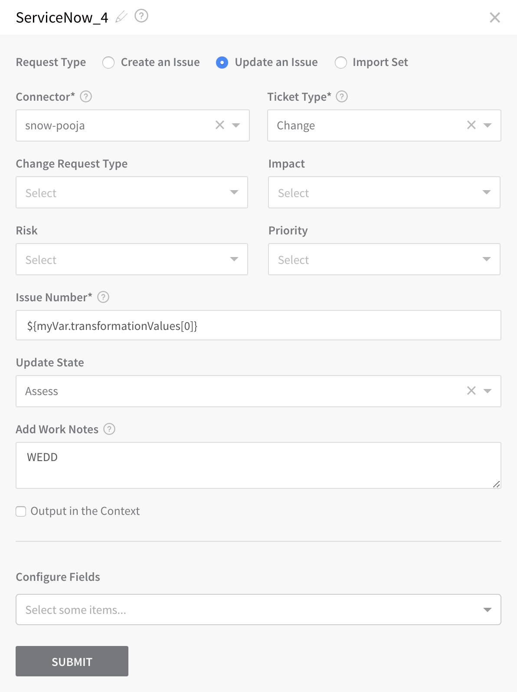

### ServiceNow-based Approvals

You can use a ServiceNow ticket as an approval stage in a Harness Pipeline and, when the ticket is updated, the Pipeline stage can be approved or rejected. For example, changing the **State attribute** of a ServiceNow ticket from **Resolved** to **Approved** could automatically approve the execution of a Pipeline stage or Workflow deployment in Harness.

For more information, see [ServiceNow Approvals](../approvals/service-now-ticketing-system.md).

