You can configure Workflows to skip one or more steps based on different conditions.

Harness users often have Workflows that are very similar, but differ in settings such as Service, Environment, or artifact. Instead if managing multiple Workflows, you can merge these Workflows and add conditions that skip specific steps based on these different conditions.

:::note
You can add Workflow step skip conditions to any Harness Workflow types.
:::

### Before You Begin

* [Workflows](workflow-configuration.md)
* [Variables and Expressions in Harness](https://docs.harness.io/article/9dvxcegm90-variables)

### Option 1: Skip All Steps in a Section

This example uses Harness Workflow templates and Harness built-in variable expressions. See [Template a Workflow](workflow-configuration.md#template-a-workflow) and [Variables and Expressions in Harness](https://docs.harness.io/article/9dvxcegm90-variables).Open a Workflow that contains multiple steps that you want skipped under a specific condition.

For example, here is a Workflow that deploys a WAR file to physical servers.

It contains two **Prepare Infra** steps to select nodes:

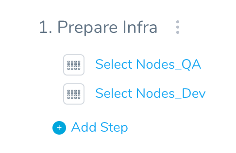

For this example, you want to skip all of these steps if the name of the Environment used by the Workflow is **testing**.

Click the more options button (**︙**) next to **Prepare Infra** to see its options.

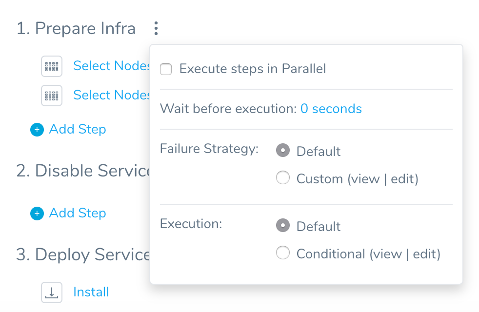

In **Execution**, click **Conditional**. The **Conditional Execution** settings appear.

Click **All Steps**.

In **Skip condition**, enter the condition to evaluate. Enter `$` to see the available Harness built-in variables. See [Variables and Expressions in Harness](https://docs.harness.io/article/9dvxcegm90-variables).

Skip conditions are boolean. If the condition you enter in **Skip condition** evaluates to **true**, all of the steps in **Prepare Infra** are skipped.

Skip conditions use [Java Expression Language (JEXL)](https://commons.apache.org/proper/commons-jexl/reference/syntax.html). You could use simply use a condition like `myvalue == true`.

Skip conditions support advanced expressions. For example:

`!${workflow.variables.A} == 1 || ${workflow.variables.B} == 2)`

Review the operators in the [JEXL reference](https://commons.apache.org/proper/commons-jexl/reference/syntax.html#Operators).

In our example, we want the steps skipped if the name if the Environment used by the Workflow is **testing**. The **Conditional Execution** settings are: `${env.name} == 'testing'`

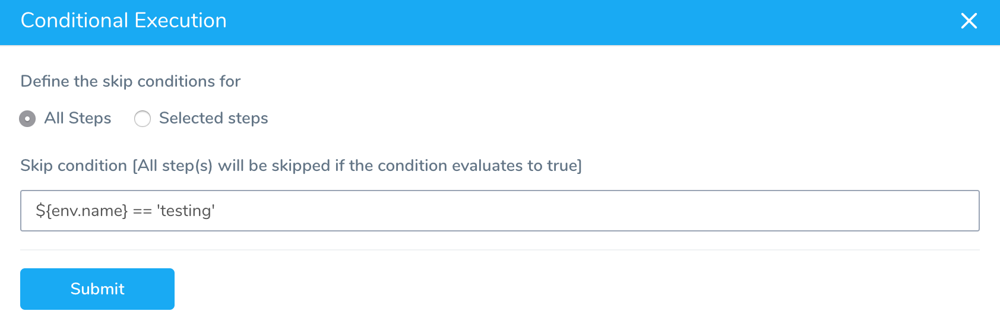

The variable expression `${env.name}` is one of the many built-in Harness expressions.

Click **Submit**. The Workflow indicates that the section is using skip conditions, and displays the skip condition you set up:

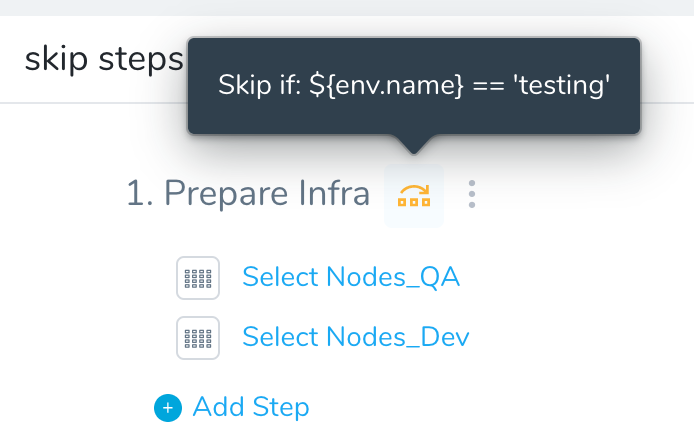In this example we deploy the Workflow and select **testing** for the Environment. This means that the skip condition evaluates to true, and the steps are skipped.

As you can see, the deployment results indicates the skip condition.

If you wish to remove the defined conditional expressions, click on the **Default** button and confirm.

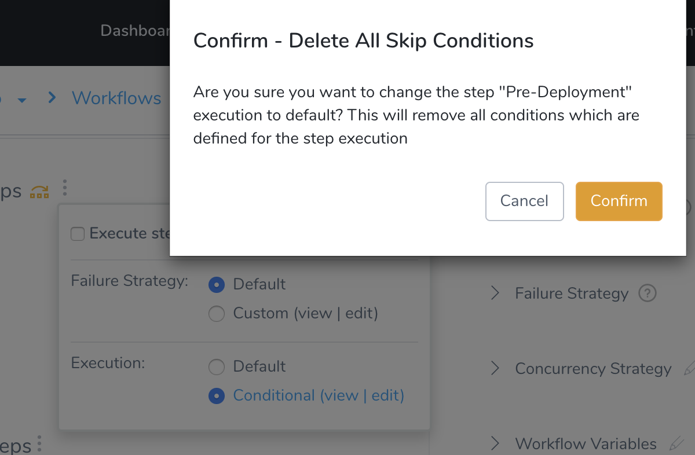

### Option 2: Skip Specific Steps in a Section

You can skip specific steps based on a condition.

Open a Workflow, and click the more options button (**︙**) next to a section heading, such as **Prepare Infra**.

In **Execution**, click **Conditional**. The **Conditional Execution** settings appear.

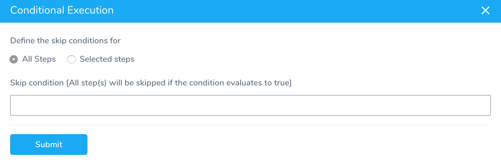

Click **Selected steps**. In **Skip Conditions** click **Add**. The settings for adding multiple conditions appear.

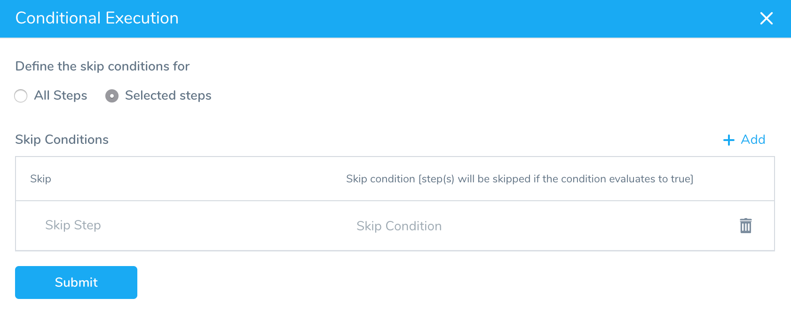

Click in **Skip** and select the step(s) you want to set a skip condition on.

In **Skip condition**, enter the condition to evaluate. Enter `$` to see the available Harness built-in variables.

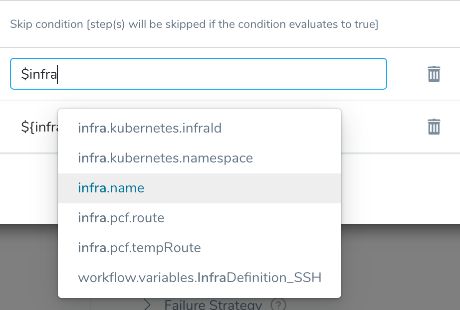

Click **Add** to add conditions for other steps. Here's an example with conditions for two steps using the variable expression `${infra.name}`.

The `${infra.name}` evaluates to the name of the Infrastructure Definition used by this Workflow at deployment runtime. See [Variables and Expressions in Harness](https://docs.harness.io/article/9dvxcegm90-variables) for other built-in expressions.

In this example, two conditions are added:

* The Infrastructure Definition named **QA** is selected as the condition value, and the step **Select\_Nodes\_Dev** is selected as the skip step.
* The Infrastructure Definition named **DEV** is selected as the condition value, and the step **Select\_Nodes\_QA** is skipped.

Click **Submit**. The Workflow indicates that each step is using skip conditions, and displays the skip condition you set up for each step:

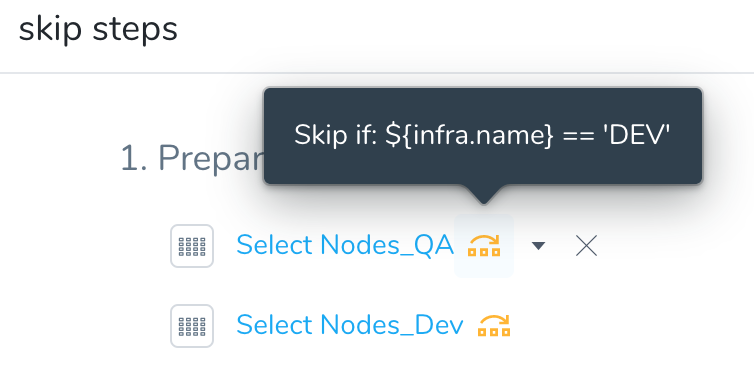

In this example we deploy the Workflow and select **DEV** for the Infrastructure Infrastructure. This means that the skip condition evaluates to true, and the **Select Nodes\_QA** step is skipped.

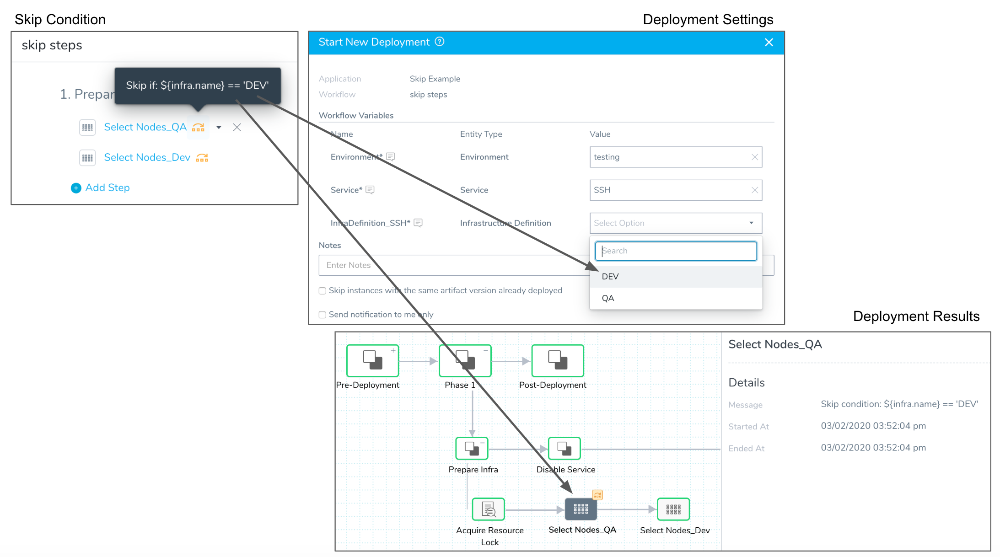

As you can see, the deployment results indicates the skip condition.

### Option 3: Skip Rollback Steps

You can add skip conditions to steps in a Workflow **Rollback Steps** section.

For example, in a Harness Kubernetes Canary Workflow there is a default rollback step, **Rollback Deployment**.

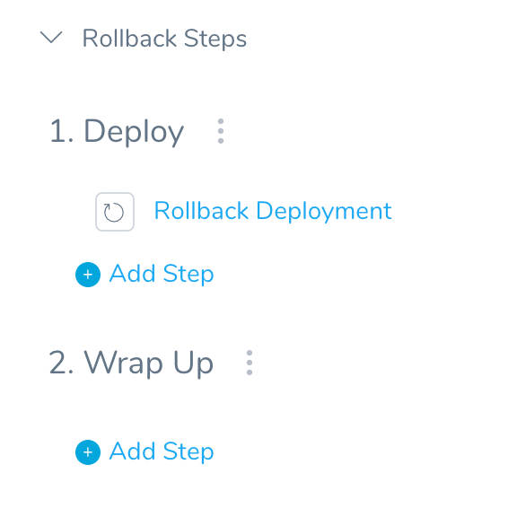

Perhaps you are testing and do not want to rollback the deployment if it fails. You can click the more option button next to **Deploy** and then in **Execution** click **Conditional**.

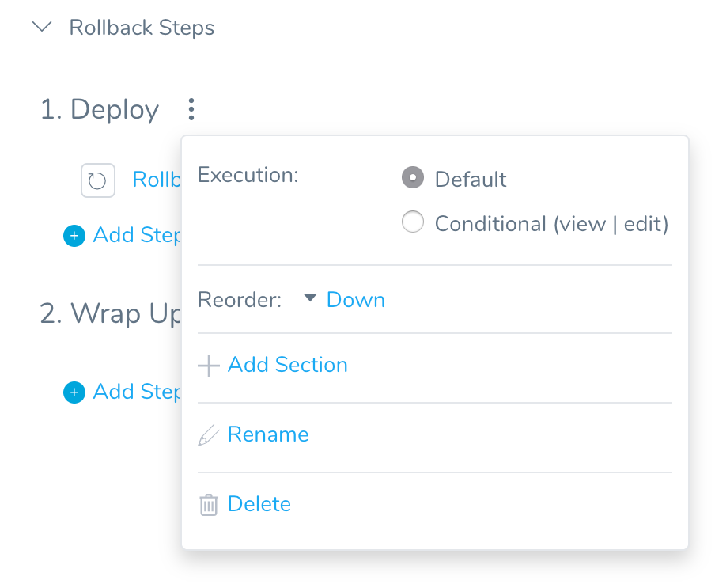

In **Conditional Execution**, you can set a condition to skip the **Rollback Deployment** step if the name of the Environment used by the Workflow is **testing**:

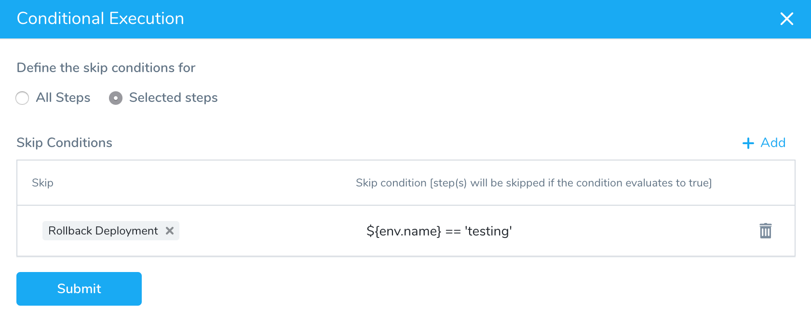

### Review: What Conditions Can I Use?

You cannot use Harness secrets in conditions.The conditions you set in **Conditional Execution** are boolean. If the condition evaluates to **true**, the selected step is skipped.

The conditions follow the syntax `val1 == val2`.

You can use boolean values `true` and `false`, or any other value that can be evaluated.

Skip conditions use [Java Expression Language (JEXL)](https://commons.apache.org/proper/commons-jexl/reference/syntax.html). You could use simply use a condition like `myvalue == true`.

Skip conditions support advanced expressions. For example:

`!${workflow.variables.A} == 1 || ${workflow.variables.B} == 2)`

Review the operators in the [JEXL reference](https://commons.apache.org/proper/commons-jexl/reference/syntax.html#Operators).

For variable expressions, you can use:

* Harness built-in variable expressions.
* Expressions that reference Service or Workflow variables you created.
* Expressions that reference variables published as part of an Approval Stage in a Pipeline.

Ensure the variable referenced by the expression is available in the Workflow section where you have applied the skip condition.

For example, Service variables are not available in Canary or Multi-Service Workflow **Pre-deployment Steps**. This is because in these Workflow types, the Service is selected in the Phases that follow the **Pre-deployment Steps**.

If the variable expression you select cannot be evaluated, the Workflow will fail.

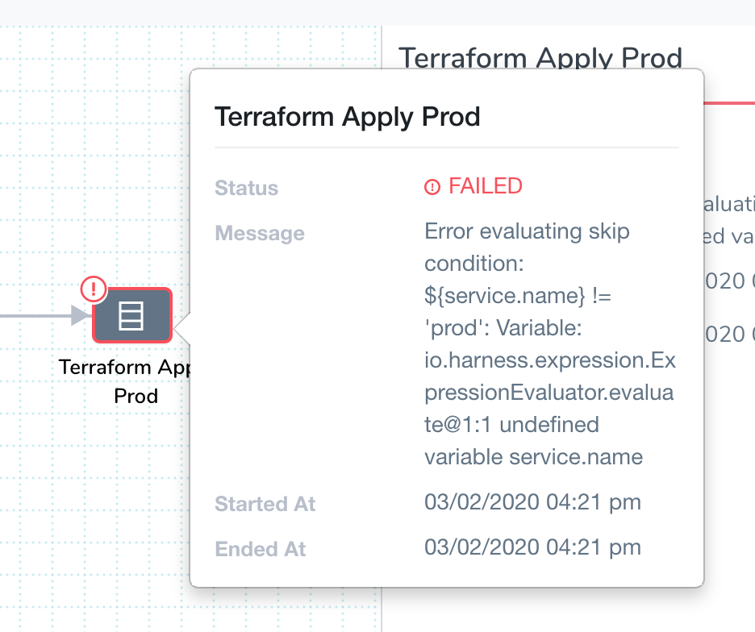

#### Regex

Harness supports the [Java Expression Language (JEXL)](https://commons.apache.org/proper/commons-jexl/reference/syntax.html). You can use JEXL regex in your skip conditions.

For example, if the artifact the Workflow is deploying is named **todolist.war** you could use the following regex in your skip condition: `${artifact.fileName} =~ '^todo.*'`.

#### Operators

Harness supports [JEXL operators](https://commons.apache.org/proper/commons-jexl/reference/syntax.html#Operators). Since skip conditions are boolean, you may only use operators that evaluate to true or false. An expression that evaluates to a numeric value like `${artifact.buildNo}*10` will not work.

As an example of other operators, you can use the Starts With `=^` operator like this `${infra.name} =^ 'Q'` :

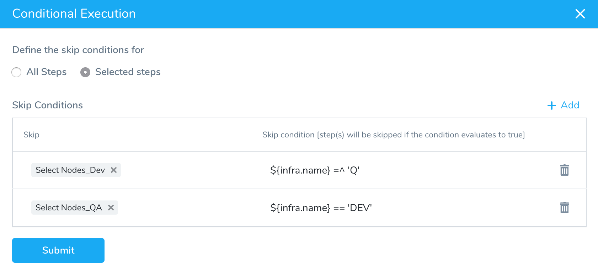

If you select the **QA** Infrastructure Definition at deployment, the condition is matched because **QA** starts with **Q** and the **Select Nodes\_Dev** is skipped:

Here is another example using the Inequality `!=` operator:

### Limitations

* Skip conditions do not support the Ternary conditional `?:` operator.

### Next Steps

* [Variables and Expressions in Harness](https://docs.harness.io/article/9dvxcegm90-variables)

