Currently, this feature is behind the feature flag `DEPLOY_TO_SPECIFIC_HOSTS`. Contact [Harness Support](mailto:support@harness.io) to enable the feature.You can choose to deploy to specific hosts when you start or rerun a Workflow whose Service uses the [Secure Shell (SSH) Deployment Type](https://docs.harness.io/article/6pwni5f9el-traditional-deployments-overview) or [Windows Remote Management (WinRM)](https://docs.harness.io/article/2oo63r9rwb-iis-net-quickstart) deployment types.

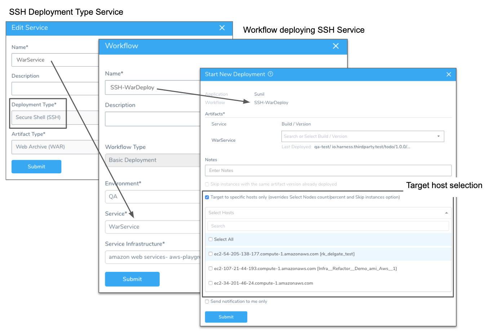

### Review: Target Specific Hosts

By default, when you deploy an SSH or WinRM Service, Harness automatically selects target hosts in the VPC (Virtual Private Cloud) that you've specified in your Infrastructure Definition.

You can use the **Tags** field here to identify specific hosts, but you'll need to have these hosts available for every deployment, and to ensure that the Tags are applied to them. Harness cannot query the hosts before deployment.

Also, if you are doing frequent ad-hoc deployments, managing the Tags for your target hosts can be time-consuming, and you'll need to repeatedly update your Infrastructure Definitions.

With the **Target to specific hosts only** alternative outlined below, when you deploy a Workflow for an SSH or WinRM  Service, you can select specific target hosts in the dialog that starts or restarts the deployment.

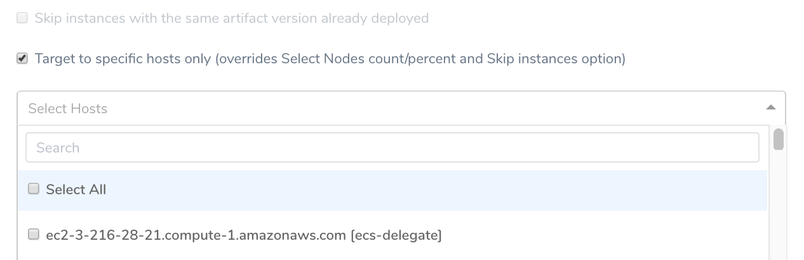This option enables you to manually select hosts even within templatized Workflows, and to redeploy specific Services without creating new Infrastructure Definition mappings.

### Review: Restrictions

The **Target to specific hosts only** option is restricted to the following circumstances where it is practical:

* Available only in Workflows that deploy SSH Services (see [Traditional Deployments](https://docs.harness.io/article/6pwni5f9el-traditional-deployments-overview)) or WinRM Services (see [IIS (.NET) Quickstart](https://docs.harness.io/article/2oo63r9rwb-iis-net-quickstart)), and that therefore contain a [Select Nodes](https://docs.harness.io/article/9h1cqaxyp9-select-nodes-workflow-step) step.
* Available only in direct Workflow execution—not in Pipeline or Trigger execution.
* Available only in Basic, Canary, or Rolling Workflows that deploy a *single* Harness SSH or WinRM Service.
* Unavailable with [dynamically provisioned](../infrastructure-provisioner/add-an-infra-provisioner.md) Infrastructure Definitions, relying on Terraform or CloudFormation (where selecting nodes/hosts is not possible).
* In a multi-phase Workflow, your selected hosts will override only the first phase. Harness will skip remaining phases.
* Overrides any [Select Nodes](https://docs.harness.io/article/9h1cqaxyp9-select-nodes-workflow-step) count, percentage, or specific hosts statically configured in the Workflow.
* Overrides the option to **Skip instances with the same artifact version already deployed.**
* Defaults to no selected hosts each time you start or rerun a Workflow deployment.

### Review: Skip instances with the same artifact version already deployed

Currently, this feature is behind the feature flag `DEPLOY_TO_SPECIFIC_HOSTS`. Contact [Harness Support](mailto:support@harness.io) to enable the feature.If you want to rerun the Workflow and only deploy to instances that do not have the same artifact version, enable the **Skip instances with the same artifact version already deployed** option.

### Step 1: Selecting Hosts

When you click the **Deploy**, **Start New Deployment**, or **Rerun Workflow** option for a Workflow set up with an SSH Service, the resulting dialog displays the option highlighted below, labeled **Target to specific hosts only**:

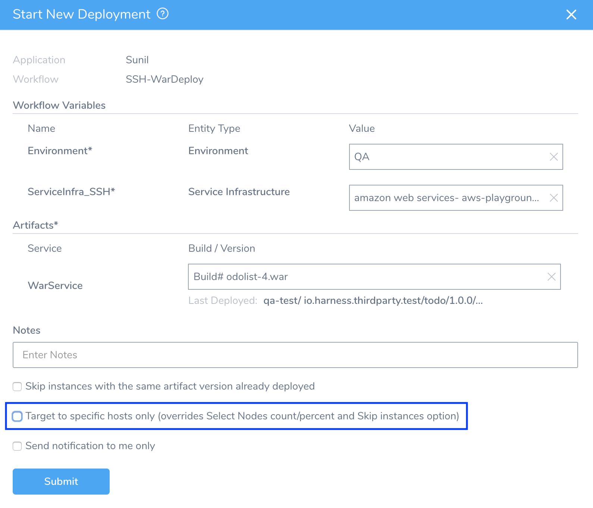Clicking this check box overrides the adjacent option labeled **Skip instances with the same artifact version already deployed**. (This option grays out, as shown below.)

More importantly, clicking the check box displays a new **Select Hosts** drop-down:

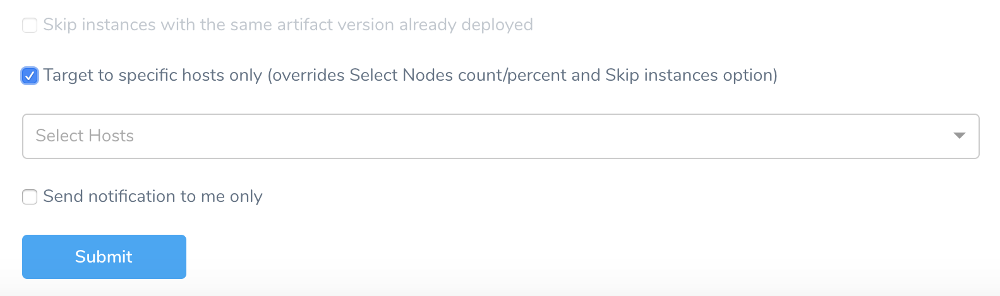Click **Select Hosts** to open the controls shown below.

Each time you start or rerun the Workflow, the upper selection field will be empty. Regardless of your selections during prior deployments, you must manually select target hosts for each new deployment.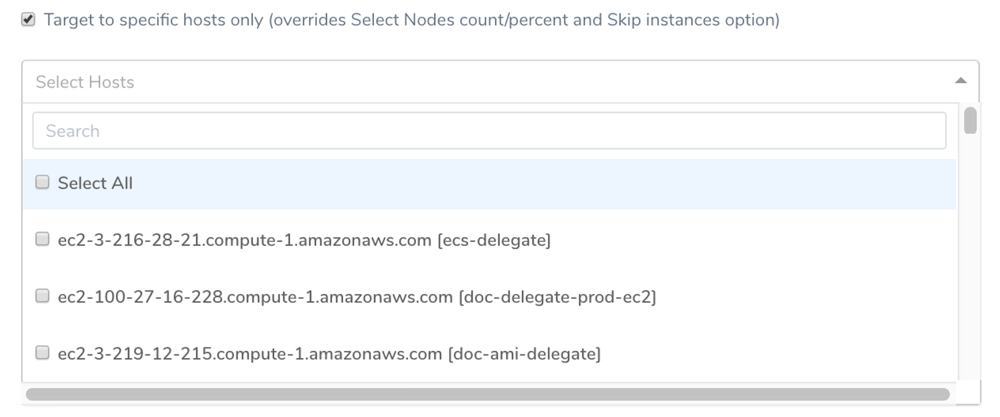These controls provide the following options for selecting target hosts:

* Scroll the drop-down list to select individual hosts' check boxes.
* Click **Select All** to select all hosts in the list. (This is a toggle: Empty the check box to deselect all hosts.)
* Type substrings into the **Search** box to scroll directly to individual hosts.

#### Searching for Hosts

In this example, we've searched on a substring to locate—and select—one matching host:

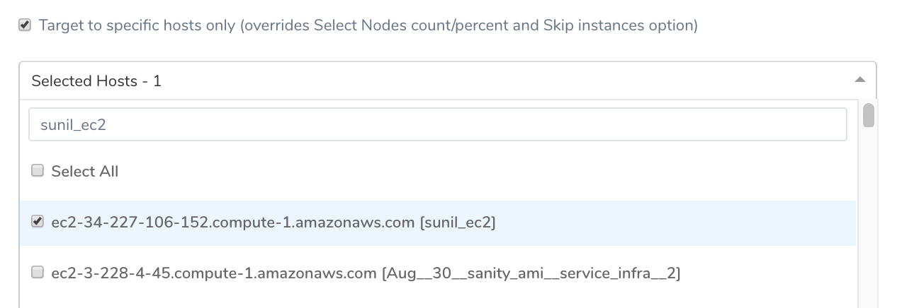

#### Confirming Hosts

After you've selected your desired target hosts, click or tab out of the selection field. The field's label now reads **Selected Hosts**, and summarizes the number of hosts you've selected:

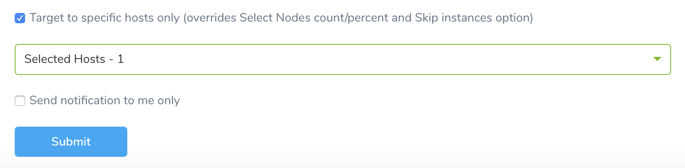To double-check that you've selected individual hosts, you can reopen the [Search](#search) box, and find these hosts by substring.

When you're satisfied with your selections, click **Submit** to deploy the Workflow.

### Option: Select Host Not in Infrastructure Definition

Currently, this feature is behind the feature flag `DEPLOY_TO_INLINE_HOSTS` and available in SSH or WinRM deployments only. Contact [Harness Support](mailto:support@harness.io) to enable the feature.When your Workflow deploys an SSH Service or WinRM using an Infrastructure Definition of Deployment Type **Secure Shell (SSH)** or **Windows Remote Management (WinRM)**, you can select target hosts that were not selected in the Workflow's Infrastructure Definition.

In **Start New Deployment**, in the **Target to specific hosts only** option, enter additional hosts.

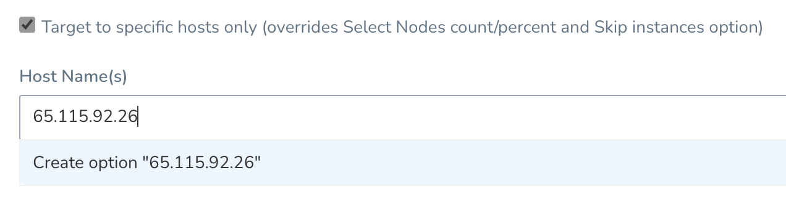Enter the target host name or IP address and click **Create option**.

**Target to specific hosts only** allows you to select hosts that are listed in the Workflow's Infrastructure Definition, enter additional hosts manually, or use Workflow variable expressions.

### Review: Selected Hosts in Deployment

Using the example configuration above, deployment proceeds as normal to the **Select Nodes** step:

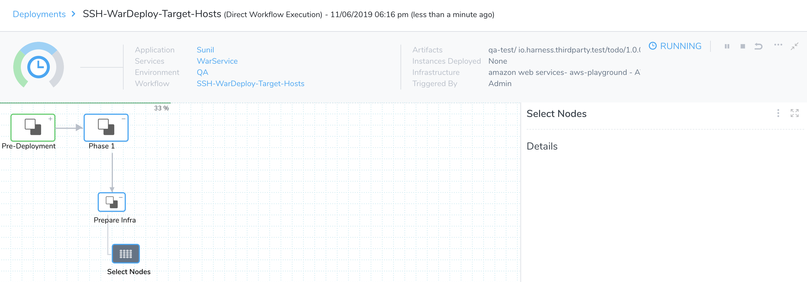As that step completes, the **Details** panel confirms that our execution-time selections have overridden the Workflow's **Select Nodes** defaults:

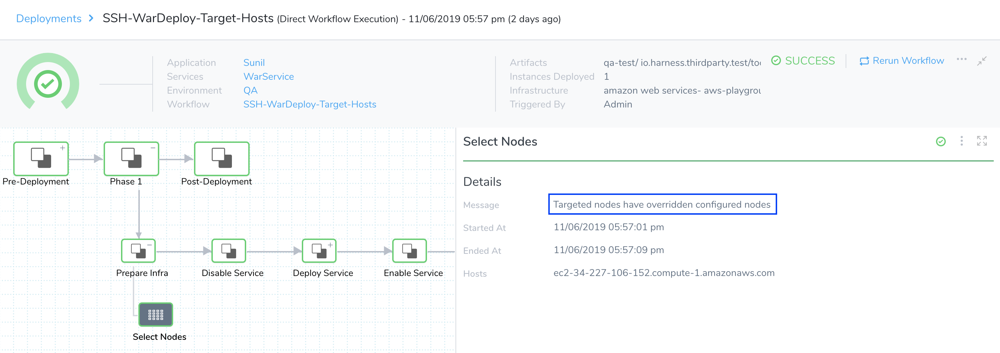Once the **Install** step executes, its log confirms connections to the host(s) we've specified:

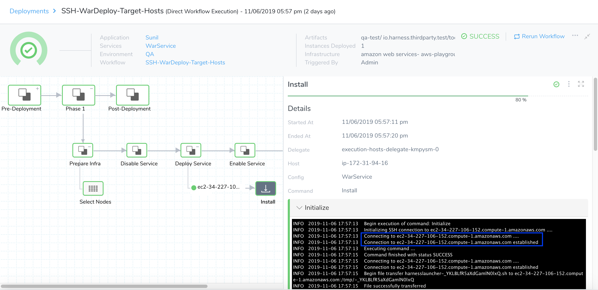Assuming that all selected hosts are available, your deployment should conclude successfully:

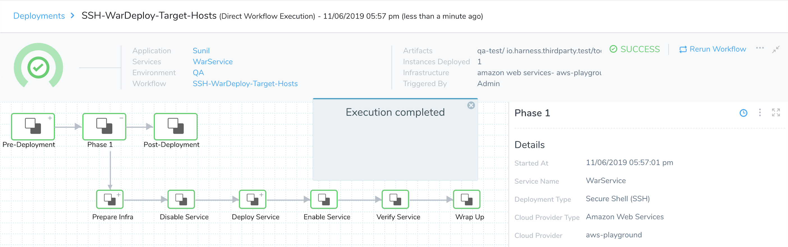

### Review: Rerunning Workflows

When you select the Workflow's **Rerun Workflow** link, the resulting dialog will display the same **Target to specific hosts only** check box and selection controls, in the same location:

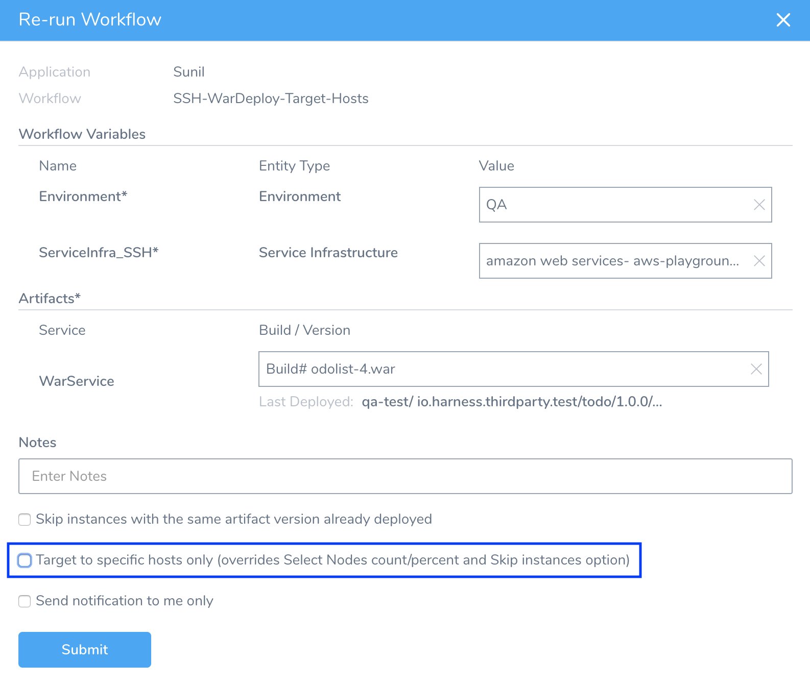As with the first deployment, the selection drop-down list will initially be empty. It will not pre-populate with any of the hosts selected in the previous run of the Workflow.

