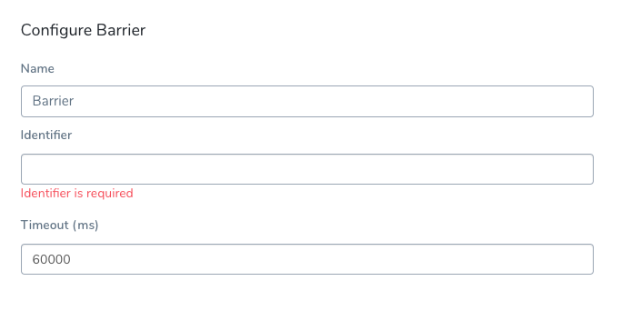

Barriers allow you to synchronize different Workflows in your Pipeline, and control the flow of your deployment systematically.

### Before You Begin

* [Barriers](workflow-configuration.md#barriers)
* [Add a Workflow](tags-how-tos.md)

### Review: Barriers and Synchronization

When deploying interdependent services, such as microservices or a large and complicated application, there might be a need to coordinate the timing of the different components' deployments. A common example is the need to verify a group of services only after *all the services* are deployed successfully.

Harness Workflows address this scenario using barriers. Barriers allow you to synchronize different Workflows in your Pipeline, and control the flow of your deployment systematically.

Barriers have an effect only when two or more Workflows use the same barrier name, and are executed in parallel in a Pipeline. When executed in parallel, both Workflows will cross the barrier at the same time.

If a Workflow fails before reaching its barrier point, the Workflow signals the other Workflows that have the same barrier, and the other Workflows will react as if they failed as well. At that point, each Workflow will act according to its [Failure Strategy](#failure_strategies).

### Step: Configure Barrier

To use a barrier, do the following:

1. In your Workflow, click **Add Step**.
2. Click **Barrier**. The **Configure Barrier** settings appear.
3. In **Identifier**, enter a name for the barrier. This name must be identical to all the other related barriers in the other Workflows you want to impact.

You cannot use a Harness variable expression in **Identifier**.1. In **Timeout**, enter the timeout period, in milliseconds. For example, 600000 milliseconds is 10 minutes. The timeout period determines how long each Workflow with a barrier must wait for the other Workflows to reach their barrier point. When the timeouts expire, it is considered a deployment failure.

Barrier timeouts are not hard timeouts. A Barrier can fail anytime between timeout + 1min.

#### Notes

* You can have multiple barriers in a Workflow. Every Barrier in the same Workflow must use a unique Identifier.
* Ensure the identifier string for each related barrier across the different Workflows matches.

