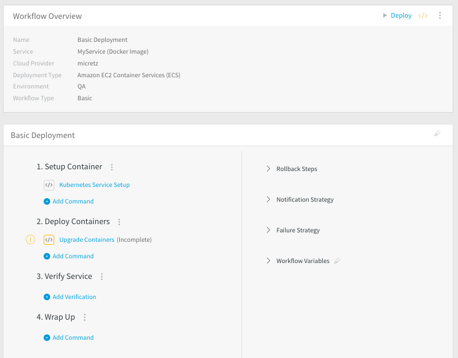

This topic outlines how to set up a Workflow. 

### Before You Begin

Before adding a workflow, you should have an understanding of the following:

* [Workflows](workflow-configuration.md)
* [Application Components](../applications/application-configuration.md)
* [Add a Service](../setup-services/service-configuration.md)
* [Add an Environment](../environments/environment-configuration.md)

### Visual Summary

### Step: Workflow Setup

The following steps cover the common Workflow setup. To add a Workflow, do the following:

1. Click **Setup**.
2. Click the Application where you want to put the Workflow.
3. Click **Workflows**.
4. Click **Add Workflow**. The **Workflow** dialog appears.
5. Give your Workflow a name and description that tells users its purpose. For example, if the Workflow takes a service with a Docker artifact and deploys it to a Kubernetes environment in GCP, you might name the workflow **docker-to-k8s-GCP**.
6. In **Workflow Type**, select the type of Workflow you want to perform. For a summary of the types, see **Workflow Types** below.
7. In **Environment**, select the environment where you want to deploy the service. Select from the environments you added in [Add an Environment](../environments/environment-configuration.md).
8. In **Service**, select the service you want to deploy.
9. In **Infrastructure Definition**, select the Infrastructure Definition where you want the Workflow to deploy the Service.
10. Click **SUBMIT**. The Workflow is created. Here is an example of a Basic Deployment.

If this is a Basic Deployment, you might need to update one step before using the Workflow. For example, in the figure above, the **Upgrade Containers** step requires attention. In the case of other deployment types, there might be additional steps to configure.

### Next Steps

For platform and strategy-specific Workflow configurations, see the topics in [Continuous Deployments](https://docs.harness.io/category/1qtels4t8p-cd-category).

