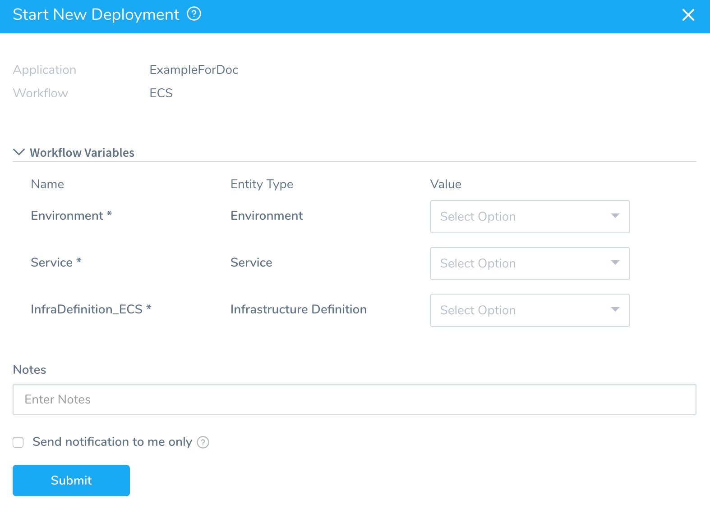
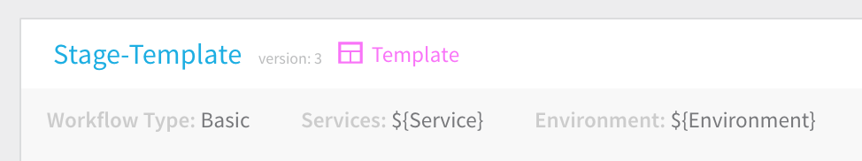

You can turn a Workflow into a Workflow template ("templatize it") by using variables for important settings such as Environment, Service, and Infrastructure Definition.

### Before You Begin

* [Add a Workflow](tags-how-tos.md)

### Step: Turn a Workflow into a Template

To turn a Workflow into a template, do the following:

1. In a Workflow, click the More Options ⋮ menu next to the **Deploy** button, and click **Edit**. The **Workflow** settings appear. The Workflow settings that may be turned into variables have a **[T]** button in their fields.
2. For each setting you want to turn into a variable, click the **[T]** button in its field. The field values are replaced by variables.

   
   
   You can pass in variables from Triggers to set values for these Workflow variables. For more information, see [Passing Variables into Workflows and Pipelines from Triggers](../expressions/passing-variable-into-workflows.md).
3. Click **SUBMIT**. The new variables are displayed under **Workflow Variables**.
4. To see how the Workflow variables are used, click **Deploy**. The **Start New Deployment** dialog appears, displaying the variables you created in the **Workflow Variables** section.

   
   
   When this deployment is run, users can select from the options for each setting from the **Value** drop-down. Now the Workflow is a template that can be used by multiple services.

In the **Workflows** page, Workflow templates are identified with a template icon.

The template option for Workflow settings is available in the main Workflow settings in all Workflow types. In multi-phase deployment types (Canary), some settings may also be templated in the Phase settings.
### Next Steps

* [Template a Workflow](workflow-configuration.md#template-a-workflow)

