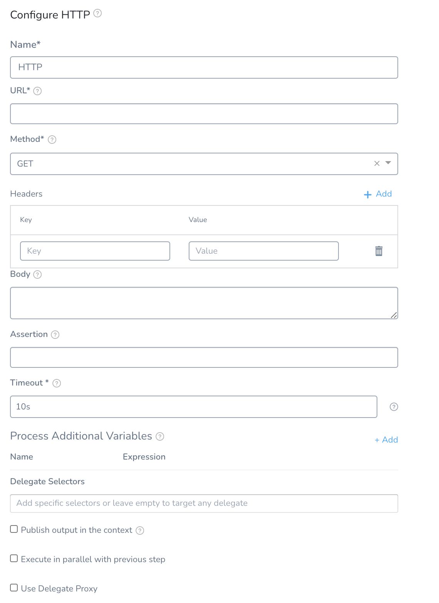
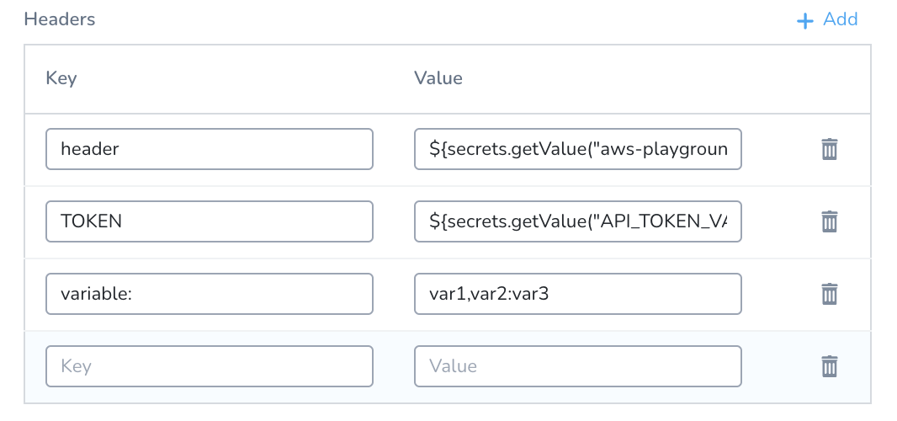
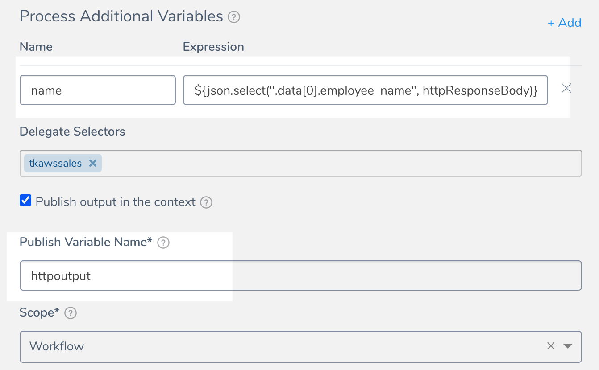
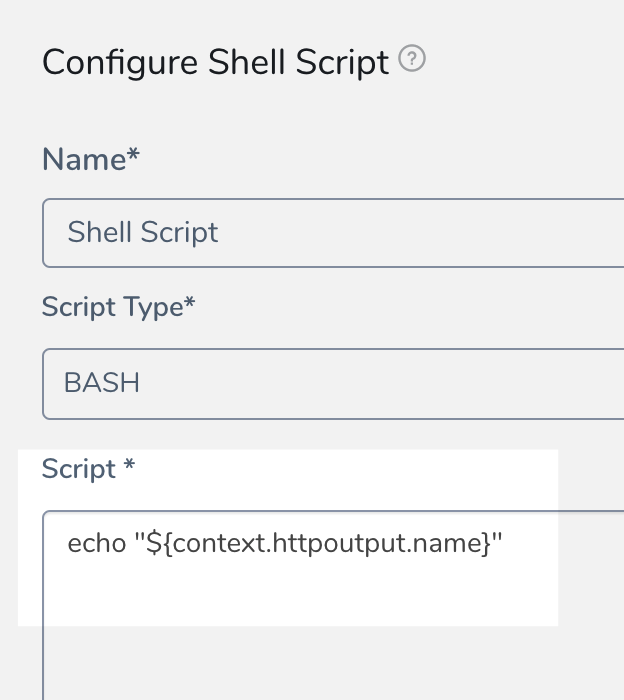

You can use the HTTP step to run HTTP methods containing URLs, methods, headers, assertions, and variables.

In this topic:

* [Create HTTP Command](using-the-http-command.md#create-http-command)
* [Header Capability Check](using-the-http-command.md#header-capability-check)
* [Reserved Words for Export Variable Names](using-the-http-command.md#reserved-words-for-export-variable-names)
* [Next Steps](using-the-http-command.md#next-steps)

### Create HTTP Command

1. In your **Workflow**, click **Add Step**. The **Add Step** settings appear.
2. To create a new HTTP command, click **HTTP**. To use an existing HTTP command, select a Template Library and link the HTTP command template to your Workflow. For this example, we will create a new HTTP command.  
  
The **HTTP** settings appear.

Harness CV supports the following HTTP command options.

#### Name 

Enter the name for the HTTP command.

#### URL 

Enter the URL for the HTTP call. 

#### Method 

Select the [HTTP method](https://restfulapi.net/http-methods/#summary). 

#### Headers 

Enter the media type for the message. For example, if you are using the GET method, the headers are used to specify the GET response body message type Harness will check for.
1. In **Headers**, click **Add**.
2. In **Key**, enter the key. For example, `Token, Variable:`.
3. In **Value**, enter the value. For example, `${secrets.getValue("aws-playground_AWS_secret_key")}`, `var1,var2:var3`.

You can enter multiple header entries. Click **Add** to add **Key** and **Value** fields.

#### Body 

Enter the message body (if any) of the HTTP message. |

####  Assertion

The assertion is used to validate the incoming response. For example, if you wanted to check the health of an HTTP connection, you could use the assertion **${httpResponseCode}==200**.

To see the available expressions, simply enter `${` in the Assertions field. The HTTP expressions are described in the [HTTP](https://docs.harness.io/article/9dvxcegm90-variables#http) section of [Variables and Expressions in Harness](https://docs.harness.io/article/9dvxcegm90-variables).
  
You can also use JSON and XML functors as described in [JSON and XML Functors](https://docs.harness.io/article/wfvecw3yod-json-and-xml-functors). For example:

`json.select("status", ${httpResponseBody}) == "success"` 

####  Timeout 

Enter a value, in seconds, for how long Harness should wait for a response from the server you specified in **URL**. 

####  Process Additional Variables 

Create variables using built-in Harness expressions.You can then publish these are output variables using the **Publish output in the context** settings. Whatever is configured in **Process Additional Variables** can be made available in the context defined in **Publish output in the context**.In **Name**, enter a name for the variable. In **Expression**, enter an expression that obtains some value. Harness supports these functors and methods:

* JSON Path:
	+ `select()`. Example: `${json.select("path-in-response", httpResponseBody)}`
	+ `object()`. Example: `${json.object(httpResponseBody).item}`
	+ `list()`. Example: `{json.list(\"store.book\", httpResponseBody).get(2).isbn}`

* XPath:
	+ `select()`. Example: `${xml.select("/bookstore/book[1]/title", httpResponseBody)}`

For details, see [JSON and XML Functors](https://docs.harness.io/article/wfvecw3yod-json-and-xml-functors).

See [Variable Expression Name Restrictions](https://docs.harness.io/article/9dvxcegm90-variables#variable_expression_name_restrictions). |

####  **Publish output in the context**

Select this option to create a variable containing the content of a variable specified in **Process Additional Variables**.

in **Publish Variable Name**, enter a unique name to define the output context. You will use this name to reference the variable elsewhere.

For example, if the name of a variable in **Process Additional Variables** is `name` the **Publish** **Variable Name** is `httpoutput`, you would reference it with `${context.httpoutput.name}`.

Here is the HTTP step:

And here is a Shell Script step referencing the published variable using `${context.httpoutput.name}`:

In **Scope**, select **Pipeline**, **Workflow**, or **Phase**. The output variable are available within the scope you set here.

The scope you select is useful for preventing variable name conflicts. You might use a Workflow with published variables in multiple pipelines, so scoping the variable to **Workflow** will prevent conflicts with other Workflows in the Pipeline. |

####  Delegate Selectors

You can use Selectors to select which Harness Delegates to use when executing the HTTP step. Enter the Selectors of the Delegates you want to use.

You can also use [Harness variable expressions](https://docs.harness.io/article/9dvxcegm90-variables). For example, if you have a Workflow variables named delegate, you can enter `$(workflow.variables.delegate)`. When you deploy the Workflow, you can provide a value for the variable that matches a Delegate Selector.

Harness will use Delegates matching the Selectors you select.

If you use one Selector, Harness will use any Delegate that has that Selector.If you select two Selectors, a Delegate must have both Selectors to be selected. That Delegate might also have other Selectors, but it must have the two you selected.

:::danger
If your Workflow Infrastructure Definition's Cloud Provider is a Harness [Kubernetes Cluster Cloud Provider](https://docs.harness.io/article/l68rujg6mp-add-kubernetes-cluster-cloud-provider) or [AWS Cloud Provider](https://docs.harness.io/article/wt1gnigme7-add-amazon-web-services-cloud-provider) that uses Delegate Selectors, do not add a Selector to the Workflow step. The Workflow is already targeted to a specific Delegate. 
:::

####  Use Delegate Proxy 

Select this option to explicitly use the delegate proxy settings. For details, see [Delegate Proxy Settings](https://docs.harness.io/article/h9tkwmkrm7-delegate-installation#delegate_proxy_settings).
* If the Delegate is not using any proxy, selecting this option does not enable the proxy settings.
* If you have specified an URL that is set up to bypass proxy settings on the Delegate, then it throws an error.

### Header Capability Check

Currently, this feature is behind the Feature Flag `HTTP_HEADERS_CAPABILITY_CHECK`. Contact [Harness Support](mailto:support@harness.io) to enable the feature. When Harness runs an HTTP step and connects to a service, it checks to make sure that an HTTP connection can be established.

Some services require that HTTP headers are included in connections. Without the headers, the HTTP connections fail and simple HTTP verification cannot be performed.

Harness performs an HTTP header capability check for any header requirements on the target service.

If the target host server requires headers and you do not include headers in the **Headers** setting of the HTTP step, the Harness Delegate will fail the deployment with the error `No eligible Delegates could perform this task` (`error 400`).

Simply add the required headers in **Headers**, and then run the deployment. Adding the headers will prevent the 400 error.

### Reserved Words for Export Variable Names

The following words cannot be used for names in **Publish Variable Name:**

* arm
* ami
* aws
* host
* setupSweepingOutputAppService
* terragrunt
* terraform
* deploymentInstanceData
* setupSweepingOutputEcs
* deploySweepingOutputEcs
* runTaskDeploySweepingOutputEcs
* setupSweepingOutputAmi
* setupSweepingOutputAmiAlb
* ecsAllPhaseRollbackDone
* Azure VMSS all phase rollback
* k8s
* pcfDeploySweepingOutput
* CloudFormationCompletionFlag
* terraformPlan
* terraformApply
* terraformDestroy
* Elastigroup all phase rollback
* setupSweepingOutputSpotinst
* setupSweepingOutputSpotinstAlb

### Next Steps

* [Use Templates](https://docs.harness.io/article/ygi6d8epse-use-templates)
* [Using the Shell Script Command](capture-shell-script-step-output.md)

