This content is for Harness [FirstGen](../../../../getting-started/harness-first-gen-vs-harness-next-gen.md). Switch to [NextGen](https://docs.harness.io/article/as4dtppasg).Harness integrates with [Jenkins](https://jenkins.io/), enabling you to run Jenkins jobs, to dynamically capture output variables from the jobs, and to pull artifacts from Jenkins. 

Harness' integration requires Jenkins version 2.130 or higher.

## Overview

Among the steps you can include in a Harness Workflow is a **Jenkins** command.

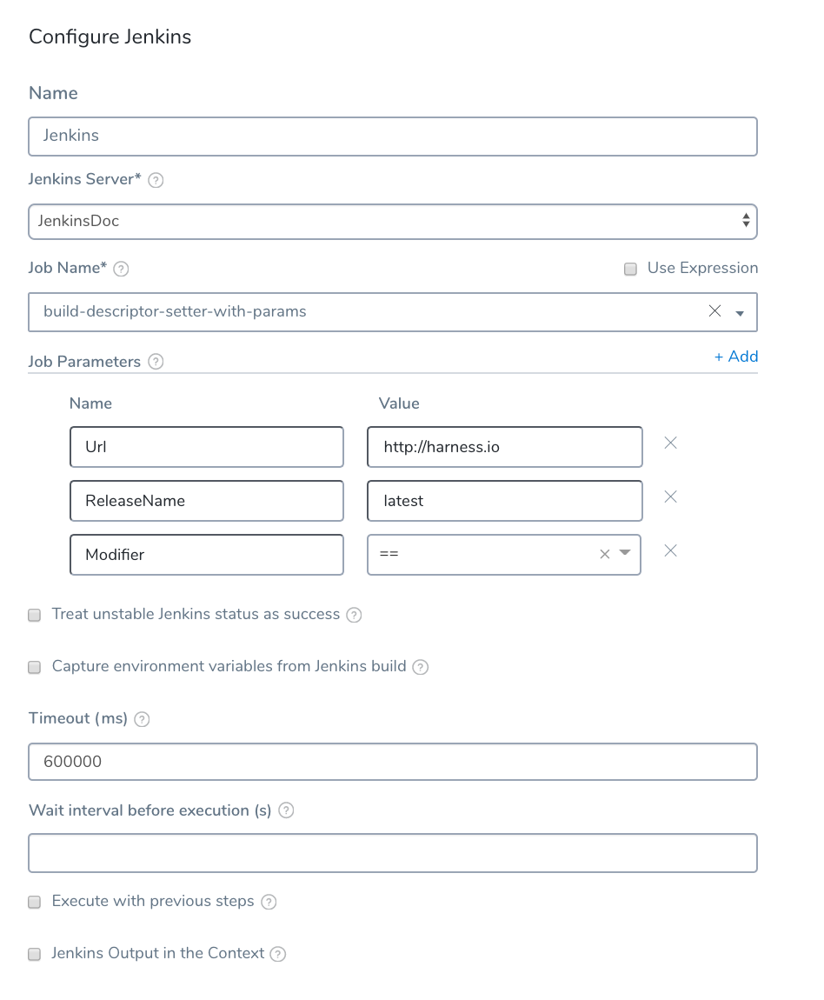

With the **Jenkins** command, you can execute Jenkins jobs in the Workflow's shell session.

When executing a job, you can also *dynamically capture* the output from the job, publishing runtime variables based on the context. You can then use those variables in another step in the same Workflow or Phase, or in another Workflow or Phase in the same Pipeline.

The **Shell Script** workflow command step can also set and capture shell session information and publish it as output variables. For more information, see [Using Shell Script Commands](capture-shell-script-step-output.md).### What Information is Available to Capture?

Any Jenkins job information in the particular shell session of the Workflow can be captured and output using one or more Jenkins steps in that Workflow. In addition, you can capture information available using the built-in Harness variables. For more information, see [Variables and Expressions in Harness](https://docs.harness.io/article/9dvxcegm90-variables).

Capturing and exporting output in the Jenkins step can be very powerful. For example, a Jenkins step could capture Jenkins build information in a Workflow, and a Harness service could echo the build information and use it in a complex function, and then export the output down the Pipeline for further evaluation.

## Jenkins Plugin Requirements

For Harness to capture Jenkins environment variables, your Jenkins configuration requires the [EnvInject Plugin](https://wiki.jenkins.io/display/JENKINS/EnvInject+Plugin). The plugin does not provide full compatibility with the Pipeline Plugin. See [Known limitations](https://plugins.jenkins.io/envinject) from Jenkins.

## Before You Begin

* [Add a Workflow](workflow-configuration.md)
* [Variables and Expressions in Harness](https://docs.harness.io/article/9dvxcegm90-variables)
* [Using Shell Script Commands](capture-shell-script-step-output.md)

## Use the Jenkins Command Step

Before you can use this command, you need to add your Jenkins server as a Harness Artifact Server. See [Add Artifact Servers](https://docs.harness.io/article/7dghbx1dbl-configuring-artifact-server).The following procedure adds and configures a Jenkins command step in a Workflow, and captures and publishes Jenkins output in a variable. Later, we will show you how to use the published variable in a Harness service.

To use the Jenkins command step, do the following:

1. In a Harness Application, open a Workflow. For this example, since we are using Jenkins, we will use a **Build** workflow.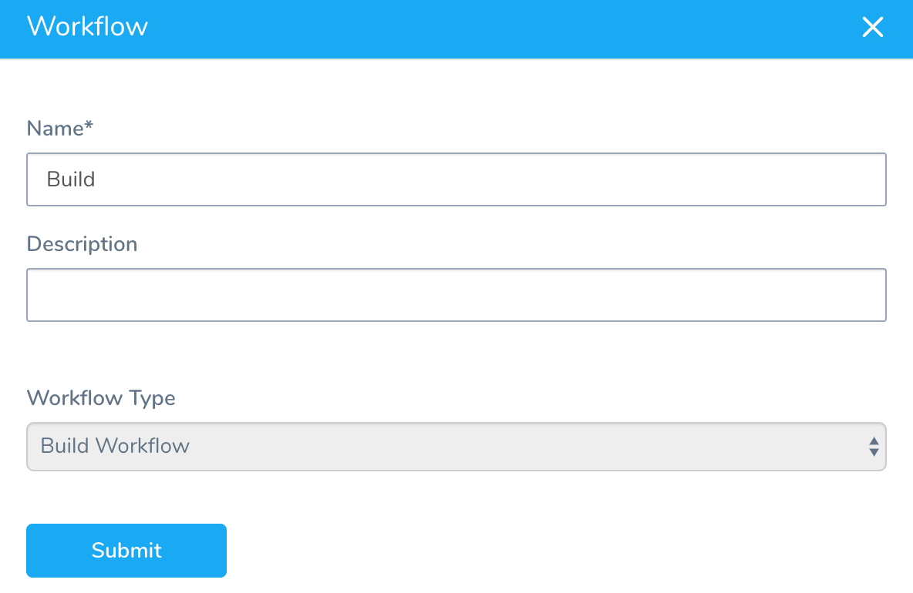
2. In the Workflow **Phase** section, in **Prepare Steps**, click **Add Step**. The **Add Step** dialog opens.
3. In **Add Step**, select **Jenkins**. The **Jenkins** settings appear.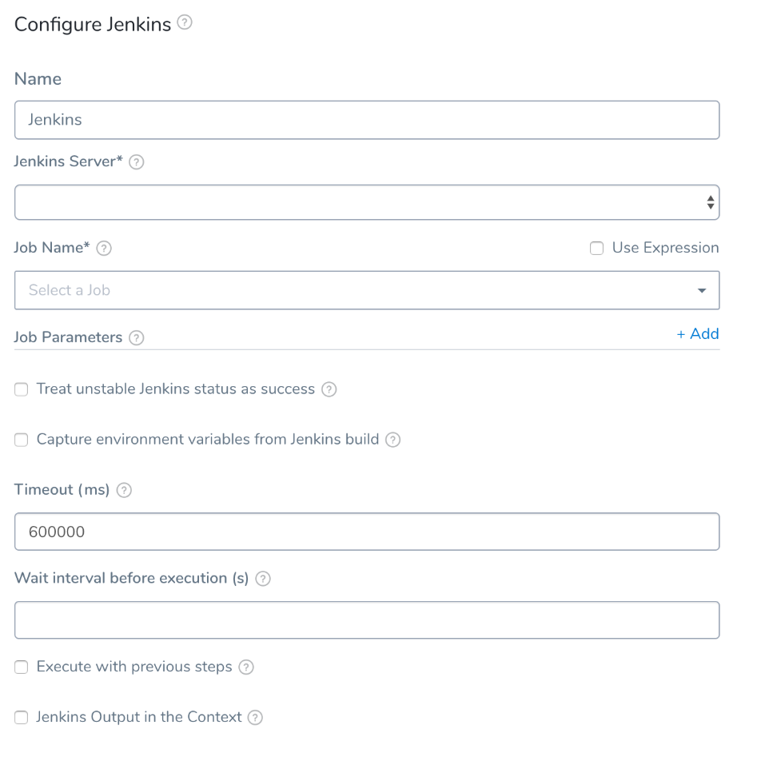
4. Configure the **Jenkins** command step and click **SUBMIT**. 


The Jenkins command step has the following settings.


### Jenkins Server

Select the Jenkins server you added as a Harness Artifact Server. For more information, see the [Jenkins Artifact Server](https://docs.harness.io/article/qa7lewndxq-add-jenkins-artifact-servers) setup.

You can turn this setting into a deployment runtime parameter by clicking the template button (**[T]**). Clicking the button turns the setting into a variable expression, such as `${Jenkins_Server}`. You can change the name of the expression.

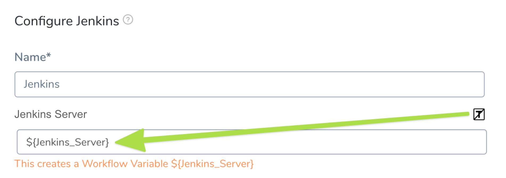

The Workflow now has a [Workflow variable](add-workflow-variables-new-template.md) for that setting.

If you template the setting, Harness cannot pull the list of Jobs from a server. You must manually enter the Job name in **Job Name**.

When you deploy the Workflow, you must select a Jenkins server for the Jenkins Server setting Workflow variable. In **Value**, you can select one of the [Jenkins Artifact Servers](https://docs.harness.io/article/qa7lewndxq-add-jenkins-artifact-servers) you have set up in Harness.

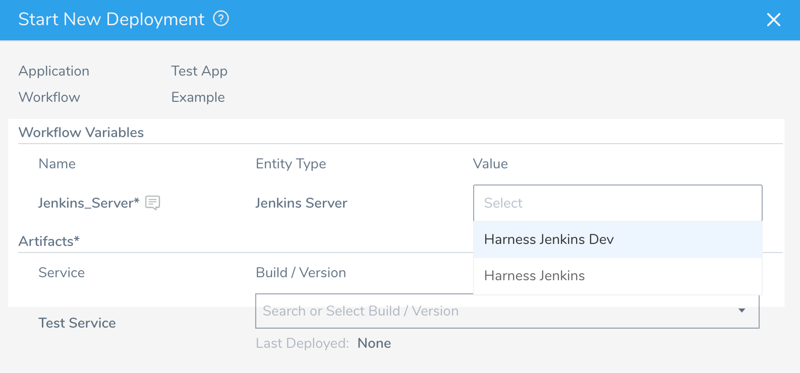


You can also pass in variable expressions to use in this setting, or use a [Service Config Variable](../setup-services/add-service-level-config-variables.md). See [Pass Variables between Workflows](../expressions/how-to-pass-variables-between-workflows.md) and [Passing Variables into Workflows and Pipelines from Triggers](../expressions/passing-variable-into-workflows.md). 


### Job Name

Select the Jenkins job (also called a project) to execute. The list is automatically populated using the **Jenkins Server** you selected. 


### Job Parameters

If you are using a [parameterized build](https://wiki.jenkins.io/display/JENKINS/Parameterized+Build), click **Add** to add your name/value parameters. These are the parameters you will reference using the published output variables.


### Treat unstable Jenkins status as success

A build is **stable** if it was built successfully and no publisher reports it as unstable.A build is **unstable** if it was built successfully and one or more publishers report it unstable. For example, if the JUnit publisher is configured and a test fails then the build will be marked unstable. 


### Capture environment variables from Jenkins build

Select this option to capture the environment variables from the Jenkins Job. These are the environment variables you can see in your Jenkins Job Environment Variables section (or via API)

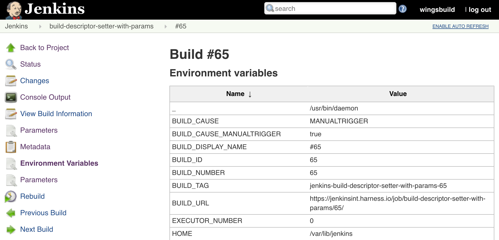

Next, you can enable the **Jenkins Output in the Context** setting to output the environment variables. See [Using Published Jenkins Variables](using-the-jenkins-command.md#using-published-jenkins-variables) below.


### Timeout

Enter the timeout period, in milliseconds. For example, 600000 milliseconds is 10 minutes. The timeout period determines how long to wait for the step to complete. When the timeout expires, it is considered a workflow failure and the workflow [Failure Strategy](workflow-configuration.md#failure-strategy) is initiated. 


### Wait interval before execution 

Set how long the deployment process should wait before executing the step. 


### Execute with previous steps

Check this checkbox to run this step in parallel with the previous steps. 


### Jenkins Output in the Context

To export the Jenkins job output as a variable, enable **Jenkins output in the context**. 


### Variable Name 

Enter a unique name for the output variable. You will use this name to reference the variable elsewhere. For example, if the Variable Name is **Jenkins\_Test**, you would reference the Jenkins `Url` parameter set in **Job Parameters** with `${Jenkins_Test.Url}`. 

### Scope

Select **Pipeline**, **Workflow**, or **Phase**. The output variables are available within the scope you set here.The scope you select is useful for preventing variable name conflicts. You might use a workflow with published variables in multiple pipelines, so scoping the variable to **Workflow** will prevent conflicts with other workflows in the pipeline. |

A completed Jenkins step looks something like this:


:::note 
To see how to configure the settings in this topic using YAML, configure the settings in the UI first, and then click the **YAML** editor button.
:::

### Referencing Parameters in the Same Step

You can reference the Job parameters you set in Jenkins step **Job Parameters** section in the same Workflow step (for example, **Collect Artifact**) using the name of the Jenkins step.

Here are two steps in the same section, **Collect Artifact**, a **Jenkins** step where the parameters as set in the **Job Parameters** section, and a **Shell Script** step that uses the parameters via variables.

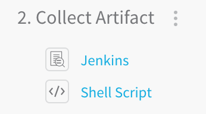Here is the Job parameter set in **Jenkins** step **Job Parameters** section:

Here is the parameter referenced in the **Shell Script** step using the **Jenkins** step name, **Jenkins**:

`${Jenkins.jobParameters.Url}`

To reference the parameters outside the step (in other steps in the Workflow, or in another Workflow in the Pipeline), use output variables, described in [Using Published Jenkins Variables](#using-published-jenkins-variables).

### Using Published Jenkins Variables

For Harness to capture Jenkins environment variables, your Jenkins configuration requires the [EnvInject Plugin](https://wiki.jenkins.io/display/JENKINS/EnvInject+Plugin). The plugin does not provide full compatibility with the Pipeline Plugin. See [Known Incompatibilities](https://plugins.jenkins.io/envinject/#plugin-content-jenkins-pipeline-compatibility) from Jenkins.You can use the Jenkins variable you published in the Jenkins step (via the **Jenkins Output in the Context** settings), and reference parameters and environment variables in other steps of the Workflow, such as a Shell Script step.

You can reference job parameters from the Jenkins step **Job Parameters** section with the `jobParameters` component in the following syntax:

```
${var_name.jobParameters.param_name}
```
Or, if you selected the **Capture environment variables from Jenkins build** setting, you can reference environment variables with the `envVars` component in the following syntax:


```
${var_name.envVars.envVar_name}
```
#### Job Parameters

For example, here is a Job parameter set in Jenkins step **Job Parameters** section:

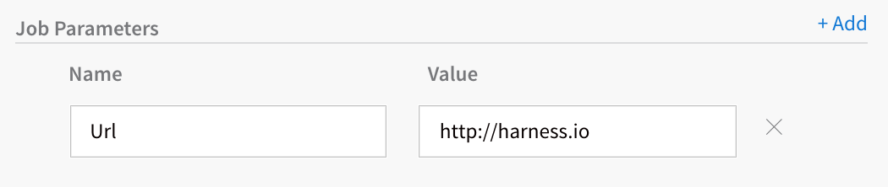

Here is the output variable in the same Jenkins step, scoped to Pipeline:

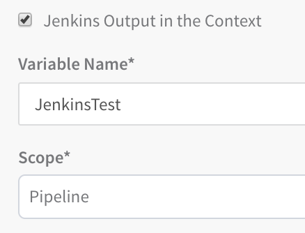

Here is a Shell Script step referencing the Job parameter using the output variable:

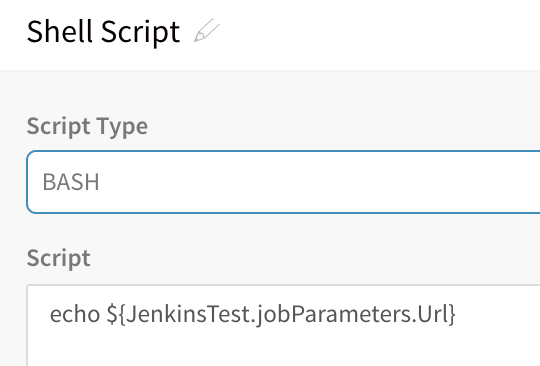

When the Workflow is deployed, the Harness Deployments page will list the output of the variable (in this case, the Url parameter we set):

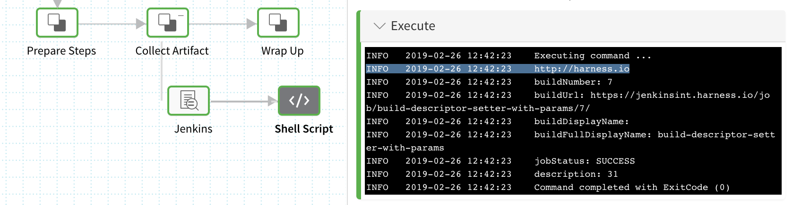

#### Environment Variables

For Harness to capture Jenkins environment variables, your Jenkins configuration requires the [EnvInject Plugin](https://wiki.jenkins.io/display/JENKINS/EnvInject+Plugin). The plugin does not provide full compatibility with the Pipeline Plugin. See [Known Incompatibilities](https://wiki.jenkins.io/display/JENKINS/EnvInject+Plugin#EnvInjectPlugin-Knownincompatibilities) from Jenkins.Let's look at an example for environment variables where you selected the **Capture environment variables from Jenkins build** setting, and then used **Jenkins Output in the Context** settings to set an output variable named `myVar`:

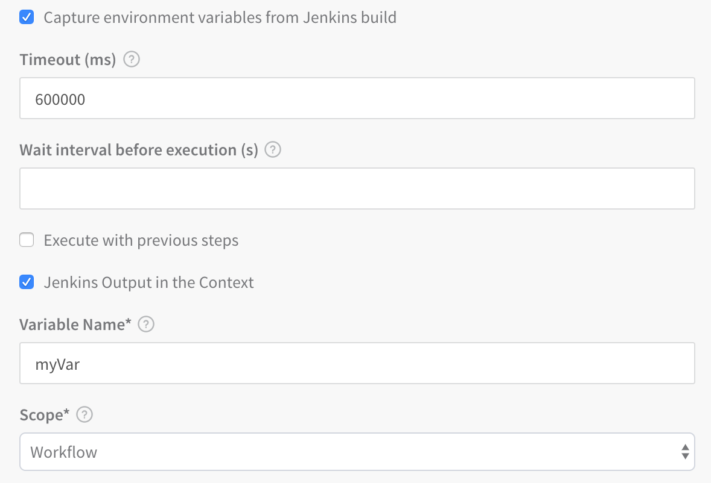Here is an example of the environment variables from a Jenkins Job (via API):


```
{  
  "_class" : "org.jenkinsci.plugins.envinject.EnvInjectVarList",  
  "envMap" : {  
    "BUILD_CAUSE" : "MANUALTRIGGER",  
    "BUILD_CAUSE_MANUALTRIGGER" : "true",  
    "BUILD_DISPLAY_NAME" : "#65",  
    "BUILD_ID" : "65",  
    "BUILD_NUMBER" : "65",  
    "BUILD_TAG" : "jenkins-build-descriptor-setter-with-params-65",  
    "BUILD_URL" : "https://jenkinsint.harness.io/job/build-descriptor-setter-with-params/65/",  
    ...  
  }  
}
```
In a Shell Script step in the Workflow, you can get the BUILD\_URL environment variable using a variable containing `envVars`:


```
${myVar.envVars.BUILD_URL}
```
You can get all environment variables by simply omitting any specific environment variable name:


```
${myVar.envVars}
```
### Harness Built-in Parameter Variables

Harness includes built-in Jenkins parameters you can use in your Shell Script steps, but only within the same Workflow step section as the Jenkins step. For example, here are two steps in the same section, a Jenkins step and a Shell Script step that uses the built-in variables:


Here is the list of parameters with their variables:

* **buildNumber** - `${Jenkins.buildNumber}`
* **buildUrl** - `${Jenkins.buildUrl}`
* **buildDisplayName** - `${Jenkins.buildDisplayName}`
* **buildFullDisplayName** - `${Jenkins.buildFullDisplayName}`
* **jobStatus** - `${Jenkins.jobStatus}`
* **description** - `${Jenkins.description}` (requires [Descriptor Setter](https://wiki.jenkins.io/display/JENKINS/Description+Setter+Plugin) plugin in Jenkins)

When the Workflow is deployed, the Shell Script is run and the echo output using the variables is displayed.


### Multibranch Pipeline Support

For Harness to capture Jenkins environment variables, your Jenkins configuration requires the [EnvInject Plugin](https://wiki.jenkins.io/display/JENKINS/EnvInject+Plugin). The plugin does not provide full compatibility with the Pipeline Plugin. See [Known Incompatibilities](https://wiki.jenkins.io/display/JENKINS/EnvInject+Plugin#EnvInjectPlugin-Knownincompatibilities) from Jenkins.The Jenkins Multibranch Pipeline (Workflow Multibranch) feature enables you to automatically create a Jenkins pipeline for each branch on your source control repo.

Each branch has its own [Jenkinsfile](https://jenkins.io/doc/book/pipeline/jenkinsfile/), which can be changed independently. This features enables you to handle branches better by automatically grouping builds from feature/experimental branches.

In the Harness Workflow Jenkins command, multibranch pipelines are displayed alongside other Jobs, with the child branches as subordinate options:

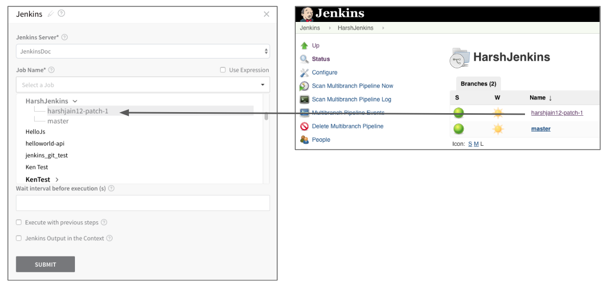When you deploy the Harness Workflow, the branch you selected is built:

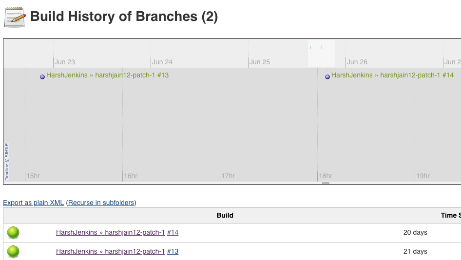For more information, see [Pipeline-as-code with Multibranch Workflows in Jenkins](https://jenkins.io/blog/2015/12/03/pipeline-as-code-with-multibranch-workflows-in-jenkins/) from Jenkins.

### Reserved Words for Export Variable Names

The following words cannot be used for names in Jenkins Output in the Context **Variable Name:**

* arm
* ami
* aws
* host
* setupSweepingOutputAppService
* terragrunt
* terraform
* deploymentInstanceData
* setupSweepingOutputEcs
* deploySweepingOutputEcs
* runTaskDeploySweepingOutputEcs
* setupSweepingOutputAmi
* setupSweepingOutputAmiAlb
* ecsAllPhaseRollbackDone
* Azure VMSS all phase rollback
* k8s
* pcfDeploySweepingOutput
* CloudFormationCompletionFlag
* terraformPlan
* terraformApply
* terraformDestroy
* Elastigroup all phase rollback
* setupSweepingOutputSpotinst
* setupSweepingOutputSpotinstAlb

