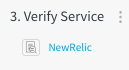

One of the most important steps in a Workflow is verification. A verification step ties your Workflow and your Verification Provider to **Harness Continuous Verification** features.

In order to obtain the names of the host(s) or container(s) where your Service is deployed, the **Verify Steps** should be defined in your Workflow **after** you have run at least one successful deployment.In this topic:

* [Before You Begin](#before_you_begin)
* [Step: Add Verification Steps to Workflows](#add_verify_step_workflows)

### Before You Begin

* [Add a Workflow](tags-how-tos.md)
* [Workflows](workflow-configuration.md)

### Step: Add Verification Steps to Workflows

To set up a verification step, do the following:

1. In a Workflow, click **Verify Service** and then **Add Step.** The **Add Step** settings appear.
2. In **Verifications**, click the Verification Provider connected to the Service you are deploying in this Workflow. The configuration dialog for the Service appears.
3. Fill out the Verification Provider's configuration dialog and click **Submit**. The **Verify Service** step displays the Verification Provider.

   

In a multi-phase deployment, the verification steps are in the sub-steps within each phase.You can read more about the different verification integrations in [What Is Continuous Verification (CV)?](https://harness.helpdocs.io/article/ina58fap5y-what-is-cv) and [Verification Providers](https://docs.harness.io/article/r6ut6tldy0-verification-providers).

